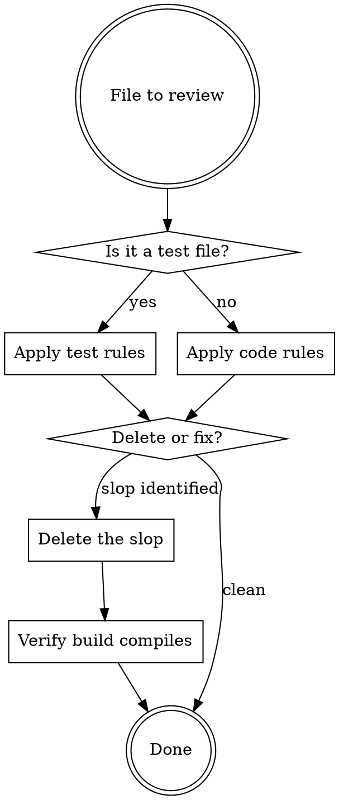

# Deslop

Strip AI-generated noise from this codebase. Be decisive — delete, don't "consider" or "flag".

## Decision Flow

## Principles

1. **Delete, don't hedge.** "Remove this" not "consider removing". If it's slop, it goes.
2. **Cleaning is not refactoring.** Don't extract helpers, add abstractions, or reorganize while deslopping. Remove noise, nothing more.
3. **Demo app context.** This is a reference implementation, not production software. Tests should cover critical memory-unit/authority/conflict/drift logic — not structural concerns.
4. **Trust the framework.** Spring, Vaadin, Embabel, and Java itself provide guarantees. Don't defend against things that can't happen.

## Comment Slop — Delete These

| Pattern | Example | Why it's slop |
|---------|---------|---------------|
| Section banners | `// ========== Helpers ==========` | ASCII-art organization. Methods have names. |
| Dashed dividers | `// ----- Wiring -----` | Same. Extract methods if sections are too long. |
| Field group labels | `// Controls`, `// State`, `// Progress` | Field names are self-documenting. |
| Restating the code | `// Set the name` above `setName(name)` | Reader can read. |
| Tautological `@param` | `@param contextId the context ID` | Says nothing the signature doesn't. |
| Tautological method Javadoc | `/** Renders the report. */` on `render(Report r)` | Method name already says this. |
| Orphaned spec refs | `// (10.7)`, `// per F06` | Meaningless without context. |
| Future enhancement notes | `// Future: support X` | Not a TODO, not a bug, just noise. |
| Getter/setter labels | `// --- Memory unit getters and setters ---` | IDE can fold. Don't label the obvious. |

### Keep These Comments

- **Invariant annotations**: `A1: rank always in [100, 900]` — these document contracts
- **Non-obvious logic**: Lazy-init guards, algorithmic choices, workarounds for framework quirks
- **Class-level architecture Javadoc**: Layout diagrams, state machine docs, design decision records
- **`@param`/`@return` with real semantics**: constraints, side effects, valid ranges, not just "the X"

## Defensive Check Slop — Delete These

| Pattern | Example | Why it's slop |
|---------|---------|---------------|
| Null check on framework values | `if (combo.getValue() == null) return;` repeated 6x | Vaadin guarantees value if you set a default |
| `Objects.requireNonNull` on record fields | `Objects.requireNonNull(name, "must not be null")` | Use `@NonNull` annotation or compact constructor with a meaningful validation |
| `Optional.ofNullable` on known non-null | `Optional.ofNullable(map.get(k))` when map is populated by you | If you control the data, assert instead of wrapping |
| Try-catch that just rethrows | `catch (E e) { throw new RuntimeException(e); }` | Let it propagate |
| Catch for impossible exceptions | `catch (IOException e) { /* close() threw */ }` | Classpath streams don't throw on close |
| Null-to-empty-string conversion | `if (text == null) return ""` in internal methods | Fail-fast. Let NPE surface bad data. |

### Keep These Checks

- **Boundary validation**: User input, external API responses, deserialized data
- **Contract enforcement in public API**: `if (rank < 100 \|\| rank > 900) throw` in `MemoryUnit.clampRank()`
- **`Optional` returns from repositories**: `findById()` legitimately returns `Optional`

## Java 25 Modernization

This project runs Java 25 with `--enable-preview`. Prefer modern Java structures aggressively — records, switch expressions, pattern matching, text blocks, sealed interfaces. Preview features are fair game.

**Default to modern.** The question isn't "is there a reason to modernize?" — it's "is there a reason NOT to?"

| Old pattern | Modern replacement |
|-------------|-------------------|
| `if (obj instanceof Foo) { Foo f = (Foo) obj; ... }` | `if (obj instanceof Foo f) { ... }` |
| `instanceof` + cast chain | Pattern matching in `switch`: `case Foo f -> ...` |
| `switch (x) { case A: return ...; }` with breaks | Switch expression: `return switch (x) { case A -> ...; };` |
| `if/else if/else` on type or enum | Switch expression with pattern matching or exhaustive enum cases |
| `catch (Exception _ignored)` / `(var _unused, var v)` | Unnamed variable: `catch (Exception _)` / `(_, var v)` |
| C-style `for (int i = 0; i < list.size(); i++)` | `for (var item : list)` — only use index loop if index is needed |
| String concatenation chains | Text blocks: `"""..."""` |
| `String.format()` / `+` concatenation | `"text %s".formatted(val)` (except in log statements — use `{}` placeholders) |
| Hand-rolled Comparator with null sentinels | `Comparator.comparing(Foo::bar, Comparator.nullsLast(naturalOrder()))` |
| Mutable POJO with only getters/setters | **Record.** If it's immutable data, it's a record. No exceptions. |
| Class with only `static` methods, no state | Utility class: `private` constructor, `final` class, or just use the record pattern |
| `new ArrayList<>()` for literals | `List.of()`, `Set.of()`, `Map.of()` |
| `Collections.unmodifiableList(new ArrayList<>(...))` | `List.copyOf(source)` |
| Stream `.collect(Collectors.toList())` | `.toList()` |
| `for (int i = 0; i < n; i++) sb.append(s)` (index unused) | `sb.append(s.repeat(n))` |
| `stream.collect(Collectors.groupingBy(...))` where Gatherers fit | Evaluate `stream.gather(...)` for complex multi-stage transforms |
| Abstract class with no shared state | Sealed interface with record implementations |
| Marker interface / type tag enum + data class | Sealed interface: `sealed interface Event permits Created, Deleted` |
| `Optional.isPresent()` + `Optional.get()` | `Optional.ifPresent()`, `Optional.map()`, or pattern match |

**Records are the default for data.** If a class carries data and doesn't need mutability, it should be a record. This includes:
- DTOs, view models, API responses
- Configuration carriers (`@ConfigurationProperties` can bind to records)
- `PromptContributor` implementations (data carriers, not service beans)
- `@LlmTool` return types
- Test fixtures and builders

**Sealed interfaces are the default for type hierarchies.** If you have a fixed set of subtypes, seal the interface and use record implementations. This gives exhaustive switch checking.

**Don't force it.** If the old pattern is genuinely clearer, keep it. But the bar is high — "I'm used to the old way" is not a reason.

## Spring / Embabel / DICE Idioms

| Anti-pattern | Idiomatic |
|--------------|-----------|
| `@Autowired` on fields | Constructor injection (implicit `@Autowired` on single constructor) |
| `@Component` PromptContributor with injected services | Record implementing `PromptContributor` carrying pre-assembled data |
| `@LlmTool` returning `String` | `@LlmTool` returning a record |
| Manual Cypher string concatenation | `@Query` with parameters |
| `new ArrayList<>()` as default collection | `List.of()` |
| Checked exceptions in service layer | Unchecked: `IllegalArgumentException`, `IllegalStateException` |
| Wildcard imports | Explicit imports only |
| `logger.info("x " + val)` | `logger.info("x {}", val)` |

## Test Slop — Delete or Fix

Tests exist to verify that memory units resist drift, authority upgrades work, conflicts resolve correctly, and the simulation engine produces meaningful results.

### Delete Entirely

- **Reflection-based structural tests**: Tests that use `getDeclaredFields()` to verify constants exist, are non-null, end with a suffix. If a constant is wrong, the app won't start.
- **Trivial enum tests**: One-assertion tests that verify `CANON.previousLevel() == RELIABLE`. This is testing the Java language, not business logic.
- **Tests that mock everything**: If every dependency is mocked and the test just verifies `verify(mock).method()` was called, it tests wiring, not behavior.
- **Constructor/getter tests**: "Object is created successfully", "getter returns value set in constructor". Records eliminate this entire category.
- **Path/resource existence tests**: If a template is missing, the app fails at startup. The test adds nothing.

### Fix, Don't Delete

- **Tests with real assertions but poor structure**: Restructure with `@Nested` + `@DisplayName`, rename to `actionConditionExpectedOutcome`
- **Tests that test the right thing but have slop around them**: Remove section banners, unnecessary comments, redundant setup

### Red Flags in Tests

| Smell | Verdict |
|-------|---------|
| Test name starts with `test` | Rename: `actionConditionExpectedOutcome` |
| Only assertion is `assertNotNull` | Probably worthless. What behavior does it verify? |
| `@DisplayName` just restates the method name | Remove the `@DisplayName` or make it describe behavior |
| Helper method with 0 callers after refactoring | Delete it |
| `@BeforeEach` sets up mocks never used in most tests | Move setup into the tests that need it |

## Process

When deslopping a file:

1. **Read the file.** Understand what it does before changing anything.
2. **Identify slop.** Use the tables above. Be exhaustive.
3. **Make changes.** Delete comments, remove defensive checks, modernize syntax, fix tests.
4. **Don't add anything.** No new helpers, no new abstractions, no new comments, no new tests. Cleaning only.
5. **Compile.** Run `./mvnw.cmd clean compile -DskipTests` after changes.
6. **Run tests.** Run `./mvnw.cmd test` after changes. If a test breaks because you removed something it depended on, evaluate whether the test itself was slop.

## Common Mistakes When Deslopping

| Mistake | Why it's wrong |
|---------|---------------|
| Removing invariant comments | `A1: rank in [100, 900]` documents a contract. Keep it. |
| Removing all null checks | Boundary validation is real. Only remove internal redundant checks. |
| Extracting helpers during cleanup | Cleaning is not refactoring. One concern at a time. |
| Adding Javadoc to replace removed comments | You're adding slop while removing slop. |
| Hedging with "consider" or "flag" | Be decisive. If it's slop, delete it. |
| Salvaging worthless tests | A test that doesn't test business logic can't be fixed by restructuring. Delete it. |
| Modernizing working code for novelty | Don't use Gatherers where `.map().filter()` is clearer. Serve clarity. |
