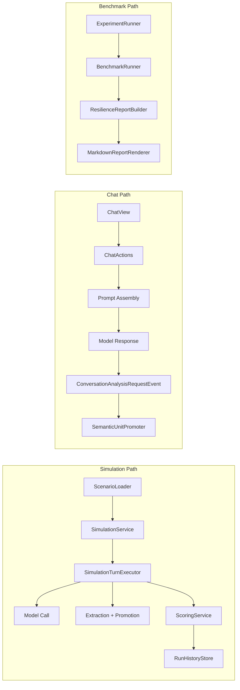
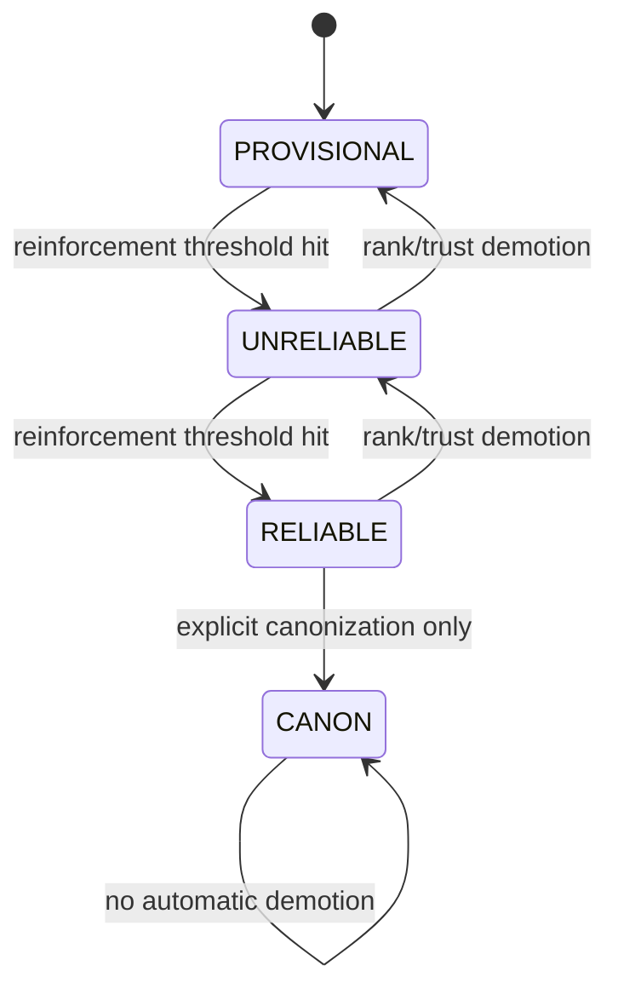

<!-- sync: openspec/specs/memory-unit-conflict, openspec/specs/memory-unit-trust, openspec/specs/memory-unit-lifecycle, openspec/specs/benchmark-report, openspec/specs/resilience-report, openspec/specs/run-history-persistence, openspec/specs/observability -->
<!-- last-synced: 2026-02-25 -->

# Architecture

This project is a single Spring Boot app (Java 25) + Neo4j 5.x. It is intentionally opinionated and demo-focused.

## System topology

| Route | Purpose |
|---|---|
| `/` | simulation harness |
| `/chat` | interactive ARC-Mem-aware DM chat |
| `/benchmark` | condition/scenario batch experiments |
| `/run` | run inspection and cross-run comparison |

Everything shares the same memory unit lifecycle engine and persistence layer.

## Runtime execution paths

Simulation path:

`ScenarioLoader -> SimulationService -> SimulationTurnExecutor -> (LLM call + ComplianceEnforcer.enforce()) -> (extraction + ConflictPreCheck + SemanticUnitPromoter) -> (MaintenanceStrategy.onTurnComplete()) -> ScoringService -> RunHistoryStore`

Chat path:

`ChatView -> ChatActions -> prompt assembly -> model response -> async extraction event -> SemanticUnitPromoter`

Benchmark/report path:

`ExperimentRunner -> BenchmarkRunner -> ResilienceReportBuilder -> MarkdownReportRenderer`



## Package map

- `memory/`: activation score/authority lifecycle, conflict resolution, decay, trust re-eval, maintenance strategies (reactive/proactive/hybrid), memory pressure gauge, conflict index, budget strategies, Prolog integration
- `assembly/`: context assembly, lock, relevance scoring, compaction/token budget, compliance enforcement
- `extraction/`: proposition-to-memory-unit gate pipeline
- `chat/`: Embabel action/tool integration + chat UI
- `persistence/`: Neo4j entities/repository, tiered memory unit storage (HOT/WARM/COLD)
- `sim/`: scenario execution, judge scoring, benchmarking, report output, UI panels

## Core data model

### MemoryUnit (active working-memory item)

Memory units are not a separate node type. A proposition with `rank > 0` (activation score) is active.

```java
record MemoryUnit(
    String id,
    String text,
    int rank,                  // [100, 900] activation score
    Authority authority,       // PROVISIONAL/UNRELIABLE/RELIABLE/CANON
    boolean pinned,
    double confidence,
    int reinforcementCount,
    @Nullable TrustScore trustScore,
    double diceImportance,
    double diceDecay,
    MemoryTier memoryTier      // COLD/WARM/HOT
)
```

### Authority hierarchy

```java
enum Authority {
    PROVISIONAL(0),
    UNRELIABLE(1),
    RELIABLE(2),
    CANON(3)
}
```



Strict invariants:
- CANON is never auto-assigned.
- CANON is immune to automatic demotion.
- Pinned memory units are immune to decay and budget eviction.
- Activation score is always clamped through `MemoryUnit.clampRank()`.

## ARC-Mem engine responsibilities

`ArcMemEngine` is the orchestrator. The behavior that matters most:

- `inject(contextId)`: returns active memory units sorted by activation score desc
- `promote(propositionId, initialRank, authorityCeiling?)`: promote then enforce budget
- `reinforce(unitId)`: increment reinforcement, apply activation score bump, maybe authority upgrade
- `detectConflicts(contextId, text)`: delegate to configured detector
- `resolveConflict(conflict)`: delegate to configured resolver
- `supersede(predecessorId, successorId, reason)`: archive + lineage link

### Budget enforcement

Budget is enforced per promotion call, not as a batch post-pass.

```text
promote()
  -> write promoted memory unit
  -> evictLowestRanked(contextId, budget)
```

Default budget is `20` active memory units per context.

## Maintenance strategies

`MaintenanceStrategy` sealed interface with three modes:

- `REACTIVE` (default): per-turn `DecayPolicy` + `ReinforcementPolicy` — identical to pre-optimization behavior
- `PROACTIVE`: 5-step sleeping-LLM-inspired sweep (audit → refresh → consolidate → prune → validate) triggered by `MemoryPressureGauge` thresholds
- `HYBRID`: reactive per-turn hooks + proactive sweeps

`MemoryPressureGauge` computes composite `[0.0, 1.0]` pressure from budget usage, conflict rate, decay demotions, and compaction frequency. Light-sweep at 0.4, full-sweep at 0.8.

Strategy is selectable globally via `ArcMemProperties` and per-scenario via YAML for A/B comparison.

## Compliance enforcement

`ComplianceEnforcer` interface: `enforce(ComplianceContext) → ComplianceResult`.

Implementations:
- `PromptInjectionEnforcer` — current behavior, always ACCEPT (default)
- `PostGenerationValidator` — LLM validates response against CANON/RELIABLE memory units after generation
- `PrologInvariantEnforcer` — deterministic rule-based checking via DICE tuProlog

Authority-based strictness: CANON enforced by default; lower authorities configurable.

## Conflict handling

Available detector strategies:
- `llm` (default): semantic contradiction detection
- `lexical`: negation marker + token overlap heuristic
- `composite`: multi-detector chaining
- `indexed`: O(1) lookup via precomputed `ConflictIndex` (Neo4j `CONFLICTS_WITH` relationships)
- `logical`: Prolog backward chaining via DICE tuProlog (deterministic, no LLM calls)

Resolver default (authority-biased):

```text
if existing.authority >= RELIABLE -> KEEP_EXISTING
else if incoming.confidence > 0.8 -> REPLACE
else                              -> COEXIST
```

Conflict outcomes:
- `KEEP_EXISTING`
- `REPLACE`
- `DEMOTE_EXISTING`
- `COEXIST`

## Trust pipeline

Trust gating runs before promotion and routes candidates into zones.

```text
TrustPipeline.evaluate(node, contextId)
  -> collect TrustSignal values
  -> apply DomainProfile weights
  -> compute TrustScore
  -> map to PromotionZone: AUTO_PROMOTE / REVIEW / ARCHIVE
```

Profile thresholds:

| Profile | Auto Promote | Review | Archive |
|---|---:|---:|---:|
| `BALANCED` | `>= 0.70` | `>= 0.40` | `< 0.40` |
| `SECURE` | `>= 0.85` | `>= 0.50` | `< 0.50` |
| `NARRATIVE` | `>= 0.60` | `>= 0.35` | `< 0.35` |

## Prompt assembly and compaction

`ArcMemLlmReference` injects an explicit established-facts block into the system prompt.

Example shape:

```text
=== ESTABLISHED FACTS ===
1. [CANON] The East Gate is breached (rank: 850)
2. [RELIABLE] Baron Krell is a four-armed mutant (rank: 750)
=== END ESTABLISHED FACTS ===
```

Compaction path (`CompactedContextProvider`):
1. collect context messages
2. estimate token pressure
3. summarize with LLM when thresholds are exceeded
4. validate protected content survival (`CompactionValidator`)

Current limitation: validator is detect-only, no automatic retry/recovery.

## Revision and supersession

`RevisionAwareConflictResolver` treats `REVISION` separately from `CONTRADICTION` and `WORLD_PROGRESSION`.

High-level policy:
- `CANON`: immutable
- `RELIABLE`: configurable revisability
- `UNRELIABLE`: revisable above confidence threshold
- `PROVISIONAL`: revisable

`REPLACE` typically leads to:

```text
ArcMemEngine.supersede()
  -> archive predecessor
  -> create SUPERSEDES edge in Neo4j
  -> emit lifecycle event + audit metadata
```

## Simulation scoring + history

`ScoringService` computes run metrics including:
- fact survival rate
- contradiction counts (including MAJOR count)
- drift absorption rate
- mean turns to first drift
- strategy-level effectiveness

Run storage is behind `RunHistoryStore`:
- `memory`: in-memory `SimulationRunStore`
- `neo4j`: persistent `Neo4jRunHistoryStore`

## Key config defaults

| Setting | Default |
|---|---|
| `arc-mem.budget` | `20` |
| `arc-mem.initial-rank` | `500` |
| `conflict-detection.strategy` | `llm` |
| `chat.chat-llm.model` | `gpt-4.1-mini` |
| `sim.evaluator-model` | `gpt-4.1-mini` |
| `run-history.store` | `memory` |
| `arc-mem.revision.enabled` | `true` |
| `arc-mem.revision.reliable-revisable` | `false` |
| `arc-mem.maintenance.mode` | `REACTIVE` |
| `arc-mem.pressure.light-sweep-threshold` | `0.4` |
| `arc-mem.pressure.full-sweep-threshold` | `0.8` |
| `arc-mem.budget.strategy` | `COUNT` |
| `compliance.enforcement-strategy` | `PROMPT_ONLY` |
| `tiered-storage.enabled` | `false` |
| `quality-scoring.enabled` | `false` |

## External dependencies

- Neo4j 5.x
- OpenAI-compatible model endpoint
- OTEL/Langfuse (optional)

## Architectural boundaries

- Core ARC-Mem logic does not reference simulation concepts.
- Conflict/trust/promotion should fail safe, not fail open.
- This demo prefers explicit policies over generic abstractions.
