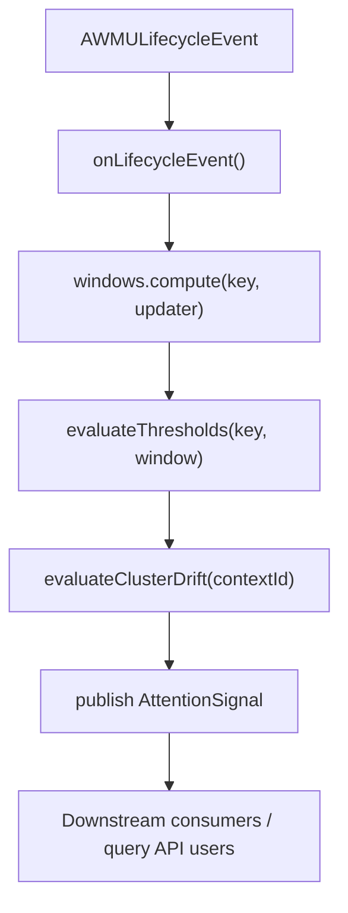
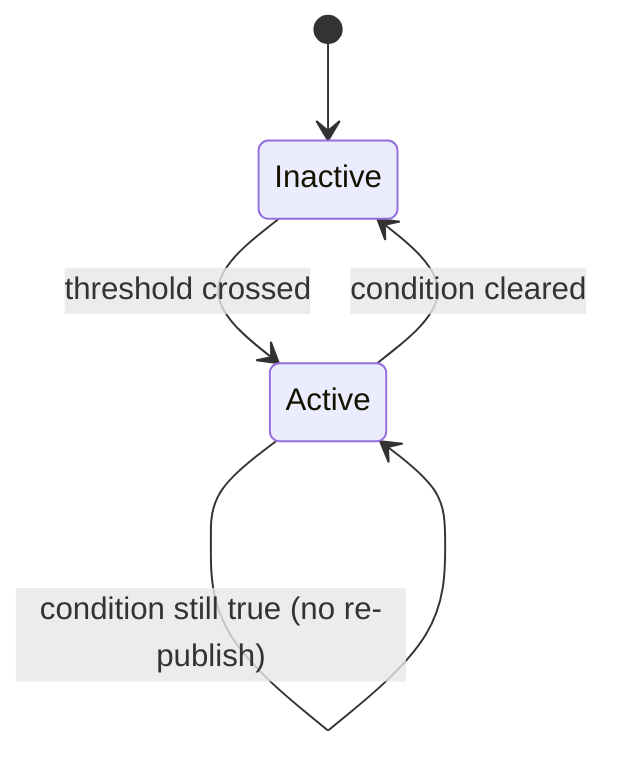

# Attention Tracker Architecture

This subsystem tracks short-horizon attention pressure per ARC Working Memory Unit (AWMU).

## Package

`dev.arcmem.core.memory.attention`

Core classes:
- `AttentionTracker`: event listener + state owner + query API
- `AttentionWindow`: immutable sliding-window stats
- `AttentionSignal`: event emitted on threshold transitions
- `AttentionSignalType`: `PRESSURE_SPIKE`, `HEAT_PEAK`, `HEAT_DROP`, `CLUSTER_DRIFT`
- `AttentionSnapshot`: frozen publish-time metrics

## Event flow

```text
AWMULifecycleEvent
  -> AttentionTracker.onLifecycleEvent()
  -> update window in ConcurrentHashMap.compute(key, ...)
  -> evaluate per-AWMU thresholds
  -> evaluateClusterDrift(contextId)
  -> publish AttentionSignal with AttentionSnapshot
```

Per-key update path is atomic because of `compute(...)`.



## Window metrics

The window keeps counts/timestamps and exposes three key metrics:

```text
heatScore     = min(1.0, totalEventCount / maxExpectedEventsPerWindow)
pressureScore = conflictCount / totalEventCount
burstFactor   = recentQuarterDensity / uniformExpectedDensity
```

Interpretation:
- high `heatScore`: this AWMU is active now
- high `pressureScore`: conflict-heavy activity
- high `burstFactor`: sudden concentrated activity burst

## Signal semantics

- `PRESSURE_SPIKE`: conflict pressure exceeded threshold and minimum conflict floor
- `HEAT_PEAK`: heat crossed peak threshold
- `HEAT_DROP`: AWMU cooled below drop threshold after a peak
- `CLUSTER_DRIFT`: enough AWMUs in same context are in active `HEAT_DROP`

Cluster drift is tracked via synthetic key `("__cluster__", contextId)` in hysteresis state.

## Hysteresis model

The tracker keeps an "already active" signal set and only publishes transitions.

```text
if condition true and signal not active -> publish + mark active
if condition false and signal active    -> clear active
```

That prevents noisy duplicate event spam.



## Thread-safety notes

Current assumptions:
- default Spring `@EventListener` dispatch is synchronous
- map updates are thread-safe (`ConcurrentHashMap`)
- `EnumSet` mutation in hysteresis map is acceptable under synchronous delivery

If listeners move to async dispatch, either:
1. move hysteresis mutation into map-level atomic compute, or
2. replace mutable `EnumSet` handling with a concurrent-safe structure

## Query API (pull mode)

Useful methods for downstream consumers:
- `getWindow(unitId, contextId)`
- `getHottestUnits(contextId, limit)`
- `getAllWindows(contextId)`
- `snapshot(contextId)`
- `cleanupContext(contextId)`

## Config reference

All under `arc-mem.attention.*`.

| Property | Default | Meaning |
|---|---|---|
| `enabled` | `true` | master switch |
| `window-duration` | `PT5M` | sliding window size |
| `pressure-threshold` | `0.5` | conflict ratio threshold |
| `min-conflicts-for-pressure` | `3` | minimum conflict count guard |
| `heat-peak-threshold` | `0.7` | heat peak threshold |
| `heat-drop-threshold` | `0.2` | cool-down threshold |
| `cluster-drift-min-units` | `3` | AWMUs required for drift signal |
| `max-expected-events-per-window` | `20` | heat normalization ceiling |

## Design choices

- Location is `memory/attention`, not `assembly` or `sim`, because this is a core observer.
- `AttentionSignal` is separate from `MemoryUnitLifecycleEvent` (derived output vs source event).
- Heat normalization is static right now for predictability; adaptive normalization is a future enhancement.

## Near-term improvements

1. Fold attention into `RelevanceScorer` to boost contested AWMUs in prompt injection.
2. Surface `CLUSTER_DRIFT` warnings in `RunInspectorView`.
3. Add tests for async-event safety if listener mode changes.
