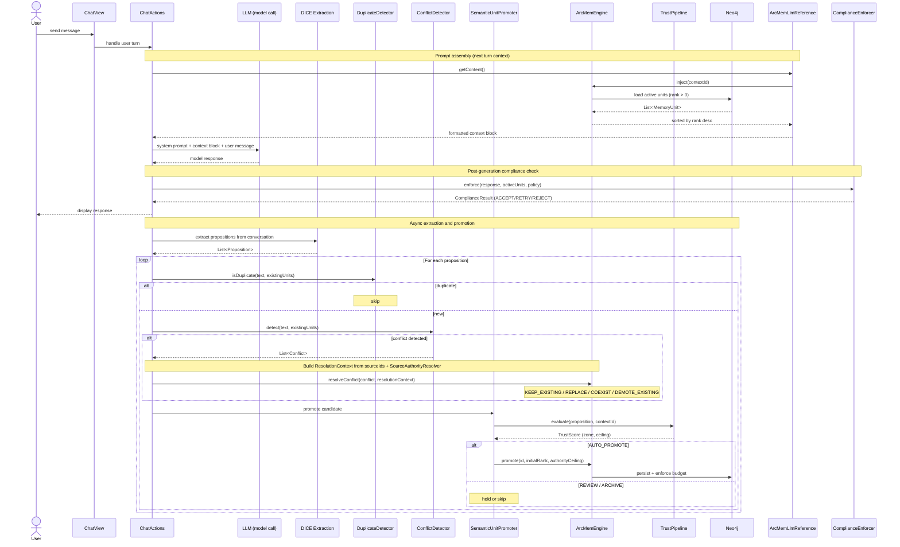
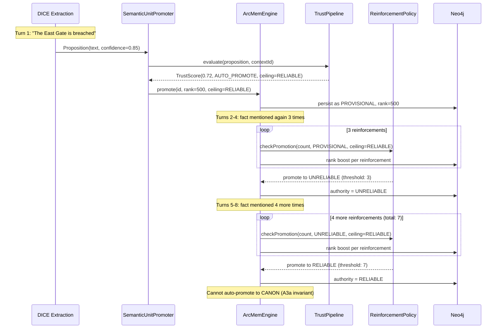
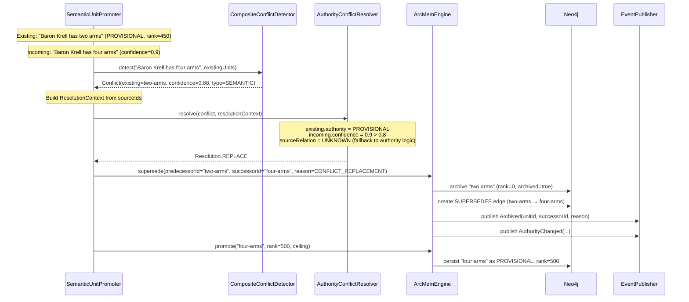
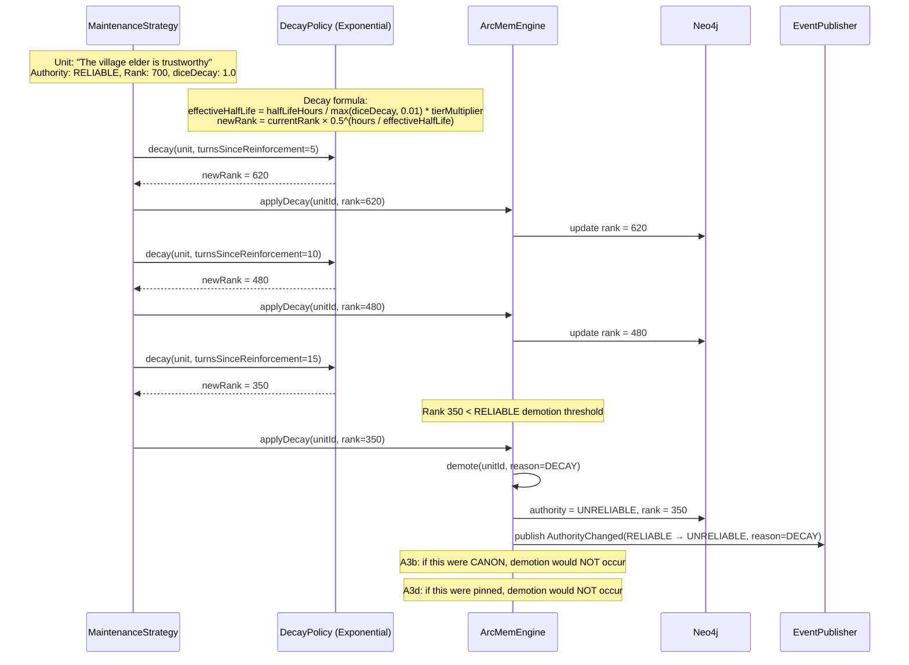
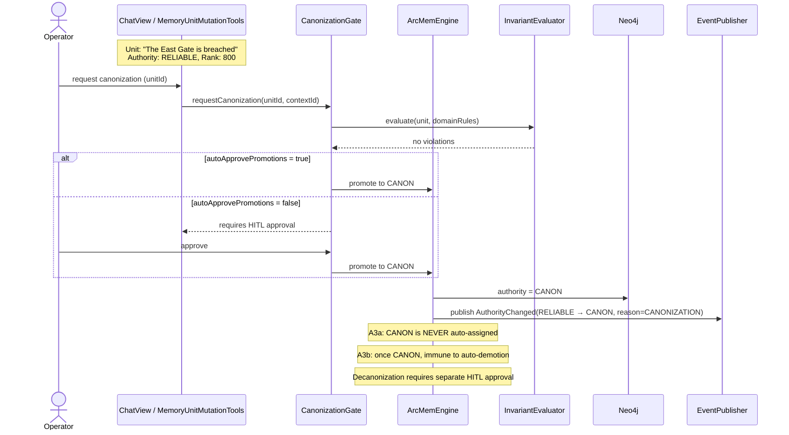
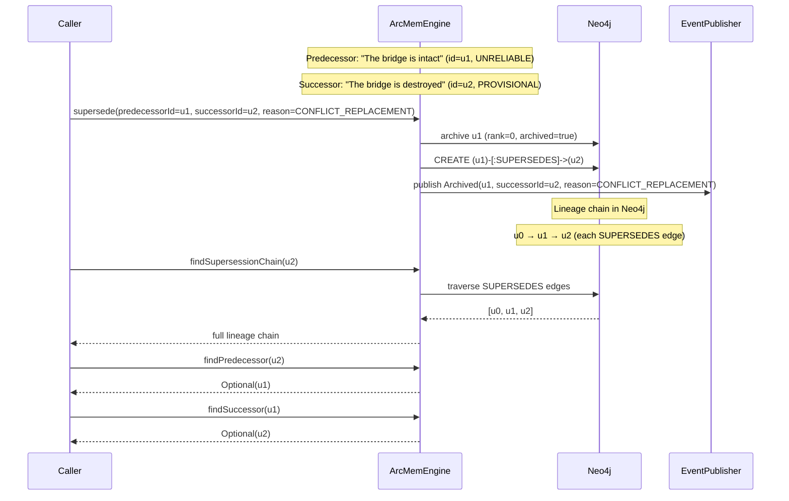

# Data Flows

End-to-end execution traces for the major ARC-Mem data paths. Each scenario shows the concrete sequence of service calls, state changes, and persistence operations so that a developer can trace any execution path without reading source code.

For structural diagrams (module map, component relationships, config defaults), see [architecture.md](architecture.md). For mutation semantics and gate details, see [promotion-revision-supersession.md](promotion-revision-supersession.md).

## 1. End-to-End: User Message → Memory Units → LLM Response

This is the complete path for the chat flow. A user sends a message, propositions are extracted, promoted to memory units, and assembled into the next LLM prompt.

### Key observations

- Context assembly happens **before** the LLM call — the model sees the current state of working memory.
- Extraction and promotion happen **after** the response — new facts from the conversation are processed asynchronously.
- Compliance enforcement occurs **after** generation — the response is validated against active memory units.
- Budget enforcement runs **inside** `ArcMemEngine.promote()` — if capacity is exceeded, the lowest-ranked non-pinned unit is evicted immediately.

## 2. Scenario A: Promotion Trace

A new fact is extracted and promoted from PROVISIONAL through reinforcement to RELIABLE.

### State progression

| Turn | Reinforcements | Authority | Rank (approx) |
|------|---------------|-----------|----------------|
| 1 | 0 | PROVISIONAL | 500 |
| 2 | 1 | PROVISIONAL | 530 |
| 3 | 2 | PROVISIONAL | 560 |
| 4 | 3 | UNRELIABLE | 590 |
| 5 | 4 | UNRELIABLE | 620 |
| 6 | 5 | UNRELIABLE | 650 |
| 7 | 6 | UNRELIABLE | 680 |
| 8 | 7 | RELIABLE | 710 |

## 3. Scenario B: Conflict Resolution with REPLACE

An incoming fact contradicts an existing PROVISIONAL unit. The resolver chooses REPLACE, archiving the predecessor and linking the successor via supersession.

### Resolution decision matrix

| Existing Authority | Incoming Confidence | Resolution |
|-------------------|-------------------|------------|
| CANON or RELIABLE | any | KEEP_EXISTING |
| PROVISIONAL | > 0.8 | REPLACE |
| PROVISIONAL | ≤ 0.8 | COEXIST |
| UNRELIABLE | > 0.8 | REPLACE |
| UNRELIABLE | ≤ 0.8 | COEXIST |

## 4. Scenario C: Decay Demotion

A RELIABLE unit decays over several turns without reinforcement, eventually dropping below the demotion threshold.

### Decay modifiers

| Factor | Effect |
|--------|--------|
| `diceDecay = 0.0` | No decay (permanent) |
| `diceDecay = 1.0` | Standard decay rate |
| `diceDecay > 1.0` | Accelerated decay |
| `memoryTier = HOT` | Slower decay (higher tier multiplier) |
| `memoryTier = COLD` | Faster decay (lower tier multiplier) |

## 5. Scenario D: Canonization via HITL

An operator explicitly promotes a RELIABLE unit to CANON through the `CanonizationGate`.

### CANON guarantees

- Immune to automatic demotion (A3b)
- Immune to decay-triggered authority changes
- Highest priority in conflict resolution (KEEP_EXISTING)
- Minimal token footprint in adaptive prompt assembly (reference only)
- Decanonization requires explicit HITL approval through `CanonizationGate`

## 6. Scenario E: Supersession with Lineage Chain

A memory unit is superseded by a newer version. The predecessor is archived and linked to the successor, forming a queryable lineage chain.

### Supersession reasons

| Reason | Trigger |
|--------|---------|
| `CONFLICT_REPLACEMENT` | Conflict resolver chose REPLACE |
| `BUDGET_EVICTION` | Working-memory capacity exceeded |
| `DECAY_DEMOTION` | Activation score decayed below minimum |
| `USER_REVISION` | Operator explicitly revised via UI/tool |
| `MANUAL` | Programmatic supersession |

### Lineage queries

- `findSupersessionChain(unitId)` — returns the full predecessor → successor chain
- `findPredecessor(unitId)` — returns the immediate predecessor (if any)
- `findSuccessor(unitId)` — returns the immediate successor (if any)

Current limitation: lineage is 1:1 (no merge/split semantics). A unit has at most one predecessor and one successor.
