# DICE Integration Reference

**DICE Version**: 0.1.0-SNAPSHOT
**Last Verified**: 2026-02-28

This document is the canonical reference for how dice-anchors integrates with DICE for proposition extraction, revision, persistence, and incremental analysis. It covers both extraction paths (chat and simulation), component API usage, fragile coupling points, API stability assessment, responsibility boundaries, and a monitoring strategy for SNAPSHOT API evolution.

## Overview

DICE is a proposition-centric memory library that dice-anchors uses to extract semantic facts from narrative text (D&D campaign transcripts). The extracted propositions feed into dice-anchors' anchor lifecycle engine, which manages rank, authority, promotion, and conflict resolution.

### Proposition Lifecycle

1. **Extract** — LLM examines conversation/DM response and outputs structured propositions
2. **Revise** — LLM deduplicates and refines propositions against existing propositions in the repository
3. **Persist** — Propositions are saved to Neo4j via `PropositionRepository` (implemented by `AnchorRepository`)
4. **Promote** — dice-anchors evaluates persisted propositions through the trust pipeline and promotes eligible ones to anchors (rank > 0)

DICE handles steps 1–3. dice-anchors handles step 4 (plus anchor lifecycle operations: decay, reinforcement, conflict resolution, authority management, and eviction).

## End-to-End Integration Flow

dice-anchors uses two distinct extraction paths:

- **Chat path**: Event-driven via `ConversationPropositionExtraction`, using windowed incremental analysis
- **Simulation path**: Synchronous via `SimulationExtractionService`, using one-shot pipeline

Both paths share the same pipeline configuration and persistence layer.

### Chat Extraction Flow

**Entry Point**: `ConversationPropositionExtraction.java:83`

```
ConversationAnalysisRequestEvent
  ↓
ConversationPropositionExtraction.onConversationExchange() [line 83]
  ↓
PropositionIncrementalAnalyzer.analyze(source, context) [line 103]
  ↓ (returns ChunkPropositionResult)
ChunkPropositionResult.propositionsToPersist() [line 130]
  ↓
PropositionResults.persist() with fallback [lines 140-160]
  ↓ (on fallback: propositionRepository.saveAll())
AnchorRepository.assignContextIds(propositionIds, contextId) [line 165]
  ↓
AnchorPromoter.evaluateAndPromote(contextId, propositionsToPersist) [line 170]
```

**Key Characteristics**:

- **Asynchronous**: Marked with `@Async @EventListener`; processing happens on Spring's async thread pool
- **Windowed**: `WindowConfig` (lines 68–72) controls a sliding window over conversation messages
  - `windowSize`: number of messages in the extraction window
  - `windowOverlap`: number of messages carried forward between windows (enables deduplication across turns)
  - `triggerInterval`: number of new messages before window advances
- **Incremental**: `PropositionIncrementalAnalyzer` processes only novel messages via chunk history tracking, avoiding re-extraction of already-processed conversation segments

**Error Handling**:

- If `analyze()` throws `ClassCastException`, `IllegalArgumentException`, or `RuntimeException`: logged and skipped
- If result is null: logged as window-not-triggered (normal condition)
- If result is not `ChunkPropositionResult`: logged as type mismatch and skipped
- If full `persist()` fails: falls back to `propositionRepository.saveAll(propositionsToPersist)` (lines 145–149)

### Simulation Extraction Flow

**Entry Point**: `SimulationExtractionService.java:66`

```
SimulationExtractionService.extract(contextId, dmResponseText)
  ↓
PropositionPipeline.process(List.of(chunk), context) [line 79]
  ↓ (returns PropositionResults)
PropositionResults.propositionsToPersist() [line 80]
  ↓
PropositionResults.persist() with fallback [lines 94-105]
  ↓ (on fallback: propositionRepository.saveAll())
AnchorRepository.assignContextIds(propositionIds, contextId) [line 113]
  ↓
AnchorRepository.tagSourceIds(propositionIds, "dm") [line 120]
  ↓
AnchorPromoter.batchEvaluateAndPromoteWithOutcome(contextId, propositions) [line 123]
```

**Key Characteristics**:

- **Synchronous**: Called directly from `SimulationTurnExecutor` during turn execution
- **One-Shot**: No windowing or incremental analysis; entire DM response is extracted in a single pipeline invocation
- **Source Tagging**: After persistence, all DM-extracted propositions are tagged with source ID "dm" to boost trust scores (line 120; see `SourceAuthoritySignal` in anchor trust pipeline)
- **Contextual Outcome Tracking**: Returns `ExtractionResult` with counts of extracted and promoted propositions

**Error Handling**:

- Empty DM response: returns `ExtractionResult.empty()` (line 69)
- No propositions extracted: returns `ExtractionResult.empty()` (line 84)
- Full `persist()` fails: falls back to `propositionRepository.saveAll(propositions)` (lines 94–101)
- General exception: logs error and returns `ExtractionResult.empty()` (line 136)

### Data Flow Diagrams

#### Chat Path (Event-Driven, Windowed)

```mermaid
graph LR
    A["ConversationExchangeEvent<br/>(user message + DM response)"]
    B["ConversationPropositionExtraction<br/>@Async @EventListener<br/>(line 83)"]
    C["PropositionIncrementalAnalyzer<br/>.analyze()<br/>(line 103)"]
    D["ChunkHistoryStore<br/>(deduplication)"]
    E["PropositionPipeline<br/>(extract → revise)"]
    F["ChunkPropositionResult<br/>(line 121)"]
    G["PropositionResults.persist()<br/>or fallback<br/>(lines 140-160)"]
    H["AnchorRepository<br/>assignContextIds<br/>(line 165)"]
    I["AnchorPromoter<br/>evaluateAndPromote<br/>(line 170)"]
    J["Anchors<br/>(rank > 0)"]

    A --> B
    B --> C
    C --> D
    D --> E
    E --> F
    F --> G
    G --> H
    H --> I
    I --> J

    style A fill:#e1f5ff
    style B fill:#fff3e0
    style C fill:#fff3e0
    style D fill:#fce4ec
    style E fill:#f3e5f5
    style F fill:#f3e5f5
    style G fill:#e8f5e9
    style H fill:#e8f5e9
    style I fill:#fce4ec
    style J fill:#fff9c4
```



#### Simulation Path (Synchronous, One-Shot)

```mermaid
graph LR
    A["SimulationTurnExecutor<br/>(turn processing)"]
    B["SimulationExtractionService<br/>.extract()<br/>(line 66)"]
    C["PropositionPipeline<br/>.process()<br/>(line 79)"]
    D["PropositionResults<br/>(line 80)"]
    E["PropositionResults.persist()<br/>or fallback<br/>(lines 94-105)"]
    F["AnchorRepository<br/>assignContextIds<br/>(line 113)"]
    G["AnchorRepository<br/>tagSourceIds 'dm'<br/>(line 120)"]
    H["AnchorPromoter<br/>batchEvaluateAndPromoteWithOutcome<br/>(line 123)"]
    I["Anchors<br/>(rank > 0)"]

    A --> B
    B --> C
    C --> D
    D --> E
    E --> F
    F --> G
    G --> H
    H --> I

    style A fill:#e1f5ff
    style B fill:#fff3e0
    style C fill:#fff3e0
    style D fill:#f3e5f5
    style E fill:#e8f5e9
    style F fill:#e8f5e9
    style G fill:#e8f5e9
    style H fill:#fce4ec
    style I fill:#fff9c4
```



## Component API Usage

### LlmPropositionExtractor

**Location**: `PropositionConfiguration.java:107–118`

**Builder Pattern**:

```java
LlmPropositionExtractor
    .withLlm(String llmName)           // LLM identifier from config
    .withAi(Ai ai)                     // Embabel AI instance
    .withPropositionRepository(PropositionRepository)
    .withSchemaAdherence(SchemaAdherence.DEFAULT)
    .withTemplate("dice/extract_dnd_propositions")  // Custom D&D extraction template
```

**Purpose**: Extracts propositions from text chunks using an LLM and a Jinja2 extraction template. The template guides the LLM to identify D&D entities (characters, locations, items, factions, creatures, story events) and their relationships within the narrative.

**Custom Template**: dice-anchors provides a custom extraction template at `src/main/resources/prompts/dice/extract_dnd_propositions.jinja2` tailored to D&D campaign semantics.

### LlmPropositionReviser

**Location**: `PropositionConfiguration.java:125–132`

**Builder Pattern**:

```java
LlmPropositionReviser
    .withLlm(String llmName)           // LLM identifier from config
    .withAi(Ai ai)                     // Embabel AI instance
```

**Purpose**: Deduplicates and refines extracted propositions against existing propositions in the `PropositionRepository`. Prevents exact and near-duplicate propositions from being persisted multiple times.

### PropositionPipeline

**Location**: `PropositionConfiguration.java:138–146`

**Builder Pattern**:

```java
PropositionPipeline
    .withExtractor(LlmPropositionExtractor propositionExtractor)
    .withRevision(PropositionReviser propositionReviser,
                  PropositionRepository propositionRepository)
```

**Core Method**:

```java
PropositionResults process(List<Chunk> chunks, SourceAnalysisContext context)
```

**Input**:
- `chunks`: list of text chunks to extract from
- `context`: includes `contextId` (for isolation), `entityResolver`, and `schema` (D&D data dictionary)

**Output**: `PropositionResults` with two key methods:

- `List<Proposition> propositionsToPersist()` — deduplicated propositions ready for storage
- `void persist(PropositionRepository, NamedEntityDataRepository)` — full persist with entity linking (may throw `RuntimeException` on entity link failure)

**Error Handling Contract**: If `persist()` throws `RuntimeException`, callers MUST fall back to `propositionRepository.saveAll(propositionsToPersist)` to ensure extraction is not lost (see lines 145–149 in `ConversationPropositionExtraction`).

### PropositionIncrementalAnalyzer

**Location**: Constructed in `ConversationPropositionExtraction.java:73–78`

**Constructor**:

```java
new PropositionIncrementalAnalyzer<>(
    PropositionPipeline pipeline,
    ChunkHistoryStore chunkHistoryStore,
    MessageFormatter.INSTANCE,
    WindowConfig config
)
```

**Core Method**:

```java
Object analyze(ConversationSource source, SourceAnalysisContext context)
```

**Input**:
- `source`: conversation with message history
- `context`: contextId, entity resolver, schema

**Output**: `Object` (untyped due to Java type erasure in DICE generics; requires `instanceof ChunkPropositionResult` check at line 121)

**Behavior**: Manages a sliding window over conversation messages, calling `PropositionPipeline.process()` only when the window advances (controlled by `triggerInterval`). Tracks extracted chunks in `ChunkHistoryStore` to prevent re-extraction.

**Return Values**:
- `ChunkPropositionResult`: window triggered and propositions extracted
- `null`: window not triggered (normal; not enough new messages)

### SourceAnalysisContext

**Builder Pattern**:

```java
SourceAnalysisContext
    .withContextId(String)
    .withEntityResolver(EntityResolver)
    .withSchema(DataDictionary)
```

Used in both chat (line 93–96) and simulation (line 72–75) extraction flows.

**Purpose**: Bundles context for extraction: isolation context ID, entity resolver for entity linking, and D&D schema for schema-adherent extraction.

## Fragile Coupling Points

### 1. Proposition.create() 15-Parameter Overload

**Risk Level**: HIGH

**Location**: Call site at `PropositionView.java:81–97`

**Signature**:

```java
Proposition.create(
    id,            // String — UUID
    contextId,     // String — isolation context (e.g., "chat-{uuid}" or "sim-{uuid}")
    text,          // String — proposition statement
    mentions,      // List<EntityMention> — entity references extracted from text
    confidence,    // double — LLM certainty score (0.0–1.0)
    decay,         // double — staleness rate, decay factor per turn (0.0–1.0)
    0.0,           // double — UNKNOWN semantics (position 7, passed as literal 0.0)
    reasoning,     // String — LLM explanation for extraction (why this is a fact)
    grounding,     // List<String> — chunk/span IDs supporting this proposition
    created,       // Instant — extraction timestamp
    revised,       // Instant — last update timestamp
    revised,       // Instant — DUPLICATED (possibly "accessed"; semantics unclear)
    status,        // PropositionStatus — lifecycle status (EXTRACTED, REVISED, etc.)
    0,             // int — UNKNOWN semantics (position 14, passed as literal 0)
    sourceIds      // List<String> — source lineage (e.g., ["dm", "player"])
)
```

**Fragility Factors**:

- **Unclear parameter at position 7** (double, always `0.0`): Possibly importance/weight, but semantics are not documented upstream.
- **Duplicated parameter at position 12** (Instant `revised` appears twice): Suggests the API is still settling; position 12 may eventually become "accessed" timestamp.
- **Unclear parameter at position 14** (int, always `0`): Possibly version counter or internal state flag, but semantics are undocumented.

**Mitigation**:

- Monitor DICE releases for clarification or changes to this signature.
- Document any parameter changes immediately upon discovery.
- (Deferred) Implement integration test that verifies method signature at compile time (using reflection to detect parameter count/types).

### 2. ChunkHistoryStore Wrapper

**Risk Level**: MEDIUM

**Location**: Interface at `DiceAnchorsChunkHistoryStore.java:19–42`; implementation at `InMemoryDiceAnchorsChunkHistoryStore.java:22–51`

**Interface Contract**:

```java
ChunkHistoryStore delegate()                 // Return underlying DICE store
void clearByContext(String contextId)        // Clear context-specific history
void clearAll()                              // Full reset
```

**Fragility Factor**:

**Per-Context Clearing Limitation** — The `clearByContext()` method (line 38–44 in `InMemoryDiceAnchorsChunkHistoryStore`) cannot selectively clear history for a single context because DICE's `InMemoryChunkHistoryStore` does not support per-context clearing. **Consequence**: calling `clearByContext()` resets the entire in-memory history store, affecting all contexts.

- **Impact**: In multi-context scenarios (e.g., parallel simulations), clearing one context's history clears all context history. This is acceptable in the current single-instance in-memory implementation where simulation contexts are short-lived and isolated, but would fail in a persistent (Neo4j-backed) implementation.

**Mitigation**:

- If DICE adds per-context clearing support to `InMemoryChunkHistoryStore` in a future release, remove the full-reset workaround.
- When implementing a Neo4j-backed `DiceAnchorsChunkHistoryStore`, use Neo4j MATCH/DETACH DELETE to clear only entries matching the context ID.
- Document the limitation explicitly in the implementation Javadoc (already done at lines 39–41).

### 3. WindowConfig Semantics

**Risk Level**: MEDIUM

**Location**: `ConversationPropositionExtraction.java:68–72`

**Parameters** (from `DiceAnchorsProperties.memory()`):

```java
var config = new WindowConfig(
    memory.windowSize(),       // Messages in sliding window (e.g., 10)
    memory.windowOverlap(),    // Messages carried forward between windows (e.g., 3)
    memory.triggerInterval()   // Messages before window advances (e.g., 5)
)
```

**Fragility Factor**:

**Undocumented Semantics** — DICE upstream does not document what these parameters mean. dice-anchors' understanding is **inferred from usage**, not from authoritative DICE documentation:

- `windowSize`: estimated to be the total number of messages in the sliding window
- `windowOverlap`: estimated to be the number of messages carried forward (overlap region for deduplication)
- `triggerInterval`: estimated to be the number of new messages needed before the window advances

**Consequence**: If DICE refines the semantics or changes parameter interpretation in a future SNAPSHOT release, dice-anchors configuration may silently produce incorrect window behavior (e.g., too-frequent or too-rare extraction triggers).

**Mitigation**:

- When DICE releases an updated documentation or API clarification, verify that the current configuration aligns with the documented semantics.
- Add integration tests that verify extraction behavior empirically (e.g., "with this configuration, extraction is triggered every N messages").

### 4. PropositionIncrementalAnalyzer Untyped Return

**Risk Level**: MEDIUM

**Location**: Call site at `ConversationPropositionExtraction.java:103`

**Issue**: `analyze()` returns `Object` (not typed as `ChunkPropositionResult<T>`) due to Java type erasure in DICE's generic implementation.

**Consequence**: Requires manual `instanceof` check and cast (line 121). If DICE adds a generic type parameter in a future release, this code may no longer compile without refactoring.

**Mitigation**:

- If DICE updates the return type to `ChunkPropositionResult<? extends Proposition>`, update the local type annotation.
- The `instanceof` check is defensive and will continue to work even after type parameter additions.

## API Stability Assessment

| Component | Stability | Risk Description |
|-----------|-----------|-------------------|
| `Proposition.create()` 15-param overload | **LOW** | Unclear semantics for positions 7, 12, 14; duplicated `revised` parameter. Suggests API still settling. |
| `PropositionResults.persist()` fallback | **MEDIUM** | May evolve to structured error handling (e.g., typed exceptions) instead of generic `RuntimeException`. |
| `WindowConfig` semantics | **MEDIUM** | Parameters undocumented upstream; overlap and trigger intervals may be refined in future releases. |
| `analyze()` untyped return | **MEDIUM** | Type erasure issue; may gain generic type parameter in future, requiring local code updates. |
| `PropositionStatus` enum | **HIGH** | Core model; unlikely to change. May add ARCHIVED or SUPERSEDED values, but existing values stable. |
| `EntityMention` fields | **HIGH** | Core model; `span`, `type`, `resolvedId`, `role` are fundamental and unlikely to change. |
| `PropositionRepository` SPI | **HIGH** | Interface contract stable (saveAll, assignContextIds, tagSourceIds methods are foundational). |

**Overall DICE Integration Stability**: MEDIUM. The `Proposition.create()` overload is the highest-risk API. The rest of the integration points are well-established patterns (extraction pipeline, repository SPI, incremental analyzer).

## Responsibility Boundaries

### What dice-anchors Implements

- **Anchor lifecycle management** — rank (clamped [100, 900]), authority state (PROVISIONAL → UNRELIABLE → RELIABLE → CANON), promotion from propositions, demotion via conflict/decay
- **Trust pipeline** — multi-gate evaluation of proposition quality before promotion (source authority signal, extraction confidence, reinforcement history, invariant rules, domain profiles)
- **Conflict detection and resolution** — composite detector (lexical negation + semantic LLM-based) and authority-based resolution strategy
- **Context assembly and prompt injection** — `AnchorsLlmReference` injects relevant anchors into LLM prompt; `CompactedContextProvider` summarizes older context when token budgets exceed thresholds
- **Budget enforcement** — eviction of lowest-ranked non-pinned anchors when anchor count exceeds configured max (default 20)
- **Decay and reinforcement policies** — per-turn rank decay scaled by memory tier; rank reinforcement on mention/evidence in conversation
- **UI and simulation orchestration** — Vaadin views for anchor inspection, simulation scenario execution, benchmarking, adversarial stress testing

### What DICE Provides

- **Proposition extraction** — LLM-based extraction of facts from text via `LlmPropositionExtractor` and custom Jinja2 templates
- **Proposition revision** — deduplication and refinement via `LlmPropositionReviser` against existing propositions in the repository
- **Chunk history management** — `ChunkHistoryStore` SPI tracking which text chunks have been extracted, enabling incremental analysis
- **Incremental windowed analysis** — `PropositionIncrementalAnalyzer` sliding window over conversation messages with deduplication
- **Entity mention extraction** — `EntityMention` model for entity references within propositions (span, type, resolved ID, role)
- **Source analysis context** — bundling of context (contextId, entity resolver, schema) for extraction

### Extension Points

- **`PropositionRepository` SPI** — Implemented by `AnchorRepository` to persist extracted propositions. MUST implement: `saveAll(List<Proposition>)`, `assignContextIds(propositionIds, contextId)`, `tagSourceIds(propositionIds, source)`.
- **`ChunkHistoryStore` SPI** — Wrapped by `DiceAnchorsChunkHistoryStore` to manage chunk deduplication state. Can be replaced with persistent implementation (e.g., Neo4j-backed) for multi-instance deployments.
- **Extraction templates** — Custom Jinja2 templates in `src/main/resources/prompts/dice/` guide LLM behavior. D&D template at `dice/extract_dnd_propositions` can be modified to adjust extraction style or entity schema.

## Monitoring Strategy

### Release Tracking Cadence

MUST monitor DICE releases **monthly** (or on notification if available) for breaking changes:

- Subscribe to DICE release notes on GitHub (`https://github.com/embabel/dice/releases`)
- Monitor the embabel-agent changelog for indirect DICE version updates
- When a new SNAPSHOT version is available, upgrade the `pom.xml` dependency version and run `./mvnw clean compile -DskipTests` to detect breaking changes

### Integration Test Recommendations

(Deferred to future maintenance cycle; not in scope for this documentation feature.)

The following integration test patterns are recommended but NOT implemented:

1. **Compile-Time Signature Verification** — Use reflection to verify that `Proposition.create()` exists with the expected 15-parameter signature at runtime (test would fail at startup if signature changes).

2. **Runtime API Compatibility** — Integration tests that instantiate each DICE component (extractor, reviser, pipeline, incremental analyzer) and verify expected method return types match assumptions.

3. **Extraction Behavior Verification** — Tests that extract sample text and validate that output propositions match expected count and structure.

See the future maintenance task for implementation details.

### Deprecation Warning Detection

Add deprecation warning detection to the Maven build:

```bash
./mvnw clean compile -Xlint:deprecation
```

DICE may deprecate APIs before removing them. Capturing deprecation warnings early allows dice-anchors to migrate ahead of breaking changes.

### Maintenance Calendar

**Quarterly maintenance cycle** (every 3 months):

1. Check for new DICE releases and review changelogs
2. Run deprecation warning build if any new warnings appear
3. Update `pom.xml` dependency versions if patches or minor upgrades are available (minor versions only; major version upgrades require design review)
4. Verify build passes and no new warnings introduced
5. Document any parameter semantic changes in this document

**Timeline**:
- Q1: January maintenance window
- Q2: April maintenance window
- Q3: July maintenance window
- Q4: October maintenance window

Out-of-band updates may be applied for critical security or stability issues.

### Notes on Integration Test Implementation

Integration test implementation is **deferred to a future maintenance cycle** and is **outside the scope of this documentation feature**. The patterns documented above serve as design guidance for future contributors; the decision to defer ensures that this feature remains documentation-only, per the feature prep document's key decisions.
