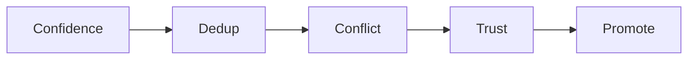
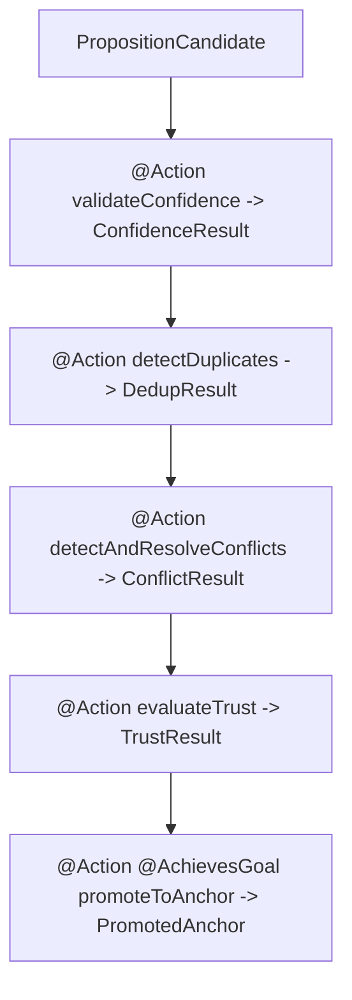
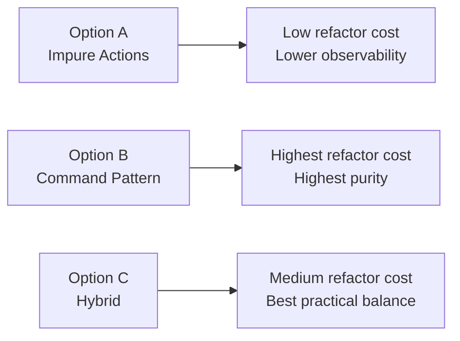
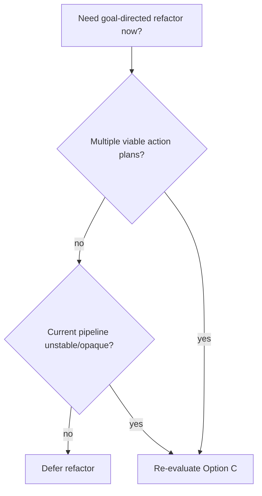

# Embabel Goal-Directed Orchestration Evaluation

**Status**: evaluation only (no implementation in this change)
**Embabel version evaluated**: `0.3.5-SNAPSHOT`
**Date**: `2026-02-28`

Primary question: should `AnchorPromoter` move from the current imperative pipeline to Embabel goal-directed action chaining (`@Action` + `@AchievesGoal` + GOAP planner)?

Recommendation: not yet.

## 1) Current pipeline (what exists now)

`AnchorPromoter` uses a strict five-gate sequence:

```text
confidence -> dedup -> conflict -> trust -> promote
```



Location: `src/main/java/dev/dunnam/diceanchors/extract/AnchorPromoter.java`

### Gate 1: Confidence

```java
if (prop.getConfidence() < threshold) {
    continue;
}
postConfidence++;
```

- fast filter
- no I/O
- no mutation

### Gate 2: Dedup

```java
if (duplicateDetector.isDuplicate(prop.getText(), anchors)) {
    continue;
}
postDedup++;
```

- normalized-string and optional semantic dedup
- no mutation

### Gate 3: Conflict

```java
var conflicts = engine.detectConflicts(contextId, prop.getText());
if (!conflicts.isEmpty()) {
    var resolutionResult = resolveConflicts(prop, conflicts);
    if (!resolutionResult.accepted()) {
        continue;
    }
}
postConflict++;
```

- detects conflicts
- resolves using two-pass approach (decide first, mutate second)
- mutations possible here (`supersede`, `demote`, `reEvaluateTrust`)

### Gate 4: Trust

```java
var trustScore = trustPipeline.evaluate(node, contextId);
if (trustScore.promotionZone() == PromotionZone.REVIEW) {
    continue;
}
if (trustScore.promotionZone() == PromotionZone.ARCHIVE) {
    continue;
}
postTrust++;
```

- read-only evaluation
- candidate routed by `PromotionZone`

### Gate 5: Promote

```java
if (trustScore != null) {
    engine.promote(prop.getId(), initialRank, trustScore.authorityCeiling());
} else {
    engine.promote(prop.getId(), initialRank);
}
promoted++;
```

- mutation
- budget enforcement happens inside promote path

## 2) Why this is hard to model with pure action chaining

Embabel goal actions are strongest when steps are mostly pure typed transforms.

Anchor promotion is not that:
- conflict outcomes can mutate existing anchors
- trust re-eval can trigger follow-on demotions/promotions
- promote can trigger eviction

So the core tension is:

```text
typed immutable flow  vs  ordered Neo4j side effects
```

## 3) What a goal-directed rewrite would look like

A typed action chain could look like this:

```text
PropositionCandidate
  -> ConfidenceResult
  -> DedupResult
  -> ConflictResult
  -> TrustResult
  -> PromotedAnchor (@AchievesGoal)
```



Example style:

```java
@Action
ConfidenceResult validateConfidence(PropositionCandidate c) { ... }

@Action
DedupResult detectDuplicates(ConfidenceResult c) { ... }

@Action
ConflictResult detectAndResolveConflicts(DedupResult d) { ... }

@Action
TrustResult evaluateTrust(ConflictResult c) { ... }

@Action
@AchievesGoal(description = "Candidate promoted to anchor")
PromotedAnchor promoteToAnchor(TrustResult t, ConflictResult c) { ... }
```

Execution order would still be the same because types force the dependency order.

## 4) Side-effect handling options

Three implementation patterns are relevant.

### Option A: Impure actions (mutate inside each `@Action`)

```java
@Action
ConflictResult detectAndResolveConflicts(DedupResult d) {
    // resolve + mutate immediately
    engine.demote(...);
    engine.reEvaluateTrust(...);
    return ...;
}
```

Pros:
- small refactor
- closest to current code

Cons:
- weak data-flow clarity
- partial-failure handling is messy
- planner visibility into side effects is poor

### Option B: Command objects (fully deferred execution)

```java
record DemoteCommand(String anchorId, DemotionReason reason) {}
record PromoteCommand(String propositionId, int rank, Authority ceiling) {}
```

Pros:
- pure typed flow
- explicit side-effect plan
- easier preflight validation

Cons:
- highest complexity
- many command types
- bigger error/rollback surface

### Option C: Hybrid result objects + terminal executor

```java
record ConflictOutcome(Conflict conflict, Resolution resolution) {}

@Action
ConflictResult detectAndResolveConflicts(DedupResult d) {
    // collect outcomes, no mutation
}

@Action
@AchievesGoal(...)
PromotedAnchor promoteToAnchor(TrustResult t, ConflictResult c) {
    // apply conflict mutations, then promote
}
```

Pros:
- better observability than imperative flow
- lower complexity than full command pattern
- keeps mutation ordering explicit in one place

Cons:
- still non-trivial refactor
- terminal action must own failure semantics



## 5) Utility mode vs GOAP mode

Current chat mode is utility mode:

```java
@Bean
Chatbot chatbot(AgentPlatform agentPlatform) {
    return AgentProcessChatbot.utilityFromPlatform(agentPlatform);
}
```

Why this still fits:
- chat behavior is single action per user message
- promoter gate order is fixed
- no meaningful alternative action path for planner to optimize

GOAP becomes more useful when multiple viable action plans or fallback paths exist.

## 6) Blackboard state binding opportunity

Current context lookup pattern:

```java
private String resolveContextId(ActionContext context) {
    var id = context.getProcessContext().getProcessOptions().getContextIdString();
    return id != null ? id : FALLBACK_CONTEXT;
}
```

Blackboard binding could clean this up:

```java
agentProcess.bindProtected("context", contextId);
agentProcess.addObject(anchorEngine);
agentProcess.addObject(anchorRepository);
```

Deferred because in single-action mode the gain is incremental.

## 7) Decision

Current recommendation: **defer goal-directed refactor for `AnchorPromoter`**.



Reasoning:
1. fixed gate order means little planner optimization value
2. refactor cost is medium/high for modest practical gain
3. current imperative pipeline is explicit and stable
4. side-effect semantics need careful transaction/error design before conversion

## 8) Re-evaluate when

Revisit this decision if any of these become true:
1. debugging pressure makes typed action observability clearly worth the refactor
2. chat flow grows into true multi-action orchestration
3. Embabel goal-pattern guidance stabilizes beyond snapshot-stage APIs
4. stricter type-level guarantees around gate progression are needed

## 9) If refactoring later

Start with **Option C (hybrid)**.

Suggested migration order:
1. introduce result records per gate (`ConfidenceResult`, `DedupResult`, etc.)
2. make gates pure decision steps
3. move all mutations into one terminal action
4. wrap terminal mutation block in explicit transactional/error policy
5. preserve existing funnel metrics so before/after behavior is comparable

## References

- Embabel API docs: [https://docs.embabel.com/embabel-agent/api-docs/0.3.5-SNAPSHOT/index.html](https://docs.embabel.com/embabel-agent/api-docs/0.3.5-SNAPSHOT/index.html)
- Embabel coding style: [https://github.com/embabel/embabel-agent/blob/main/embabel-agent-api/.embabel/coding-style.md](https://github.com/embabel/embabel-agent/blob/main/embabel-agent-api/.embabel/coding-style.md)
- `AnchorPromoter`: `src/main/java/dev/dunnam/diceanchors/extract/AnchorPromoter.java`
- `ChatActions`: `src/main/java/dev/dunnam/diceanchors/chat/ChatActions.java`
- `ChatConfiguration`: `src/main/java/dev/dunnam/diceanchors/chat/ChatConfiguration.java`
- OpenSpec artifacts:
  - `openspec/changes/embabel-goal-modeling/specs/embabel-goal-modeling/spec.md`
  - `openspec/changes/embabel-goal-modeling/design.md`
  - `openspec/changes/embabel-goal-modeling/tasks.md`
