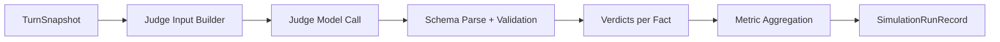
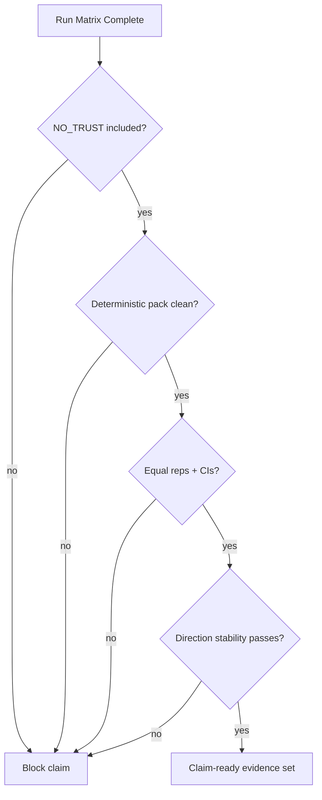

<!-- sync: openspec/specs/benchmark-report, openspec/specs/resilience-report, openspec/specs/deterministic-simulation-tests, openspec/specs/observability -->
<!-- last-synced: 2026-02-25 -->

# Evaluation Protocol

Protocol for evaluating whether ARC-Mem improves long-horizon consistency under pressure.

## 1. Conditions

| Condition | Status | Purpose |
|---|---|---|
| `FULL_ANCHORS` | implemented | full trust + authority stack |
| `NO_ANCHORS` | implemented | baseline without memory unit injection |
| `FLAT_AUTHORITY` | implemented | ablation without hierarchy |
| `NO_TRUST` | missing | ablation isolating trust contribution |

Strong trust-causality claims are out of scope until `NO_TRUST` exists.

## 2. Scenario packs

Evidence is split into two buckets:
- deterministic scripted pack (claim-facing)
- stochastic/adaptive pack (stress-facing)

Rule: do not mix them for primary claim conclusions.

## 3. Reproducibility requirements

For deterministic claim runs:
1. scripted turns only (no generated fallback)
2. pinned model IDs and temperatures
3. pinned execution mode
4. persisted run manifest (scenario hash + prompt hashes + effective config)

Recommended repetitions per `condition x scenario` cell:
- minimum: 10
- preferred: 20

## 4. Drift evaluation model

Per evaluated turn, a judge model sees:
- ground-truth facts (with IDs)
- player prompt
- DM response

Verdicts:
- `CONTRADICTED`
- `CONFIRMED`
- `NOT_MENTIONED`

Severity:
- `NONE`
- `MINOR`
- `MAJOR`

Important rule:
- epistemic hedging counts as `NOT_MENTIONED`, not contradiction.



### Judge output shape (simplified)

```json
{
  "factId": "f-12",
  "verdict": "CONTRADICTED",
  "severity": "MAJOR",
  "explanation": "DM explicitly reversed the fact"
}
```

## 5. Metrics

### Primary (claim-facing)

```text
factSurvivalRate        = (totalFacts - contradictedFacts) / totalFacts * 100
driftAbsorptionRate     = (evaluatedTurns - turnsWithContradictions) / evaluatedTurns * 100
meanTurnsToFirstDrift   = average(firstContradictionTurnByFact)
```

Also tracked as primary:
- `contradictionCount`
- `majorContradictionCount`

### Secondary (diagnostic)

- memory unit attribution count
- strategy effectiveness table
- per-fact survival table
- contradiction detail table
- composite resilience score

Composite score is secondary; raw metrics drive decisions.

## 6. Turn types evaluated

| Turn type | Evaluated |
|---|---|
| `ATTACK` | yes |
| `DISPLACEMENT` | yes |
| `DRIFT` | yes |
| `RECALL_PROBE` | yes |
| `WARM_UP` | no |
| `ESTABLISH` | no |

## 7. Current evidence posture

Status: preliminary.

Useful now:
- finding failure modes
- catching harness/instrumentation bugs
- spotting unstable scenario behavior

Not enough yet for final claim:
- some winner-direction flips still happen
- stochastic/adaptive runs are noisy
- `NO_TRUST` still missing

## 8. Integrity checks before final claim

1. `NO_TRUST` exists and is included
2. deterministic pack has no generated attack turns
3. equal reps per matrix cell
4. confidence intervals reported for all primary metrics
5. direction stability passes across independent batches
6. at least one failure excerpt per condition is retained



## 9. Interpretation guidance

Trust results more when:
- deterministic scripted scenarios
- sample size >= 10 per cell
- direction agrees across independent batches
- manifest and prompt/config hashes are present

Trust results less when:
- adaptive/generated runs only
- low sample size
- winner direction flips across snapshots

## 10. Minimum bar for stronger claim language

1. implement + run `NO_TRUST`
2. run deterministic pack at scale (10-20 reps per cell)
3. pass stability gate across at least two independent batches
4. publish primary metric tables with CIs and failure excerpts
