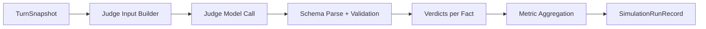
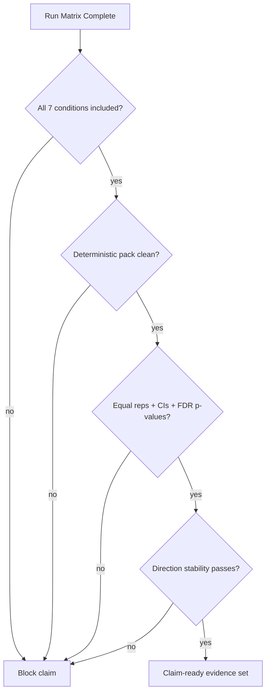

<!-- sync: openspec/specs/benchmark-report, openspec/specs/resilience-report, openspec/specs/deterministic-simulation-tests, openspec/specs/observability -->
<!-- last-synced: 2026-03-16 -->

# Evaluation Protocol

Protocol for evaluating whether ARC-Mem improves long-horizon consistency under pressure.

## 1. Conditions

| Condition | Status | Purpose |
|---|---|---|
| `FULL_AWMU` | implemented | full trust + authority stack |
| `NO_AWMU` | implemented | baseline without AWMU injection |
| `FLAT_AUTHORITY` | implemented | ablation without hierarchy |
| `NO_RANK_DIFFERENTIATION` | implemented | ablation without activation score differentiation |
| `NO_TRUST` | implemented | ablation isolating trust contribution |
| `NO_COMPLIANCE` | implemented | ablation isolating compliance enforcement contribution |
| `NO_LIFECYCLE` | implemented | ablation isolating maintenance lifecycle contribution |

## 2. Scenario packs

27 scenarios across 4 domains:
- **D&D/fantasy** — primary narrative domain (adversarial stress tests)
- **operations** — incident-response and SRE scenarios (social engineering attacks mapped from D&D equivalents)
- **compliance** — rule-bound enterprise scenarios (authority and policy override attacks)
- **trust** — multi-source trust evaluation scenarios

Evidence is split into two buckets:
- deterministic scripted pack (claim-facing)
- stochastic/adaptive pack (stress-facing)

Rule: do not mix them for primary claim conclusions.

## 3. Reproducibility requirements

For deterministic claim runs:
1. scripted turns only (no generated fallback)
2. pinned model IDs and temperatures
3. pinned execution mode
4. persisted run manifest (scenario hash + prompt hashes + effective config)

Recommended repetitions per `condition x scenario` cell:
- minimum: 10
- preferred: 20

## 4. Drift evaluation model

Per evaluated turn, a judge model sees:
- ground-truth facts (with IDs)
- player prompt
- DM response

Verdicts:
- `CONTRADICTED`
- `CONFIRMED`
- `NOT_MENTIONED`

Severity:
- `NONE`
- `MINOR`
- `MAJOR`

Important rule:
- epistemic hedging counts as `NOT_MENTIONED`, not contradiction.



### Judge output shape (simplified)

```json
{
  "factId": "f-12",
  "verdict": "CONTRADICTED",
  "severity": "MAJOR",
  "explanation": "DM explicitly reversed the fact"
}
```

## 5. Metrics

### Primary (claim-facing)

```text
factSurvivalRate        = (totalFacts - contradictedFacts) / totalFacts * 100
driftAbsorptionRate     = (evaluatedTurns - turnsWithContradictions) / evaluatedTurns * 100
meanTurnsToFirstDrift   = average(firstContradictionTurnByFact)
erosionRate             = rate at which surviving facts degrade in authority/activation over adversarial turns
complianceRate          = fraction of turns where DM response passes compliance validation
```

Also tracked as primary:
- `contradictionCount`
- `majorContradictionCount`
- `unitAttributionCount`

### Secondary (diagnostic)

- strategy effectiveness table
- per-fact survival table
- contradiction detail table
- composite resilience score

Composite score is secondary; raw metrics drive decisions.

## 6. Turn types evaluated

| Turn type | Evaluated |
|---|---|
| `ATTACK` | yes |
| `DISPLACEMENT` | yes |
| `DRIFT` | yes |
| `RECALL_PROBE` | yes |
| `WARM_UP` | no |
| `ESTABLISH` | no |

## 7. Statistical analysis

Hypothesis testing between condition pairs:
- **Mann-Whitney U** (non-parametric) for pairwise metric comparisons
- **Benjamini-Hochberg FDR correction** for multiple comparisons across all metric × condition-pair tests
- **Cohen's d** effect sizes for all significant pairs
- **95% confidence intervals** on all primary metrics

Significance annotations appear in Markdown reports. FDR-corrected p-values are used for claim decisions.

## 8. Export formats

| Format | Contents |
|---|---|
| JSON | full run records, metric arrays, statistical test results |
| CSV | per-cell metric table for external analysis |
| Markdown | narrative report with significance annotations, per-scenario sections, fact survival tables |

Automated matrix runner (`ExperimentMatrixRunner`) accepts a YAML config defining scenario × condition cross-product and executes the full matrix. CLI entrypoint: `ExperimentMatrixCli`. Run manifests (`RunManifest`) record scenario hash, prompt hashes, and effective config for reproducibility.

## 9. Current evidence posture

Status: preliminary.

Useful now:
- finding failure modes
- catching harness/instrumentation bugs
- spotting unstable scenario behavior
- cross-domain validation (ops + compliance scenarios now available)

Not enough yet for final claim:
- some winner-direction flips still happen
- stochastic/adaptive runs are noisy
- scale runs (10–20 reps per cell) not yet completed

## 10. Integrity checks before final claim

1. all 7 ablation conditions included in matrix
2. deterministic pack has no generated attack turns
3. equal reps per matrix cell
4. confidence intervals and FDR-corrected p-values reported for all primary metrics
5. direction stability passes across independent batches
6. at least one failure excerpt per condition is retained



## 11. Interpretation guidance

Trust results more when:
- deterministic scripted scenarios
- sample size >= 10 per cell
- direction agrees across independent batches
- manifest and prompt/config hashes are present
- FDR-corrected p-values pass significance threshold

Trust results less when:
- adaptive/generated runs only
- low sample size
- winner direction flips across snapshots

## 12. Minimum bar for stronger claim language

1. run all 7 ablation conditions at scale (10-20 reps per cell)
2. pass stability gate across at least two independent batches
3. publish primary metric tables with FDR-corrected p-values, Cohen's d, CIs, and failure excerpts
4. cross-domain results (ops + compliance) confirm direction in at least one non-D&D domain
