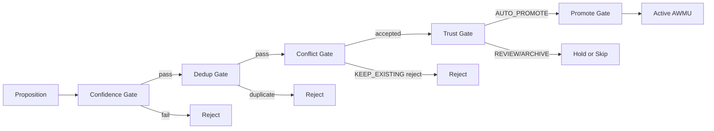
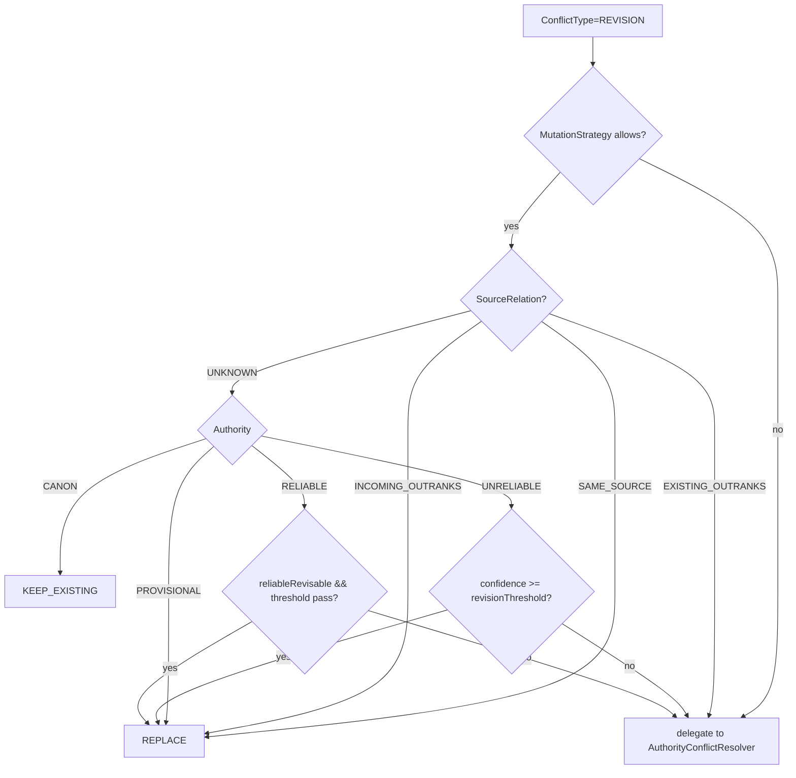
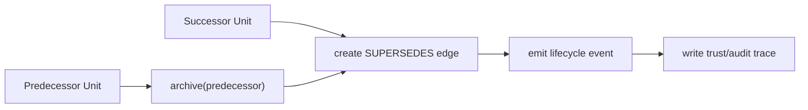

# Promotion, Revision, and Supersession

Mutation semantics reference for ARC Working Memory Units (AWMUs).

## 1) Promotion pipeline

`SemanticUnitPromoter` runs a strict 5-gate sequence:

```text
Proposition -> Confidence -> Dedup -> Conflict -> Trust -> Promote
```



### Gate details

1. confidence gate
- reject below `autoActivateThreshold`
- only eligible statuses continue

2. dedup gate
- `DuplicateDetector.isDuplicate(text, AWMUs)`
- batch mode does fast exact checks before model-assisted dedup

3. conflict gate
- detect via configured detector stack
- resolve in two passes:
  - pass 1: compute resolutions (no side effects)
  - pass 2: execute side effects if candidate survives

4. trust gate
- `TrustPipeline.evaluate(node, contextId)` -> `TrustScore`
- `PromotionZone` routing:
  - `AUTO_PROMOTE` -> continue
  - `REVIEW` -> hold
  - `ARCHIVE` -> skip

5. promote gate
- `ArcMemEngine.promote(id, initialRank, authorityCeiling?)`
- budget enforcement runs inside engine promotion path

## Promotion invariants

- gate order is fixed and must not be reordered
- duplicates must not create separate AWMUs
- conflict outcomes must be executed, not logged and ignored
- budget enforcement is per-promotion, not deferred to batch end

## 2) Conflict resolution outcomes

Possible outcomes:
- `KEEP_EXISTING`
- `REPLACE`
- `DEMOTE_EXISTING`
- `COEXIST`

Typical side effects:

```text
REPLACE         -> arcMemEngine.supersede(existing.id, incoming.id, reason)
DEMOTE_EXISTING -> arcMemEngine.demote(existing.id, reason) + arcMemEngine.reEvaluateTrust(existing.id)
COEXIST         -> arcMemEngine.reEvaluateTrust(existing.id)
```

## 3) Revision pipeline

Revision is not contradiction.

Conflict typing:
- `REVISION`: refine/update existing AWMU
- `CONTRADICTION`: assert opposite
- `WORLD_PROGRESSION`: state changed over narrative time

`RevisionAwareConflictResolver` applies source-aware and authority-aware policy:

```text
if revision disabled        -> delegate to AuthorityConflictResolver
if mutation strategy denies  -> delegate (e.g., HITL-only mode)
if WORLD_PROGRESSION        -> COEXIST
if CONTRADICTION or null    -> delegate
if REVISION:
  1. check source relation (ResolutionContext):
     SAME_SOURCE       -> REPLACE (self-revision)
     INCOMING_OUTRANKS -> REPLACE (higher authority override)
     EXISTING_OUTRANKS -> delegate (lower can't revise higher)
     UNKNOWN           -> fall through to authority-based logic
  2. authority-based fallback (UNKNOWN source):
     CANON       -> KEEP_EXISTING
     PROVISIONAL -> REPLACE
     UNRELIABLE  -> REPLACE when confidence >= revision threshold
     RELIABLE    -> REPLACE only if reliable-revisable is enabled and threshold passes
```



### Source ownership

Each `MemoryUnit` carries an optional `sourceId` identifying who established the fact. `SemanticUnitPromoter` reads the incoming proposition's `sourceIds[0]` from `PropositionNode` and compares it against the existing unit's `sourceId` via a caller-provided `SourceAuthorityResolver`. The result is a `ResolutionContext` with one of four `SourceAuthorityRelation` values:

| Relation | Meaning | Revision behavior |
|---|---|---|
| `SAME_SOURCE` | Same entity that established the fact | Permissive: REPLACE |
| `INCOMING_OUTRANKS` | Incoming source has higher authority | REPLACE |
| `EXISTING_OUTRANKS` | Existing source has higher authority | Delegate to authority resolver |
| `UNKNOWN` | Source info unavailable | Fall through to authority-based logic |

Core defines `SourceAuthorityResolver` as a `@FunctionalInterface`. The simulator provides a concrete implementation (DM outranks player). Core never references domain-specific roles.

## 4) AWMU MutationStrategy gate

All mutation attempts pass through `MemoryUnitMutationStrategy`.

```java
interface MemoryUnitMutationStrategy {
    MutationDecision evaluate(MutationRequest request);
}
```

Default `HitlOnlyMutationStrategy` behavior:
- `UI` source: allow
- `LLM_TOOL`: deny
- `CONFLICT_RESOLVER`: deny

Implication: with defaults, conflict resolver does not auto-replace via non-UI source.

## 5) Supersession lineage

`ArcMemEngine.supersede(predecessorId, successorId, reason)`:
1. archive predecessor
2. create Neo4j `SUPERSEDES` edge
3. emit supersession lifecycle event
4. write trust/audit/trace metadata



`SupersessionReason` examples:
- `CONFLICT_REPLACEMENT`
- `BUDGET_EVICTION`
- `DECAY_DEMOTION`
- `USER_REVISION`
- `MANUAL`

Current limitation: AWMU lineage is still 1:1 (no merge/split semantics).

## 6) AWMU Decay, demotion, reinforcement

Decay model:

```text
effectiveHalfLife = halfLifeHours / max(diceDecay, 0.01) * max(tierMultiplier, 0.01)
newRank = currentRank * 0.5^(hours / effectiveHalfLife)
```

Demotion thresholds (default behavior):
- RELIABLE -> UNRELIABLE below reliable rank threshold
- UNRELIABLE -> PROVISIONAL below unreliable rank threshold
- CANON excluded from auto-demotion

Reinforcement behavior:
- rank boost per reinforcement
- authority upgrades at reinforcement thresholds
- CANON is never auto-assigned

## 7) AWMU Trust re-evaluation hook

`ArcMemEngine.reEvaluateTrust(unitId)` can demote when score falls below configured demotion threshold.
