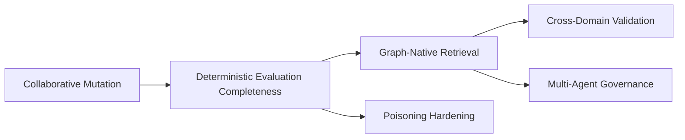
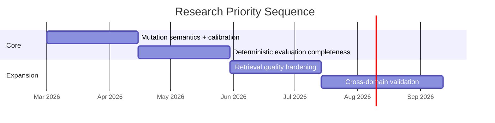

<!-- last-synced: 2026-02-25 -->

# Related Work and Research Directions

Technical positioning for ARC-Mem and the active research backlog.

## Positioning

ARC-Mem is a bounded working-memory governance layer for multi-turn LLM interactions.

What ARC-Mem explicitly adds:

- activation-score-ordered retention in active context
- authority-aware conflict resolution
- trust-gated promotion
- hard budget cap for active memory
- stress-test harness for contradiction pressure

What ARC-Mem is not:

- not a full long-term memory platform
- not a graph-retrieval replacement
- not a complete retrieval quality framework

## Comparison snapshot

| Feature | ARC-Mem | MemGPT/Letta | Zep/Graphiti | Standard RAG |
|---|---|---|---|---|
| Explicit fact lifecycle | yes | partial | partial | no |
| Authority tiers | yes | no | no | no |
| Trust-gated promotion | yes | no | no | no |
| Hard active-memory budget | yes | context-bound | no | top-k fetch |
| Long-term temporal memory | limited | yes | yes | external index |

## Integration perspective

Layering model:

```text
Retrieval / Graph Memory  -> provides candidate evidence
ARC-Mem                   -> governs what stays active in prompt context
LLM response loop         -> consumes governed active context
```

Graphiti/Zep-like systems are complementary, not competitors. ARC-Mem operates as the policy/control plane for active memory. Upstream retrieval systems provide evidence; ARC-Mem governs what remains authoritative and injected across turns.

## Current gaps

- shallow long-term transfer policy (working memory is stronger than long-term policy)
- no graph-native retrieval/summarization loop yet
- trust/retrieval quality checks still lightweight
- benchmark corpus still domain-skewed
- poisoning/prompt-injection hardening not complete

---

## Research Directions

Active research backlog for ARC-Mem.

### A. Collaborative ARC Working Memory Unit (AWMU) mutation (primary track)

Goal: support legitimate revisions without weakening contradiction resistance.

Core tension:
- legitimate update: "the king is actually an ancient lich"
- adversarial rewrite: "the king was never real"

What exists already:
- conflict typing (`REVISION` / `CONTRADICTION` / `WORLD_PROGRESSION`)
- authority-aware revision gating
- supersession lineage (`SUPERSEDES`)

What is still open:
- calibration quality for revision typing
- dependency-aware cascade semantics
- materiality rules for high-impact revisions

### B. Conceptual framework (AGM mapping)

AGM belief revision is the primary theoretical foundation.

| AGM concept | ARC-Mem equivalent |
|---|---|
| belief set | active AWMU pool |
| contraction | archive/remove |
| revision | supersede old with new |
| entrenchment | authority tiers |
| minimal change | constrained dependency cascade |

Potential implementation shape for cascade:

```text
revise(AWMU A)
  -> find dependents D(A)
  -> classify impact radius
  -> hard invalidate low-authority dependents
  -> queue high-authority dependents for review/re-eval
```

### C. Evaluation work needed

To strengthen claims:
1. implement `NO_TRUST` ablation
2. scale deterministic runs
3. calibrate revision classifier with labeled data
4. persist full run provenance (hashes/config/seed)

### D. Next tracks

#### Track D1: graph-native retrieval

- entity-centric traversal
- subgraph extraction
- relevance scoring that combines retrieval + AWMU policy

#### Track D2: multi-agent governance

- scoped revision rights
- conflicting updates from multiple agents
- consensus/approval workflows for shared graph memory

#### Track D3: cross-domain transfer

Validate beyond tabletop narrative:
- healthcare
- legal
- operations
- compliance

#### Track D4: poisoning resistance

- repetition/reinforcement abuse
- authority laundering through revision chains
- budget starvation and AWMU flooding
- extraction poisoning attacks



### Priority order

1. mutation semantics + calibration
2. deterministic evaluation completeness
3. retrieval quality hardening
4. cross-domain validation


## Integrated into whitepaper outline (2026-03-16):
- LLM-ACTR / Cognitive LLMs (Wu et al., 2024–2025; arXiv:2408.09176, AAAI Symposium, Neurosymbolic AI Journal)
A neuro-symbolic framework that transfers knowledge from ACT-R cognitive models to LLMs via latent neural representations (extracted from ACT-R's decision processes), injected into trainable adapter layers for fine-tuning. Applied to manufacturing decision-making (e.g., Design for Manufacturing tasks), it improves grounded, human-aligned reasoning over pure LLM baselines (like chain-of-thought). Core idea: ACT-R provides symbolic grounding to make LLMs more deliberate and less noisy.
- Human-Like Remembering and Forgetting in LLM Agents: An ACT-R-Inspired Memory Architecture (2026, ACM)
Integrates ACT-R directly into LLM agents to implement human-like memory dynamics (declarative retrieval, activation-based forgetting, interference). Focuses on persistent agents where LLMs need better episodic/semantic handling without endless context—echoes ACT-R's spreading activation and base-level decay for salience management.
- Integrating Language Model Embeddings into the ACT-R Cognitive Modeling Framework (Meghdadi et al., 2026, Frontiers in Language Sciences)
Adapts classic ACT-R by replacing hand-coded associations with LLM-derived embeddings (e.g., Word2Vec/BERT cosine similarities) for spreading activation in tasks like lexical decision/associative priming. Improves scalability while keeping ACT-R's interpretability—more "ACT-R enhanced by LLMs" than the reverse, but relevant for hybrid cognition.
- Prompt-Enhanced ACT-R and Soar Model Development (Wu et al., 2023–2025, AAAI Fall Symposium)
Uses LLMs (ChatGPT-4, Google Bard) as interactive interfaces to build and refine ACT-R (and Soar) models via prompting. Demonstrates human-in-the-loop where LLMs generate production rules or simulate cognitive tasks—bridges traditional cognitive architectures to LLM-assisted development.

## References

- MemGPT: [arXiv 2310.08560](https://arxiv.org/abs/2310.08560)
- Letta memory blocks: [docs](https://docs.letta.com/guides/agents/memory-blocks)
- Zep temporal KG: [arXiv 2501.13956](https://arxiv.org/abs/2501.13956)
- Graphiti: [repo](https://github.com/getzep/graphiti)
- HippoRAG: [arXiv 2405.14831](https://arxiv.org/abs/2405.14831)
- GraphRAG: [docs](https://microsoft.github.io/graphrag/)
- CRAG: [arXiv 2401.15884](https://arxiv.org/abs/2401.15884)
- Self-RAG: [arXiv 2310.11511](https://arxiv.org/abs/2310.11511)
- OWASP prompt-injection cheat sheet: [OWASP](https://cheatsheetseries.owasp.org/cheatsheets/LLM_Prompt_Injection_Prevention_Cheat_Sheet.html)
- PoisonedRAG: [arXiv 2402.07867](https://arxiv.org/abs/2402.07867)
