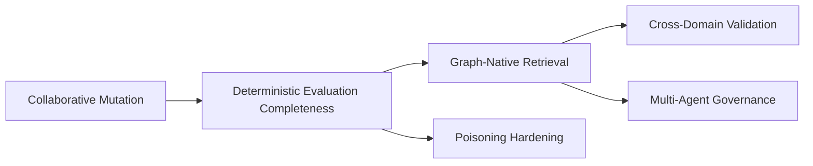
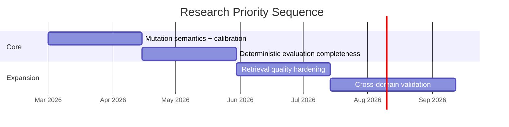

# Research Directions

Active research backlog for the demo.

## A. Collaborative anchor mutation (primary track)

Goal: support legitimate revisions without weakening contradiction resistance.

Core tension:
- legitimate update: "the king is actually an ancient lich"
- adversarial rewrite: "the king was never real"

What exists already:
- conflict typing (`REVISION` / `CONTRADICTION` / `WORLD_PROGRESSION`)
- authority-aware revision gating
- supersession lineage (`SUPERSEDES`)

What is still open:
- calibration quality for revision typing
- dependency-aware cascade semantics
- materiality rules for high-impact revisions

## B. Conceptual framework (AGM mapping)

AGM belief revision is the primary theoretical anchor.

| AGM concept | Anchor equivalent |
|---|---|
| belief set | active anchor pool |
| contraction | archive/remove |
| revision | supersede old with new |
| entrenchment | authority tiers |
| minimal change | constrained dependency cascade |

Potential implementation shape for cascade:

```text
revise(anchor A)
  -> find dependents D(A)
  -> classify impact radius
  -> hard invalidate low-authority dependents
  -> queue high-authority dependents for review/re-eval
```

## C. Evaluation work needed

To strengthen claims:
1. implement `NO_TRUST` ablation
2. scale deterministic runs
3. calibrate revision classifier with labeled data
4. persist full run provenance (hashes/config/seed)

## D. Next tracks

### Track D1: graph-native retrieval

- entity-centric traversal
- subgraph extraction
- relevance scoring that combines retrieval + anchor policy

### Track D2: multi-agent governance

- scoped revision rights
- conflicting updates from multiple agents
- consensus/approval workflows for shared graph memory

### Track D3: cross-domain transfer

Validate beyond tabletop narrative:
- healthcare
- legal
- operations
- compliance

### Track D4: poisoning resistance

- repetition/reinforcement abuse
- authority laundering through revision chains
- budget starvation and anchor flooding
- extraction poisoning attacks



## Priority order

1. mutation semantics + calibration
2. deterministic evaluation completeness
3. retrieval quality hardening
4. cross-domain validation


