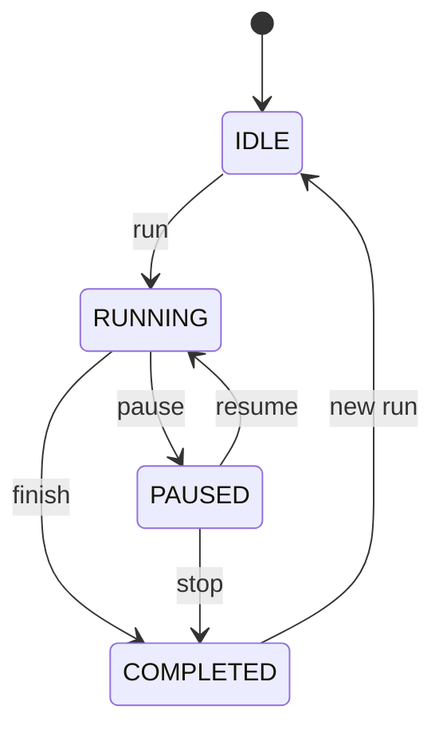
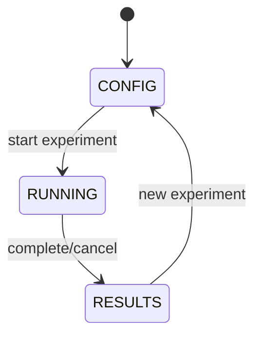
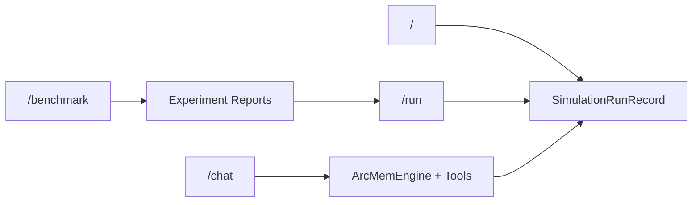

# UI Views

Engineer-facing route map for the Vaadin UI.

## `/` SimulationView

Primary role: run scenario turns and inspect ARC Working Memory Unit (AWMU) behavior in-flight.

### Main panels

- conversation transcript
- context inspector
- AWMU timeline
- drift summary
- knowledge browser
- manipulation panel (only while paused)

### State machine

```text
IDLE -> RUNNING -> PAUSED -> COMPLETED
```



Control behavior by state:
- `RUNNING`: run controls locked except pause/stop
- `PAUSED`: manipulation enabled
- `COMPLETED`: results tab emphasized

Technical details:
- execution runs async (`CompletableFuture`)
- UI updates fan through `ui.access()`

## `/chat` ChatView

Primary role: interactive DM chat with live AWMU/proposition controls.

### Sidebar function groups

- AWMUs: activation score/authority/pin/revision controls
- Propositions: promote candidates
- Context: rendered injection preview
- Session info: context and turn counters

### Session model

- state lives in `VaadinSession`
- each send path invokes `chatSession.onUserMessage(...)`
- extraction updates arrive asynchronously after response

Tooling split is explicit:
- query tools (read-only)
- mutation tools (state-changing)

## `/benchmark` BenchmarkView

Primary role: run condition/scenario matrixes and inspect statistical comparisons.

### State machine

```text
CONFIG -> RUNNING -> RESULTS
```



Execution notes:
- runs async in background
- cancellation is cooperative (`cancel` at cell boundary)
- report output generated as Markdown

Key analysis panels:
- condition comparison table
- per-fact drill-down
- experiment history

## `/run` RunInspectorView

Primary role: post-run forensics and optional side-by-side comparison.

URL modes:
- single run: `?runId=<id>`
- comparison: `?runId=<id>&compare=<id>`

Tabs:
- conversation
- AWMUs
- drift
- AWMU diff (single-run mode)
- comparison (cross-run mode)

Technical details:
- view state is materialized from `SimulationRunRecord`
- changing selected turn re-renders all tabs from the same index
- no async fetch loop in this screen

## Route summary

| Route | Primary job |
|---|---|
| `/` | run and monitor simulations |
| `/chat` | interactive ARC-Mem-aware chat |
| `/benchmark` | compare conditions at experiment scale |
| `/run` | inspect run internals and compare outcomes |


