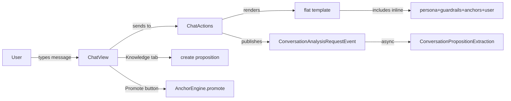

## Context

The chat UI at `/chat` crashes on every user message because `dice-anchors.jinja` uses `` directives that Embabel's Jinjava renderer cannot resolve (no classpath resource loader). The simulation templates work because they avoid includes entirely. The chat UI also lacks a way to manually add knowledge (propositions) for demo purposes.

## Goals / Non-Goals

**Goals:**
- Fix the template crash so chat works again
- Add a Knowledge tab for manual proposition management
- Keep the existing Anchors tab with its create/manage functionality

**Non-Goals:**
- Configuring Embabel's Jinjava resource loader (internal API, version-dependent)
- Changing the DICE extraction pipeline
- Adding new domain entity types

## Decisions

### D1: Flatten Jinja template instead of configuring resource loader

Inline all `` content into `dice-anchors.jinja` as a single flat template. This matches `SimulationTurnExecutor`'s working approach and avoids depending on Embabel internal Jinjava configuration.

**Alternative**: Configure a custom `ClassPathResourceLoader` bean. Rejected because Embabel 0.3.4-SNAPSHOT may not expose this extension point, and flat templates are simpler.

### D2: Add Knowledge tab to existing TabSheet

Add a fourth "Knowledge" tab to the sidebar `TabSheet` in `ChatView`. This tab will contain:
- A list of all propositions (non-anchor) with text, confidence, status
- A "Promote" button on each proposition card
- A "Add Knowledge" form (text field + confidence slider + create button)

**Alternative**: Merge into existing Propositions tab. Rejected because the Propositions tab is specifically for DICE-extracted propositions, while Knowledge includes manually added entries.

### D3: Proposition creation via existing persistence layer

Use the same pattern as `buildCreateAnchorForm()`: create a `PropositionNode`, save via `GraphObjectManager`, and set contextId. No new repository methods needed.

## Risks / Trade-offs

- [Flat template maintenance] Large single template file is harder to maintain → Acceptable for a demo app; templates are short
- [Tab count] Four sidebar tabs may crowd the UI → Tabs are compact in Vaadin's TabSheet; sidebar has 30% width

