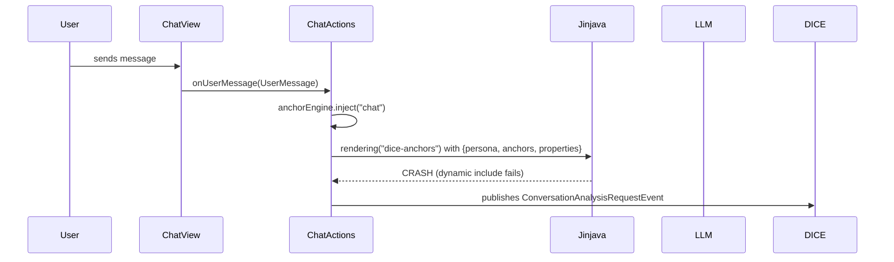

## Context

The chat UI at `/chat` is currently broken. `ChatActions.respond()` calls `context.ai().rendering("dice-anchors")` which loads `dice-anchors.jinja`. The template's first line — `` — uses dynamic string concatenation in an `` tag, which Embabel's Jinjava renderer cannot resolve. This crashes with `InterpretException: Error rendering tag (FATAL)` on every message.

Beyond the crash, the chat view has a propositions sidebar but no way to manually create anchors, edit anchor metadata, or inspect the knowledge graph during a session. This limits its usefulness for manual testing of the anchor system.

### Current Flow



### Reference: Impromptu

The `impromptu` project uses a simpler template (`impromptu_chat_response.jinja`) with static includes and no dynamic path concatenation. It also uses `.withPromptElements(user)` to auto-load persona elements, but dice-anchors doesn't have an `ImpromptuUser` equivalent. The simplest fix is to restructure the template to use static includes with conditional persona selection.

### Template Files

| File | Content |
|------|---------|
| `dice-anchors.jinja` | Main template — 4 dynamic includes |
| `personas/dm.jinja` | Bigby DM persona |
| `personas/assistant.jinja` | Factual assistant persona |
| `elements/guardrails.jinja` | "Never contradict established facts" instructions |
| `elements/anchor-context.jinja` | ESTABLISHED FACTS block (iterates `anchors` list) |
| `elements/user.jinja` | User context intro |

## Goals / Non-Goals

**Goals:**
- Fix the Jinja template crash so chat messages are processed end-to-end
- Add anchor management to the chat sidebar — create, edit rank/authority, evict
- Add knowledge inspection — show propositions with extraction status and trust scores
- Verify the full pipeline: message → LLM response → DICE extraction → anchor promotion

**Non-Goals:**
- Full DICE Memory integration (requires Embabel 0.3.5 `LlmReference` which isn't available)
- Persona switching at runtime (hardcode `dm` persona for now)
- Voice input, asset tracking, or concert-style features from impromptu
- Persistent chat history across restarts

## Decisions

### D1: Fix template with static includes + conditional persona

Replace dynamic include with Jinja conditional blocks:

```jinja








```

**Why not inline everything?** Keeping the include structure preserves modularity. If new personas are added, they just need a new conditional branch and a `.jinja` file.

**Why not use `.withPromptElements()`?** That requires an `ImpromptuUser`-style object and tighter Embabel coupling. The template approach is simpler and already works for the sim harness.

### D2: Anchor management in sidebar panel

Add a collapsible "Manage Anchors" section below the existing propositions sidebar. Components:

- **Create anchor form**: text field, rank slider [100-900], authority dropdown (PROVISIONAL/UNRELIABLE/RELIABLE), submit button
- **Per-anchor actions**: inline rank slider, authority dropdown, evict button
- All operations go through `AnchorRepository` with contextId `"chat"`

**Why in the sidebar, not a dialog?** The sidebar is always visible and updates reflect immediately in the anchor list above. A dialog would require open/close ceremony and manual refresh.

### D3: Knowledge browser as a tab in the sidebar

Replace the flat propositions list with a tabbed sidebar:
- **Tab 1: Anchors** — active anchors with management controls (existing display + new controls)
- **Tab 2: Propositions** — extracted propositions with confidence, promotion status
- **Tab 3: Session Info** — context ID, message count, extraction event count

**Why tabs?** The sidebar is already 30% width. Adding anchor management controls inline would make it too busy. Tabs let us show more detail per section without scrolling.

### D4: Use existing AnchorEngine/AnchorRepository for all operations

All anchor CRUD goes through the existing `AnchorEngine` and `AnchorRepository`. No new service layer. The chat view calls these directly (like the sim's `AnchorManipulationPanel` does).

## Risks / Trade-offs

- **[Risk] Jinjava might have other hidden issues** → Mitigation: Test with both `dm` and `assistant` personas; add error handling around template rendering in ChatActions with a fallback plain-text system prompt
- **[Risk] DICE extraction may not fire correctly** → Mitigation: Verify `ConversationAnalysisRequestEvent` flow end-to-end; add log statements at each pipeline stage
- **[Risk] Sidebar refresh timing** → Mitigation: Keep the current manual refresh approach (query after each turn); async extraction may not have completed by refresh time, so propositions may lag one turn behind — this is acceptable for manual testing
