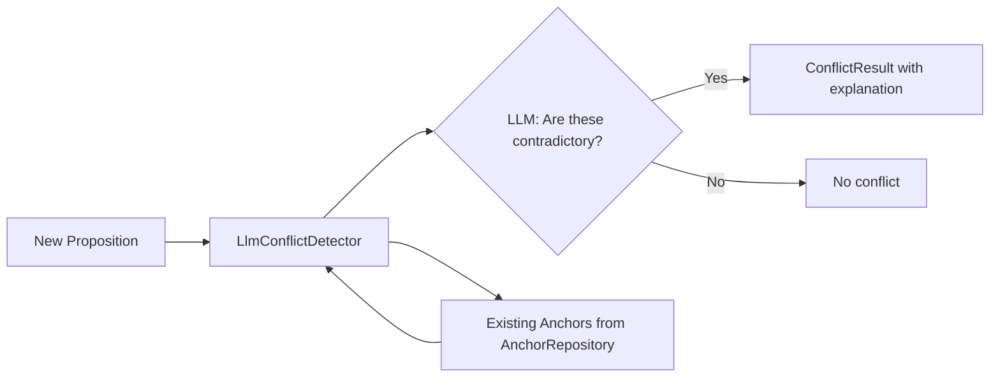
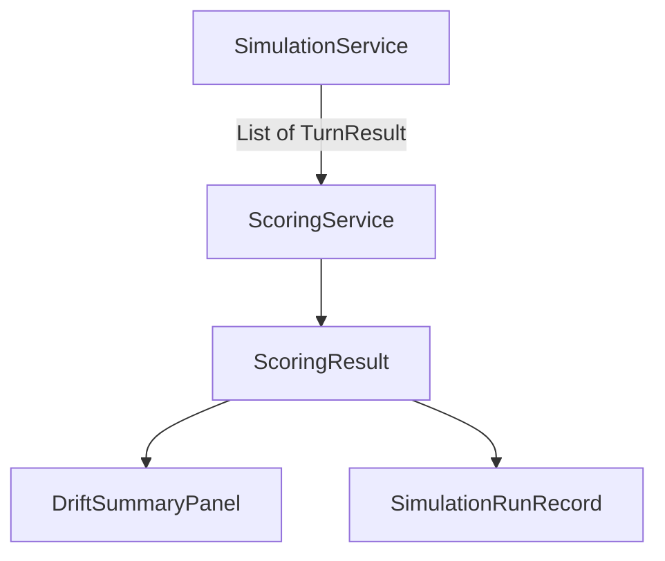

## Context

dice-anchors has a working simulation harness and anchor engine, but several components use placeholder implementations documented in [known-limitations.md](../../docs/known-limitations.md). The tor project has battle-tested solutions for drift evaluation and scoring. Spring AI 1.1.1 lacks native structured output, so JSON output follows the instruct+parse pattern (JSON schema in prompt → strip markdown fences → Jackson ObjectMapper → fallback heuristics).

Key current state:
- `SimulationTurnExecutor.evaluateDrift()` uses a weak prompt and fragile line-by-line regex parsing
- `NegationConflictDetector` uses lexical negation markers + word overlap — misses semantic contradictions
- `SimulationRunStore` is in-memory only — lost on restart
- Compaction generates summaries but never validates that protected facts survived
- Trust signals have the SPI framework but minimal implementations
- DICE extraction pipeline is actually working (ConversationPropositionExtraction → PropositionPipeline → AnchorPromoter) with minor issues

## Goals / Non-Goals

**Goals:**
- Replace drift evaluation with structured JSON output, tor-style prompts, and severity tracking
- Add true attribution tracking matching injected anchors to ground truth
- Add ScoringService computing 7+ metrics from turn data
- Replace lexical conflict detection with LLM-based semantic detection
- Add post-compaction fact survival validation
- Persist run history to Neo4j with a pluggable store interface
- Enrich trust signal implementations
- Fix minor DICE extraction issues
- Update known-limitations.md as fixes land

**Non-Goals:**
- Parallel scenario execution or batch runs
- Embedding-based semantic similarity (LLM judgment is sufficient for this exploration)
- Cross-model benchmarking
- Production-hardened error handling
- Empirical tuning of trust profile thresholds (future work)

## Decisions

### D1: Structured drift output via instruct+parse (not native structured output)

Spring AI 1.1.1 has no `BeanOutputConverter` or `ChatClient.entity()`. The pattern used by tor and consistent with the codebase:

1. Include JSON schema in the system prompt with examples
2. Call ChatModel normally
3. Strip markdown code fences (````json ... ```)
4. Parse with Jackson ObjectMapper into `DriftEvaluationResult` record
5. On parse failure, fall back to keyword heuristic (scan for CONTRADICTED/CONFIRMED/NOT_MENTIONED)

**Alternative considered:** Wait for Spring AI structured output API. Rejected — no timeline, and instruct+parse is proven in tor.

**Records:**
```java
record DriftEvaluationResult(List<FactVerdict> verdicts) {}
record FactVerdict(String factId, Verdict verdict, Severity severity, String explanation) {}
enum Verdict { CONTRADICTED, CONFIRMED, NOT_MENTIONED }
enum Severity { NONE, MINOR, MAJOR }
```

### D2: LLM-based conflict detection with cheap model

Replace `NegationConflictDetector` with `LlmConflictDetector` that sends anchor text pairs to a cheap, fast model (configurable, default gpt-4o-nano).



The `ConflictDetector` interface stays as-is. `LlmConflictDetector` implements it. Config selects which implementation is active via `dice-anchors.conflict-detection.strategy` property (lexical | llm).

**Prompt design:** Send pairs, not the full anchor set. For budget=20, worst case is 20 LLM calls per new proposition. With gpt-4o-nano latency (~100ms) this is ~2s total. Acceptable for exploration. Batch optimization is a non-goal.

**Alternative considered:** Embedding cosine similarity for pre-filtering + LLM for confirmation. Rejected — adds embedding model dependency for marginal gain in an exploration project.

### D3: ScoringService as a stateless computation layer

`ScoringService` takes a `List<TurnResult>` and `List<GroundTruthFact>` and returns a `ScoringResult` record. No persistence, no state — pure function. Consumed by `SimulationService` at run end and by `DriftSummaryPanel` for display.



**Metrics computed:**
- `factSurvivalRate` — % of facts never contradicted
- `contradictionCount` — total CONTRADICTED verdicts
- `majorContradictionCount` — total MAJOR severity contradictions
- `driftAbsorptionRate` — % of evaluated turns with zero contradictions
- `meanTurnsToFirstDrift` — average turn of first contradiction per fact
- `anchorAttributionCount` — verdicts where injected anchor matched ground truth
- `strategyEffectiveness` — Map<AttackStrategy, Double> showing contradiction rate per strategy

### D4: Attribution via normalized text matching

Port tor's `computeAttribution()` approach:
1. Normalize both anchor text and ground truth text (lowercase, strip non-alphanumeric)
2. Check if normalized anchor contains normalized fact OR vice versa
3. Count matches as attributed

This is crude but effective for simulation ground truth that mirrors seed anchor text. A semantic similarity approach would be better but is a non-goal.

### D5: RunHistoryStore interface with dual implementations

```java
interface RunHistoryStore {
    void save(SimulationRunRecord record);
    Optional<SimulationRunRecord> load(String runId);
    List<SimulationRunRecord> list();
    List<SimulationRunRecord> listByScenario(String scenarioId);
    void delete(String runId);
}
```

- `InMemoryRunHistoryStore` — current behavior, default
- `Neo4jRunHistoryStore` — serializes `SimulationRunRecord` to Neo4j node with JSON payload

Config selects via `dice-anchors.run-history.store` property (memory | neo4j). Default: memory.

**Alternative considered:** File-based JSON store. Rejected — Neo4j is already running, and the JSON-in-node pattern is simple.

### D6: Post-compaction validation via keyword check

After `SimSummaryGenerator` produces a summary, check that each protected content item (from `ProtectedContentProvider`) appears in the summary text. Use normalized keyword matching (not LLM) — fast, deterministic, and sufficient for simulation ground truth.

Report missing facts as `CompactionLossEvent` entries on the turn result.

### D7: Trust signal enrichment — concrete implementations

The four trust signals (SourceAuthority, ExtractionConfidence, GraphConsistency, Corroboration) already have SPI definitions and basic implementations. Enrich them:
- `GraphConsistencySignal`: Use Jaccard similarity between proposition tokens and active anchor tokens (currently word-overlap, make it proper Jaccard)
- `CorroborationSignal`: Weight by source diversity (DM + PLAYER sources worth more than 2x PLAYER)
- Add scenario YAML integration so trust profiles activate per-scenario

### D8: DICE extraction minor fixes

The pipeline works. Fixes:
- `ChunkHistoryStore`: Currently in-memory. Add Neo4j-backed implementation behind an interface (same pattern as RunHistoryStore)
- Error handling: Replace broad `catch (Exception e)` with specific exception types in `ConversationPropositionExtraction`
- Verify end-to-end event flow with a focused integration test

## Risks / Trade-offs

- **[LLM cost for conflict detection]** → Mitigated by using gpt-4o-nano (cheapest available). Budget of 20 anchors × ~$0.0001/call = negligible per proposition.
- **[Instruct+parse brittleness]** → Mitigated by fallback keyword heuristic. If JSON parsing fails, we still get basic verdict classification.
- **[Attribution false positives]** → Normalized substring matching may match unrelated anchors with common terms. Acceptable for controlled simulation scenarios with distinct ground truth.
- **[Neo4j run history schema]** → Storing full JSON payload as a node property is not queryable. Acceptable — we only need save/load/list, not complex queries on run internals.

## Open Questions

- Should conflict detection batch multiple anchor pairs per LLM call, or keep it one-pair-per-call for simplicity? Starting with one-pair-per-call.
- Should `ScoringService` also compute per-fact lifecycle tracking (ESTABLISHED → MAINTAINED → CHALLENGED → CONTRADICTED → SURVIVED)? Starting without — can add if the metrics prove useful.
