# Design: sim-ui-feature-parity

## Context

dice-anchors currently has a minimal simulation UI (3 view files totaling ~735 lines) compared to tor's anchor-sim (12+ view files). The `SimulationView` is a monolithic 403-line class that mixes control state management, conversation rendering, progress handling, and inspector wiring into one file. The `ContextInspectorPanel` has only two tabs (Anchors, Verdicts) with no drill-down capabilities. The chat integration (`ChatActions`) diverges from the urbot/impromptu record patterns that Embabel users expect. There is no trust model, compaction pipeline, run history, assertion framework, or observability instrumentation.

The current codebase provides the core anchor engine (`AnchorEngine`, `Anchor`, `Authority`, `AnchorPromoter`), a working persistence layer (`AnchorRepository`, `PropositionNode`), context injection (`AnchorsLlmReference`), and a turn executor (`SimulationTurnExecutor`) that calls `ChatModel` directly for DM response generation and drift evaluation.

Key existing patterns this design builds on:
- `SimulationService` manages pause/resume/cancel with `volatile boolean` flags and `AtomicBoolean`
- `SimulationTurnExecutor` accepts `boolean injectionEnabled` captured once at simulation start
- `AnchorPromoter` evaluates propositions using a confidence threshold and conflict check
- `ChatActions` is already a record with `@EmbabelComponent` and `@Action`, but does not follow the full urbot chain
- `SimulationProgress` delivers per-turn snapshots to the UI via `Consumer<SimulationProgress>`
- `SimulationScenario` is a Jackson-deserialized record with `@JsonIgnoreProperties(ignoreUnknown = true)` for forward compatibility

## Goals / Non-Goals

### Goals

- **G1**: Break `SimulationView` into composed panels with a `SimControlState` enum driving all visibility
- **G2**: Fix the injection toggle to read state per-turn instead of capturing at start
- **G3**: Align chat integration with urbot patterns for `ChatActions`, `ChatConfiguration`, `PropositionConfiguration`
- **G4**: Layer a trust scoring model on top of the existing anchor engine without replacing it
- **G5**: Add a browsable knowledge panel for propositions and anchors within simulation review
- **G6**: Build a compaction pipeline that protects anchor-backed content from being summarized away
- **G7**: Instrument key operations with Micrometer `@Observed` and export traces to Langfuse via OTEL
- **G8**: Store completed simulation runs in memory and provide a tabbed per-turn inspector
- **G9**: Expand from 2 to 15 scenarios covering trust evaluation, adversarial attacks, dormancy, and multi-session
- **G10**: Add a declarative assertion framework driven by YAML scenario config
- **G11**: Apply a retro dark theme via Vaadin custom theme directory

### Non-Goals

- **NG1**: Replacing Neo4j with a relational store (Article II of the constitution)
- **NG2**: Building a production-grade auth system -- `AnonymousDmUser` remains sufficient
- **NG3**: Real-time collaborative simulation (multi-user viewing the same run)
- **NG4**: Streaming LLM responses -- `ChatModel.call()` remains synchronous per turn
- **NG5**: Persisting run history to Neo4j -- in-memory LRU is sufficient for the demo
- **NG6**: Building a generic simulation framework -- this is dice-anchors-specific

## Decisions

### D1: Panel Composition over Monolithic Views

**Decision**: Decompose `SimulationView` into 5 composed panels: `ConversationPanel`, `DriftSummaryPanel`, `AnchorTimelinePanel`, `AnchorManipulationPanel`, and `InterventionImpactBanner`. Each panel is a standalone `VerticalLayout` subclass with its own `update()` method.

**Rationale**: The current `SimulationView` (403 lines) mixes conversation rendering, control wiring, progress handling, and message formatting. Adding anchor manipulation, timeline visualization, and drift summary to the same class would push it past 800 lines. Panels enable independent development, isolated testing, and selective visibility based on `SimControlState`.

**Alternatives considered**:
- *Keep monolithic and use regions*: Rejected because control state logic becomes a tangled web of `setEnabled`/`setVisible` calls scattered across one file.
- *Use Vaadin `RouterLayout` with sub-routes*: Rejected because all panels need to share the same simulation lifecycle and react to the same `SimulationProgress` stream.

**Layout structure**:
```
SimulationView (VerticalLayout, @Route(""))
  +-- Header: title + scenarioCombo + injectionToggle + buttons
  +-- InterventionImpactBanner (conditionally visible)
  +-- SplitLayout (primary)
  |     +-- LEFT: SplitLayout (secondary, vertical)
  |     |     +-- TOP: ConversationPanel
  |     |     +-- BOTTOM: DriftSummaryPanel
  |     +-- RIGHT: TabSheet
  |           +-- Tab: ContextInspectorPanel (existing, enhanced)
  |           +-- Tab: AnchorTimelinePanel
  |           +-- Tab: AnchorManipulationPanel (visible only in PAUSED)
  |           +-- Tab: KnowledgeBrowserPanel
  +-- StatusBar: progressBar + statusLabel
```

### D2: SimControlState Enum as State Machine Driver

**Decision**: Introduce a `SimControlState` enum (`IDLE`, `RUNNING`, `PAUSED`, `COMPLETED`) that drives all button enable/disable and panel visibility through a single `transitionTo(SimControlState)` method on `SimulationView`.

**Rationale**: The current `setControlsRunning()` / `setControlsIdle(boolean)` pattern requires manually coordinating 6 buttons and will grow to 10+ components. A state enum centralizes the mapping.

**Alternatives considered**:
- *Boolean flag soup*: Current approach; already fragile with 4 buttons, untenable with manipulation panel and timeline.
- *Vaadin Binder with a state model*: Over-engineered for this use case; Binder is designed for form fields, not component visibility.

**Transition table**:

| Current State | Event | Next State | Side Effects |
|---|---|---|---|
| IDLE | Run clicked | RUNNING | Clear panels, start sim, show progress |
| RUNNING | Pause clicked | PAUSED | Show manipulation panel, enable resume |
| RUNNING | Complete | COMPLETED | Show drift summary, store run |
| RUNNING | Cancel clicked | IDLE | Clean up, reset panels |
| PAUSED | Resume clicked | RUNNING | Show intervention banner, hide manipulation |
| PAUSED | Cancel clicked | IDLE | Clean up, reset panels |
| COMPLETED | New run | IDLE | Reset panels |

### D3: Injection Toggle Fix -- `Supplier<Boolean>` per Turn

**Decision**: Change `SimulationService.runSimulation()` from `boolean injectionEnabled` to `Supplier<Boolean> injectionStateSupplier`. The supplier is read at the start of each turn in the loop. `SimulationTurnExecutor.executeTurn()` also changes from `boolean injectionEnabled` to accept the evaluated boolean.

**Rationale**: The current code captures `var injectionEnabled = injectionToggle.getValue()` once in `startSimulation()` and passes it as a `boolean` to `runSimulation()`. Mid-run toggling has no effect. The `Supplier<Boolean>` defers evaluation to each turn.

**BREAKING**: This changes the `SimulationService.runSimulation()` public signature. All call sites (currently only `SimulationView.startSimulation()`) MUST be updated.

**Implementation**:
```java
// SimulationView.startSimulation():
simulationService.runSimulation(scenario,
    () -> injectionToggle.getValue(),  // Supplier, evaluated per-turn
    progress -> ui.access(() -> applyProgress(progress, scenario)));

// SimulationService.runSimulation() loop:
for (int i = 0; i < scenario.maxTurns() && !cancelRequested.get(); i++) {
    var injectionThisTurn = injectionStateSupplier.get();
    var turn = turnExecutor.executeTurn(..., injectionThisTurn, ...);
}
```

### D4: ChatActions as Record (urbot Alignment)

**Decision**: Refactor `ChatActions` to follow the urbot `ChatActions` record pattern exactly: `@EmbabelComponent` record with record components for all dependencies, `@Action(canRerun = true, trigger = UserMessage.class)` for `respond()`, and a full `context.ai().withLlm(...).withPromptElements(...).withTools(...).rendering(...)` chain.

**Rationale**: dice-anchors' `ChatActions` is already a record (good) but its `respond()` method uses `.withDefaultLlm()` + `.respondWithSystemPrompt()` instead of the urbot chain pattern. Aligning makes the demo recognizable to anyone coming from urbot/impromptu.

**Alternatives considered**:
- *Keep current simplified pattern*: Rejected because the current pattern doesn't wire `PromptElement` contributors (including `AnchorsLlmReference` as a proper `PromptElement`), doesn't support tools, and doesn't integrate memory.
- *Class-based ChatActions*: Rejected per Article IV (records for immutable data).

**Key change**: `AnchorsLlmReference` SHOULD implement `PromptElement` (or an equivalent SPI from Embabel) so it can be passed to `.withPromptElements(...)` rather than manually injected into the template variable map.

### D5: Trust Model Feeds INTO AnchorEngine, Does Not Replace It

**Decision**: The trust model layers a composite `TrustScore` on each proposition *before* promotion. `TrustPipeline` wraps `AnchorPromoter`, replacing the current `confidence >= threshold` check with a trust-scored routing that outputs a `PromotionZone` (`AUTO_PROMOTE`, `REVIEW`, `ARCHIVE`). The existing `AnchorEngine.promote()`, `reinforce()`, and `detectConflicts()` methods are unchanged.

**Rationale**: The existing anchor engine enforces invariants A1-A4 (budget, rank clamping, explicit promotion, authority upgrade-only). The trust model is a *pre-filter* that determines which propositions reach `AnchorEngine.promote()`, not a replacement for the engine's invariant enforcement.

**Alternatives considered**:
- *Embed trust scoring inside AnchorEngine*: Rejected because it conflates "should this become an anchor?" (trust) with "enforce anchor invariants" (engine). The engine is already well-tested with 7 test classes.
- *Replace Authority with TrustScore*: Rejected because Authority is an upgrade-only enum with constitutional protection (Article V, A4). Trust scores are continuous and re-evaluated; authority levels are monotonic.

**Trust ← Authority interaction**: Trust scoring MAY influence the *initial rank* assigned during promotion (higher trust = higher starting rank), but it MUST NOT influence authority levels. Authority upgrades remain governed solely by `ReinforcementPolicy.shouldUpgradeAuthority()`.

**`TrustScore` as a field on `Anchor`**: The `Anchor` record gains a `TrustScore trustScore` field. This is nullable (existing anchors created before trust scoring have `null` trust scores). The `AnchorEngine.toAnchor()` private method constructs `TrustScore` from `PropositionNode` fields or passes `null` for legacy anchors.

### D6: In-Memory Run Store (Not Neo4j)

**Decision**: Completed simulation runs are stored in a `SimulationRunStore` backed by a `LinkedHashMap` with LRU eviction at 50 entries. No Neo4j persistence for run history.

**Rationale**: Article II mandates Neo4j as the sole persistence store, but run history is ephemeral demo data that would add schema complexity (new node types, indexes) for minimal value. An in-memory LRU provides fast access and automatic cleanup. The 50-entry limit prevents unbounded memory growth in long demo sessions.

**Alternatives considered**:
- *Neo4j persistence*: Constitutional compliance is moot since run records contain serialized `ContextTrace` objects with full prompt text (potentially large). Graph storage of blobs is wasteful.
- *File-based storage*: Adds filesystem dependency for a demo app. Rejected.

### D7: Assertion Framework is Declarative (YAML), Not Programmatic

**Decision**: Assertions are defined per-scenario in YAML using an `assertions` list. Each assertion has a `type` (matching a `SimulationAssertion` SPI implementation by name) and a `params` map. `ScenarioLoader` deserializes them. `SimulationService` evaluates them after the run completes.

**Rationale**: Declarative assertions let scenario authors (who write YAML, not Java) define success criteria. New assertion types require SPI implementations, but configuring thresholds and expected values is YAML-only.

**YAML format**:
```yaml
assertions:
  - type: anchor-count
    params:
      min: 3
      max: 8
  - type: trust-score-range
    params:
      minMean: 0.6
  - type: no-canon-auto-assigned
```

**Alternatives considered**:
- *JUnit-style programmatic assertions*: Rejected because scenarios are YAML-defined, and requiring Java for each scenario's assertions defeats the purpose.
- *Expression language (SpEL)*: Over-complex for a demo. Rejected.

### D8: Simulation Uses ChatModel Directly, NOT Embabel Chatbot

**Decision**: The simulation turn executor continues to call `ChatModel.call()` directly (via the new `ChatModelHolder` wrapper) for DM response generation, adversarial message generation, and drift evaluation. It does NOT use the Embabel `Chatbot` or `AgentProcess`.

**Rationale**: This is the existing pattern in `SimulationTurnExecutor`. The simulation needs raw prompt control (system prompt assembly, conversation history windowing, adversary prompt formatting) that the Embabel chatbot abstracts away. `ChatModelHolder` adds observation and model-switching without changing the direct-call pattern.

**Alternatives considered**:
- *Route through Embabel Chatbot*: Rejected because the sim needs to construct adversarial prompts and evaluator prompts that don't fit the chatbot's conversation model.

### D9: ChatModelHolder as Delegating Wrapper

**Decision**: Introduce `ChatModelHolder` as a `ChatModel` implementation that delegates to the underlying `ChatModel` bean, adding `ObservationRegistry` integration and `switchModel(String)` for per-turn model selection. It replaces the raw `ChatModel` dependency in `SimulationTurnExecutor` and `SimulationService`.

**Rationale**: Spring AI's observation support requires an `ObservationRegistry` wired into the chat model call chain. Rather than modifying every `chatModel.call()` site, a delegating wrapper centralizes observation. `switchModel()` enables scenario-defined per-turn model overrides (e.g., using a cheaper model for warm-up turns).

**BREAKING**: `SimulationTurnExecutor` constructor changes from `ChatModel chatModel` to `ChatModelHolder chatModelHolder`. `SimulationService` changes similarly.

### D10: Compaction Uses ChatModel Directly

**Decision**: `SimSummaryGenerator` uses `ChatModel.call()` (via `ChatModelHolder`) to generate narrative summaries during compaction. It does NOT use Embabel's `CompactionPipeline` APIs.

**Rationale**: Embabel 0.3.5-SNAPSHOT's compaction APIs are not verified available. Direct `ChatModel` usage is proven in the codebase (sim turn executor, adversarial message generation). The compaction prompt is a straightforward summarization task.

**Alternatives considered**:
- *Embabel CompactionPipeline*: Deferred until API availability is confirmed. The design allows swapping in later by replacing `SimSummaryGenerator`'s implementation.

### D11: Extended SimulationScenario with Backward Compatibility

**Decision**: New fields are added to `SimulationScenario` with `@Nullable` types and null-safe defaults. `@JsonIgnoreProperties(ignoreUnknown = true)` (already present) ensures existing `cursed-blade.yml` and `anchor-drift.yml` continue to load without modification.

**New fields**:
- `TrustConfig trustEvaluation` -- profile name + optional weight overrides
- `CompactionConfig compactionConfig` -- enabled, forceAtTurns, thresholds
- `List<AssertionConfig> assertions` -- per-scenario assertion list
- `DormancyConfig dormancyConfig` -- decay triggers, revival thresholds
- `List<SessionConfig> sessions` -- multi-session structure with named sessions

All new config records use `@DefaultValue` or null checks in accessor methods.

## Data Flow Diagrams

### Simulation Data Flow

```mermaid
flowchart TB
    subgraph Startup
        YAML[("Scenario YAML<br/>simulations/*.yml")]
        SL[ScenarioLoader]
        YAML --> SL
    end

    subgraph SimulationView
        SC[SimControlState<br/>IDLE → RUNNING → PAUSED → COMPLETED]
        CP[ConversationPanel]
        DSP[DriftSummaryPanel]
        ATP[AnchorTimelinePanel]
        AMP[AnchorManipulationPanel]
        CIP[ContextInspectorPanel]
        KBP[KnowledgeBrowserPanel]
    end

    subgraph SimulationService
        SS[SimulationService<br/>runSimulation&#40;scenario, Supplier, Consumer&#41;]
        SRS[SimulationRunStore<br/>LRU 50 entries]
    end

    subgraph TurnExecution
        STE[SimulationTurnExecutor]
        CMH[ChatModelHolder<br/>delegates to ChatModel<br/>+ ObservationRegistry]
        ALR[AnchorsLlmReference<br/>context assembly]
        AE[AnchorEngine<br/>inject / promote / reinforce]
        EVAL[Drift Evaluator<br/>ground truth comparison]
    end

    subgraph Persistence
        AR[AnchorRepository<br/>Drivine ORM]
        NEO[(Neo4j)]
    end

    SL --> SS
    SC -->|state transitions| SS
    SS -->|per-turn| STE
    STE --> ALR
    ALR --> AE
    AE --> AR
    AR --> NEO
    STE -->|system + user prompt| CMH
    CMH -->|DM response| STE
    STE --> EVAL
    EVAL -->|verdicts| STE
    STE -->|SimulationTurn| SS
    SS -->|SimulationProgress| CP
    SS -->|SimulationProgress| DSP
    SS -->|SimulationProgress| ATP
    SS -->|SimulationProgress| CIP
    SS -->|completed run| SRS
    SRS -->|historical runs| KBP
```



### Trust Evaluation Pipeline

```mermaid
flowchart LR
    subgraph Input
        PROP[DICE Proposition<br/>id, text, confidence,<br/>sourceIds, status]
    end

    subgraph TrustSignals["Trust Signals (SPI)"]
        SAS[SourceAuthoritySignal<br/>DM=0.9, PLAYER=0.3,<br/>SYSTEM=1.0]
        ECS[ExtractionConfidenceSignal<br/>passthrough from DICE]
        GCS[GraphConsistencySignal<br/>word-overlap vs<br/>existing anchors]
        CS[CorroborationSignal<br/>multi-source count<br/>from sourceIds]
    end

    subgraph Evaluation
        DP[DomainProfile<br/>SECURE / NARRATIVE /<br/>BALANCED]
        TE[TrustEvaluator<br/>weighted sum +<br/>absent-signal redistribution]
        TS[TrustScore<br/>score: 0.0-1.0<br/>zone: AUTO / REVIEW / ARCHIVE]
    end

    subgraph Promotion
        PZ{PromotionZone?}
        AP[AnchorPromoter<br/>evaluateAndPromote&#40;&#41;]
        AE2[AnchorEngine.promote&#40;&#41;<br/>rank clamped, budget enforced]
        REV[Review Queue<br/>manual inspection]
        ARCH[Archive<br/>proposition retained,<br/>not promoted]
    end

    PROP --> SAS
    PROP --> ECS
    PROP --> GCS
    PROP --> CS
    SAS --> TE
    ECS --> TE
    GCS --> TE
    CS --> TE
    DP --> TE
    TE --> TS
    TS --> PZ
    PZ -->|AUTO_PROMOTE| AP
    PZ -->|REVIEW| REV
    PZ -->|ARCHIVE| ARCH
    AP --> AE2
```



### Chat Flow (urbot-aligned)

```mermaid
flowchart TB
    subgraph VaadinUI["ChatView (Vaadin)"]
        UV[User types message]
        BOT[Chatbot.createSession&#40;&#41;]
        RQ[ResponseQueue<br/>BlockingQueue]
    end

    subgraph EmbabelAgent["Embabel Agent Process"]
        CB[AgentProcessChatbot<br/>utilityFromPlatform&#40;&#41;]
        CA[ChatActions &#40;record&#41;<br/>@Action respond&#40;&#41;]
        PE[PromptElements<br/>AnchorsLlmReference<br/>+ DM persona]
        LLM[LLM via context.ai&#40;&#41;<br/>.withLlm&#40;&#41;.withPromptElements&#40;&#41;<br/>.rendering&#40;&#41;]
    end

    subgraph AsyncExtraction["Async Extraction Pipeline"]
        CARE[ConversationAnalysis<br/>RequestEvent]
        CPE["ConversationProposition<br/>Extraction<br/>@Async @EventListener"]
        PIA[PropositionIncremental<br/>Analyzer<br/>windowed extraction]
        PP[PropositionPipeline<br/>reviser + entity resolver<br/>+ graph projector]
    end

    subgraph TrustPromotion["Trust-Gated Promotion"]
        TP[TrustPipeline]
        AP2[AnchorPromoter]
        AE3[AnchorEngine]
    end

    UV -->|UserMessage| BOT
    BOT --> CB
    CB --> CA
    CA --> PE
    PE --> LLM
    LLM -->|AssistantMessage| RQ
    RQ -->|ui.access&#40;&#41;| UV
    CA -->|publishEvent| CARE
    CARE --> CPE
    CPE --> PIA
    PIA --> PP
    PP -->|extracted propositions| TP
    TP -->|AUTO_PROMOTE zone| AP2
    AP2 --> AE3
```



## Risks / Trade-offs

**[R1: Anchor record field addition]** Adding `TrustScore trustScore` to the `Anchor` record changes every construction site (currently: `AnchorEngine.toAnchor()`, `AnchorPromoter`, test fixtures across 7 test classes).
- *Mitigation*: `TrustScore` is nullable. Add a static factory `Anchor.withoutTrust(...)` that passes `null` to minimize churn in existing construction sites. Update test fixtures to use the factory.

**[R2: ChatModelHolder replaces raw ChatModel in sim path]** Both `SimulationService` and `SimulationTurnExecutor` change constructor dependencies.
- *Mitigation*: `ChatModelHolder implements ChatModel`, so it's a drop-in replacement. Existing tests using mock `ChatModel` continue to work if `ChatModelHolder` is also mockable.

**[R3: urbot pattern adoption requires Embabel 0.3.5-SNAPSHOT API verification]** The `context.ai().withLlm(...).withPromptElements(...).withTools(...).rendering(...)` chain and `AgentProcessChatbot.utilityFromPlatform()` factory MUST exist in the 0.3.5-SNAPSHOT APIs.
- *Mitigation*: Verify against Embabel API docs and DeepWiki before implementing. If APIs differ, adapt the chain pattern to available methods while preserving the record-based `ChatActions` structure.

**[R4: GraphConsistencySignal cold start]** In scenarios with no existing anchors (cold start), the graph consistency signal returns a neutral 0.5 score. This means trust scoring is less informative on early turns.
- *Mitigation*: The `DomainProfile` weights compensate -- `SourceAuthoritySignal` and `ExtractionConfidenceSignal` carry more weight in early turns. The absent-signal redistribution in `TrustEvaluator` handles this automatically.

**[R5: Langfuse v3 docker-compose is heavy]** The full stack (Postgres, ClickHouse, MinIO, Redis, worker, web) adds 6 containers.
- *Mitigation*: Provide two compose profiles: `docker-compose.yml` (Neo4j only, existing) and `docker-compose-observability.yml` (adds Langfuse stack). Document both in the README.

**[R6: In-memory run store lost on restart]** All run history disappears when the app restarts.
- *Mitigation*: Acceptable for a demo app (Non-Goal NG5). The 50-entry LRU prevents memory growth. A future change MAY add Neo4j persistence if needed.

**[R7: Panel composition increases event coupling]** All panels need to react to `SimulationProgress` updates, creating an implicit event bus.
- *Mitigation*: `SimulationView.applyProgress()` remains the single dispatcher that calls `update()` on each panel. No Spring event bus for intra-view communication -- direct method calls through the parent view.

**[R8: AnchorManipulationPanel thread safety during PAUSED state]** The manipulation panel calls `AnchorEngine` methods while the simulation loop is blocked in `awaitResumeOrCancel()`.
- *Mitigation*: The `awaitResumeOrCancel()` spin-wait does not hold any locks. `AnchorEngine` delegates to `AnchorRepository` (Drivine + Neo4j), which handles its own transactional safety. Manipulation during PAUSED is safe because the turn executor is not running.

**[R9: Scenario format extensions and backward compatibility]** Adding 8+ new optional fields to `SimulationScenario` makes the record unwieldy (currently 12 components, growing to ~20).
- *Mitigation*: Group related fields into nested config records (`TrustConfig`, `CompactionConfig`, `DormancyConfig`, `SessionConfig`). The parent `SimulationScenario` gains 5 nullable nested records rather than 15+ flat fields. Jackson's `@JsonIgnoreProperties(ignoreUnknown = true)` ensures backward compatibility.
