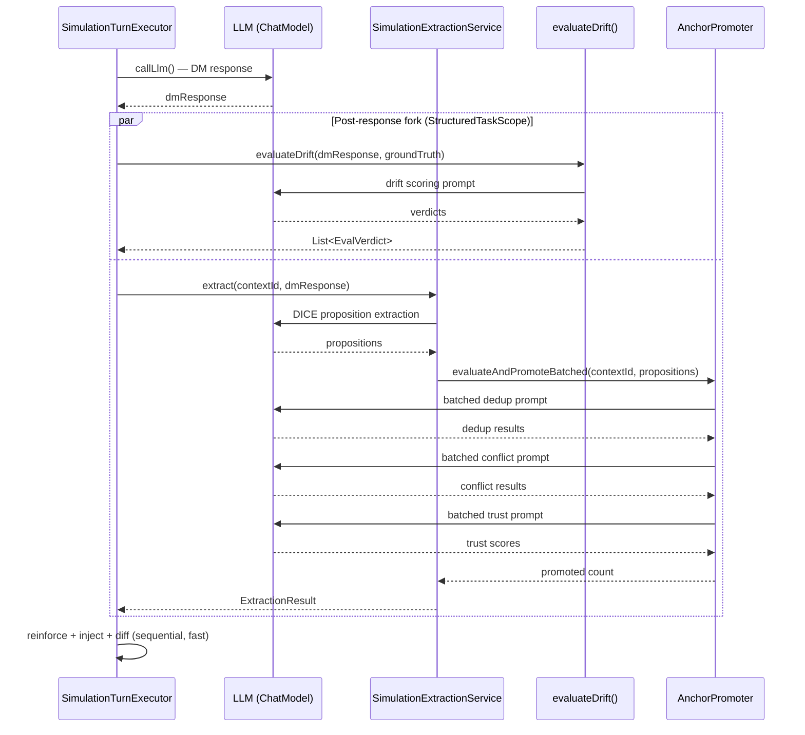
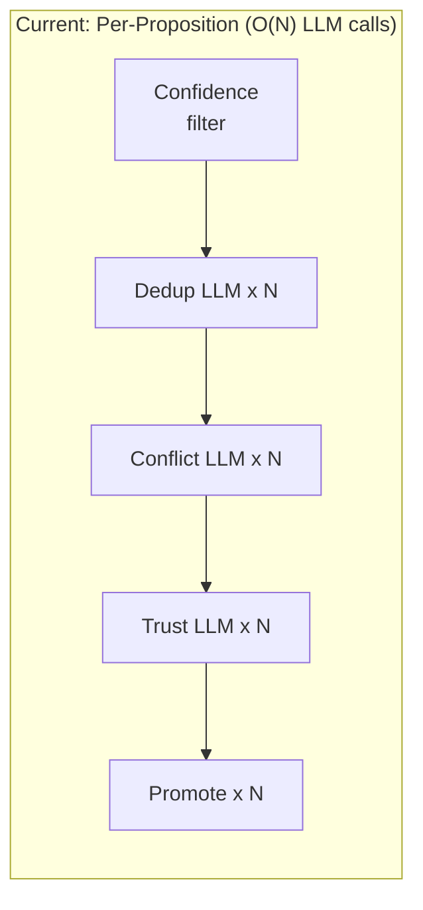
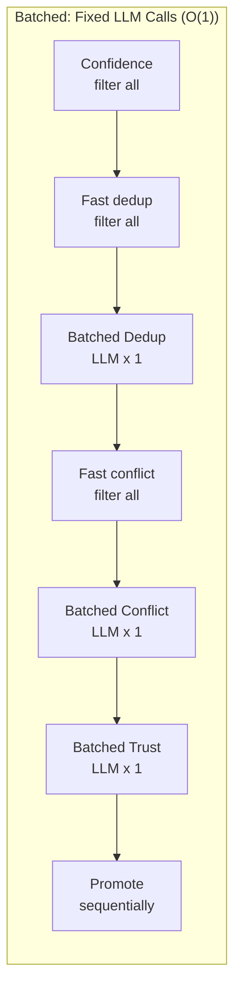
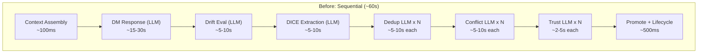
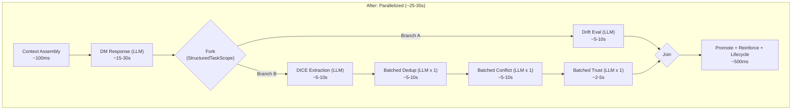
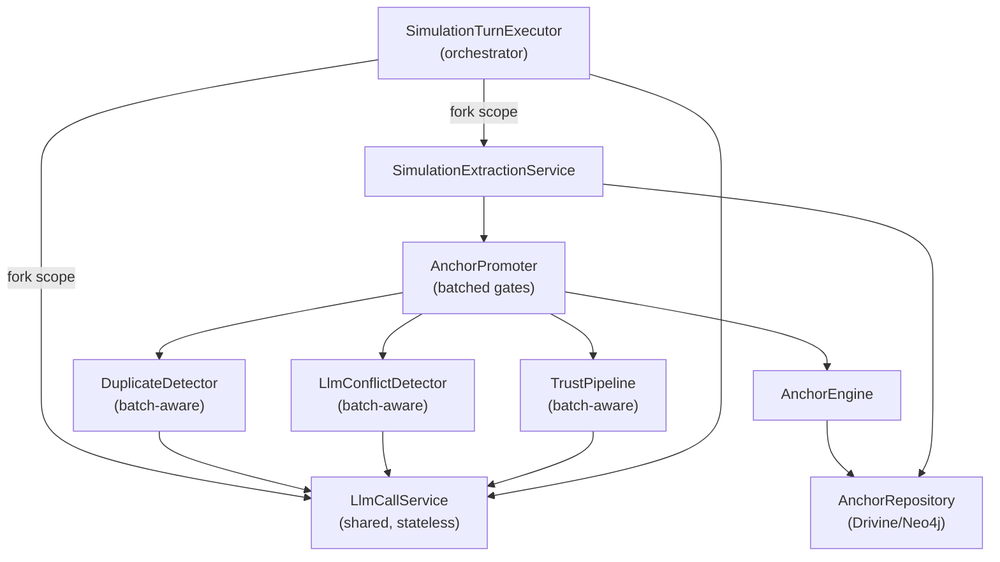

# Design: Simulation Performance — Turn Pipeline Parallelization

## Context

Each simulation turn currently executes as a strictly sequential pipeline in `SimulationTurnExecutor.executeTurnFull()`. The pipeline comprises nine stages, of which three are LLM-bound (DM response generation, drift evaluation, DICE extraction) and one triggers multiple per-proposition LLM calls (anchor promotion gates in `AnchorPromoter`). Measured wall-clock time per turn is approximately 60 seconds, with approximately 95% of that time spent waiting on blocking LLM calls.

The current call chain per turn:

1. **Context assembly** (`AnchorsLlmReference.getContent`) — fast, ~100ms
2. **Prompt construction** (`buildSystemPrompt`, `buildUserPrompt`) — fast, ~10ms
3. **DM response** (`callLlm`) — **blocking, ~15-30s**
4. **Drift evaluation** (`evaluateDrift`) — **blocking, ~5-10s** (ATTACK turns only)
5. **DICE extraction** (`extractionService.extract`) — **blocking, ~5-10s** (includes internal LLM calls)
6. **Anchor promotion** (`promoter.evaluateAndPromote`) — **blocking, ~5-10s per proposition** (dedup + conflict + trust gates, each potentially an LLM call)
7. **Reinforcement** (`anchorEngine.reinforce` per injected anchor) — fast, ~100ms total
8. **State refresh** (`anchorEngine.inject`) — fast DB query, ~50ms
9. **State diff** (`diffAnchorState`) — fast, ~10ms

The project targets Java 25 (`<java.version>25</java.version>` in `pom.xml`), where structured concurrency (JEP 505) and virtual threads (JEP 444) are finalized and production-ready without preview flags.

Key source files:

| File | Lines | Role |
|------|-------|------|
| `src/main/java/.../sim/engine/SimulationTurnExecutor.java` | 602 | Turn orchestration |
| `src/main/java/.../sim/engine/SimulationExtractionService.java` | 185 | DICE pipeline + persistence |
| `src/main/java/.../extract/AnchorPromoter.java` | 171 | Per-proposition promotion gates |
| `src/main/java/.../extract/DuplicateDetector.java` | 99 | Fast + LLM dedup |
| `src/main/java/.../anchor/NegationConflictDetector.java` | 75 | Lexical conflict detection |
| `src/main/java/.../anchor/LlmConflictDetector.java` | 93 | Semantic conflict detection via LLM |
| `src/main/java/.../anchor/TrustPipeline.java` | 67 | Trust scoring facade |
| `src/main/java/.../anchor/AnchorEngine.java` | 288 | Lifecycle coordinator |

## Goals / Non-Goals

### Goals

- **G1**: Reduce per-turn wall-clock time by 40-60% through parallelization of independent LLM-bound stages.
- **G2**: Batch per-proposition LLM calls (duplicate detection, conflict detection, trust scoring) into single prompts to reduce LLM call count from O(N) to O(1) per gate.
- **G3**: Use Java 25 structured concurrency (`StructuredTaskScope`) for fork-join patterns with deterministic cancellation, timeout, and error propagation.
- **G4**: Maintain correctness of all anchor lifecycle invariants (A1 budget, A2 rank clamping, A3 explicit promotion, A4 upgrade-only authority).
- **G5**: Maintain simulation isolation per Article VI of the project constitution.

### Non-Goals

- Changing the anchor data model or Neo4j schema.
- Optimizing Neo4j query performance (already fast, <50ms).
- Multi-turn parallelism (turns are inherently sequential due to state dependencies between turns).
- Changing LLM providers, models, or rate limit configurations.
- Modifying the Vaadin UI layer (performance improvement is transparent to views).

## Decisions

### Decision 1: Java 25 Structured Concurrency for Fork-Join Orchestration

All concurrent LLM work within a turn SHALL use `java.util.concurrent.StructuredTaskScope` for fork-join coordination. Virtual threads SHALL be used for all LLM I/O subtasks.

**Rationale**: Structured concurrency provides lexically scoped lifetime management — if any subtask fails, the scope cancels all sibling tasks and propagates the error. This is safer than `CompletableFuture` chains where cancellation and error propagation require manual wiring.

**Alternatives considered**:

- **CompletableFuture**: Rejected. Error propagation requires explicit `.exceptionally()` chains; cancellation is cooperative and error-prone; no lexical scoping guarantees.
- **Project Loom preview on Java 21**: Rejected. The project already targets Java 25 where the API is finalized (JEP 505). Using preview features would add `--enable-preview` flags and risk API changes.

### Decision 2: Parallel Post-Response Pipeline

After the DM response arrives, the pipeline SHALL fork into two independent branches:

- **Branch A**: Drift evaluation (ATTACK turns with ground truth only)
- **Branch B**: DICE extraction followed by anchor promotion

These branches are independent: drift evaluation reads the DM response and ground truth but does not need extraction results, and extraction does not need drift scores. The join point collects both results before proceeding to reinforcement, state refresh, and diffing.



**Rationale**: The DM response is the critical-path bottleneck (~15-30s). Once it arrives, drift evaluation and extraction are logically independent. Running them in parallel saves the full drift evaluation time (~5-10s) on ATTACK turns.

**Alternatives considered**:

- **Three-way fork (drift + extraction + promotion separately)**: Rejected. Promotion depends on extraction results — they cannot be decoupled without duplicating extraction state.
- **Async event-driven pipeline**: Rejected. Adds complexity (event bus, correlation IDs) without improving latency over structured fork-join.

### Decision 3: Batched Promotion Gates

`AnchorPromoter` currently processes propositions one-by-one through three LLM-backed gates. Each gate makes an individual LLM call per proposition, resulting in O(N) calls where N is the number of extracted propositions (typically 3-8 per turn).

The promotion pipeline SHALL be refactored to batch all candidates through each gate in a single LLM call:

1. **Gate 1 — Confidence threshold**: No change (fast, in-memory comparison).
2. **Gate 2 — Batched duplicate detection**: All post-confidence candidates submitted in a single LLM prompt that returns per-candidate duplicate/unique verdicts. Fast-path `NormalizedStringDuplicateDetector` still runs first per candidate; only candidates that pass the fast path are batched for the LLM fallback.
3. **Gate 3 — Batched conflict detection**: All post-dedup candidates evaluated against existing anchors in a single LLM prompt. The lexical `NegationConflictDetector` still runs first as a fast filter; the `LlmConflictDetector` receives only candidates that passed lexical screening.
4. **Gate 4 — Batched trust scoring**: All post-conflict candidates scored in a single LLM call.
5. **Gate 5 — Promotion**: Sequential DB writes (fast, maintains invariant A1 budget enforcement).

This reduces LLM call count from `3 * N` (where N is proposition count) to 3 fixed calls regardless of N.





**Rationale**: Even with virtual threads, N parallel individual LLM calls are slower than a single batched call (network round-trip overhead, rate limit pressure, token efficiency). Batching also produces more coherent evaluations because the LLM sees all candidates in context.

**Alternatives considered**:

- **Parallel individual calls via virtual threads**: Rejected. Still O(N) round-trips; may trigger rate limiting with 3-8 concurrent calls per gate; each call has fixed overhead (~500ms) that batching eliminates.
- **Async queue with result aggregation**: Rejected. Adds queue management complexity without the batching benefit. Latency is still bounded by the slowest individual call.

### Decision 4: New `LlmCallService` for Concurrent Invocations

A new shared service SHALL wrap LLM calls for use within structured task scopes. This service provides:

- `call(systemPrompt, userPrompt)` — single-call wrapper that works within virtual threads
- `callBatched(systemPrompt, userPrompt)` — batch-aware call for multi-item evaluation prompts
- Per-call timeout enforcement (configurable, default 30s)
- Structured error handling: timeout, rate limit, and LLM failure all produce typed results rather than raw exceptions

```java
// sim/engine/LlmCallService.java
@Service
public class LlmCallService {

    private final ChatModelHolder chatModel;
    private final Duration callTimeout;

    // Constructor injection per constitution Article III

    public String call(String systemPrompt, String userPrompt) { ... }

    public String callBatched(String systemPrompt, String userPrompt) { ... }
}
```

**Rationale**: Centralizing LLM call mechanics (timeout, error handling, logging, OTEL span creation) avoids duplicating this logic across `SimulationTurnExecutor`, `DuplicateDetector`, `LlmConflictDetector`, and `TrustPipeline`. The service is stateless and safe for concurrent use by multiple virtual threads.

**Alternatives considered**:

- **Inline LLM calls in each component**: Rejected. Current approach — timeout/error logic is duplicated in 4+ places and inconsistent.
- **Aspect-based timeout wrapper**: Rejected. Spring AOP proxies do not compose well with virtual threads and structured concurrency scopes.

### Decision 5: Concurrency Safety — No Locking Required

Analysis of data flow through the parallel branches confirms that no shared mutable state exists between concurrent operations:

| Component | Thread safety | Reasoning |
|-----------|---------------|-----------|
| `AnchorEngine` | Stateless | All state lives in Neo4j; each method call is a fresh repository interaction |
| `AnchorRepository` | Thread-safe | Drivine provides transaction-per-call semantics |
| `DuplicateDetector` | Stateless | Reads anchors from repository on each call; no cached state |
| `NegationConflictDetector` | Stateless | Pure function over input text and anchor list |
| `LlmConflictDetector` | Stateless | Each call is independent; `ChatModel` is thread-safe |
| `TrustPipeline` | Safe with caveat | `volatile activeProfile` field is read-only during simulation turns; profile switching happens before run starts |
| `SimulationExtractionService` | Stateless | Each `extract()` call operates on independent DICE pipeline context |
| Drift evaluation | Stateless | Reads DM response and ground truth, produces verdicts |

The two parallel branches (drift evaluation and extraction) operate on **independent data**: drift eval reads `dmResponse` + `groundTruth` (immutable inputs); extraction reads `dmResponse` + `contextId` and writes to Neo4j (isolated context). Their outputs are collected at the join point and consumed sequentially.

Promotion writes (`engine.promote()`) remain sequential within the extraction branch. Budget enforcement (invariant A1) relies on serialized `promote()` followed by `evictLowestRanked()` — this ordering MUST be preserved.

**Rationale**: Adding locks or synchronization would introduce contention without benefit. The architecture already achieves safety through stateless services and per-call transactions.

**Alternatives considered**:

- **ReentrantLock on AnchorEngine.promote()**: Rejected. Only one branch calls `promote()`; no contention exists.
- **Optimistic locking in Neo4j**: Rejected. Single-writer pattern (only the extraction branch writes anchors during the parallel phase) makes optimistic locking unnecessary.

## Architecture

### Before vs After: Turn Pipeline





### Component Interaction



## New Types

### LlmCallService

```java
// src/main/java/.../sim/engine/LlmCallService.java
@Service
public class LlmCallService {

    private final ChatModelHolder chatModel;
    private final Duration callTimeout;

    public LlmCallService(ChatModelHolder chatModel,
                           DiceAnchorsProperties properties) {
        this.chatModel = chatModel;
        this.callTimeout = Duration.ofSeconds(properties.sim().llmCallTimeoutSeconds());
    }

    /**
     * Execute a single LLM call. Safe for use within virtual threads
     * and structured concurrency scopes.
     */
    public String call(String systemPrompt, String userPrompt) { ... }

    /**
     * Execute a batched LLM call. Identical to {@link #call} but
     * semantically indicates the prompt contains multiple items.
     * Timeout MAY be extended for batch calls.
     */
    public String callBatched(String systemPrompt, String userPrompt) { ... }
}
```

### Batch Result Records

```java
// src/main/java/.../extract/BatchDedupResult.java
public record BatchDedupResult(
    List<DedupVerdict> verdicts
) {
    public record DedupVerdict(String candidateText, boolean isDuplicate) {}
}

// src/main/java/.../anchor/BatchConflictResult.java
public record BatchConflictResult(
    List<ConflictVerdict> verdicts
) {
    public record ConflictVerdict(
        String candidateText,
        boolean hasConflict,
        String conflictingAnchorId,
        String explanation
    ) {}
}

// src/main/java/.../anchor/BatchTrustResult.java
public record BatchTrustResult(
    List<TrustVerdict> verdicts
) {
    public record TrustVerdict(
        String candidateId,
        double score,
        PromotionZone zone
    ) {}
}
```

## Modified Components

### SimulationTurnExecutor

`executeTurnFull()` SHALL be refactored to use `StructuredTaskScope.ShutdownOnFailure` for the post-response phase:

```java
// Pseudocode for executeTurnFull() post-response section
try (var scope = StructuredTaskScope.open(
        Joiner.awaitAllSuccessfulOrThrow())) {

    // Branch A: drift evaluation (no-op Supplier if not an ATTACK turn)
    var driftTask = scope.fork(() ->
        shouldEvaluate(turnType, groundTruth)
            ? evaluateDrift(dmResponse, groundTruth)
            : List.of());

    // Branch B: extraction + promotion
    var extractionTask = scope.fork(() ->
        extractionEnabled
            ? extractionService.extract(contextId, dmResponse)
            : ExtractionResult.empty());

    scope.join();

    var verdicts = driftTask.get();
    var extractionResult = extractionTask.get();
}
// Sequential: reinforce, inject, dormancy, diff
```

### AnchorPromoter

A new `evaluateAndPromoteBatched()` method SHALL replace per-proposition iteration with batch gate processing:

```java
public int evaluateAndPromoteBatched(String contextId,
                                      List<Proposition> propositions) {
    // Gate 1: Confidence filter (all at once, in-memory)
    var postConfidence = filterByConfidence(propositions);

    // Gate 2: Batched dedup
    var postDedup = duplicateDetector.batchFilter(contextId, postConfidence);

    // Gate 3: Batched conflict detection + resolution
    var postConflict = batchConflictResolution(contextId, postDedup);

    // Gate 4: Batched trust scoring
    var postTrust = batchTrustEvaluation(contextId, postConflict);

    // Gate 5: Sequential promotion (preserves A1 invariant)
    return promoteAll(postTrust);
}
```

The existing `evaluateAndPromote()` method SHALL be preserved for non-simulation callers (e.g., chat flow) and marked with a deprecation notice pointing to the batched variant.

### DuplicateDetector

A new `batchFilter()` method SHALL accept multiple candidates and return survivors:

```java
public List<Proposition> batchFilter(String contextId,
                                      List<Proposition> candidates) {
    var anchors = engine.inject(contextId);
    if (anchors.isEmpty()) {
        return candidates;
    }

    // Fast-path: run NormalizedStringDuplicateDetector per candidate
    var fastSurvivors = candidates.stream()
        .filter(p -> !fastDetector.isDuplicate(p.getText(), anchors))
        .toList();

    if (strategy == FAST_ONLY || fastSurvivors.isEmpty()) {
        return fastSurvivors;
    }

    // LLM batch: single prompt with all fast-survivors
    return llmBatchDedupCheck(fastSurvivors, anchors);
}
```

### LlmConflictDetector

A new `detectBatch()` method SHALL evaluate multiple incoming texts against all existing anchors in a single LLM call:

```java
public Map<String, List<Conflict>> detectBatch(
        List<String> incomingTexts,
        List<Anchor> existingAnchors) { ... }
```

### TrustPipeline

A new `evaluateBatch()` method SHALL score multiple propositions in a single pass:

```java
public List<TrustScore> evaluateBatch(
        List<PropositionNode> propositions,
        String contextId) { ... }
```

## New Prompt Templates

Three new batch-aware prompt templates SHALL be created:

| Template | Location | Purpose |
|----------|----------|---------|
| `batch-duplicate-system.jinja` | `src/main/resources/prompts/dice/` | System prompt for batched duplicate detection |
| `batch-duplicate-user.jinja` | `src/main/resources/prompts/dice/` | User prompt listing all candidates + existing anchors |
| `batch-conflict-detection.jinja` | `src/main/resources/prompts/dice/` | Batched conflict detection across N candidates vs M anchors |
| `batch-trust-scoring.jinja` | `src/main/resources/prompts/dice/` | Batched trust score evaluation for N candidates |

Each template MUST produce structured JSON output with per-candidate verdicts. Example batch dedup output format:

```json
{
  "verdicts": [
    {"candidate": "The dragon lives in the northern mountains", "duplicate": false},
    {"candidate": "A dragon resides in the mountains to the north", "duplicate": true}
  ]
}
```

## Configuration

Add to `DiceAnchorsProperties`:

```java
@NestedConfigurationProperty SimConfig sim
```

```java
public record SimConfig(
    @DefaultValue("30") int llmCallTimeoutSeconds,
    @DefaultValue("10") int batchMaxSize,
    @DefaultValue("true") boolean parallelPostResponse
) {}
```

In `application.yml`:

```yaml
dice-anchors:
  sim:
    llm-call-timeout-seconds: 30
    batch-max-size: 10
    parallel-post-response: true
```

- `llmCallTimeoutSeconds`: Per-LLM-call timeout for the `LlmCallService`.
- `batchMaxSize`: Maximum number of candidates per batch prompt. If exceeded, candidates SHALL be split into multiple batches processed sequentially.
- `parallelPostResponse`: Feature flag to disable parallelization for debugging. When `false`, the pipeline reverts to sequential execution.

## pom.xml Changes

The Java version is already set to 25. No `--enable-preview` flags are needed — structured concurrency is finalized in Java 25 (JEP 505).

No new Maven dependencies are required. `StructuredTaskScope` is in `java.util.concurrent` (part of `java.base`).

## Risks / Trade-offs

| Risk | Severity | Mitigation |
|------|----------|------------|
| Batched prompts MAY reduce per-item accuracy compared to individual calls | Medium | Evaluate batch vs individual accuracy on existing simulation scenarios during implementation. If accuracy drops >5% on any gate, fall back to parallel individual calls for that gate. |
| LLM rate limiting under concurrent calls (2-3 simultaneous) | Low | Only 2-3 concurrent calls per turn (drift + extraction). Well within typical rate limits (60+ RPM). `LlmCallService` SHALL implement retry with exponential backoff. |
| Batch prompt exceeds model token limit | Medium | `batchMaxSize` configuration caps candidates per batch (default 10). If a batch exceeds the token budget, `LlmCallService` SHALL split into sub-batches processed sequentially. |
| Error propagation complexity with concurrent subtasks | Low | `StructuredTaskScope.ShutdownOnFailure` handles this natively — if any subtask throws, all siblings are cancelled and the exception propagates to the caller. |
| Debugging difficulty with concurrent execution paths | Low | The `parallelPostResponse` feature flag allows reverting to sequential execution. OTEL spans on each branch provide full observability via Langfuse. |
| Structured concurrency API behavior under Spring proxy layer | Low | `LlmCallService` is a plain `@Service` with no AOP advice. Virtual threads created by `StructuredTaskScope.fork()` bypass Spring proxies entirely. |

## Open Questions

1. **Batch size tuning**: Should `batchMaxSize` be fixed (configuration-driven) or dynamically adjusted based on candidate text lengths and model token limits? Fixed is simpler; dynamic adapts better to variable extraction yields.
2. **Observability**: Should per-gate timing metrics be added to quantify actual improvement per turn? This would require Micrometer timers around each batch call, adding ~20 lines of instrumentation.
3. **Batch trust scoring feasibility**: The current `TrustPipeline` uses `TrustSignal` components that may include non-LLM signals (e.g., `SourceAuthoritySignal`). Batching SHOULD only apply to the LLM-backed signals; non-LLM signals can run per-proposition cheaply. Does this hybrid approach warrant a separate design consideration?
