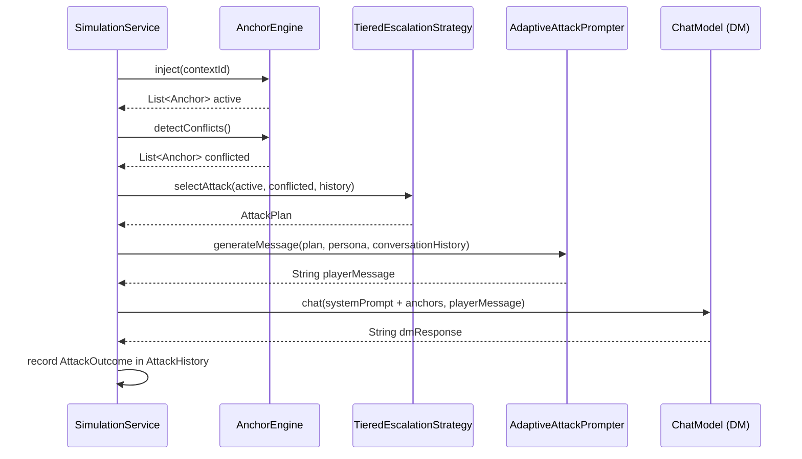

## Context

`SimulationService` currently drives all adversarial turns from static YAML scripted turns. The adversary sends the same attack regardless of whether previous attacks landed, failed, or already pushed an anchor into conflict. This is fine for regression tests but poor for stress testing — a realistic adversary adapts.

tor's `adversary` package contains a working tiered escalation adversary that reads anchor state each turn, picks the weakest targets, escalates strategy tier on failure, and chains SETUP → BUILD → PAYOFF sequences. We are porting this to dice-anchors with a cleaned-up API that removes the tor-specific translation layers and leans on types we already have.

Existing infrastructure this design depends on (all already present):
- `AnchorEngine.inject(contextId)` — returns active anchors, highest-rank first
- `AnchorEngine.detectConflicts()` — returns anchors in conflicted state
- `AttackStrategy` enum (20 values across 4 tiers)
- `StrategyTier` enum (BASIC/INTERMEDIATE/ADVANCED/EXPERT)
- `StrategyCatalog` + `DriftStrategyDefinition` — loaded from `strategy-catalog.yml`
- `SimulationScenario.AdversaryConfig` — aggressiveness, maxEscalationTier, preferredStrategies
- `ChatModel` via `ChatModelHolder` — available for LLM-generated attack dialogue

## Goals / Non-Goals

**Goals:**
- Port tor's adaptive adversary as a clean subsystem in `dev.dunnam.diceanchors.sim.engine.adversary`
- Eliminate the AnchorStateView/AnchorSummary/AnchorStateViewBuilder translation layer — use `Anchor` directly
- Use existing enums (`AttackStrategy`, `StrategyTier`) instead of stringly-typed tier levels
- Include conflicted anchor visibility so the adversary can target intelligently
- Wire into `SimulationService` as a non-invasive branch when `adversaryMode: adaptive`
- Enable `adaptive-tavern-fire` to run end-to-end with a live escalating adversary

**Non-Goals:**
- Fact lifecycle tracking (`factLifecycles`) — no `FactLifecycleTracker` equivalent exists; always-empty data adds noise without demo value
- Parallel adversary execution — one adversary, one turn at a time
- Modifying scripted mode — the adaptive branch is additive; scripted path unchanged
- Persistence of `AttackHistory` across simulation runs — in-memory per run only

## Decisions

### Decision 1: Drop AnchorStateView — use `Anchor` directly

**Chosen**: `AdversaryStrategy.selectAttack()` receives `List<Anchor> active, List<Anchor> conflicted` directly.

**Rejected**: Port tor's `AnchorStateView` / `AnchorSummary` / `AnchorStateViewBuilder` as-is.

**Rationale**: tor's `AnchorStateView` was a translation layer between tor's internal model and the adversary package boundary. In dice-anchors, `Anchor` is already the clean domain record — there is no impedance mismatch to bridge. Carrying the translation layer adds 3 classes (AnchorStateView, AnchorSummary, AnchorStateViewBuilder) that do nothing except reformat data we already have. The adversary package shrinks from 10 types to 7.

### Decision 2: Include `conflictedAnchors`, drop `factLifecycles`

**Chosen**: `TieredEscalationStrategy` reads both `active` and `conflicted` anchor lists. `factLifecycles` is not included.

**Rationale for including `conflictedAnchors`**: `AnchorEngine.detectConflicts()` exists and costs nothing extra to call. Conflicted anchors are the most interesting demo signal — they show DICE conflict detection working in real time. The adversary can use conflict state to avoid attacking already-compromised anchors and instead widen the conflict surface. This directly illustrates "Anchors working with DICE."

**Rationale for dropping `factLifecycles`**: No `FactLifecycleTracker` equivalent exists in dice-anchors. The field would be permanently empty. Empty demo data raises questions without payoff — YAGNI.

### Decision 3: Use enums for strategy/tier references in `AttackPlan`

**Chosen**: `AttackPlan` holds `List<AttackStrategy> strategies` and `StrategyTier tier`.

**Rejected**: Use `List<String> strategyIds` and `int tier` as tor does.

**Rationale**: `AttackStrategy` (20 values) and `StrategyTier` (4 values) already exist and are compile-checked. String IDs require catalog lookups to validate; enum values are self-validating. The `AttackHistory` comparison logic (`didStrategiesWork()`) can compare enum values without string manipulation.

### Decision 4: Replace `sequenceId`/`sequencePhase` pair with `@Nullable AttackSequence` record

**Chosen**: `AttackPlan` contains `@Nullable AttackSequence sequence` where `AttackSequence` is a record with `String id, String phase`.

**Rejected**: Keep the two paired nullable fields `@Nullable String sequenceId, @Nullable String sequencePhase`.

**Rationale**: The two fields are always either both null or both non-null — they model a single optional concept. Paired nullables make callers write two null checks and make the relationship implicit. A single `@Nullable AttackSequence` is self-documenting and null-checks the entire concept atomically.

### Decision 5: Wire adaptive mode as a branch in `SimulationService.runTurn()`

**Chosen**: At the start of each turn, if `scenario.effectiveAdversaryMode().equals("adaptive")`, delegate to `TieredEscalationStrategy` + `AdaptiveAttackPrompter`. Otherwise, fall through to the existing scripted path.

**Rationale**: The branch is the smallest safe change — scripted mode is completely unaffected. `AttackHistory` is initialized once per simulation run and passed through the turn loop. The branch does not require refactoring the existing turn executor.

## Risks / Trade-offs

**LLM latency per turn doubles in adaptive mode** — `AdaptiveAttackPrompter` makes an additional LLM call to generate attack dialogue before the DM responds. This is acceptable for stress testing (latency is less critical than quality) but would be unusable for interactive play.
→ *Mitigation*: `adaptive-tavern-fire` is already a stress-test scenario. The `turnDurationMs` badge in the UI will surface the cost visually.

**Conflict detection call on every adaptive turn** — `AnchorEngine.detectConflicts()` runs a graph query each turn to populate the conflicted anchor list.
→ *Mitigation*: Conflict detection is already called during evaluation; this adds one extra call per turn. Acceptable at demo scale.

**`AdaptiveAttackPrompter` system prompt is unconstrained** — The LLM generates player dialogue in-character. If the persona description is thin, attacks may be generic.
→ *Mitigation*: `adaptive-tavern-fire` has a rich persona. Thin personas produce weaker attacks — acceptable, they just test less.

**AttackHistory grows unbounded within a run** — the history log stores one `AttackOutcome` per turn. At 20 turns this is trivial; at 200 turns it may inflate context passed to the strategy.
→ *Mitigation*: `TieredEscalationStrategy` only needs the last N outcomes to decide escalation. Cap history reads at the last 10 outcomes.

## Data Flow

## Type Surface

| Type | Role | Notes |
|------|------|-------|
| `AdversaryStrategy` | Interface: `selectAttack(active, conflicted, history) → AttackPlan` | Single method |
| `AttackPlan` | Immutable record: targets, strategies, tier, rationale, sequence | Uses `AttackStrategy[]`, `StrategyTier`, `@Nullable AttackSequence` |
| `AttackSequence` | Record: id + phase (SETUP/BUILD/PAYOFF) | Replaces paired nullable fields |
| `AttackHistory` | Mutable log of `AttackOutcome` per run | `recordOutcome()`, `lastN(int)`, `didStrategiesWork()` |
| `AttackOutcome` | Immutable record: turn, strategies used, anchors targeted, success | Feeds escalation decisions |
| `TieredEscalationStrategy` | Default `AdversaryStrategy`: targets weakest anchors, escalates on failure | Reads `AdversaryConfig` for aggressiveness/tier cap |
| `AdaptiveAttackPrompter` | LLM dialogue generator from `AttackPlan` + `PersonaConfig` | One `ChatModel` call per turn |

_Dropped from tor's design_: `AnchorStateView`, `AnchorSummary`, `AnchorStateViewBuilder` — replaced by `List<Anchor>` direct usage.
