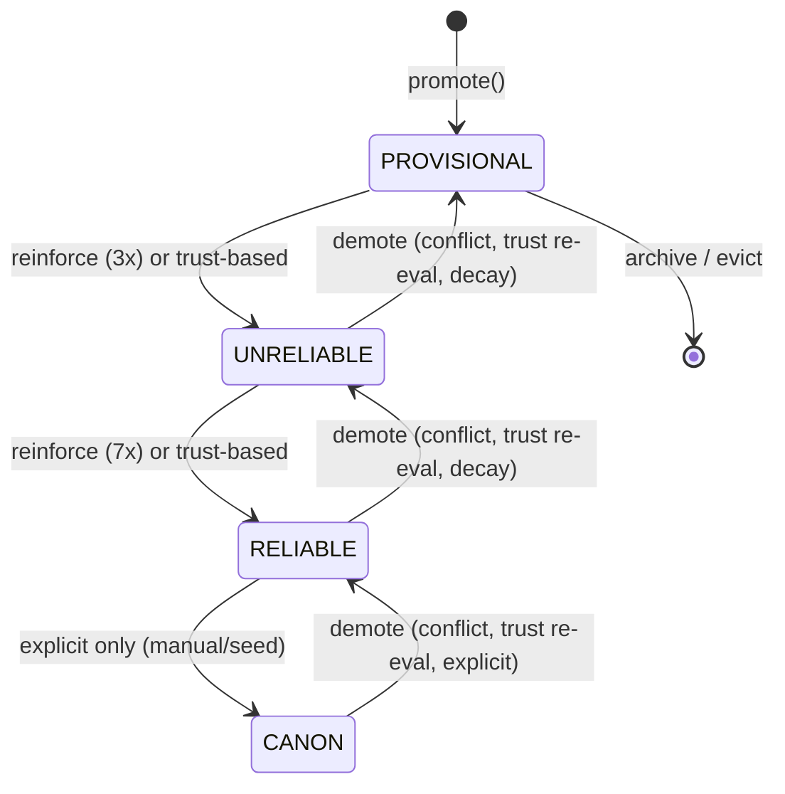
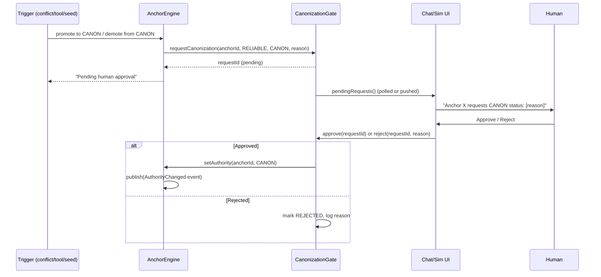
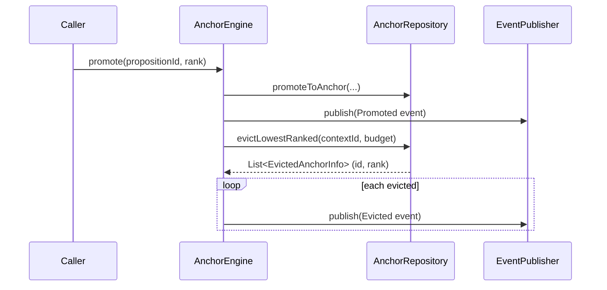

## Context

dice-anchors is a working demo of adversarial drift resistance using Anchors -- enriched DICE Propositions with rank, authority, and budget management. The codebase has ~50 source files across 6 packages (`anchor/`, `assembly/`, `extract/`, `persistence/`, `chat/`, `sim/`) with 27 passing tests.

The current implementation works: anchors resist adversarial prompt drift in both chat and simulation modes. But the APIs grew organically around a proof-of-concept. Javadoc coverage is inconsistent (0% on `Authority.java`, 80% on `AnchorEngine`), SPI interfaces lack formal contracts, computed values go unused (trust authority ceiling), failures are silently swallowed, and the DICE integration surface is narrow (only extraction, not revision classifications or importance scores).

This design document describes HOW to harden the existing code -- improving clarity, documentation, correctness, and DICE integration depth -- without introducing unnecessary abstractions.

### Current Code Organization

```
anchor/                    # Core model + engine + SPIs
  Anchor.java              # Record: id, text, rank, authority, pinned, confidence, reinforcementCount, trustScore
  AnchorEngine.java        # Facade: inject, promote, reinforce, applyDecay, archive, conflict ops
  Authority.java           # Enum: PROVISIONAL(0) → UNRELIABLE(1) → RELIABLE(2) → CANON(3)
  ConflictDetector.java    # SPI interface + Conflict record
  ConflictResolver.java    # SPI interface + Resolution enum + byAuthority() factory
  ReinforcementPolicy.java # SPI interface + ThresholdReinforcementPolicy nested class
  DecayPolicy.java         # SPI interface + ExponentialDecayPolicy nested record
  NegationConflictDetector.java  # Lexical negation detection
  LlmConflictDetector.java      # LLM-based semantic conflict detection
  CompositeConflictDetector.java # Chains lexical → semantic
  SubjectFilter.java       # Pre-filter for subject alignment
  TrustPipeline.java       # Facade for trust evaluation
  TrustEvaluator.java      # Weighted signal composition
  TrustScore.java          # Record: score, authorityCeiling, promotionZone, signalAudit
  TrustSignal.java         # SPI interface + static factories
  DomainProfile.java       # Record: weights, thresholds (SECURE, NARRATIVE, BALANCED)
  PromotionZone.java       # Enum: AUTO_PROMOTE, REVIEW, ARCHIVE
  TrustContext.java        # Record: proposition + contextId
  AnchorConfiguration.java # Spring beans: detector, resolver, policy defaults
  event/                   # Sealed lifecycle event hierarchy

assembly/                  # Prompt injection + budget management
  AnchorsLlmReference.java       # Cached anchor provider for system prompt
  PropositionsLlmReference.java  # Cached proposition provider for system prompt
  PromptBudgetEnforcer.java      # Token budget enforcement
  AnchorContextLock.java         # Mutual exclusion during prompt assembly
  TokenCounter.java              # SPI interface for token estimation
  CharHeuristicTokenCounter.java # Default: 4 chars/token
  BudgetResult.java              # Record: included, excluded, estimatedTokens, budgetExceeded

extract/                   # Proposition → anchor promotion pipeline
  AnchorPromoter.java      # Multi-gate pipeline: confidence → dedup → conflict → trust → promote
  DuplicateDetector.java   # Composite dedup: fast string + LLM
  NormalizedStringDuplicateDetector.java # Fast-path normalized string matching
  DuplicateDetectionStrategy.java # Enum: FAST_ONLY, LLM_ONLY, FAST_THEN_LLM

persistence/               # Neo4j via Drivine
  AnchorRepository.java    # PropositionRepository impl (DICE contract) + anchor ops
  PropositionNode.java     # Neo4j entity: DICE fields + anchor fields
  PropositionView.java     # Drivine GraphView: proposition + mentions

chat/                      # Embabel agent integration
  ChatActions.java         # @EmbabelComponent: respond to UserMessage, inject anchors, reinforce
  AnchorTools.java         # @MatryoshkaTools: queryFacts, listAnchors, pinFact, unpinFact
  ChatView.java            # Vaadin chat UI
```

## Goals / Non-Goals

**Goals:**

- **G1**: Every public API method and SPI interface has comprehensive Javadoc documenting contract, preconditions, postconditions, invariants, events published, and error behavior.
- **G2**: Authority lifecycle is bidirectional -- anchors can be promoted AND demoted based on evidence. Trust ceiling is enforced on both promotion and re-evaluation. The old "upgrade-only" invariant is replaced with clear rules for when each direction is valid.
- **G3**: Budget eviction publishes lifecycle events (observability gap -- eviction is currently silent).
- **G4**: DICE revision classifications (IDENTICAL, SIMILAR, CONTRADICTORY, GENERALIZES, UNRELATED) are integrated into conflict/dedup pipelines where they add value without duplicating work DICE already does.
- **G5**: DICE importance and decay signals inform anchor priority decisions.
- **G6**: Silent LLM failure swallowing is eliminated -- all fallback paths log at WARN with structured context.
- **G7**: Repository finders return `Optional<T>` instead of nullable, making absence explicit in the type system.
- **G8**: Configuration validates at startup (fail-fast on invalid values).
- **G9**: Assembly cache invalidation is event-driven rather than manual `refresh()`.
- **G10**: `AnchorContextLock` concurrency is cleaned up (eliminate redundant volatile).
- **G11**: All 27 existing tests continue passing (some updated to reflect new invariants); new tests cover bidirectional authority transitions, trust ceiling enforcement, demotion triggers, eviction events, DICE integration, and config validation.

**Non-Goals:**

- **NG1**: Decomposing `AnchorEngine` into multiple services. The engine is ~280 lines with clear internal sections. Splitting it would scatter related logic and force consumers to know which service to call.
- **NG2**: Introducing `AnchorBlock` (named memory regions) or `AnchorMemoryProvider` SPI. These are documented as future directions in the proposal; implementing them now would add structural complexity without clear benefit at current scale.
- **NG3**: Positional-aware prompt assembly (placing anchors at cognitively optimal positions). Requires deeper control over Embabel's prompt rendering pipeline than we currently have.
- **NG4**: Memory pressure monitoring. The current budget enforcement (count-based + optional token budget) is sufficient.
- **NG5**: Expanding LLM-callable tools for self-directed anchor management (LLM-initiated promotions, archival suggestions). Current tools (query, list, pin, unpin) are sufficient for the demo.
- **NG6**: Performance optimization, distributed consistency, or audit trail persistence. These are real concerns but orthogonal to API hardening.

## Decisions

### D1: AnchorEngine Stays as One Class -- Clean Internal Organization

**Decision**: Keep `AnchorEngine` as a single facade. Add section-level Javadoc comments organizing methods into logical groups: Injection, Lifecycle (promote/reinforce/archive), Budget, Conflict Operations, and Internal Helpers.

**Rationale**: At ~280 lines, the engine is readable as a single unit. Consumers call `engine.promote()`, `engine.reinforce()`, `engine.inject()` -- they don't need to know whether budget enforcement is a separate service. The cognitive load of "which service do I call?" outweighs the benefit of smaller classes at this scale.

**Alternative considered**: Split into AnchorLifecycleService + AnchorBudgetManager + AnchorQueryService. Rejected because it introduces 3 new files, 3 new constructor injection sites, and cross-service calls (promote needs budget check) without reducing complexity.

> **Future direction**: If AnchorEngine grows beyond ~400 lines or gains new responsibility categories (e.g., batch operations, scheduled maintenance), decompose along the section boundaries documented in class Javadoc.

### D2: Bidirectional Authority Lifecycle (Promotion AND Demotion)

**Decision**: Replace the current "upgrade-only" authority model with a **bidirectional authority lifecycle**. Authority can move in both directions based on evidence. The old invariant A3 ("authority only upgrades, never downgrades") is retired and replaced with new invariants governing when each direction of transition is valid.

**Current state (being replaced)**:
- `AnchorEngine.nextAuthority()` -- only returns the next level UP, caps at RELIABLE
- `AnchorRepository.upgradeAuthority()` -- Cypher `WHERE newLevel > currentLevel` silently ignores downgrades
- ~10 Javadoc references to "invariant A3: upgrade-only" scattered across the codebase

**New authority lifecycle**:



**New invariants** (replacing A3):

| Invariant | Rule |
|-----------|------|
| **A3a** | CANON is never assigned by automatic promotion. Only explicit action (seed anchors, manual tool call) can set CANON. |
| **A3b** | CANON demotion requires explicit action (conflict resolution with REPLACE, or manual tool call). CANON anchors are immune to decay-based demotion. |
| **A3c** | Automatic demotion (via decay or trust re-evaluation) can demote RELIABLE → UNRELIABLE → PROVISIONAL. |
| **A3d** | Pinned anchors are immune to automatic demotion (same as eviction immunity). Explicit demotion still works. |
| **A3e** | Authority transitions publish `AuthorityChanged` lifecycle events in both directions. |

**Promotion triggers** (upward transitions):

| Trigger | Scope | Mechanism |
|---------|-------|-----------|
| Reinforcement threshold | PROVISIONAL→UNRELIABLE (3x), UNRELIABLE→RELIABLE (7x) | `ReinforcementPolicy.shouldUpgradeAuthority()` (existing) |
| Trust-based initial authority | On promotion only | `TrustScore.authorityCeiling` sets max initial authority (D2 ceiling enforcement) |
| Manual / seed | Any level, including CANON | `AnchorTools` or scenario seed anchors |

**Demotion triggers** (downward transitions):

| Trigger | Scope | Mechanism |
|---------|-------|-----------|
| **Conflict resolution** | Any level including CANON | When `ConflictResolver` returns `DEMOTE_EXISTING` for an incoming proposition that contradicts an existing anchor, the existing anchor's authority is demoted one level and the incoming proposition is promoted. If already PROVISIONAL, the existing anchor is archived. For CANON anchors, demotion is routed through the `CanonizationGate` (D3). |
| **Trust re-evaluation** | RELIABLE→UNRELIABLE, UNRELIABLE→PROVISIONAL | Event-driven re-evaluation via `TrustPipeline` (triggered by conflict resolution, reinforcement milestones, or explicit request — see anchor-trust spec). If an anchor's trust score drops below the threshold for its current authority level, demote. |
| **Decay-based demotion** | RELIABLE→UNRELIABLE, UNRELIABLE→PROVISIONAL (not CANON) | When rank decays below authority-specific thresholds. A RELIABLE anchor whose rank drops below 400 demotes to UNRELIABLE. An UNRELIABLE anchor whose rank drops below 200 demotes to PROVISIONAL. |
| **Manual demotion** | Any level including CANON | `AnchorTools.demoteAnchor()` (new LLM tool) or explicit API call |

**Implementation changes**:

1. **`Authority` enum** -- Add `previousLevel()` method (symmetric with promotion path):
   ```java
   public Authority previousLevel() {
       return switch (this) {
           case CANON -> RELIABLE;
           case RELIABLE -> UNRELIABLE;
           case UNRELIABLE, PROVISIONAL -> PROVISIONAL;
       };
   }
   ```

2. **`AnchorEngine`** -- Add `demote(String anchorId, DemotionReason reason)` method:
   - Looks up current authority
   - Computes `previousLevel()`
   - If already PROVISIONAL, archives instead of demoting
   - Calls new `repository.setAuthority(anchorId, newAuthority)` (replaces the upgrade-only `upgradeAuthority`)
   - Publishes `AuthorityChanged` event (replaces the upgrade-only `AuthorityUpgraded`)

3. **`AnchorRepository`** -- Replace `upgradeAuthority()` with `setAuthority()`:
   - Remove the `WHERE newLevel > currentLevel` guard from Cypher
   - The engine is now responsible for transition validation, not the repository
   - Repository becomes a dumb store; business rules live in the engine

4. **`ConflictResolver`** -- Add `DEMOTE` resolution option:
   ```java
   enum Resolution {
       KEEP_EXISTING,    // Reject incoming, no change to existing
       REPLACE,          // Archive existing, promote incoming
       DEMOTE_EXISTING,  // Demote existing one level, promote incoming
       COEXIST           // Keep both
   }
   ```
   The `byAuthority()` factory updates: when incoming evidence conflicts with an anchor but the anchor has higher authority, instead of unconditionally keeping the existing, consider demotion if the incoming evidence is strong (high confidence + corroboration).

5. **`DecayPolicy`** -- Add authority demotion thresholds:
   - The decay policy already calculates new rank. Add a method `shouldDemoteAuthority(Anchor anchor, int newRank)` that returns true when rank drops below authority-specific thresholds.
   - Thresholds: RELIABLE requires rank >= 400, UNRELIABLE requires rank >= 200.

6. **Lifecycle events** -- Rename `AuthorityUpgraded` to `AuthorityChanged`:
   ```java
   record AuthorityChanged(String anchorId, Authority previousAuthority,
                           Authority newAuthority, int reinforcementCount,
                           AuthorityChangeDirection direction, String reason)
   ```
   Where `AuthorityChangeDirection` is `PROMOTED` or `DEMOTED`.

7. **`DemotionReason` enum**:
   ```java
   enum DemotionReason {
       CONFLICT_EVIDENCE,   // Contradicting evidence found
       TRUST_DEGRADATION,   // Trust re-evaluation scored below threshold
       RANK_DECAY,          // Rank dropped below authority threshold
       MANUAL               // Explicit user/system action
   }
   ```

**Trust ceiling enforcement** (originally D2 -- now part of this decision): `TrustScore.authorityCeiling` is enforced in `AnchorPromoter` when determining initial authority. The ceiling also applies during trust re-evaluation: if an anchor's trust is re-evaluated and the new ceiling is below current authority, the anchor is demoted to match.

**Where trust ceiling is stored**: The `Anchor` record's `trustScore` field (currently always null) MUST be populated on promotion and updated on re-evaluation.

**Alternative considered**: Keep upgrade-only, add a separate "revoke" mechanism that archives and re-creates at lower authority. Rejected because it loses the anchor's identity (ID, reinforcement history, pin status) and creates a confusing lifecycle where "the same fact" appears as two different anchors.

**Alternative considered**: Allow demotion without any guard on CANON. Rejected because CANON anchors serve as the security layer (MUST-comply). Automatic demotion of security constraints would undermine the system's core purpose. CANON demotion is deliberately explicit-only (invariant A3b).

### D3: Human-in-the-Loop Gate for Canonization / Decanonization

**Decision**: All transitions to or from CANON authority pass through a **human approval gate**. The system creates a pending `CanonizationRequest` that a human must approve or reject before the authority change takes effect. This applies to both directions: promoting an anchor to CANON ("canonization") and demoting a CANON anchor ("decanonization").

**Rationale**: CANON is the security tier -- anchors at this level carry MUST-comply weight in the prompt. Granting or revoking that status should never happen without a human in the loop, regardless of how the request originated (LLM tool call, conflict resolution, manual API). This is the "you can't have real freedom without boundaries" principle applied to the system itself: even the system's own judgment about what deserves CANON status is bounded by human oversight.

**New types**:

```java
/**
 * A pending request to change an anchor's authority to or from CANON.
 * Created by the engine when a CANON transition is requested.
 * Must be approved or rejected by a human before taking effect.
 */
record CanonizationRequest(
    String id,              // unique request ID
    String anchorId,        // target anchor
    String contextId,       // context for filtering pending requests
    String anchorText,      // snapshot of anchor text (for display)
    Authority currentAuthority,
    Authority requestedAuthority,  // always CANON (canonize) or one below CANON (decanonize)
    String reason,          // why the transition was requested
    String requestedBy,     // who/what requested it (e.g., "conflict-resolver", "user", "trust-pipeline")
    Instant createdAt,
    CanonizationStatus status  // PENDING, APPROVED, REJECTED
) {}

enum CanonizationStatus { PENDING, APPROVED, REJECTED }
```

**`CanonizationGate` service**:

```java
@Service
public class CanonizationGate {

    // In-memory for now. Future: persist to Neo4j if needed.
    private final Map<String, CanonizationRequest> pending = new ConcurrentHashMap<>();

    /** Create a pending request. Returns the request ID. */
    public String requestCanonization(String anchorId, String contextId, Authority current, Authority requested, String reason, String requestedBy);

    /** Approve a pending request. Executes the authority change via AnchorEngine. */
    public void approve(String requestId);

    /** Reject a pending request. No authority change. */
    public void reject(String requestId, String rejectionReason);

    /** List all pending requests (for UI display). */
    public List<CanonizationRequest> pendingRequests();

    /** List all pending requests for a specific context. */
    public List<CanonizationRequest> pendingRequests(String contextId);
}
```

**Integration flow**:



**Where the gate intercepts**:

1. **`AnchorEngine.promote()`**: If the caller requests CANON authority (e.g., via `AnchorTools.canonizeAnchor()`), the engine delegates to `CanonizationGate` instead of setting authority directly. The anchor is promoted at RELIABLE (the highest auto-assignable level) and a pending canonization request is created.

2. **`AnchorEngine.demote()`**: If the target anchor is CANON, the engine delegates to `CanonizationGate`. The anchor stays at CANON until the human approves the demotion. This means conflict resolution against a CANON anchor creates a pending decanonization rather than immediately demoting.

3. **Seed anchors**: Scenario YAML files can set `authority: CANON` on seed anchors. These bypass the gate (the human authored the scenario file, so approval is implicit). Document this exception clearly.

**UI surface**:

- **Chat view**: A notification badge or inline prompt when canonization requests are pending. The human can approve/reject without leaving the chat.
- **Simulation view**: Pending requests shown in the context inspector panel. In automated simulation mode, canonization requests can be auto-approved (configurable) since the simulation is already a controlled environment.

**Configuration**:

```yaml
dice-anchors:
  anchor:
    canonization-gate-enabled: true       # default: true
    auto-approve-in-simulation: true      # default: true (simulations skip HITL)
```

**Why in-memory**: The gate stores requests in a `ConcurrentHashMap` for simplicity. Pending requests are transient -- if the application restarts, they're lost. This is acceptable for a demo. If persistence is needed later, requests can be stored as Neo4j nodes with a `CanonizationRequest` label.

**Stale request validation**: When `approve()` is called, the gate SHALL verify that the anchor's current authority still matches `request.currentAuthority`. If the anchor's authority has changed since the request was created (e.g., demoted by conflict resolution while pending), the request is rejected as stale with a descriptive error. This prevents a pending canonization from jumping an anchor from UNRELIABLE to CANON if it was demoted from RELIABLE while the request was pending.

**Alternative considered**: Full workflow engine (e.g., Spring State Machine, Temporal). Rejected as massive overkill for a single approve/reject checkpoint. A `ConcurrentHashMap` and two methods is all we need.

**Alternative considered**: Just make CANON changes require a special API key or admin role. Rejected because authorization is not the same as approval. The question isn't "are you allowed to?" but "should this specific anchor really be CANON?"

### D4: Eviction Events Added to Sealed Lifecycle Hierarchy

**Decision**: Add `AnchorLifecycleEvent.Evicted(String anchorId, String contextId, int previousRank)` to the sealed event hierarchy. Publish from `AnchorEngine` when budget eviction removes an anchor.

**Implementation**: The current eviction path is in `AnchorEngine.promote()` which calls `repository.evictLowestRanked(contextId, budget)`. This repository method returns the count of evicted anchors but not their IDs. Two options:

1. **Query before evict**: Before calling `evictLowestRanked()`, query for the anchors that would be evicted (lowest-ranked, non-pinned, exceeding budget), publish events for each, then execute the eviction.
2. **Change repository to return evicted IDs**: Modify `evictLowestRanked()` to return `List<String>` (evicted anchor IDs) instead of `int`.

**Choice**: Option 2 (change repository return type). Cleaner than a speculative pre-query that could race with concurrent operations. The repository already identifies the evicted nodes in its Cypher query.



**Event ordering**: The `Promoted` event fires before any `Evicted` events. This matches the current code flow where promotion writes first, then budget enforcement evicts. The brief moment where active count exceeds budget (between promote and evict) is acceptable because both operations happen within a single `promote()` call — no external observer can see the intermediate state.

### D5: DICE Revision Classifications in Conflict Detection

**Decision**: Create a `DiceRevisionConflictDetector` that delegates to DICE's `LlmPropositionReviser` for semantic relationship classification. This detector uses DICE's CONTRADICTORY classification as a conflict signal, replacing or augmenting the current `LlmConflictDetector` which uses a custom prompt for the same purpose.

**Rationale**: DICE's reviser already classifies proposition relationships as IDENTICAL, SIMILAR, CONTRADICTORY, GENERALIZES, or UNRELATED. The current `LlmConflictDetector` makes a separate LLM call with a custom prompt to detect contradictions. Using DICE's classification:
- Eliminates a redundant LLM call (DICE revision already runs during extraction)
- Uses a well-tested classification taxonomy
- Provides richer relationship information (GENERALIZES, SIMILAR) beyond just contradiction

**Implementation approach**: The `DiceRevisionConflictDetector` implements `ConflictDetector` and maps DICE classifications to conflict signals:
- CONTRADICTORY → Conflict with high confidence
- SIMILAR → Potential conflict, lower confidence (the propositions overlap but don't directly contradict)
- IDENTICAL → Not a conflict but signals duplication (delegate to dedup)
- GENERALIZES, UNRELATED → No conflict

**Integration in AnchorConfiguration**: Add `"dice"` as a new strategy option alongside `"lexical"`, `"hybrid"`, and `"llm"`. The `"dice"` strategy uses the DICE revision API directly.

**Alternative considered**: Replace *all* conflict detection with DICE revision. Rejected because the lexical `NegationConflictDetector` is fast and useful as a first-pass filter. The composite pattern (lexical first, DICE-based second) preserves the optimization.

> **Implementation note — BLOCKED on Q1**: This design assumes DICE's `LlmPropositionReviser` can be called outside the extraction pipeline to compare incoming text against existing anchors. If Q1 investigation reveals this is not supported, the `DiceRevisionConflictDetector` SHALL NOT be implemented. Instead: (1) keep the current `LlmConflictDetector` with improved documentation and logging, (2) document the DICE revision API limitation as a future integration point, and (3) remove the `"dice"` strategy option. The lexical `NegationConflictDetector` and existing `LlmConflictDetector` remain unaffected regardless of Q1's outcome.

### D6: DICE Importance and Decay Alignment

**Decision**: Integrate DICE's `decay` field into anchor rank decay calculations. Currently `ExponentialDecayPolicy` uses a fixed 24-hour half-life independent of the proposition's DICE decay signal.

**Implementation**: The decay policy interface stays the same. `ExponentialDecayPolicy` gains awareness of the proposition's DICE decay field:
- `diceDecay = 1.0` (standard): Base half-life applies unchanged (backward-compatible default)
- `diceDecay = 0.0` (permanent): No rank decay applied (effectively infinite half-life)
- `diceDecay > 1.0` (ephemeral): Faster decay (shorter half-life)
- Formula: `effectiveHalfLife = baseHalfLife / max(diceDecay, 0.01)`
- **Default value**: `1.0` (not `0.0`), preserving current decay behavior for all existing anchors that lack DICE decay data

This requires passing the DICE decay value to the decay policy. Currently `DecayPolicy.applyDecay(Anchor, long)` only receives the `Anchor` record and hours since reinforcement. The `Anchor` record does not carry the DICE decay field. Two approaches:

1. **Add decay field to Anchor record**: Natural place, but adds a field to every Anchor for a value only used during decay calculation.
2. **Look up decay in the policy**: The policy queries the repository for the proposition's decay field. Introduces a repository dependency in a stateless policy.

**Choice**: Option 1 (add `diceDecay` field to Anchor record). The field is cheap (one double), makes the Anchor self-contained, and avoids coupling the policy to persistence. The `AnchorEngine.toAnchor()` method already reads all `PropositionNode` fields -- adding one more is trivial.

**Regarding DICE importance**: DICE propositions carry an `importance` field that currently maps to 0.0 in `PropositionView.toDice()` (line 88, hardcoded). This means importance data is **not being persisted**. Before we can use importance for priority decisions, we need to:

1. Persist the importance value in `PropositionNode` (add field + column)
2. Round-trip it correctly in `PropositionView.fromDice()` / `toDice()`
3. Propagate it to the `Anchor` record

This is straightforward but touches persistence schema. Implementation will handle it as part of the DICE integration tasks.

### D7: Event-Driven Cache Invalidation for Assembly Layer

**Decision**: `AnchorsLlmReference` and `PropositionsLlmReference` listen for `AnchorLifecycleEvent` instances and invalidate their cached content automatically.

**Current problem**: Callers must manually call `refresh()` to invalidate the cache. If they forget (or if an anchor is modified by a background process like decay), the prompt assembly uses stale data.

**Implementation**: Both reference classes become Spring `@EventListener` targets. Any `AnchorLifecycleEvent` (Promoted, Reinforced, Archived, Evicted, AuthorityUpgraded, ConflictResolved) triggers cache invalidation for the matching contextId.

**Complication**: `AnchorsLlmReference` is currently created as a local variable in `ChatActions.respond()`, not as a Spring bean. It can't receive events via `@EventListener` without being registered in the application context.

**Resolution options**:
1. **Make it a scoped bean**: Request-scoped or prototype-scoped Spring bean, injected into ChatActions. Overhead: Spring bean lifecycle management.
2. **Delegate invalidation to a separate Spring bean**: Create `AnchorCacheInvalidator` as a singleton Spring bean that listens for events and maintains a set of "dirty" context IDs. `AnchorsLlmReference` checks with the invalidator before using cached data.
3. **Keep manual refresh, improve documentation**: Document when refresh is needed and why.

**Choice**: Option 2 (`AnchorCacheInvalidator` bean). Clean separation: the invalidator tracks dirty state per contextId, and the reference classes check it before using cached data. No lifecycle changes to existing code, just an additional check in `ensureAnchorsLoaded()`.

```mermaid
flowchart TD
    A[AnchorLifecycleEvent] -->|@EventListener| B[AnchorCacheInvalidator]
    B -->|marks dirty| C[dirtyContextIds Set]
    D[AnchorsLlmReference.ensureAnchorsLoaded] -->|checks| C
    C -->|is dirty| E[Reload anchors]
    C -->|is clean| F[Use cached]
```

### D8: Silent Failure Elimination Strategy

**Decision**: Every catch block in `DuplicateDetector` and `LlmConflictDetector` that returns a permissive default (unique/no-conflict) MUST log at WARN level with:
- The operation that failed
- The exception type and message
- The fallback value being returned
- The contextId and candidate text (for correlation)

**Rationale**: Most catch blocks already log at WARN level with fallback behavior. However, `LlmConflictDetector.parseResponse()` logs JSON parse failures at DEBUG — this must be upgraded to WARN. All catch blocks should be audited for consistent structured logging (operation, exception, fallback, correlation context).

**Scope**: Audit and upgrade all `catch` blocks in:
- `DuplicateDetector` — most already log at WARN; verify consistency
- `LlmConflictDetector.parseResponse()` — upgrade DEBUG to WARN (primary gap)
- `LlmConflictDetector.batchDetect()` — already logs at WARN; add structured context if missing

The permissive default behavior stays (we don't want a transient LLM failure to block all promotions), but the failure becomes observable.

### D9: Optional Returns for Repository Finders

**Decision**: Change `AnchorRepository.findPropositionNodeById()` from returning `@Nullable PropositionNode` to returning `Optional<PropositionNode>`. Callers update from null-checks to `Optional` handling.

**Scope**: Only `findPropositionNodeById()` is changed. Other finders that return lists are unaffected (empty list is already the "not found" representation).

**Callers affected**:
- `AnchorEngine.promote()` -- currently `if (proposition == null) { log.warn(...); return; }`
- `AnchorEngine.reinforce()` -- same pattern
- `AnchorEngine.applyDecay()` -- same pattern
- `AnchorEngine.archive()` -- same pattern
- `AnchorTools.pinFact()` / `unpinFact()` -- same pattern

All callers already handle the null case. The change is mechanical: replace `var node = repo.findById(id); if (node == null)` with `repo.findById(id).ifPresentOrElse(node -> { ... }, () -> { log.warn(...); })` or similar.

### D10: Configuration Validation

**Decision**: Add a `@PostConstruct` validation method in `AnchorConfiguration` that checks:
- `anchor.budget > 0`
- `anchor.autoActivateThreshold` in [0.0, 1.0]
- `anchor.minRank < anchor.maxRank`
- `anchor.initialRank` in [minRank, maxRank]
- `assembly.promptTokenBudget >= 0`

Violations throw `IllegalStateException` at startup with a descriptive message.

**Alternative considered**: Jakarta Bean Validation (`@Min`, `@Max`, `@Positive`) on the record components. This is cleaner for simple constraints but doesn't support cross-field validation (minRank < maxRank) without a custom validator. A `@PostConstruct` method handles all cases uniformly.

### D11: Fix ReinforcementPolicy.threshHold() Typo

**Decision**: Rename `ReinforcementPolicy.threshHold()` to `ReinforcementPolicy.threshold()`. This is a typo in the current code (inconsistent capitalization).

**Impact**: `AnchorConfiguration.reinforcementPolicy()` calls `ReinforcementPolicy.threshHold()`. One call site. Simple rename.

### D12: AnchorContextLock Cleanup

**Decision**: Replace `AtomicBoolean locked` + `volatile String lockedBy` with a single `AtomicReference<String> lockedBy`. Lock state is derived from whether `lockedBy` is null.

**Current code**:
```java
private final AtomicBoolean locked = new AtomicBoolean(false);
private volatile String lockedBy;
```

**After**:
```java
private final AtomicReference<String> lockedBy = new AtomicReference<>(null);

public boolean tryLock(String turnId) {
    return lockedBy.compareAndSet(null, turnId);
}

public void unlock(String turnId) {
    lockedBy.compareAndSet(turnId, null);
}

public boolean isLocked() {
    return lockedBy.get() != null;
}
```

Single atomic variable, no redundant volatile, same semantics.

## Risks / Trade-offs

**[R1] DICE revision API may not support standalone comparison** → If `LlmPropositionReviser` can only be used during the extraction pipeline (not for comparing arbitrary text against existing anchors), the `DiceRevisionConflictDetector` (D5) cannot be implemented as designed.
→ **Mitigation**: Investigate DICE's API before implementing. If standalone comparison isn't supported, keep the current `LlmConflictDetector` with improved documentation and log a feature request for DICE. The lexical `NegationConflictDetector` is unaffected.

**[R2] Bidirectional authority changes the security model** → The current "upgrade-only" rule was a simplicity safeguard. Allowing demotion means an adversary could theoretically trigger a conflict that demotes a protective anchor.
→ **Mitigation**: CANON anchors are immune to automatic demotion (invariant A3b). Only explicit action can demote CANON. Pinned anchors are immune to automatic demotion (invariant A3d). The demotion path requires conflict resolution to return DEMOTE_EXISTING, which the `byAuthority()` resolver only does for anchors below RELIABLE authority when incoming evidence has high confidence. RELIABLE+ anchors defend by default.

**[R3] Adding `diceDecay` field to Anchor record (D6) changes the record constructor** → All call sites that construct `Anchor` records need updating.
→ **Mitigation**: The only construction site is `AnchorEngine.toAnchor()` (package-private). No external callers construct `Anchor` directly. Low blast radius.

**[R4] Event-driven cache invalidation (D7) adds a new Spring bean** → `AnchorCacheInvalidator` becomes a singleton that all `AnchorsLlmReference` instances depend on.
→ **Mitigation**: The invalidator is stateless except for a `Set<String>` of dirty context IDs. Thread-safe via `ConcurrentHashMap.newKeySet()`. Minimal footprint.

**[R5] Optional returns (D9) are a source-compatible but behavior-visible change** → Code that previously compared against `null` now uses `Optional` methods. Any caller not updated will get a compile error (intentional).
→ **Mitigation**: Limited to ~5 call sites, all in `AnchorEngine` and `AnchorTools`. Mechanical refactor.

**[R6] Comprehensive Javadoc is maintenance overhead** → Documentation that diverges from code is worse than no documentation.
→ **Mitigation**: Focus Javadoc on contracts (invariants, preconditions, postconditions) not implementation details. Contracts change less frequently than code. Use `{@code}` references that break at compile time if renamed.

**[R7] Existing tests assert upgrade-only behavior** → Tests like `TrustModelTest` assert "CANON is never assigned as ceiling" and `DeterministicSimulationTest` asserts "CANON never upgrades." These tests encode the old invariant A3.
→ **Mitigation**: Update tests to assert the new invariant set (A3a-A3e). CANON is still never *auto-assigned* (A3a) and still never *auto-demoted* (A3b). The ceiling test stays valid. What changes is that demotion is now a first-class operation with its own test coverage.

## Future Directions

These are not in scope for this change but are documented here because the hardening work lays the groundwork for them. They represent the natural next steps once the API surface is clean and well-contracted.

### Anchor Provenance / Chain of Custody

User trust in any agentic system depends on the user being able to understand _why the system believes what it believes_. Anchors are the system's working memory — the beliefs it uses to constrain LLM behavior. If the user cannot trace where an anchor came from, how it earned its authority, and what reinforced or challenged it, the system is a black box.

**The vision**: Every anchor should carry a traceable provenance chain — a "chain of custody" that answers:

- **Origin**: What DICE extraction produced this proposition? What conversation turn? What user input or LLM output was it extracted from?
- **Promotion path**: When was it promoted to anchor status? What was its initial confidence? What trust score justified the promotion?
- **Authority history**: How did it move through PROVISIONAL → UNRELIABLE → RELIABLE → CANON? What evidence supported each transition? If it was demoted, why?
- **Reinforcement log**: What interactions reinforced this anchor? How many times? With what confidence each time?
- **Conflict record**: Was this anchor ever challenged? By what incoming proposition? How was the conflict resolved and why?
- **Canonization audit**: If CANON, who approved it? When? If decanonized, who approved and what was the reason?

**Why this matters now**: The hardening work in this change (lifecycle events, `AuthorityChanged` with direction, `DemotionReason` enum, `CanonizationRequest` records) creates the event infrastructure needed to build provenance. Every significant state change now publishes a typed event with structured context. A future `AnchorProvenanceService` could subscribe to these events and build an append-only audit trail per anchor.

**Implementation sketch** (not for this change):

```
┌──────────────────────────────────────────────────────────┐
│                    Anchor Provenance                      │
├──────────────────────────────────────────────────────────┤
│                                                          │
│  Anchor "Water boils at 100°C"                          │
│  Authority: RELIABLE  │  Rank: 720  │  Reinforced: 5x   │
│                                                          │
│  ┌─ Origin ─────────────────────────────────────────┐   │
│  │ Turn 3, User: "What temperature does water boil?"│   │
│  │ Extracted by DICE at confidence 0.82             │   │
│  │ Promoted at PROVISIONAL, rank 500                │   │
│  └──────────────────────────────────────────────────┘   │
│                                                          │
│  ┌─ Authority History ──────────────────────────────┐   │
│  │ PROVISIONAL → UNRELIABLE (3 reinforcements)      │   │
│  │ UNRELIABLE → RELIABLE (7 reinforcements)         │   │
│  │ Trust score: 0.82, ceiling: RELIABLE             │   │
│  └──────────────────────────────────────────────────┘   │
│                                                          │
│  ┌─ Challenges ─────────────────────────────────────┐   │
│  │ Turn 7: "Water boils at 212°F" → COEXIST         │   │
│  │         (not contradictory, different unit)       │   │
│  └──────────────────────────────────────────────────┘   │
│                                                          │
└──────────────────────────────────────────────────────────┘
```

**Surfacing to users**: The provenance chain should be accessible from both the chat UI and the simulation UI. In chat, the LLM could reference it when explaining its reasoning ("I believe X because it was reinforced 5 times with high confidence"). In simulation, the inspector panel could show the full audit trail for any anchor. The existing `EntityMentionNetworkView` graph visualization is a natural home for this — see "Graph Display" below.

**Neo4j advantage**: The provenance graph is a natural fit for Neo4j's relationship model. Each provenance event becomes a relationship on the PropositionNode (`:EXTRACTED_FROM`, `:REINFORCED_BY`, `:CHALLENGED_BY`, `:APPROVED_BY`), making the chain queryable via Cypher.

### Graph Display (Known Issue)

The `EntityMentionNetworkView` in the simulation UI currently renders a vis.js force-directed graph of entity mentions, but the display does not work correctly — nodes and edges render but the layout and interaction are broken. This is a known issue that predates this change.

**Not in scope for this change**, but documented because:

1. The graph is the natural UI for anchor provenance visualization (see above)
2. The hardening work improves the data model the graph would consume (typed events, authority history, conflict records)
3. When fixed, the graph should show anchor relationships — not just entity mentions — with visual encoding for authority level (color/size), provenance chains (directed edges), and conflict history (red edges)

**When to fix**: After the API hardening is complete and the provenance event infrastructure is proven by tests. The graph fix should be a separate change that builds on the clean event model from this one.

## Open Questions

**Q1**: Does DICE's `LlmPropositionReviser` support comparing a text string against a list of existing propositions outside the extraction pipeline? This determines whether D5 (DiceRevisionConflictDetector) is feasible. Need to inspect the DICE 0.1.0-SNAPSHOT API.

**Resolution required before implementation.** The anchor-conflict spec's `DiceRevisionConflictDetector` requirement is conditional on Q1. If Q1 is "no," the requirement and its scenarios are dropped.

**Q2**: Does `PropositionNode` currently persist the DICE `importance` field? Initial investigation shows `PropositionView.toDice()` hardcodes importance to `0.0`. Need to confirm whether DICE extraction actually populates importance, or whether it's always 0.0 from the extractor.

**Q3**: Should `DomainProfile` weights be validated to sum to 1.0 at construction time (record compact constructor)? This would enforce the invariant but makes it harder to create test profiles with arbitrary weights. Leaning toward validation with a `@VisibleForTesting` escape hatch.

**Q4**: For the canonization gate UI (D3), should pending requests block the chat turn (synchronous -- human must approve before LLM responds) or be asynchronous (anchor promoted at RELIABLE immediately, CANON upgrade applied later when approved)? Leaning toward asynchronous: the anchor is useful at RELIABLE while waiting, and blocking the chat on human approval would degrade the conversational experience.
