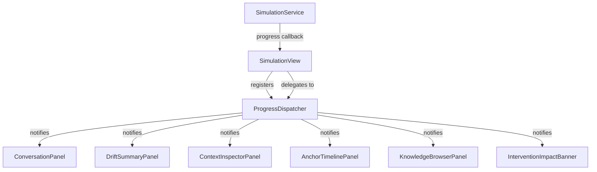

## Context

The simulation UI renders 12 view files totaling ~7,200 LOC. Styling is applied via 74+ inline `getStyle().set()` calls scattered across all panels, with only ~5 CSS class names used in Java code. The existing `anchor-retro/styles.css` (380 lines) already defines the retro palette and component-level CSS classes, but panels don't use them — they duplicate styles inline.

The `SimulationView.applyProgress()` method is a 50-line dispatcher that reaches into 6 panels with direct method calls. Every new panel requires modifying this orchestrator.

Both issues are structural: they don't affect behavior but make the codebase hard to read, hard to theme, and hostile to future layout changes (responsive, mobile, etc.).

## Goals / Non-Goals

**Goals:**
- Eliminate inline `getStyle().set()` calls from all sim and chat view files, replacing them with CSS classes in `styles.css`
- Decompose `applyProgress()` so panels handle their own progress updates
- Preserve the exact visual appearance — no pixel should change
- Make the CSS class vocabulary consistent and discoverable

**Non-Goals:**
- Responsive layout changes (follow-up change)
- Mobile support (follow-up change)
- New visual features (animations, transitions, focus mode)
- Changing panel behavior or public APIs
- Refactoring constructor bloat (opportunistic only)

## Decisions

### D1: CSS class naming convention — BEM-lite with `ar-` prefix

Use a flat BEM-inspired naming scheme prefixed with `ar-` (anchor-retro) to avoid collisions with Vaadin's built-in classes.

**Pattern:** `ar-{block}` / `ar-{block}--{modifier}`

Examples:
- `ar-bubble` (base turn bubble)
- `ar-bubble--player` / `ar-bubble--dm` (speaker variant)
- `ar-bubble--attack` (adversarial turn)
- `ar-badge` (base badge/tag pill)
- `ar-badge--verdict-held` / `ar-badge--verdict-drift`
- `ar-metric-card` (drift summary metric)
- `ar-section-title` (H4 section headers)
- `ar-system-message` (centered italic system messages)

**Why not plain class names?** Vaadin injects its own class names and Lumo utility classes. The `ar-` prefix guarantees no collision. BEM-lite (no `__element`) keeps names short since Vaadin components are the "elements."

**Why not Lumo utility classes?** Lumo utilities exist but are limited and poorly documented for custom layouts. Dedicated classes give us full control and are grep-able.

### D2: Dynamic accent colors via CSS custom properties + data attributes

Several components set accent colors dynamically based on data (verdict color, turn type color, metric health color). These cannot be pure CSS classes since the color depends on runtime values.

**Approach:** Use `data-*` attributes on the component and CSS attribute selectors.

```java
// Java: set the data attribute
badge.getElement().setAttribute("data-verdict", "contradicted");

// CSS: style via attribute selector
.ar-badge[data-verdict="contradicted"] { background: var(--anchor-accent-magenta); color: white; }
.ar-badge[data-verdict="confirmed"]    { background: var(--anchor-accent-green); color: white; }
.ar-badge[data-verdict="not-mentioned"]{ background: var(--anchor-accent-amber); color: white; }
```

**Alternative considered:** Keeping inline styles for dynamic colors only. Rejected because verdict/turn-type/health colors are a finite, known set — they're enumerable, not arbitrary. Data attributes make them CSS-targetable for future theming.

**Edge case:** Metric cards use a continuous health color (green/amber/red based on thresholds). These are also finite (3 values per metric), so `data-health="good|warn|bad"` works.

### D3: Progress dispatch via `SimulationProgressListener` interface



**Interface:**

```java
public interface SimulationProgressListener {
    default void onTurnStarted(SimulationProgress progress) {}
    default void onTurnCompleted(SimulationProgress progress) {}
    default void onSimulationCompleted(SimulationProgress progress) {}
}
```

**Why three methods instead of one?** The current `applyProgress()` already distinguishes pre-turn (player message, no DM response yet) from post-turn (DM response arrived) from terminal (complete/cancelled). Making this explicit in the interface means panels opt into only what they need.

**Where does the dispatcher live?** A simple `ProgressDispatcher` utility class held by `SimulationView`. Not a Spring bean — it's a UI-scoped helper, not a service.

```java
public class ProgressDispatcher {
    private final List<SimulationProgressListener> listeners = new ArrayList<>();

    public void addListener(SimulationProgressListener listener) {
        listeners.add(listener);
    }

    public void dispatch(SimulationProgress progress) {
        if (progress.complete()) {
            listeners.forEach(l -> l.onSimulationCompleted(progress));
        } else if (progress.lastDmResponse() != null) {
            listeners.forEach(l -> l.onTurnCompleted(progress));
        } else if (progress.lastPlayerMessage() != null) {
            listeners.forEach(l -> l.onTurnStarted(progress));
        }
    }
}
```

**SimulationView wiring:**

```java
// In constructor:
dispatcher.addListener(conversationPanel);
dispatcher.addListener(driftSummaryPanel);
dispatcher.addListener(inspectorPanel);
dispatcher.addListener(timelinePanel);
dispatcher.addListener(knowledgeBrowserPanel);

// In applyProgress():
progressBar.setValue(...);
statusLabel.setText(...);
interventionBanner.dismiss();
dispatcher.dispatch(progress);

if (progress.complete()) {
    transitionTo(SimControlState.COMPLETED);
}
```

SimulationView still handles progress bar, status label, and state transitions — these are view-level concerns, not panel concerns.

**Alternative considered:** Spring events (`ApplicationEventPublisher`). Rejected — progress events are UI-scoped and ephemeral. Publishing them through Spring's event bus would cross the service/view boundary unnecessarily and require careful thread handling.

### D4: Panel migration order — bottom-up by inline style count

Migrate panels in order of inline style density, simplest first:

1. `InterventionImpactBanner` (88 LOC, ~4 inline styles) — warm-up
2. `DriftSummaryPanel` (352 LOC, ~20 inline styles) — metric cards are the most duplicated pattern
3. `ConversationPanel` (450 LOC, ~25 inline styles) — badges are the other heavily duplicated pattern
4. `AnchorTimelinePanel` (531 LOC, ~15 inline styles) — already uses CSS classes, needs cleanup
5. `ContextInspectorPanel` (758 LOC, ~10 inline styles) — complex but fewer inline styles
6. `KnowledgeBrowserPanel` (532 LOC, ~10 inline styles)
7. `AnchorManipulationPanel` (538 LOC, ~8 inline styles)
8. `RunHistoryDialog` (159 LOC, ~3 inline styles)
9. `RunInspectorView` (924 LOC, ~15 inline styles) — largest, last
10. `SimulationView` (733 LOC, ~6 inline styles) — orchestrator, also gets progress dispatch refactor
11. `ChatView` (938 LOC, ~6 inline styles) — standalone view, migrate independently

**Why this order?** Small files first builds the CSS class vocabulary. By the time we hit the large panels, most classes already exist and it's a matter of applying them.

## Risks / Trade-offs

**[Risk: Visual regression]** → Mitigation: Side-by-side comparison before/after each panel migration. The retro theme is visually distinctive — regressions will be obvious. No automated visual testing infrastructure exists, so this is manual.

**[Risk: Data-attribute CSS specificity conflicts]** → Mitigation: The `ar-` prefix and explicit `[data-*]` selectors won't conflict with Lumo's `[theme~=]` selectors. Test in both dark and light modes.

**[Risk: Progress listener ordering assumptions]** → Mitigation: The current dispatch order in `applyProgress()` is not load-bearing — panels don't depend on update order. The dispatcher calls listeners in registration order, which preserves the current sequence.

**[Trade-off: More CSS, less Java]** → Acceptable. CSS is the right place for styling. The `styles.css` file will grow from ~380 lines to ~550-650 lines. This is a healthy size for a single-theme file.

**[Trade-off: `data-*` attributes add DOM clutter]** → Acceptable. Vaadin already generates verbose DOM. A few data attributes are invisible to users and valuable for CSS targeting and debugging.
