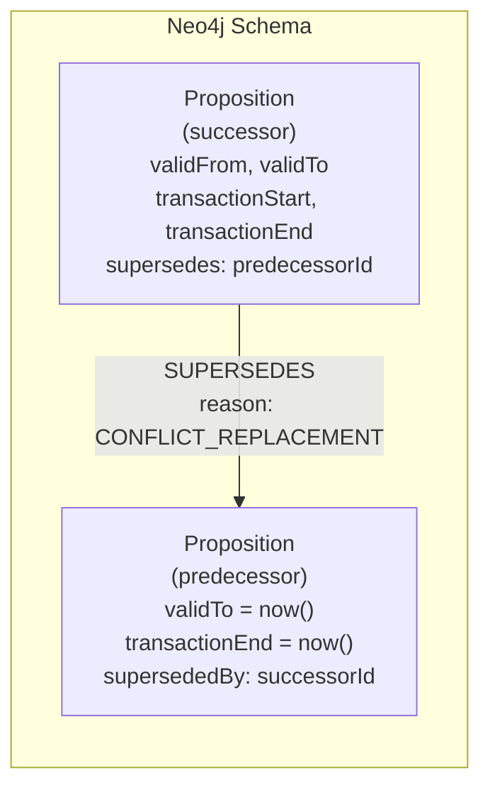
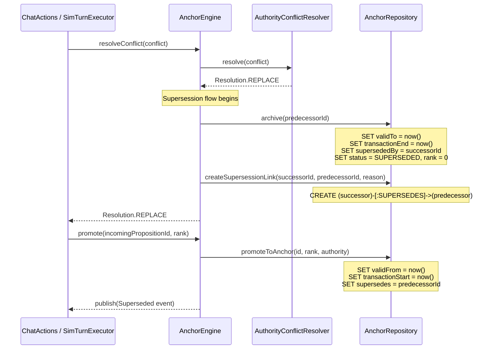

# Design: Bi-Temporal Validity and Supersession (F04)

**Change**: `bi-temporal-validity-and-supersession`
**Status**: Design
**Date**: 2026-02-22

Keywords follow [RFC 2119](https://www.ietf.org/rfc/rfc2119.txt).

---

## Context

Anchors currently lack temporal semantics. When an anchor is archived via conflict replacement, budget eviction, or decay, the system records status = `SUPERSEDED` and rank = 0, but preserves no record of _when_ the anchor was valid or _which_ successor replaced it. The `PropositionNode` stores `created` and `revised` timestamps but these track record-level metadata, not the valid-time window of the underlying fact.

This gap prevents the system from answering temporal queries ("what was the active anchor set at turn 3?"), reconstructing supersession chains ("what replaced this anchor and why?"), or producing trust audit trails for debugging drift behavior.

The F01 (memory tiering) and F02 (conflict calibration) changes are complete and provide the tier-aware lifecycle and calibrated conflict resolution that this change builds upon. `AnchorEngine` already publishes `Archived`, `Evicted`, and `ConflictResolved` lifecycle events; this change extends those flows with temporal metadata and supersession tracking.

---

## Goals / Non-Goals

### Goals

1. **Bi-temporal field model** -- Add valid-time and transaction-time fields to `PropositionNode` following the SCD2 (Slowly Changing Dimension Type 2) pattern, enabling point-in-time reconstruction of anchor state.
2. **Supersession tracking** -- Record explicit predecessor/successor links when one anchor replaces another, as both Neo4j relationships and denormalized node fields.
3. **Temporal query API** -- Expose repository methods for point-in-time anchor retrieval and supersession chain traversal.
4. **Lifecycle event** -- Add a `Superseded` event type to the sealed `AnchorLifecycleEvent` hierarchy.
5. **OTEL observability** -- Emit span attributes on supersession events for tracing and debugging.
6. **Backward compatibility** -- All changes MUST be additive. Existing nodes without temporal fields MUST continue to work.

### Non-Goals

- **Temporal version branching** -- No support for forking timelines or "what-if" temporal queries. Valid time is linear.
- **UI supersession visualization** -- The Context Inspector panel enhancement is deferred to a follow-up change. This design covers the data model and service layer only.
- **Temporal indexing** -- Neo4j composite indexes on temporal fields are deferred until query performance data justifies them.
- **Temporal garbage collection** -- No automatic cleanup of old temporal records. Superseded anchors remain in the graph for audit purposes.

---

## Decisions

### D1: Temporal Field Model

`PropositionNode` MUST gain four new `@Nullable Instant` fields following the standard bi-temporal SCD2 pattern:

| Field | Time axis | Semantics | Set when |
|-------|-----------|-----------|----------|
| `validFrom` | Valid time | When the anchor's fact became true | `AnchorEngine.promote()` |
| `validTo` | Valid time | When the anchor's fact stopped being true | `AnchorEngine.archive()`, conflict REPLACE |
| `transactionStart` | Transaction time | When this anchor state was written to the store | `AnchorEngine.promote()` |
| `transactionEnd` | Transaction time | When this anchor state was superseded in the store | Archive, supersession, eviction |

All four fields MUST be `@Nullable` to maintain backward compatibility with existing nodes that lack temporal data. The `@JsonCreator` constructor MUST accept these as optional parameters with null defaults.

**Invariant T1**: `validFrom` MUST be set when `rank` transitions from 0 to > 0 (promotion). It MUST NOT be modified after initial assignment.

**Invariant T2**: `validTo` MUST be null while the anchor is active. It MUST be set to `Instant.now()` when the anchor is archived or superseded.

**Invariant T3**: `transactionStart <= transactionEnd` when both are non-null.

### D2: Supersession Relationship

Supersession MUST be modeled using **both** a Neo4j relationship and denormalized node fields:

- **Relationship**: `(successor:Proposition)-[:SUPERSEDES]->(predecessor:Proposition)` with a `reason` property (String). This enables graph traversal queries and Cypher path expressions.
- **Node fields**: `supersededBy` (String, nullable) on the predecessor node pointing to the successor's ID, and `supersedes` (String, nullable) on the successor node pointing to the predecessor's ID.

The dual representation is justified because:
1. Relationship traversal is needed for chain queries (`findSupersessionChain`) which walk variable-length paths.
2. Node fields are needed for O(1) predecessor/successor lookups in `AnchorEngine` without relationship traversal overhead.

The `SUPERSEDES` relationship MUST carry a `reason` property corresponding to `SupersessionReason`:

```java
public enum SupersessionReason {
    CONFLICT_REPLACEMENT,
    BUDGET_EVICTION,
    DECAY_DEMOTION,
    MANUAL
}
```

This enum aligns with `ArchiveReason` but is a separate type because supersession and archival are related but distinct concepts -- an anchor can be archived without being superseded (e.g., manual archive with no replacement).



### D3: Supersession Integration Points

Supersession metadata MUST be recorded at three integration points in the existing codebase:

**3a. `AuthorityConflictResolver` outcome handling in `AnchorEngine`**

When `AnchorEngine.resolveConflict()` returns `Resolution.REPLACE`, the caller (currently in `ChatActions` and `SimulationTurnExecutor`) archives the existing anchor and promotes the incoming proposition. This flow MUST be enhanced to:

1. Set `validTo = now()` and `transactionEnd = now()` on the predecessor (`AnchorEngine.archive()`).
2. Set `validFrom = now()` and `transactionStart = now()` on the successor (`AnchorEngine.promote()`).
3. Create the `SUPERSEDES` relationship and set the denormalized `supersedes`/`supersededBy` fields.
4. Publish the `Superseded` lifecycle event.

To support this, `AnchorEngine.archive()` MUST gain an overload accepting an optional `successorId`:

```java
public void archive(String anchorId, ArchiveReason reason, @Nullable String successorId)
```

The existing `archive(String, ArchiveReason)` method MUST delegate to this overload with `successorId = null`.

**3b. `AnchorEngine.promote()`**

`promote()` MUST set `validFrom = Instant.now()` and `transactionStart = Instant.now()` on the newly promoted anchor. This is a write to `AnchorRepository` via a new `setTemporalFields()` method or by extending `promoteToAnchor()`.

**3c. Budget eviction in `AnchorRepository.evictLowestRanked()`**

When eviction occurs, the evicted anchor has no explicit successor (the incoming anchor that triggered the eviction is not a semantic replacement). The eviction flow MUST set `validTo` and `transactionEnd` on evicted anchors but MUST NOT create a `SUPERSEDES` relationship. The `ArchiveReason.BUDGET_EVICTION` distinguishes this from conflict-driven supersession.



### D4: Temporal Query Methods

`AnchorRepository` MUST expose the following temporal query methods:

**`findValidAt(String contextId, Instant pointInTime)`** -- Returns anchors whose valid-time window contains the given instant. The Cypher query:

```cypher
MATCH (p:Proposition {contextId: $contextId})
WHERE p.rank > 0
  AND (p.validFrom IS NULL OR p.validFrom <= $pointInTime)
  AND (p.validTo IS NULL OR p.validTo > $pointInTime)
RETURN p.id AS id
ORDER BY p.rank DESC
```

When `validFrom` is null (legacy nodes), the anchor is treated as valid from the beginning of time. When `validTo` is null, the anchor is treated as still valid (open-ended). This preserves `findActiveAnchors()` semantics for nodes without temporal fields.

**`findSupersessionChain(String anchorId)`** -- Walks the `SUPERSEDES` relationship chain in both directions from the given anchor, returning the ordered chain from oldest predecessor to newest successor:

```cypher
MATCH path = (start:Proposition {id: $anchorId})
              -[:SUPERSEDES*0..]->(predecessor:Proposition)
WHERE NOT (predecessor)-[:SUPERSEDES]->()
WITH predecessor
MATCH chain = (newest:Proposition)-[:SUPERSEDES*0..]->(predecessor)
WHERE NOT ()-[:SUPERSEDES]->(newest)
RETURN [node IN nodes(chain) | node.id] AS chain
```

The method MUST return `List<String>` (anchor IDs in chronological order). Variable-length path depth SHOULD be limited to 50 to prevent runaway traversal.

**`findPredecessor(String anchorId)`** and **`findSuccessor(String anchorId)`** -- O(1) lookups using the denormalized `supersedes`/`supersededBy` fields. These MUST return `Optional<String>`.

### D5: Lifecycle Event

The sealed `AnchorLifecycleEvent` hierarchy MUST be extended with a `Superseded` subtype:

```java
public static final class Superseded extends AnchorLifecycleEvent {
    private final String predecessorId;
    private final String successorId;
    private final SupersessionReason reason;
    // constructor, getters
}
```

The `permits` clause on the sealed class MUST be updated to include `Superseded`. A static factory method `AnchorLifecycleEvent.superseded(...)` MUST be added following the existing pattern.

The `Superseded` event MUST be published by `AnchorEngine` after the supersession link is persisted and before any budget eviction triggered by the successor's promotion.

### D6: OTEL Observability

Supersession events MUST set the following OTEL span attributes on `Span.current()`:

| Attribute | Type | Description |
|-----------|------|-------------|
| `supersession.reason` | String | `SupersessionReason.name()` |
| `supersession.predecessor_id` | String | ID of the replaced anchor |
| `supersession.successor_id` | String | ID of the replacing anchor |
| `supersession.predecessor_authority` | String | Authority of the predecessor at time of supersession |
| `supersession.predecessor_rank` | int | Rank of the predecessor at time of supersession |

These attributes MUST be set in `AnchorEngine` at the same call site where the `Superseded` event is published, following the pattern established by `AuthorityConflictResolver.setSpanAttributes()` and `AnchorEngine.updateTierIfChanged()`.

### D7: Migration Strategy

Existing `SUPERSEDED`-status nodes have no temporal fields and no `SUPERSEDES` relationships. The migration strategy is **null-safe defaults with no breaking migration**:

- `validFrom`: When null, treated as `created` for query purposes. No backfill required.
- `validTo`: When null on a `SUPERSEDED`-status node, treated as `revised` for query purposes. No backfill required.
- `transactionStart`: When null, treated as `created`. No backfill required.
- `transactionEnd`: When null on a `SUPERSEDED`-status node, treated as `revised`. No backfill required.
- `supersedes` / `supersededBy`: When null, the anchor has no known supersession chain. Acceptable for legacy data.

The `AnchorRepository.provision()` method MAY include an optional backfill step (controlled by a config flag) that populates temporal fields on legacy nodes using the heuristic above. This is NOT REQUIRED for correctness -- the null-safe query logic in D4 handles missing fields transparently.

### D8: Backward Compatibility

All new fields on `PropositionNode` MUST be `@Nullable`. The `@JsonCreator` constructor MUST accept these parameters with `@JsonProperty` annotations and default to null when absent.

Existing queries (`findActiveAnchors`, `findAnchorsByContext`, `countActiveAnchors`, `evictLowestRanked`) MUST NOT be modified. The temporal query methods (D4) are additive.

The `Anchor` record SHOULD NOT gain temporal fields directly. Temporal data is a persistence concern and SHOULD be accessed via repository queries rather than embedded in the in-memory view record. If temporal accessors are needed in domain logic, a separate `TemporalAnchorView` record MAY be introduced.

The `PropositionView` Drivine wrapper MUST be updated to map the new `PropositionNode` fields to/from Neo4j properties. Drivine's `@NodeFragment` mapping handles new nullable properties transparently -- no schema migration script is required.

---

## Risks / Trade-offs

### R1: Denormalized supersession fields vs. relationship-only

**Trade-off**: Storing `supersedes`/`supersededBy` on both the node and as a relationship creates a consistency risk -- the fields could diverge from the relationship if one is updated without the other.

**Mitigation**: All supersession writes MUST go through a single `AnchorRepository.createSupersessionLink()` method that atomically sets both the relationship and the node fields in a single Cypher statement. Direct mutation of `supersedes`/`supersededBy` fields outside this method MUST NOT occur.

### R2: Variable-length path traversal in `findSupersessionChain`

**Trade-off**: Cypher variable-length path queries (`-[:SUPERSEDES*0..]->`) can be expensive on deep chains and lack query plan predictability.

**Mitigation**: Depth MUST be bounded (`*0..50`). In practice, supersession chains are expected to be short (< 10 hops) because anchors are replaced infrequently relative to their lifecycle. If chain depth becomes a concern, a materialized `chainRoot` field on each node MAY be added in a future change.

### R3: Constructor parameter growth on `PropositionNode`

**Trade-off**: `PropositionNode` already has 20 constructor parameters. Adding 6 more (4 temporal + 2 supersession) pushes it to 26, which is unwieldy.

**Mitigation**: The `@JsonCreator` constructor is the primary entry point for Drivine deserialization. Application code typically uses convenience constructors (`PropositionNode(String text, double confidence)`) which default the new fields to null. A builder pattern MAY be introduced in a follow-up change if parameter count exceeds 30.

### R4: No temporal indexes on initial deployment

**Trade-off**: `findValidAt()` performs a range scan on `validFrom`/`validTo` without index support. On large anchor sets this could be slow.

**Mitigation**: Anchor counts per context are bounded by budget (default 20 active). Including superseded anchors, a typical context might have 50-100 total nodes -- well within Neo4j's unindexed scan performance. Indexes SHOULD be added if profiling shows degradation, but are NOT REQUIRED for correctness.

### R5: `SupersessionReason` vs. `ArchiveReason` overlap

**Trade-off**: Two enums with overlapping values (`CONFLICT_REPLACEMENT`, `BUDGET_EVICTION`) could cause confusion.

**Mitigation**: The types serve different purposes. `ArchiveReason` describes _why_ an anchor was deactivated (which MAY involve supersession). `SupersessionReason` describes _why_ one anchor replaced another (which always implies archival of the predecessor). The overlap is intentional and documented. A mapping utility method `SupersessionReason.fromArchiveReason()` SHOULD be provided for the common case.
