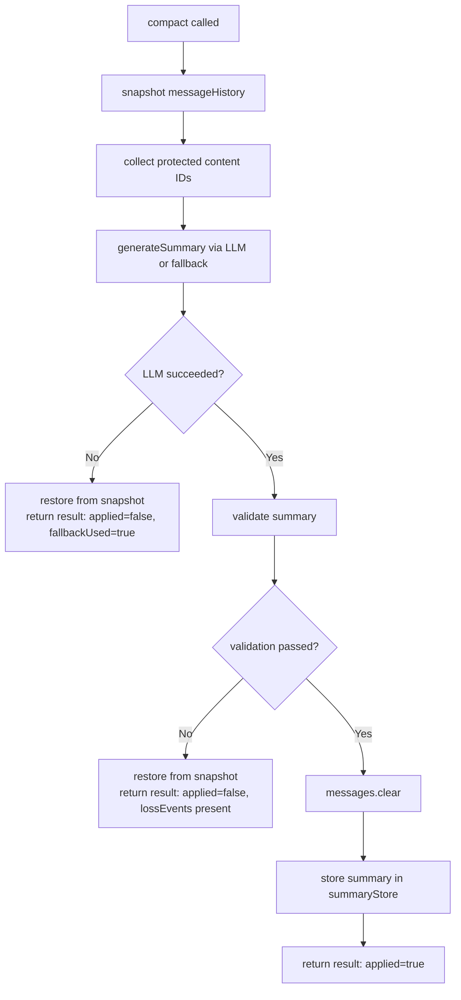

# Design: Compaction Recovery Guardrails (F05)

**Change**: `compaction-recovery-guardrails`
**Status**: Design
**Date**: 2026-02-22

Keywords follow [RFC 2119](https://www.ietf.org/rfc/rfc2119.txt).

---

## Context

The compaction pipeline in `CompactedContextProvider.compact()` manages message history for long-running simulations by generating LLM summaries and discarding raw messages. The pipeline has 81 tests and a well-designed `ProtectedContentProvider` SPI (`AnchorContentProtector`, `PropositionContentProtector`), but operates without recovery semantics.

### Current flow (`CompactedContextProvider.compact()`, lines 96–143)

```
1. Read messages from messageHistory map
2. Collect protected content IDs from all ProtectedContentProvider beans
3. Call summaryGenerator.generateSummary(messages, ...) → LLM call
4. Store summary in summaryStore
5. messages.clear()                    ← POINT OF NO RETURN
6. Call CompactionValidator.validate() ← validates AFTER clear
7. Return CompactionResult with lossEvents
```

### Critical defects

**D-BUG-1 — Validate-after-clear**: Step 5 destroys message history before step 6 detects anchor loss. If validation finds losses, there is no recovery path.

**D-BUG-2 — LLM failure stored as summary**: `SimSummaryGenerator.generateSummary()` catches all exceptions and returns `[Summary generation failed: ...]`. That string is stored in `summaryStore` and subsequently injected into LLM prompts as narrative context, corrupting future turns silently.

**D-BUG-3 — No context cleanup on cancellation**: `SimulationService.runSimulation()` `finally` block (lines 317–320) logs a message and clears `running`, but does not call `compactedContextProvider.clearContext(contextId)`. Cancelled simulations leave compaction state in memory indefinitely.

**D-BUG-4 — Hardcoded quality threshold**: `CompactionValidator.validate()` uses the magic constant `0.5` for the match ratio threshold (line 50). It cannot be tuned per scenario or globally.

**D-BUG-5 — No observability for compaction outcomes**: Compaction events are not published to Spring's `ApplicationEventPublisher` and carry no OTEL span attributes, so monitoring dashboards and event listeners have no signal when compaction succeeds, degrades, or falls back.

### Affected classes

| Class | Package | Role |
|---|---|---|
| `CompactedContextProvider` | `assembly/` | Orchestrator: tracks messages, triggers compaction, stores summaries |
| `SimSummaryGenerator` | `assembly/` | LLM summary generation; caches by message hash |
| `CompactionValidator` | `assembly/` | Post-compaction word-match validation |
| `CompactionConfig` | `assembly/` | Config record: enabled, thresholds, forced turns |
| `CompactionResult` | `assembly/` | Result record: trigger, tokens, loss events, summary |
| `AnchorContentProtector` | `assembly/` | `ProtectedContentProvider` backed by active anchors |
| `PropositionContentProtector` | `assembly/` | `ProtectedContentProvider` backed by propositions |
| `SimulationTurnExecutor` | `sim/engine/` | Integrates compaction into turn execution (lines ~547–561) |
| `SimulationService` | `sim/engine/` | Drives the simulation loop; owns `CompactedContextProvider` ref |
| `AnchorLifecycleEvent` | `anchor/event/` | Sealed base for anchor lifecycle events — NOT extended by this change |

---

## Goals / Non-Goals

### Goals

1. Eliminate the validate-after-clear defect: summary MUST be validated before message history is cleared.
2. Provide in-memory message rollback when LLM failure or validation failure occurs.
3. Add configurable LLM retry with exponential backoff before triggering extractive fallback.
4. Add a deterministic extractive fallback that is always valid by construction.
5. Make the word-match quality threshold configurable (per `CompactionConfig`).
6. Publish a `CompactionCompleted` application event after every compaction attempt.
7. Guarantee `clearContext()` is called in `SimulationService` regardless of outcome.
8. Emit OTEL span attributes for compaction metrics so dashboards have signal.

### Non-Goals

1. Persistent message backup — backup is in-memory only; no Neo4j or disk storage.
2. Summary quality beyond word-match — semantic similarity scoring is out of scope (F06 territory).
3. Compaction for the chat flow (`ChatActions`) — this change covers simulation compaction only.
4. UI display of compaction events — the event is published; UI wiring is deferred.
5. Extending `AnchorLifecycleEvent` — `CompactionCompleted` is a separate standalone record; compaction is not an anchor lifecycle concern.

---

## Decisions

### D1: Compaction Atomicity (validate-before-clear)

**Decision**: Reorder `compact()` to generate summary, validate, and only clear messages if validation passes. If validation fails, keep messages, skip storing the summary, and return a `CompactionResult` with `compactionApplied = false`.

**Rationale**: The existing code path destroys recoverable state at step 5 before detecting problems at step 6. Reordering is the minimal fix with no new dependencies.

**New record field**: `CompactionResult` gains a `boolean compactionApplied` field. Callers (`SimulationTurnExecutor`) can log or surface this to the UI.



**Files changed**: `CompactedContextProvider`, `CompactionResult`

---

### D2: Message Backup and Rollback

**Decision**: Before any compaction attempt, take an in-memory snapshot of the message list. On LLM failure or validation failure, restore from the snapshot. The backup is a `List.copyOf()` local variable within `compact()` — no new fields on `CompactedContextProvider`.

**Rationale**: The message list is a `Collections.synchronizedList(new ArrayList<>())` stored in `messageHistory`. A snapshot before the LLM call costs one allocation and is trivially restorable via `messages.clear(); messages.addAll(backup)`.

**Invariants**:
- The snapshot MUST be taken before `generateSummary()` is called.
- Rollback MUST restore the list to its exact pre-compaction state.
- The snapshot is not stored beyond the scope of `compact()` — it has no retention concern.

```mermaid
sequenceDiagram
    participant compact
    participant messageList
    participant summaryGen
    participant validator

    compact->>messageList: snapshot = List.copyOf(messages)
    compact->>summaryGen: generateSummary(messages, ...)
    alt LLM failure
        summaryGen-->>compact: throws / error result
        compact->>messageList: messages.clear(); messages.addAll(snapshot)
        compact-->>caller: CompactionResult(applied=false)
    else LLM success
        summaryGen-->>compact: summary text
        compact->>validator: validate(summary, protectedAnchors)
        alt Validation failure
            validator-->>compact: lossEvents non-empty
            compact->>messageList: messages.clear(); messages.addAll(snapshot)
            compact-->>caller: CompactionResult(applied=false, lossEvents)
        else Validation passes
            compact->>messageList: messages.clear()
            compact-->>caller: CompactionResult(applied=true)
        end
    end
```

**Files changed**: `CompactedContextProvider`

---

### D3: LLM Retry with Extractive Fallback

**Decision**: `SimSummaryGenerator.generateSummary()` gains retry logic with configurable count (default 2 retries = 3 total attempts) and exponential backoff (attempt 1 waits 1 s, attempt 2 waits 2 s). After all retries fail, it falls back to a deterministic extractive summary. The extractive summary is produced by `SimSummaryGenerator` itself, receiving the `List<ProtectedContent>` sorted descending by priority, then concatenating their `text` fields.

**Rationale**: LLM failures are transient (rate limits, timeouts). Two retries cover the common case without excessive latency. The extractive fallback is always valid by construction: it is built from the exact protected content texts, so `CompactionValidator` will always pass (the words it checks for are present verbatim).

**Extractive fallback algorithm**:
```
protectedContent.sortedByPriorityDesc()
    .map(pc -> pc.text())
    .collect(joining(" "))
```

The fallback MUST be flagged in the result so callers and the `CompactionCompleted` event can record `fallbackUsed = true`.

**New `SimSummaryGenerator` signature**:
```java
public SummaryResult generateSummary(
    List<String> messages,
    String contextDescription,
    List<ProtectedContent> protectedContent,   // for extractive fallback
    int maxRetries,                             // from CompactionConfig
    Duration initialBackoff)                    // from CompactionConfig
```

**New `SummaryResult` record** (package-private, lives in `assembly/`):
```java
record SummaryResult(String summary, int retryCount, boolean fallbackUsed) {}
```

**Retry/backoff configuration** is carried in `CompactionConfig` (see D4). Default: `maxRetries = 2`, `retryBackoffMillis = 1000`.

**Files changed**: `SimSummaryGenerator`, `CompactionConfig`, `CompactedContextProvider` (call-site update)

---

### D4: Configurable Quality Threshold

**Decision**: `CompactionConfig` gains `minMatchRatio` (type `double`, range [0.0, 1.0], default 0.5). `CompactionValidator.validate()` is updated to accept `minMatchRatio` as a parameter instead of using the hardcoded `0.5`. Additionally, `CompactionConfig` gains retry-related fields to support D3.

**Updated `CompactionConfig` record**:
```java
public record CompactionConfig(
    boolean enabled,
    int tokenThreshold,
    int messageThreshold,
    List<Integer> forceAtTurns,
    double minMatchRatio,      // default 0.5; range [0.0, 1.0]
    int maxRetries,            // default 2
    long retryBackoffMillis    // default 1000; doubles per retry
) {
    public static CompactionConfig disabled() {
        return new CompactionConfig(false, 0, 0, List.of(), 0.5, 2, 1000L);
    }
}
```

**Updated `CompactionValidator.validate()` signature**:
```java
public static List<CompactionLossEvent> validate(
    String summary,
    List<Anchor> protectedAnchors,
    double minMatchRatio)
```

The hardcoded `<= 0.5` comparison on line 50 becomes `< minMatchRatio`. Callers pass `config.minMatchRatio()`.

**Scenario YAML** MAY specify `minMatchRatio` in the `compactionConfig` block. Scenarios that omit it inherit the default.

**Files changed**: `CompactionConfig`, `CompactionValidator`, `CompactedContextProvider` (call-site update), scenario YAML loader

---

### D5: Compaction Lifecycle Event

**Decision**: Add a standalone `CompactionCompleted` record in package `dev.dunnam.diceanchors.assembly`. It extends `ApplicationEvent` directly — NOT `AnchorLifecycleEvent` — because compaction is a pipeline concern, not an anchor lifecycle concern. `CompactedContextProvider` publishes it via `ApplicationEventPublisher` after every `compact()` call, regardless of outcome.

**Rationale**: `AnchorLifecycleEvent` is a sealed class; adding `CompactionCompleted` there would require modifying the `permits` clause and misrepresents the domain concept. A separate event type is cleaner and avoids coupling the anchor lifecycle hierarchy to pipeline infrastructure.

**Record definition**:
```java
package dev.dunnam.diceanchors.assembly;

import org.springframework.context.ApplicationEvent;
import java.time.Instant;

/**
 * Published by {@link CompactedContextProvider} after each compaction attempt,
 * whether or not compaction was applied.
 */
public final class CompactionCompleted extends ApplicationEvent {

    private final String contextId;
    private final String triggerReason;
    private final int tokensBefore;
    private final int tokensAfter;
    private final int lossCount;
    private final int retryCount;
    private final boolean fallbackUsed;
    private final boolean compactionApplied;
    private final Instant occurredAt;

    public CompactionCompleted(Object source, String contextId, String triggerReason,
                               int tokensBefore, int tokensAfter, int lossCount,
                               int retryCount, boolean fallbackUsed, boolean compactionApplied) {
        super(source);
        this.contextId = contextId;
        this.triggerReason = triggerReason;
        this.tokensBefore = tokensBefore;
        this.tokensAfter = tokensAfter;
        this.lossCount = lossCount;
        this.retryCount = retryCount;
        this.fallbackUsed = fallbackUsed;
        this.compactionApplied = compactionApplied;
        this.occurredAt = Instant.now();
    }

    // accessors omitted for brevity
}
```

`CompactedContextProvider` MUST receive `ApplicationEventPublisher` via constructor injection and call `publisher.publishEvent(new CompactionCompleted(...))` as the final step of `compact()`.

**Files changed**: `CompactedContextProvider`, new file `CompactionCompleted.java`

---

### D6: Context Cleanup Guarantee

**Decision**: `SimulationService.runSimulation()` MUST call `compactedContextProvider.clearContext(contextId)` in the existing `finally` block (lines 317–320) and MUST also call `anchorRepository.clearByContext(contextId)` there. Currently, `anchorRepository.clearByContext(contextId)` is only called during SETUP (line 125), and `clearContext` is never called.

**Rationale**: Without `finally`-block cleanup, a cancelled or failed simulation leaves:
- Message history and summary store entries in `CompactedContextProvider`'s `ConcurrentHashMap` fields
- Neo4j proposition/anchor nodes for the `sim-{uuid}` context

Both leak memory (for compaction maps) and Neo4j state across runs. The `clearContext()` method already exists and is correct; it just needs to be called unconditionally.

**Updated `finally` block**:
```java
} finally {
    running = false;
    try {
        compactedContextProvider.clearContext(contextId);
        anchorRepository.clearByContext(contextId);
        logger.info("Cleaned up context {} after simulation", contextId);
    } catch (Exception cleanupEx) {
        logger.warn("Context cleanup failed for {}: {}", contextId, cleanupEx.getMessage());
    }
}
```

The cleanup MUST be wrapped in its own try/catch so a cleanup failure does not mask the original exception (if any) from the outer catch block.

**Files changed**: `SimulationService`

---

### D7: OTEL Span Attributes

**Decision**: `CompactedContextProvider.compact()` MUST set attributes on `Span.current()` from `io.opentelemetry.api.trace.Span`. These attributes reflect the outcome of the compaction attempt and are set after the decision to apply or reject has been made.

**Attributes**:

| Attribute key | Type | Source |
|---|---|---|
| `compaction.trigger_reason` | String | `triggerReason` parameter |
| `compaction.tokens_before` | long | `tokensBefore` |
| `compaction.tokens_after` | long | `tokensAfter` (0 if not applied) |
| `compaction.loss_count` | long | `lossEvents.size()` |
| `compaction.retry_count` | long | `summaryResult.retryCount()` |
| `compaction.fallback_used` | boolean | `summaryResult.fallbackUsed()` |
| `compaction.applied` | boolean | `compactionApplied` |

**Implementation pattern** (consistent with existing `@Observed` usage in `SimulationService`):
```java
var span = Span.current();
span.setAttribute("compaction.trigger_reason", triggerReason);
span.setAttribute("compaction.tokens_before", tokensBefore);
span.setAttribute("compaction.tokens_after", tokensAfter);
span.setAttribute("compaction.loss_count", lossEvents.size());
span.setAttribute("compaction.retry_count", summaryResult.retryCount());
span.setAttribute("compaction.fallback_used", summaryResult.fallbackUsed());
span.setAttribute("compaction.applied", compactionApplied);
```

`Span.current()` returns a no-op span when no active trace exists, so this is safe without a null check.

**Files changed**: `CompactedContextProvider`

---

## Risks / Trade-offs

### R1: Retry latency in hot simulation turns

Two LLM retries with backoff (1 s + 2 s) add up to 3 s of blocking latency per failed compaction attempt before the extractive fallback triggers. Simulation turns are already LLM-bound, but 3 extra seconds on a compaction turn may be noticeable.

**Mitigation**: `maxRetries` defaults to 2 but is configurable per scenario. Scenarios under time pressure can set `maxRetries: 0` to go directly to extractive fallback. The extractive fallback produces a usable summary in O(n) string concatenation with no network call.

### R2: Extractive fallback degrades summary quality

The extractive summary is verbatim concatenation of protected content texts. It loses narrative continuity and conversational context. Future turns that depend on unprotected message history detail will not find it in the summary.

**Mitigation**: The fallback is explicitly flagged in `CompactionResult.fallbackUsed` and the `CompactionCompleted` event. Operators monitoring the OTEL dashboard will see `compaction.fallback_used = true`. Validation always passes, so no anchor content is lost. The trade-off is accepted: a coherent-but-incomplete summary is strictly better than a failure string stored as context.

### R3: validate-before-clear holds messages longer under validation failure

If compaction is rejected due to validation failure, the full message history is retained. Under a persistent validation failure pattern (e.g., LLM consistently produces poor summaries), the message history grows unbounded until token thresholds force another attempt.

**Mitigation**: The extractive fallback (D3) is always valid by construction. If the LLM produces a bad summary after retries, the extractive fallback is used, which will pass validation. The only scenario where messages are retained and validation fails is if `minMatchRatio` is set unreasonably high (e.g., 1.0) and even the extractive fallback does not contain all significant words — which cannot happen by the construction of the extractor. In practice, the extractive fallback is a safety net that prevents the unbounded growth scenario.

### R4: `ApplicationEventPublisher` injection changes `CompactedContextProvider` contract

Adding `ApplicationEventPublisher` to the constructor changes the Spring bean wiring and breaks any test that manually constructs `CompactedContextProvider`. The existing 81 compaction tests may need to be updated.

**Mitigation**: Tests constructing `CompactedContextProvider` directly will pass a mock or a `SimpleApplicationEventPublisher` stub. This is mechanical test maintenance, not a design risk. The event can alternatively be published via a `@EventListener`-aware test context with `@SpringBootTest(classes = ...)` scope for integration tests.

### R5: `CompactionConfig` record expansion is a breaking deserialization change

`CompactionConfig` is parsed from scenario YAML. Adding new fields (`minMatchRatio`, `maxRetries`, `retryBackoffMillis`) with defaults will cause Jackson/SnakeYAML to use default values for existing YAML files that omit the new keys — which is the desired behavior. However, if any code path constructs `CompactionConfig` via the canonical record constructor (all fields), those call sites will fail to compile.

**Mitigation**: All call sites using the canonical constructor (including `CompactionConfig.disabled()`) MUST be updated. The compact record constructor is small; affected sites are enumerable. A compact constructor with validation MAY be added to enforce `minMatchRatio` is in [0.0, 1.0] and `maxRetries >= 0`.
