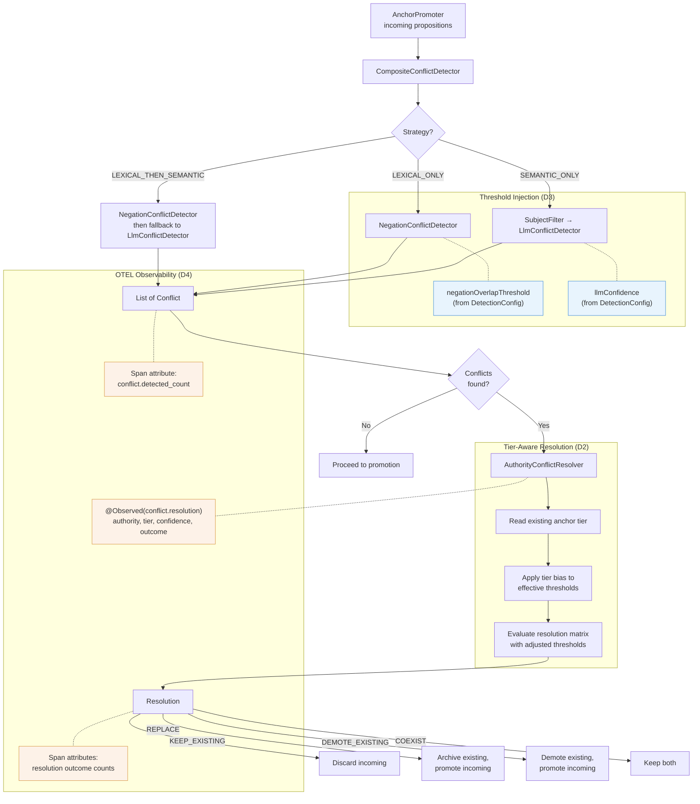

# Design: Conflict Detection Calibration (Core)

**Change**: `conflict-detection-calibration-core`
**Status**: Draft
**Date**: 2026-02-22

---

## Context

Conflict detection and resolution in dice-anchors currently relies on hardcoded thresholds scattered across three classes:

| Class | File | Threshold | Value |
|-------|------|-----------|-------|
| `NegationConflictDetector` | `src/main/java/dev/dunnam/diceanchors/anchor/NegationConflictDetector.java` (line 35) | Lexical overlap minimum for negation conflict | `0.5` |
| `LlmConflictDetector` | `src/main/java/dev/dunnam/diceanchors/anchor/LlmConflictDetector.java` (line 30) | Confidence assigned to LLM-detected contradictions | `0.9` |
| `AuthorityConflictResolver` | `src/main/java/dev/dunnam/diceanchors/anchor/AuthorityConflictResolver.java` (lines 33, 35, 42) | REPLACE threshold (`0.8`), DEMOTE threshold (`0.6`) | `0.8` / `0.6` |

The `ConflictDetector` SPI (`ConflictDetector.java`) returns `Conflict` records with a `confidence` score. The `ConflictResolver` SPI consumes these to produce `Resolution` decisions. `CompositeConflictDetector` chains the lexical and semantic detectors based on `ConflictDetectionStrategy`.

`AnchorConfiguration` wires these components via constructor injection and validates configuration at startup via `@PostConstruct`. `AnchorEngine` orchestrates the full pipeline: detection via `detectConflicts()` / `batchDetectConflicts()`, then resolution via `resolveConflict()`.

Memory tiers (`MemoryTier.HOT`, `WARM`, `COLD`) are computed from rank thresholds and influence decay multipliers but have no effect on conflict resolution. A HOT anchor with strong recent reinforcement receives identical conflict treatment to a COLD anchor approaching eviction.

OTEL observability follows an established pattern: `SimulationTurnExecutor` uses `@Observed(name = "simulation.turn")` with `Span.current().setAttribute()` for per-turn telemetry. `AnchorEngine.updateTierIfChanged()` also sets span attributes for tier transitions.

---

## Goals

1. **Externalize all conflict thresholds** to `DiceAnchorsProperties` so operators can tune detection sensitivity and resolution behavior without code changes.
2. **Add tier-aware resolution** so that an anchor's memory tier influences how aggressively it can be replaced or demoted during conflict resolution.
3. **Wire conflict observability** through OTEL span attributes and Micrometer observations so operators can measure conflict rates, resolution outcomes, and confidence distributions.

## Non-Goals

- New conflict detection algorithms (e.g., embedding-based similarity, entailment models).
- Changes to the `ConflictDetector` or `ConflictResolver` SPI interfaces.
- ML-based threshold calibration or auto-tuning.
- Changes to the `Conflict` record structure.
- Modifications to authority transition rules (A3a-A3e invariants are preserved).

---

## Decisions

### D1: Configuration Namespace

**Decision**: Add a `ConflictConfig` record nested under `DiceAnchorsProperties` at the namespace `dice-anchors.conflict.*`, with three sub-records: `DetectionConfig`, `ResolutionConfig`, and `TierModifierConfig`.

**Structure**:

```
dice-anchors.conflict:
  detection:
    negation-overlap-threshold: 0.5      # Jaccard overlap minimum for negation conflicts
    llm-confidence: 0.9                   # Confidence score assigned to LLM-detected contradictions
  resolution:
    replace-threshold: 0.8               # Confidence >= this triggers REPLACE against RELIABLE anchors
    demote-threshold: 0.6                # Confidence >= this triggers DEMOTE_EXISTING against RELIABLE anchors
  tier-modifiers:
    hot-bias: 0.1                        # Added to effective threshold for HOT anchors (defensive)
    warm-bias: 0.0                       # No adjustment for WARM anchors (baseline)
    cold-bias: -0.1                      # Subtracted from effective threshold for COLD anchors (permissive)
```

**Rationale**: The existing `ConflictDetectionConfig` record (`dice-anchors.conflict-detection.*`) holds only `strategy` and `model` fields. A new top-level `conflict` namespace avoids overloading that record and groups all calibration concerns (detection thresholds, resolution thresholds, tier modifiers) under a single hierarchical key. Sub-records keep each concern independently bindable and testable. All defaults SHALL match the current hardcoded values so that existing behavior is preserved without any configuration changes.

### D2: Tier-Aware Resolution

**Decision**: Modify `AuthorityConflictResolver` to accept a `TierModifierConfig` and apply a tier-based bias to the effective confidence thresholds before evaluating the resolution matrix.

**Mechanism**: When resolving a conflict, the resolver reads the `memoryTier` of the existing anchor and adjusts the effective resolution thresholds:

- **HOT anchor**: `effectiveReplaceThreshold = replaceThreshold + hotBias` (e.g., 0.8 + 0.1 = 0.9). The incoming proposition needs higher confidence to displace a HOT anchor.
- **WARM anchor**: `effectiveReplaceThreshold = replaceThreshold + warmBias` (e.g., 0.8 + 0.0 = 0.8). Baseline behavior, unchanged.
- **COLD anchor**: `effectiveReplaceThreshold = replaceThreshold + coldBias` (e.g., 0.8 + (-0.1) = 0.7). Lower bar for replacing a COLD anchor.

The same adjustment applies to the demote threshold. The modifier shifts thresholds, not the incoming confidence score, so that OTEL-recorded confidence values remain unmodified and comparable across tiers.

**Rationale**: Tier modifiers express a simple intuition: recently reinforced anchors (HOT) deserve more protection, while stale anchors (COLD) should yield more readily. Shifting thresholds rather than confidence preserves the meaning of the confidence value for observability and keeps the resolution matrix Javadoc accurate relative to the original behavior. CANON resolution (`KEEP_EXISTING` unconditionally) is unaffected by tier modifiers (invariant A3b).

**Invariant preservation**: Tier modifiers adjust the effective thresholds within the existing resolution matrix. They do not introduce new resolution outcomes, bypass CANON immunity, or alter authority transition rules. Invariants A3a-A3e remain intact.

### D3: Threshold Injection Pattern

**Decision**: Inject the new configuration records via constructor parameters into `NegationConflictDetector`, `LlmConflictDetector`, and `AuthorityConflictResolver`. `AnchorConfiguration` SHALL pass the bound config records when constructing these beans.

**Rationale**: This follows the project's existing pattern (Article III: constructor injection only). Each class receives exactly the config slice it needs rather than the full `DiceAnchorsProperties` tree. The `ConflictDetector` and `ConflictResolver` SPIs remain unchanged; the configuration is an implementation detail of the concrete classes.

**Impact on `AnchorConfiguration`**:
- `conflictDetector()` bean method passes `ConflictConfig.DetectionConfig` to `NegationConflictDetector` and `LlmConflictDetector`.
- `conflictResolver()` bean method passes `ConflictConfig.ResolutionConfig` and `ConflictConfig.TierModifierConfig` to `AuthorityConflictResolver`.
- `validateConfiguration()` gains validation rules for the new thresholds (overlap in [0.0, 1.0], confidence in [0.0, 1.0], replace > demote, biases in [-0.5, 0.5]).

### D4: OTEL Conflict Spans

**Decision**: Add conflict-related span attributes to the existing `simulation.turn` observation and introduce a new `conflict.resolution` observation around `AuthorityConflictResolver.resolve()`.

**Span attributes on `simulation.turn`** (set in `SimulationTurnExecutor` or `AnchorEngine`):
- `conflict.detected_count` (int): Number of conflicts detected for the turn.
- `conflict.resolution.replace_count` (int): Number of REPLACE outcomes.
- `conflict.resolution.keep_count` (int): Number of KEEP_EXISTING outcomes.
- `conflict.resolution.demote_count` (int): Number of DEMOTE_EXISTING outcomes.
- `conflict.resolution.coexist_count` (int): Number of COEXIST outcomes.

**`@Observed(name = "conflict.resolution")` observation** on `AuthorityConflictResolver.resolve()`:
- Records per-resolution latency (meaningful for future resolver implementations).
- Carries `conflict.existing.authority`, `conflict.existing.tier`, `conflict.confidence`, and `conflict.resolution` as low-cardinality key-values.

**Rationale**: The existing pattern in `SimulationTurnExecutor` uses `Span.current().setAttribute()` for per-turn telemetry. Adding conflict counts follows this pattern. The per-resolution observation uses `@Observed` consistent with `simulation.turn`, `simulation.drift_evaluation`, and `simulation.run`. Together these provide enough data for operators to compute false-positive rates (high replace_count with low drift improvement) and false-negative rates (low detected_count with high drift).

### D5: Backward Compatibility

**Decision**: All default values SHALL exactly match the current hardcoded constants. When no `dice-anchors.conflict.*` configuration is provided, the system SHALL behave identically to the current implementation.

| Property | Default | Matches |
|----------|---------|---------|
| `detection.negation-overlap-threshold` | `0.5` | `NegationConflictDetector` line 35 |
| `detection.llm-confidence` | `0.9` | `LlmConflictDetector` line 30 |
| `resolution.replace-threshold` | `0.8` | `AuthorityConflictResolver` line 33 |
| `resolution.demote-threshold` | `0.6` | `AuthorityConflictResolver` lines 35, 42 |
| `tier-modifiers.hot-bias` | `0.1` | New (no current tier awareness) |
| `tier-modifiers.warm-bias` | `0.0` | New (baseline) |
| `tier-modifiers.cold-bias` | `-0.1` | New (no current tier awareness) |

**Note on tier modifier defaults**: The tier modifier defaults (`0.1`, `0.0`, `-0.1`) introduce a new behavior that does not exist in the current codebase. To achieve strict backward compatibility, the resolver MUST check whether tier modifiers are explicitly configured and fall back to zero-bias (no tier adjustment) when the `tier-modifiers` section is absent. When the section is present, the declared defaults apply.

**Rationale**: Zero-change deployments MUST NOT alter behavior. Operators opt in to tier-aware resolution by adding the `tier-modifiers` configuration section.

---

## Risks and Trade-offs

### R1: Tier Modifier Stacking with Authority

Tier modifiers shift the effective threshold, but the resolution matrix already branches on authority level. A COLD anchor at RELIABLE authority has its replace threshold lowered (e.g., 0.7 instead of 0.8), making it easier to replace despite holding RELIABLE status. This could create surprising behavior where a recently-promoted-to-RELIABLE anchor that has decayed to COLD is replaced more easily than expected.

**Mitigation**: Document the interaction clearly. The tier modifier range is constrained to [-0.5, 0.5] to prevent extreme shifts. Operators can set `cold-bias: 0.0` to disable the effect for COLD anchors specifically.

### R2: Increased Configuration Surface Area

Adding 7 new configuration properties increases the cognitive load for operators. Misconfigured thresholds (e.g., `demote-threshold > replace-threshold`) could produce nonsensical resolution behavior.

**Mitigation**: `AnchorConfiguration.validateConfiguration()` SHALL enforce `replace-threshold > demote-threshold`, all thresholds in [0.0, 1.0], and biases in [-0.5, 0.5]. Startup fails fast with descriptive error messages on invalid configuration.

### R3: Observation Overhead

Adding `@Observed` to `AuthorityConflictResolver.resolve()` introduces per-resolution observation overhead. In batch conflict detection with many anchors, this could accumulate.

**Mitigation**: The resolver is stateless and fast (no I/O). Observation overhead is negligible relative to LLM calls in the detection phase. The observation can be conditionally disabled via standard Micrometer observation predicates if needed.

---

## Data Flow



---

## Summary of Changes by File

| File | Change Type | Description |
|------|-------------|-------------|
| `DiceAnchorsProperties.java` | Modified | Add `ConflictConfig` record with `DetectionConfig`, `ResolutionConfig`, `TierModifierConfig` sub-records |
| `NegationConflictDetector.java` | Modified | Accept `DetectionConfig` via constructor; use configured overlap threshold instead of hardcoded `0.5` |
| `LlmConflictDetector.java` | Modified | Accept `DetectionConfig` via constructor; use configured confidence instead of hardcoded `0.9` |
| `AuthorityConflictResolver.java` | Modified | Accept `ResolutionConfig` and `TierModifierConfig` via constructor; apply tier bias to thresholds; add `@Observed` |
| `AnchorConfiguration.java` | Modified | Pass config records to constructors; add validation for new properties |
| `SimulationTurnExecutor.java` | Modified | Add conflict count and resolution outcome span attributes to `simulation.turn` |
| `AnchorEngine.java` | Modified | Propagate conflict counts to span attributes after detection/resolution |
