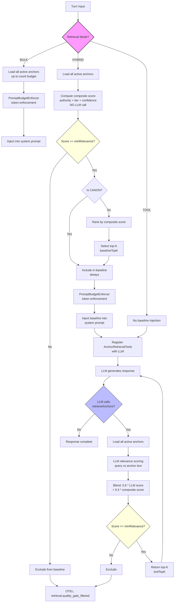

# Design: Retrieval Quality Gate ToolishRAG

**Change**: `retrieval-quality-gate-toolishrag`
**Status**: Draft
**Date**: 2026-02-22

---

## Context

The current anchor assembly pipeline in `AnchorsLlmReference` performs **bulk injection**: all active anchors (up to the count budget) are loaded from `AnchorEngine.inject()`, passed through `PromptBudgetEnforcer` for token-budget enforcement, and injected verbatim into the system prompt. There is no relevance filtering -- a RELIABLE anchor about "party inventory" is injected even when the user asks about "NPC motivations." This wastes token budget, dilutes signal-to-noise ratio, and provides the LLM with no mechanism to request specific grounding on demand.

The existing `AnchorTools` record (annotated with `@MatryoshkaTools`) already provides tool-mediated anchor access for chat via `queryFacts()` and `listAnchors()`, but these are query/management tools -- not retrieval tools designed for relevance-scored, quality-gated context injection. The simulation flow (`SimulationTurnExecutor`) has no tool-mediated retrieval at all.

The `PromptBudgetEnforcer` currently sorts by authority > tier > diceImportance > rank for drop order but has no concept of turn-contextual relevance. Budget enforcement drops low-priority anchors when tokens are tight, but it cannot distinguish "relevant to this turn" from "irrelevant to this turn."

## Goals

1. Introduce a **retrieval mode** configuration that controls how anchors reach the LLM: bulk injection, tool-mediated retrieval, or a hybrid of both.
2. Add a **quality gate** with configurable relevance threshold that filters anchors by a composite relevance score before injection.
3. Provide an `@LlmTool` retrieval tool that lets the LLM pull additional anchors on demand, scored by relevance to a query.
4. Preserve **backward compatibility** -- default configuration MUST produce identical behavior to the current system.
5. Emit **OTEL span attributes** for retrieval mode, baseline count, tool call count, and relevance scores.

## Non-Goals

- **Vector store**: No new persistence layer. Relevance scoring uses existing LLM infrastructure and heuristic composites.
- **Embedding-based retrieval**: The existing `repository.semanticSearch()` in `AnchorTools` already uses embeddings for query; this design does not replace or extend that mechanism for the baseline path.
- **Per-anchor citation tracking**: Tracking whether the LLM actually referenced a retrieved anchor in its output is deferred (mentioned in the proposal but not in scope for this design).
- **Simulation scenario-level retrieval mode**: Per-scenario retrieval mode override in YAML is deferred to a follow-up change.

## Decisions

### D1: Retrieval Mode Configuration

**Decision**: Add a `RetrievalMode` enum with three values: `BULK`, `TOOL`, `HYBRID`. The default SHALL be `HYBRID`. Configuration lives under `dice-anchors.retrieval.*` as a new `RetrievalConfig` record nested in `DiceAnchorsProperties`.

```java
public enum RetrievalMode { BULK, TOOL, HYBRID }

public record RetrievalConfig(
    @DefaultValue("HYBRID") RetrievalMode mode,
    @DefaultValue("0.0") double minRelevance,
    @DefaultValue("5") int baselineTopK,
    @DefaultValue("10") int toolTopK,
    @DefaultValue("0.4") double authorityWeight,
    @DefaultValue("0.3") double tierWeight,
    @DefaultValue("0.3") double confidenceWeight
) {}
```

**Rationale**: A three-mode enum gives operators explicit control. `BULK` preserves current behavior for regression safety. `TOOL` enables fully demand-driven retrieval for research into minimal-injection strategies. `HYBRID` (default) provides the best of both: a small, high-confidence baseline plus on-demand depth. The record pattern follows the existing `TierConfig`, `ConflictConfig`, and `AssemblyConfig` precedent in `DiceAnchorsProperties`.

### D2: Relevance Scoring

**Decision**: Use a two-tier scoring strategy. For **baseline selection** (HYBRID mode), use a cheap heuristic composite score that requires no LLM call. For **tool retrieval**, use LLM-based relevance scoring via `ChatModelHolder` / Spring AI `ChatModel`.

**Baseline composite score** (no LLM call):
```
compositeScore = (authorityWeight * authorityValue)
               + (tierWeight * tierValue)
               + (confidenceWeight * confidence)
```

Where:
- `authorityValue`: CANON=1.0, RELIABLE=0.8, UNRELIABLE=0.5, PROVISIONAL=0.3
- `tierValue`: HOT=1.0, WARM=0.7, COLD=0.4
- `confidence`: raw DICE confidence (0.0-1.0)

**Tool relevance score** (LLM call):
```
toolScore = (0.6 * llmSemanticRelevance) + (0.4 * compositeScore)
```

The LLM semantic relevance (0.0-1.0) is obtained by prompting the LLM to judge how relevant each anchor's text is to the query, batched to minimize calls.

**Rationale**: LLM-based relevance scoring is expensive (latency + cost). Baseline selection happens every turn and MUST be fast; a heuristic composite over existing fields (authority, tier, confidence) provides a reasonable proxy for "importance" without any I/O. Tool retrieval is demand-driven and less frequent, justifying the LLM call for true semantic relevance. The 60/40 blend ensures semantic relevance dominates while still giving weight to established trust signals.

### D3: Quality Gate Threshold

**Decision**: Add a configurable `minRelevance` threshold (default `0.0`). Anchors scoring below this threshold SHALL be excluded from both baseline injection and tool retrieval results. The threshold applies to the composite score for baseline and to the blended tool score for tool retrieval.

- `dice-anchors.retrieval.min-relevance=0.0` -- no filtering (backward compatible)
- `dice-anchors.retrieval.min-relevance=0.3` -- exclude low-relevance anchors

**Rationale**: Default 0.0 ensures backward compatibility with no filtering. The threshold is a single knob that operators can tune. Applying it consistently to both paths (baseline and tool) prevents low-quality anchors from sneaking in through either channel.

### D4: @LlmTool Retrieval Tool

**Decision**: Create an `AnchorRetrievalTools` record annotated with `@MatryoshkaTools`, exposing a `retrieveAnchors(String query)` method. This tool uses LLM-based relevance scoring to rank existing anchors against the query and returns the top-k results above the quality gate threshold.

```java
@MatryoshkaTools(name = "anchor-retrieval",
    description = "Tools for retrieving relevant established facts by query")
public record AnchorRetrievalTools(
    AnchorEngine engine,
    AnchorRepository repository,
    RelevanceScorer scorer,
    String contextId,
    DiceAnchorsProperties.RetrievalConfig config
) {
    @LlmTool(description = "Retrieve established facts (anchors) most relevant to "
        + "a specific topic or question. Returns anchors scored and ranked by "
        + "relevance to your query. Use this when you need grounding on a specific "
        + "topic that may not be in your baseline context.")
    public List<ScoredAnchor> retrieveAnchors(String query) { ... }
}
```

The `ScoredAnchor` record extends `AnchorSummary` with a `relevanceScore` field:
```java
public record ScoredAnchor(
    String id, String text, int rank,
    String authority, double confidence,
    double relevanceScore
) {}
```

**Rationale**: Separating retrieval tools from the existing `AnchorTools` (which handles query/management operations) follows the single-responsibility principle. The `@MatryoshkaTools` pattern matches the existing `AnchorTools` record convention. The tool description explicitly instructs the LLM on when to use it (topic-specific grounding not in baseline), which is critical for HYBRID mode where baseline context is already present.

### D5: HYBRID Mode Baseline

**Decision**: In HYBRID mode, `AnchorsLlmReference` SHALL inject a reduced baseline set:
1. All CANON anchors (always included, matching existing budget enforcement behavior).
2. Top-N non-CANON anchors by composite score (D2 heuristic), where N = `baselineTopK` (default 5).

The quality gate threshold (D3) applies: anchors scoring below `minRelevance` are excluded even from the baseline. The `AnchorRetrievalTools` tool (D4) is registered alongside the existing `AnchorTools`, giving the LLM access to the full anchor store for on-demand lookup.

In `BULK` mode, behavior is identical to current: all anchors up to budget, no relevance filtering, no retrieval tool registered. In `TOOL` mode, no baseline anchors are injected; the LLM MUST use the retrieval tool for all grounding.

**Rationale**: CANON anchors represent invariant facts that MUST always be present (existing invariant). A small top-k baseline (default 5) provides the LLM with enough context to formulate coherent initial responses without wasting budget on marginally relevant anchors. The retrieval tool covers the long tail. Making `baselineTopK` configurable allows operators to tune the balance between baseline cost and tool-call frequency.

### D6: OTEL Observability

**Decision**: Add the following span attributes to the assembly and retrieval operations:

| Attribute | Type | Location |
|-----------|------|----------|
| `retrieval.mode` | String | `AnchorsLlmReference.ensureAnchorsLoaded()` |
| `retrieval.baseline_count` | int | `AnchorsLlmReference.ensureAnchorsLoaded()` |
| `retrieval.tool_call_count` | int | `AnchorRetrievalTools.retrieveAnchors()` (incremented per call) |
| `retrieval.avg_relevance_score` | double | `AnchorRetrievalTools.retrieveAnchors()` |
| `retrieval.filtered_count` | int | Both paths (count of anchors below threshold) |

These follow the existing OTEL pattern used in `AnchorEngine.updateTierIfChanged()` and `SimulationTurnExecutor.executeTurn()` (`Span.current().setAttribute(...)`).

**Rationale**: These four attributes provide the minimum observability needed to understand retrieval behavior in production and simulation: what mode is active, how many anchors are in baseline vs. fetched on demand, and how relevant the retrieved anchors are. The filtered count helps tune the quality gate threshold.

### D7: Backward Compatibility

**Decision**: The following conditions MUST hold to preserve backward compatibility:

1. When `dice-anchors.retrieval.mode=BULK` (or when no `retrieval` config is present), the system SHALL produce **identical** behavior to the current implementation: all active anchors up to budget, no relevance filtering, no retrieval tool.
2. When `dice-anchors.retrieval.min-relevance=0.0` (default), no anchors are filtered by the quality gate.
3. The existing `AnchorTools` record and its tools (`queryFacts`, `listAnchors`, `pinFact`, `unpinFact`, `demoteAnchor`) SHALL remain unchanged and functional in all modes.
4. `PromptBudgetEnforcer` behavior SHALL be unchanged. Budget enforcement applies **after** retrieval mode selection and quality gate filtering -- it operates on whatever anchors survive the retrieval pipeline.

**Rationale**: dice-anchors is a working demo. Breaking existing behavior for users who have not opted into the new retrieval mode is unacceptable. The layered approach (retrieval mode selects candidates, quality gate filters, budget enforcer trims) preserves each component's contract.

## Risks and Trade-offs

| Risk | Severity | Mitigation |
|------|----------|------------|
| LLM relevance scoring adds latency to tool retrieval | Medium | Tool retrieval is demand-driven (not every turn). Batch scoring reduces call count. HYBRID baseline uses no LLM calls. |
| Composite heuristic score is a weak proxy for semantic relevance | Low | The heuristic is only used for baseline selection where false positives (including an irrelevant anchor) have low cost. Tool retrieval uses LLM scoring for precision. |
| TOOL mode with no baseline may produce incoherent first responses | Medium | HYBRID is the default. TOOL mode is opt-in for research/experimentation. Documentation SHALL warn about cold-start risk. |
| Quality gate with high threshold may exclude important anchors | Low | Default threshold is 0.0 (no filtering). CANON anchors bypass the quality gate in HYBRID baseline. |
| New `RetrievalConfig` adds configuration surface area | Low | All defaults produce backward-compatible behavior. Only operators who want relevance-filtered retrieval need to touch these knobs. |

## Data Flow



## Summary of Changes by File

| File | Change Type | Description |
|------|-------------|-------------|
| `DiceAnchorsProperties.java` | MODIFY | Add `RetrievalConfig` record with `mode`, `minRelevance`, `baselineTopK`, `toolTopK`, and scoring weight fields. Add `@NestedConfigurationProperty RetrievalConfig retrieval` to main record. |
| `assembly/RetrievalMode.java` | NEW | Enum: `BULK`, `TOOL`, `HYBRID`. |
| `assembly/RelevanceScorer.java` | NEW | Service computing composite scores (heuristic) and LLM-based relevance scores. Constructor-injected `ChatModel` for LLM scoring path. |
| `assembly/ScoredAnchor.java` | NEW | Record: `id`, `text`, `rank`, `authority`, `confidence`, `relevanceScore`. |
| `assembly/AnchorsLlmReference.java` | MODIFY | Accept `RetrievalConfig` in constructor. In `ensureAnchorsLoaded()`, branch on `RetrievalMode`: BULK preserves current path; HYBRID computes composite scores, selects CANON + top-k, applies quality gate; TOOL skips injection. Add OTEL span attributes. |
| `chat/AnchorRetrievalTools.java` | NEW | `@MatryoshkaTools` record with `retrieveAnchors(String query)` `@LlmTool` method. Uses `RelevanceScorer` for LLM-based scoring. Returns `List<ScoredAnchor>`. |
| `chat/ChatActions.java` | MODIFY | Conditionally construct and register `AnchorRetrievalTools` when mode is `HYBRID` or `TOOL`. Pass `RetrievalConfig` to `AnchorsLlmReference`. |
| `sim/engine/SimulationTurnExecutor.java` | MODIFY | Pass `RetrievalConfig` to `AnchorsLlmReference`. Conditionally register `AnchorRetrievalTools` for simulation turns (requires plumbing `RelevanceScorer` dependency). |
| `assembly/PromptBudgetEnforcer.java` | NO CHANGE | Budget enforcement is unchanged. It operates on whatever anchors survive the retrieval pipeline. |
| `anchor/AnchorEngine.java` | NO CHANGE | Injection logic unchanged. `inject()` still returns all active anchors up to budget. Retrieval mode filtering happens in `AnchorsLlmReference`. |
| `persistence/AnchorRepository.java` | NO CHANGE | No new queries needed. Existing `findActiveAnchors()` and `semanticSearch()` are sufficient. |
| `src/main/resources/application.yml` | MODIFY | Add default `dice-anchors.retrieval.*` properties. |
| `src/main/resources/prompts/` | MODIFY | Add relevance scoring prompt template for LLM-based scoring in `RelevanceScorer`. |
| Tests | NEW | Unit tests for `RelevanceScorer`, `AnchorRetrievalTools`, and modified `AnchorsLlmReference` HYBRID/TOOL paths. Integration test for end-to-end HYBRID retrieval flow. |
