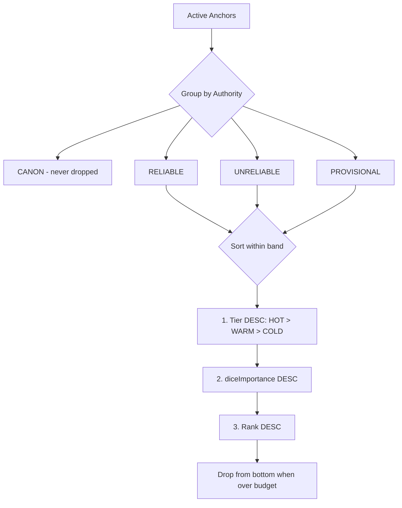
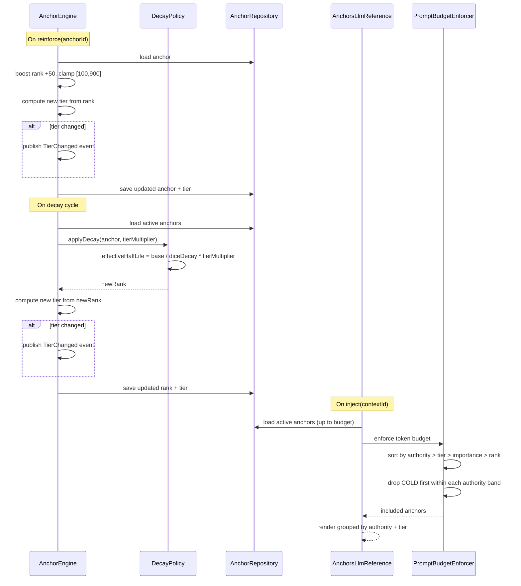

## Context

Anchors currently occupy a flat priority space where rank [100-900] is the sole ordering dimension for injection and eviction. Authority (PROVISIONAL/UNRELIABLE/RELIABLE/CANON) governs compliance strength and eviction immunity, but does not differentiate lifecycle treatment. The `ExponentialDecayPolicy` applies uniform decay to all non-pinned anchors, and `PromptBudgetEnforcer` drops by authority tier without considering recency or reinforcement freshness.

This design introduces a **memory tier** dimension orthogonal to authority and rank, partitioning anchors into HOT, WARM, and COLD tiers based on reinforcement recency. The tier drives differentiated decay rates, prompt assembly ordering, and eviction priority.

### Current Architecture (relevant paths)

- `src/main/java/dev/dunnam/diceanchors/anchor/Anchor.java` — immutable anchor record
- `src/main/java/dev/dunnam/diceanchors/anchor/AnchorEngine.java` — lifecycle orchestration
- `src/main/java/dev/dunnam/diceanchors/anchor/ExponentialDecayPolicy.java` — decay calculation
- `src/main/java/dev/dunnam/diceanchors/anchor/ThresholdReinforcementPolicy.java` — reinforcement + authority promotion
- `src/main/java/dev/dunnam/diceanchors/assembly/AnchorsLlmReference.java` — prompt injection
- `src/main/java/dev/dunnam/diceanchors/assembly/PromptBudgetEnforcer.java` — token budget enforcement
- `src/main/java/dev/dunnam/diceanchors/persistence/PropositionNode.java` — Neo4j persistence
- `src/main/java/dev/dunnam/diceanchors/persistence/AnchorRepository.java` — Drivine queries
- `src/main/java/dev/dunnam/diceanchors/anchor/event/AnchorLifecycleEvent.java` — event hierarchy

## Goals / Non-Goals

**Goals:**

1. Introduce `MemoryTier` enum (HOT, WARM, COLD) with configurable rank-based thresholds.
2. Automatic tier transitions on reinforcement (→ HOT) and decay (→ WARM → COLD).
3. Tier-modulated decay: HOT decays slower, COLD decays faster.
4. Tier-aware prompt assembly: within each authority band, HOT anchors preferred.
5. Tier-aware eviction: COLD anchors evicted before WARM before HOT at same authority.
6. `TierChanged` lifecycle event with OTEL span attributes.
7. UI tier badge in ContextInspectorPanel.

**Non-Goals:**

- Separate persistence storage per tier (all tiers remain in same Neo4j graph).
- Cross-context tier inheritance (tiers reset per context like all anchor state).
- Tier-aware conflict resolution (F02 scope).
- Time-based tier transitions independent of rank (rank is the sole tier signal).
- Configurable tier count (fixed at 3 tiers for this change).

## Decisions

### D1: Tier Boundaries Derived from Rank Thresholds

**Decision:** Tier is computed from current rank using two configurable thresholds:
- `rank >= hotThreshold` (default 600) → HOT
- `rank >= warmThreshold` (default 350) → WARM
- `rank < warmThreshold` → COLD

**Rationale:** Rank already encodes reinforcement history and decay state. Deriving tier from rank avoids a separate state machine and ensures tier always reflects the anchor's actual priority. The tier is a *view* over rank, not independent state.

**Alternatives considered:**
- *Separate tier state machine with time-based transitions*: More complex, requires additional timers, and can diverge from rank reality. Rejected for Wave 1.
- *Reinforcement-count-based tiers*: Would not reflect decay. An anchor reinforced 10 times but decayed to rank 150 should be COLD, not HOT.

### D2: Tier Stored as Persisted Field (Not Computed on Read)

**Decision:** `memoryTier` is persisted on `PropositionNode` and updated by `AnchorEngine` on every rank change (reinforce, decay, promote). The `Anchor` record exposes it as a field.

**Rationale:** While tier *could* be computed from rank on every read, persisting it enables:
- Efficient Cypher queries filtered by tier (e.g., "count COLD anchors").
- Lifecycle event emission only on actual tier transitions (compare old vs new).
- Consistent tier across concurrent reads without recomputing thresholds.

**Alternatives considered:**
- *Computed property*: Simpler but prevents efficient Neo4j queries and makes event detection harder. Rejected.

### D3: Decay Modulation via Tier Multiplier

**Decision:** `ExponentialDecayPolicy` receives a tier-based multiplier that adjusts effective half-life:

```
effectiveHalfLife = baseHalfLife / max(diceDecay, 0.01) * tierMultiplier
```

Where `tierMultiplier` is configurable per tier:
- HOT: `1.5` (50% slower decay — protected window)
- WARM: `1.0` (baseline, no change)
- COLD: `0.6` (40% faster decay — accelerated cleanup)

**Rationale:** Multiplying into the existing formula preserves backward compatibility (WARM = current behavior) and composes cleanly with `diceDecay`. HOT anchors get a "decay shield" proportional to their freshness; COLD anchors are pushed toward eviction faster.

**Alternatives considered:**
- *Absolute half-life overrides per tier*: Would bypass `diceDecay` modulation. Rejected to preserve DICE integration.
- *Decay pause for HOT*: Too aggressive — HOT anchors should still decay, just slower.

### D4: Assembly Ordering — Tier as Secondary Sort Within Authority

**Decision:** Within each authority band in `PromptBudgetEnforcer`, sort by: (1) tier DESC (HOT first), (2) diceImportance DESC, (3) rank DESC. Drop order is reversed: COLD dropped first within each authority band.



**Rationale:** Authority remains the primary sort dimension (constitutional invariant). Tier adds recency-aware ordering within authority, ensuring fresh anchors are preserved when budget is tight.

### D5: Tier Transition Events

**Decision:** Add `TierChanged` to the `AnchorLifecycleEvent` sealed hierarchy:

```java
record TierChanged(
    String anchorId,
    MemoryTier previousTier,
    MemoryTier newTier,
    String contextId,
    Instant occurredAt
) implements AnchorLifecycleEvent
```

Published by `AnchorEngine` whenever a rank update causes a tier boundary crossing. OTEL span attributes: `anchor.tier`, `anchor.tier.previous`.

### D6: MemoryTier Enum Design

**Decision:** Simple enum with ordinal-based comparison:

```java
public enum MemoryTier {
    COLD, WARM, HOT;
}
```

Ordered COLD < WARM < HOT so `compareTo()` works for sort operations.

## Data Flow



## Risks / Trade-offs

**[Risk] Tier thresholds may need tuning per scenario.**
→ Mitigation: Configurable via `dice-anchors.anchor.tier.*` properties. Defaults chosen to align with current rank distribution (mid-range 350 boundary, high-range 600 boundary).

**[Risk] Persisting tier adds a write on every rank change.**
→ Mitigation: Tier changes are infrequent relative to rank changes (only on boundary crossings). The write is bundled with the rank update — no additional Neo4j round-trip.

**[Risk] Tier-aware assembly may reduce prompt diversity.**
→ Mitigation: Tier is secondary to authority in sort order. Within the same authority band, tier ordering provides recency preference without eliminating lower-tier anchors (they're only dropped when budget demands it).

**[Trade-off] Tier derived from rank means tier and rank are tightly coupled.**
→ Accepted for Wave 1. Future work (F04 temporal validity) may introduce time-based tier signals. The `MemoryTier` abstraction is designed to be extensible.

## Migration Plan

1. Add `memoryTier` field to `PropositionNode` with default `WARM` (backward-compatible: existing anchors treated as baseline).
2. On application startup, a one-time migration query sets `memoryTier` based on current rank for all active propositions.
3. No schema migration needed — Neo4j is schema-free. New property added dynamically.
4. Rollback: remove `memoryTier` reads; field remains inert on nodes.

## Open Questions

1. Should the UI ContextInspectorPanel show tier as a colored badge, an icon, or a text label? (Deferred to implementation — not blocking.)
2. Should tier thresholds be per-context or global? (Starting with global; per-context adds complexity without clear benefit in Wave 1.)
