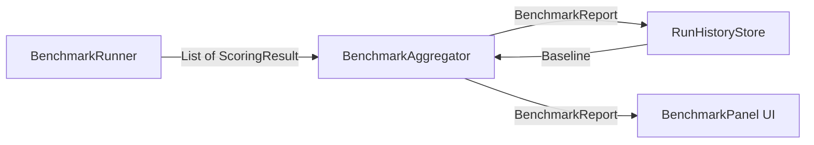
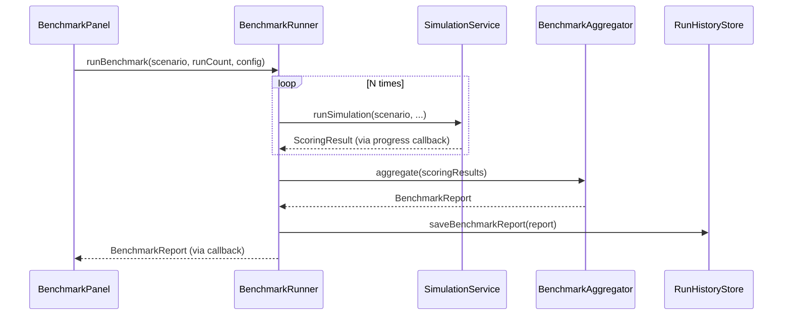

## Context

Simulation scoring (`ScoringService` → `ScoringResult`) produces seven point-estimate metrics per run: `factSurvivalRate`, `contradictionCount`, `majorContradictionCount`, `driftAbsorptionRate`, `meanTurnsToFirstDrift`, `anchorAttributionCount`, and `strategyEffectiveness`. The `RunHistoryStore` persists `SimulationRunRecord` objects (JSON nodes in Neo4j) and supports listing by scenario via `listByScenario(scenarioId)`. The `DriftSummaryPanel` renders these metrics in a CSS grid with per-strategy bar charts.

There is no multi-run aggregation, no variance analysis, no confidence intervals, and no baseline comparison. Operators cannot determine whether metric changes reflect genuine improvements or LLM non-determinism.

### Key Existing Code Paths

| Component | File | Role |
|-----------|------|------|
| `ScoringService` | `sim/engine/ScoringService.java` | Computes per-run metrics from turn snapshots |
| `ScoringResult` | `sim/engine/ScoringResult.java` | Immutable record of 7 scoring fields |
| `RunHistoryStore` | `sim/engine/RunHistoryStore.java` | SPI for run persistence (Neo4j impl) |
| `SimulationRunRecord` | `sim/engine/SimulationRunRecord.java` | Full run record with turn snapshots |
| `SimulationService` | `sim/engine/SimulationService.java` | Orchestrates single simulation runs |
| `DriftSummaryPanel` | `sim/views/DriftSummaryPanel.java` | UI metrics grid and strategy bars |
| `RunHistoryDialog` | `sim/views/RunHistoryDialog.java` | Run list with compare action |

## Goals / Non-Goals

**Goals:**

- G1: Enable operators to run a scenario N times and receive aggregated statistics (mean, stddev, median, p95) for each scoring metric.
- G2: Provide per-strategy statistical breakdowns so effectiveness is reported with variance, not just a single ratio.
- G3: Persist benchmark reports and allow saving a report as a baseline for future comparison.
- G4: Display aggregated results in the UI with confidence intervals and baseline deltas.
- G5: Emit OTEL telemetry for benchmark execution.

**Non-Goals:**

- NG1: Hypothesis testing (t-tests, p-values, effect sizes). Descriptive statistics are sufficient for this wave.
- NG2: Automated regression detection or alerting. Baseline comparison is manual/visual.
- NG3: Cross-scenario comparison. Benchmarks are scoped to a single scenario.
- NG4: Distributed or parallel benchmark execution across multiple machines.
- NG5: Export to external formats (CSV, JSON). May be added later but is not required.

## Decisions

### D1: New `sim.benchmark` package

**Decision:** Create a new `sim.benchmark` package for all benchmark-specific types, separate from the existing `sim.engine` package.

**Rationale:** Benchmark orchestration is a higher-level concern that composes `SimulationService` and `ScoringService`. Mixing it into `sim.engine` would bloat a package that already has 30+ classes. The benchmark package depends on `sim.engine` but not vice versa — clean dependency direction.

**Alternative considered:** Adding `BenchmarkRunner` to `sim.engine`. Rejected because it creates a circular concern: the engine runs simulations, the benchmark harness runs the engine.

### D2: `BenchmarkStatistics` record for descriptive stats

**Decision:** A single immutable record captures all descriptive statistics for one metric:

```java
public record BenchmarkStatistics(
    double mean,
    double stddev,
    double min,
    double max,
    double median,
    double p95,
    int sampleCount
) {}
```

**Rationale:** All seven fields are cheap to compute from a sorted `double[]` with no external dependencies. `DoubleSummaryStatistics` provides mean/min/max/count; stddev, median, and p95 require manual calculation over sorted values. The `sampleCount` field is included for downstream display (e.g., "n=10").

**Alternative considered:** Apache Commons Math `DescriptiveStatistics`. Rejected — adds a dependency for trivial computation.

### D3: `BenchmarkAggregator` as a stateless service

**Decision:** `BenchmarkAggregator` is a `@Service` that accepts `List<ScoringResult>` and returns a `BenchmarkReport`. It has no state and no dependencies beyond standard library math.

**Rationale:** Stateless design enables easy testing with canned inputs. The aggregator does not need Spring context or persistence — it's pure computation.



### D4: `BenchmarkReport` record structure

**Decision:** The report captures aggregated statistics, per-strategy breakdowns, run references, and optional baseline delta:

```java
public record BenchmarkReport(
    String reportId,
    String scenarioId,
    Instant createdAt,
    int runCount,
    long totalDurationMs,
    Map<String, BenchmarkStatistics> metricStatistics,
    Map<String, BenchmarkStatistics> strategyStatistics,
    List<String> runIds,
    @Nullable String baselineReportId,
    @Nullable Map<String, Double> baselineDeltas
) {}
```

`metricStatistics` is keyed by metric name (e.g., `"factSurvivalRate"`, `"driftAbsorptionRate"`). `strategyStatistics` is keyed by strategy name (e.g., `"SUBTLE_REFRAME"`). `baselineDeltas` shows the difference between this report's means and the baseline's means.

**Rationale:** A flat record is serializable to JSON for Neo4j storage using the same pattern as `SimulationRunRecord`. The `runIds` list provides traceability to individual runs without embedding full run records.

### D5: `BenchmarkRunner` orchestrates sequential runs

**Decision:** `BenchmarkRunner` is a `@Service` that calls `SimulationService.runSimulation()` N times sequentially, collecting `ScoringResult` from each run's final `SimulationProgress`.

**Rationale:** Sequential execution avoids concurrent Neo4j context collisions (each run uses `sim-{uuid}` isolation, but concurrent runs competing for graph object manager resources would be fragile). The benchmark is inherently I/O-bound (LLM calls), so parallelism within a single run (already implemented via `parallelPostResponse`) provides sufficient throughput.

**Alternative considered:** Parallel runs via `CompletableFuture.allOf()`. Rejected due to shared mutable state in `SimulationService` (`running`, `paused`, `cancelRequested` flags are instance-level, not per-run). Refactoring for concurrent runs is NG4.



### D6: Benchmark persistence alongside run history

**Decision:** Store `BenchmarkReport` as a Neo4j JSON node with label `BenchmarkReport`, using the same serialization pattern as `SimulationRunRecord`. Add `saveBenchmarkReport`, `loadBenchmarkReport`, `listBenchmarkReports`, and `loadBaseline` methods to `RunHistoryStore`.

**Rationale:** Reuses the proven JSON-in-Neo4j persistence pattern. Benchmark reports are small (aggregated stats, not turn-level data) so storage is negligible. Keeping them in the same store avoids a new persistence layer.

**Alternative considered:** Separate `BenchmarkStore` interface. Rejected — adds unnecessary abstraction for what is essentially the same CRUD pattern with a different node label.

### D7: `BenchmarkPanel` as a new Vaadin component

**Decision:** New `BenchmarkPanel` component in `sim.views` renders aggregated results. It is shown as a tab alongside the existing `DriftSummaryPanel` when a benchmark report is available. It does NOT replace `DriftSummaryPanel` — single-run results continue to render there.

**Rationale:** Separation of concerns: `DriftSummaryPanel` shows per-run metrics, `BenchmarkPanel` shows cross-run statistics. The tab-based approach follows the existing UI pattern (`SimulationView` already uses `TabSheet` for Conversation/Anchors/Drift/Context tabs).

The panel MUST display:
- Metric cards with mean +/- stddev, median, and p95
- Per-strategy effectiveness with confidence bounds (mean +/- 1 stddev)
- Baseline comparison badges (improved/regressed/unchanged) when a baseline is set
- Sample count ("n=10") on each metric

### D8: No modification to `ScoringResult`

**Decision:** Do NOT add a `benchmarkContext` field to `ScoringResult`. Instead, the `BenchmarkReport` references runs by ID.

**Rationale:** The proposal suggested adding `benchmarkContext` to `ScoringResult`, but this couples single-run scoring to benchmark awareness. `ScoringResult` is used in many places (tests, UI, serialization) — adding an optional field creates noise. The `BenchmarkReport.runIds` list already provides the linkage. This is a design-time simplification that does not reduce capability.

### D9: OTEL span attributes for benchmark runs

**Decision:** Add `@Observed(name = "benchmark.run")` on `BenchmarkRunner.runBenchmark()` with span attributes:
- `benchmark.scenario_id` — scenario being benchmarked
- `benchmark.run_count` — number of repetitions
- `benchmark.duration_ms` — total wall-clock time
- `benchmark.mean_survival_rate` — headline metric from the report

**Rationale:** Follows the existing observability pattern (`@Observed` on `SimulationService.runSimulation` and `SimulationTurnExecutor.executeTurn`). Minimal attributes keep span size manageable while providing enough context for dashboards.

## Risks / Trade-offs

**R1: Sequential benchmark runs are slow** — Running a scenario 10 times with 15 turns each at ~5s/turn = ~12 minutes total. → Mitigation: The UI MUST show per-run progress (e.g., "Run 3/10 complete"). Operators can cancel mid-benchmark. Future work (NG4) can explore parallel execution.

**R2: Neo4j storage growth from benchmark reports** — Each benchmark generates N run records plus one report. → Mitigation: Benchmark reports are small (aggregated stats only). Run records are already stored. Add a cleanup action to delete all runs from a benchmark while keeping the report.

**R3: LLM non-determinism may produce high variance** — Some metrics (especially `meanTurnsToFirstDrift`) may have very high stddev, making aggregated results hard to interpret. → Mitigation: Display coefficient of variation (stddev/mean) alongside raw stddev. Flag metrics with CV > 0.5 as "high variance" in the UI.

**R4: `SimulationService` is not designed for headless multi-run** — It currently requires a `Consumer<SimulationProgress>` callback for UI updates. → Mitigation: `BenchmarkRunner` provides a lightweight callback that captures only the final `ScoringResult` and run metadata, discarding per-turn UI events. No changes to `SimulationService` are needed.

## Open Questions

- **Q1:** Should benchmark reports be exportable as JSON/CSV for external analysis tools? Deferred to a follow-up per NG5, but the record structure is already JSON-serializable.
- **Q2:** What is the default run count? Recommend 5 as default (balances speed vs. statistical stability), configurable via UI slider.
