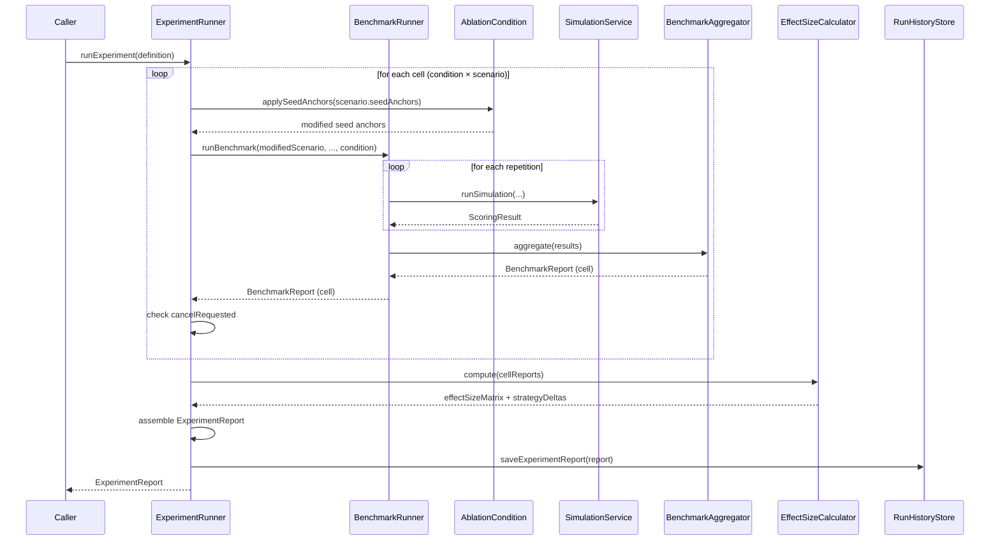

## Context

The `sim.benchmark` package provides single-condition benchmarking: `BenchmarkRunner` executes N sequential simulation runs for one scenario, `BenchmarkAggregator` computes descriptive statistics (population stddev), and `BenchmarkReport` captures the result. The only ablation mechanism is the `injectionStateSupplier` toggle passed through `SimulationService.runSimulation()`, which is bound to a UI checkbox — not a declarative, reproducible experimental condition.

To evaluate the marginal contribution of individual anchor subsystems (authority hierarchy, rank differentiation, budget enforcement), we need controlled ablation experiments that run a matrix of conditions × scenarios × repetitions and produce cross-condition statistical comparisons.

### Current Infrastructure

| Component | Location | Role |
|-----------|----------|------|
| `BenchmarkRunner` | `sim.benchmark` | Sequential N-run execution, cancel support, OTEL spans |
| `BenchmarkAggregator` | `sim.benchmark` | Stateless stats computation (population stddev), delta computation |
| `BenchmarkReport` | `sim.benchmark` | Immutable record: metric stats, strategy stats, baseline deltas |
| `BenchmarkStatistics` | `sim.benchmark` | mean/stddev/min/max/median/p95/CV, population stddev (N denominator) |
| `BenchmarkProgress` | `sim.benchmark` | Progress record: completedRuns/totalRuns/latestScoringResult |
| `SimulationService` | `sim.engine` | Per-turn simulation with `injectionStateSupplier` and `tokenBudgetSupplier` |
| `RunHistoryStore` | `sim.engine` | Interface: sim run CRUD + benchmark report CRUD + baselines |
| `Neo4jRunHistoryStore` | `sim.engine` | SimulationRunRecord in Neo4j; BenchmarkReport in-memory (ConcurrentHashMap) |
| `ScenarioLoader` | `sim.engine` | YAML scenario loading with seed anchor definitions |

### Key Observations

- `Neo4jRunHistoryStore` stores `BenchmarkReport` **in-memory** (ConcurrentHashMap), not in Neo4j despite the spec. `ExperimentReport` will follow the same in-memory pattern for consistency.
- `BenchmarkAggregator` uses **population stddev** (N denominator). Cohen's d requires **sample stddev** (N-1, Bessel's correction). `EffectSizeCalculator` will compute its own sample statistics.
- `SimulationService.seedAnchor()` creates anchors with rank/authority from the scenario YAML. Condition overrides must be applied to seed definitions *before* this method is called.
- `SimulationService.runSimulation()` accepts `Supplier<Boolean>` for injection state, evaluated per-turn. Conditions that disable injection need to override this supplier.

## Goals / Non-Goals

**Goals:**

- Declarative ablation conditions that configure anchor subsystem behavior per-run without modifying the anchor engine
- Matrix experiment execution (conditions × scenarios × repetitions) with cell-level progress and cancellation
- Cross-condition statistical comparison with Cohen's d (sample stddev), 95% CIs, and per-strategy deltas
- Experiment report persistence following the existing in-memory BenchmarkReport pattern
- OTEL observability for experiment and cell execution
- Full backward compatibility — existing BenchmarkRunner callers unaffected

**Non-Goals:**

- UI for experiments (F02 scope)
- Parallel cell or run execution (sequential only, consistent with BR3)
- Modification of `SimulationService` interface — all condition application flows through `BenchmarkRunner`
- Migration of in-memory BenchmarkReport storage to Neo4j
- Human-agreement calibration for the evaluator (R01 scope)

## Decisions

### D1: AblationCondition as record (not enum)

**Decision:** `AblationCondition` is a record with static factory constants for the four built-in conditions.

**Alternatives considered:**
- **Enum:** Cannot support custom conditions without modifying the type. Spec requires extensibility (custom condition with arbitrary overrides).
- **Sealed interface:** Unnecessary complexity for a flat data structure with no behavioral variance.

**Rationale:** A record with `FULL_ANCHORS`, `NO_ANCHORS`, `FLAT_AUTHORITY`, `NO_RANK_DIFFERENTIATION` as static final constants satisfies both the built-in requirement and extensibility requirement. Custom conditions are constructed via the record constructor.

```java
record AblationCondition(
    String name,
    boolean injectionEnabled,
    @Nullable Authority authorityOverride,
    @Nullable Integer rankOverride,
    boolean rankMutationEnabled,
    boolean authorityPromotionEnabled
) {
    static final AblationCondition FULL_ANCHORS = new AblationCondition(
        "FULL_ANCHORS", true, null, null, true, true);
    // ... etc
}
```

### D2: Condition application via seed anchor transformation

**Decision:** `AblationCondition` provides an `applySeedAnchors(List<SeedAnchor>)` method that returns a new list of `SeedAnchor` with overrides applied. `BenchmarkRunner` calls this before passing the scenario to `SimulationService`.

**Alternatives considered:**
- **Modify SimulationService to accept conditions:** Violates EX3 (ExperimentRunner SHALL NOT modify SimulationService state beyond what BenchmarkRunner already does).
- **AOP/interceptor on seedAnchor():** Fragile, hidden coupling.

**Rationale:** The cleanest approach is to transform the scenario's seed anchor list before handing it to the existing pipeline. `BenchmarkRunner` creates a modified `SimulationScenario` copy with condition-applied seed anchors and an injection state supplier that respects the condition's `injectionEnabled` flag.

```mermaid
flowchart LR
    A[ExperimentDefinition] --> B[ExperimentRunner]
    B --> |per cell| C[BenchmarkRunner]
    C --> |apply condition| D[Modified SeedAnchors]
    D --> E[SimulationService.runSimulation]
    E --> F[ScoringResult]
    F --> G[BenchmarkAggregator]
    G --> H[Cell BenchmarkReport]
    H --> I[EffectSizeCalculator]
    I --> J[ExperimentReport]
```



### D3: ExperimentRunner composes BenchmarkRunner (not extends)

**Decision:** `ExperimentRunner` is a new `@Service` that delegates to `BenchmarkRunner` for each cell. It does not extend or modify `BenchmarkRunner`.

**Alternatives considered:**
- **Extend BenchmarkRunner:** Tight coupling; BenchmarkRunner's cancel semantics would conflict with experiment-level cancellation.
- **Replace BenchmarkRunner:** Breaks existing BenchmarkPanel and all backward compatibility.

**Rationale:** Composition. `ExperimentRunner` iterates the matrix (conditions × scenarios), calls `BenchmarkRunner.runBenchmark()` per cell with the appropriate condition, collects `BenchmarkReport` results, then delegates to `EffectSizeCalculator` for cross-condition statistics.

### D4: EffectSizeCalculator as stateless service

**Decision:** `EffectSizeCalculator` is a `@Service` with a single method that takes the cell reports map and returns the effect size matrix and strategy deltas.

**Rationale:** Mirrors the `BenchmarkAggregator` pattern — stateless, side-effect-free, easily unit-testable. Computes its own sample stddev (N-1) from the raw metric values stored in `BenchmarkStatistics`, since `BenchmarkStatistics.stddev()` uses population stddev (N).

**Sample stddev approach:** `EffectSizeCalculator` will recompute sample variance from the available statistics. Given that `BenchmarkStatistics` stores `mean`, `stddev` (population), and `sampleCount`, the sample stddev can be derived: `sampleStddev = populationStddev * sqrt(n / (n-1))`. This avoids requiring access to raw per-run values.

### D5: ExperimentReport follows in-memory storage pattern

**Decision:** `ExperimentReport` is stored in `Neo4jRunHistoryStore` using the same `ConcurrentHashMap` pattern as `BenchmarkReport`.

**Alternatives considered:**
- **Full Neo4j persistence:** Would be ideal but `BenchmarkReport` itself isn't persisted to Neo4j yet (despite the spec, the implementation uses in-memory maps). Adding Neo4j persistence for only ExperimentReport while BenchmarkReport remains in-memory would be inconsistent.

**Rationale:** Consistency with current implementation. Both report types can be migrated to Neo4j together in a future change.

### D6: Experiment-level cancellation with cell completion guarantee

**Decision:** `ExperimentRunner` checks an `AtomicBoolean cancelRequested` between cells. When cancelled, it completes the current cell (delegates to `BenchmarkRunner` which runs to completion), then stops before starting the next cell. The partial `ExperimentReport` includes all completed cells.

**Rationale:** Cell-level granularity matches the spec (EX4). Cancelling mid-run within a cell would produce incomplete statistics for that cell. Completing the current cell ensures every cell in the report has valid aggregated statistics.

### D7: Progress reporting maps cell+run to a flat callback

**Decision:** `ExperimentRunner` accepts a `Consumer<ExperimentProgress>` callback. `ExperimentProgress` is a new record wrapping cell-level and run-level progress:

```java
record ExperimentProgress(
    int currentCell, int totalCells,
    String conditionName, String scenarioId,
    int currentRun, int totalRuns
) {
    String message() {
        return "Cell %d/%d: %s x %s, Run %d/%d".formatted(
            currentCell, totalCells, conditionName, scenarioId, currentRun, totalRuns);
    }
}
```

**Rationale:** The spec defines the exact format. `ExperimentRunner` wraps `BenchmarkRunner`'s `BenchmarkProgress` callback to translate run-level progress into experiment-level progress.

### D8: Effect size matrix key format

**Decision:** Condition-pair keys in the matrix use the format `"conditionA:conditionB"` where conditions are ordered alphabetically. This ensures each pair appears exactly once and lookup is deterministic.

**Rationale:** For N conditions, N*(N-1)/2 unique pairs. Alphabetical ordering gives a canonical key. The value is a `Map<String, EffectSizeEntry>` where the key is the metric name and `EffectSizeEntry` is a record containing `cohensD`, `interpretation`, and `lowConfidence` flag.

### D9: Condition application to rankMutation and authorityPromotion

**Decision:** When a condition disables `rankMutationEnabled` or `authorityPromotionEnabled`, the `BenchmarkRunner` passes these flags alongside the modified seed anchors. `SimulationService` already controls these behaviors via configuration — the condition maps to the appropriate supplier/flag overrides.

Specifically:
- `injectionEnabled = false` → override the `injectionStateSupplier` to always return `false`
- `rankMutationEnabled = false` → override the decay/reinforcement policies to no-op (via a flag on the scenario or a wrapper)
- `authorityPromotionEnabled = false` → disable automatic authority promotion during the run

**Implementation approach:** The simplest path is to add optional `Supplier<Boolean>` parameters for rank mutation and authority promotion to `BenchmarkRunner.runBenchmark()`, which are passed through to `SimulationService`. Since the spec says `BenchmarkRunner` can accept conditions (BR modified spec), this is within scope. The alternative — modifying `SimulationScenario` to carry these flags — would also work but is less explicit.

## Data Flow



## New Types

| Type | Kind | Package | Purpose |
|------|------|---------|---------|
| `AblationCondition` | record | `sim.benchmark` | Declarative condition configuration |
| `ExperimentDefinition` | record | `sim.benchmark` | Experiment matrix specification |
| `ExperimentRunner` | `@Service` | `sim.benchmark` | Matrix execution engine |
| `ExperimentReport` | record | `sim.benchmark` | Full experiment results with effect sizes |
| `ExperimentProgress` | record | `sim.benchmark` | Cell+run progress for callbacks |
| `EffectSizeCalculator` | `@Service` | `sim.benchmark` | Cohen's d, CIs, strategy deltas |
| `EffectSizeEntry` | record | `sim.benchmark` | Single metric effect size + interpretation |
| `ConfidenceInterval` | record | `sim.benchmark` | Lower/upper bound pair |

## Risks / Trade-offs

**[Population vs sample stddev mismatch]** → `BenchmarkStatistics.stddev()` uses population stddev (N). `EffectSizeCalculator` derives sample stddev via `σ_sample = σ_pop × √(n/(n-1))`. This is mathematically exact given the stored values but semantically awkward. Mitigation: document the conversion clearly in `EffectSizeCalculator` javadoc.

**[In-memory persistence loss on restart]** → `ExperimentReport` stored in `ConcurrentHashMap` is lost on app restart. Mitigation: acceptable for demo/research app. Full Neo4j persistence is a future improvement that should cover both `BenchmarkReport` and `ExperimentReport` together.

**[Condition flag passthrough complexity]** → `rankMutationEnabled` and `authorityPromotionEnabled` need to reach into simulation behavior. `SimulationService` doesn't currently expose knobs for these. Mitigation: add minimal configuration parameters to `BenchmarkRunner.runBenchmark()` overload that are threaded through to control decay/reinforcement/promotion behavior per-run. Keep changes to `SimulationService` minimal.

**[Long experiment execution time]** → 4 conditions × 5 scenarios × 5 reps = 100 runs. At ~30s/run, that's ~50 minutes. Mitigation: sequential execution is required (EX2), but cell-level cancellation allows early termination. UI progress (F02 scope) will make long runs tolerable.

**[Cohen's d with small N]** → With 5 repetitions per cell, effect size estimates have wide confidence intervals. Mitigation: the CI computation explicitly accounts for sample size; low-confidence flags warn when CV > 0.5.

## Open Questions

- **How to disable rank mutation/authority promotion per-run?** The cleanest approach needs investigation during implementation. Options: (a) add boolean flags to `SimulationService.runSimulation()`, (b) wrap decay/reinforcement policies in condition-aware decorators, (c) use scenario-level configuration overrides. Decision deferred to implementation — start with the simplest option that doesn't break existing tests.
