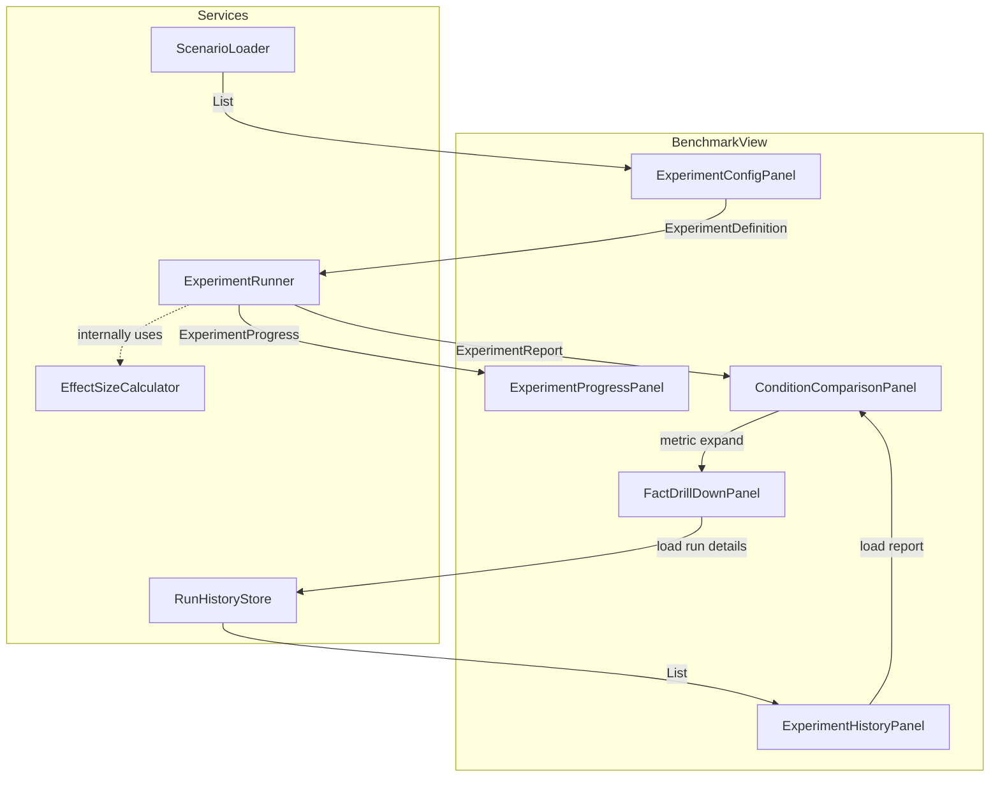
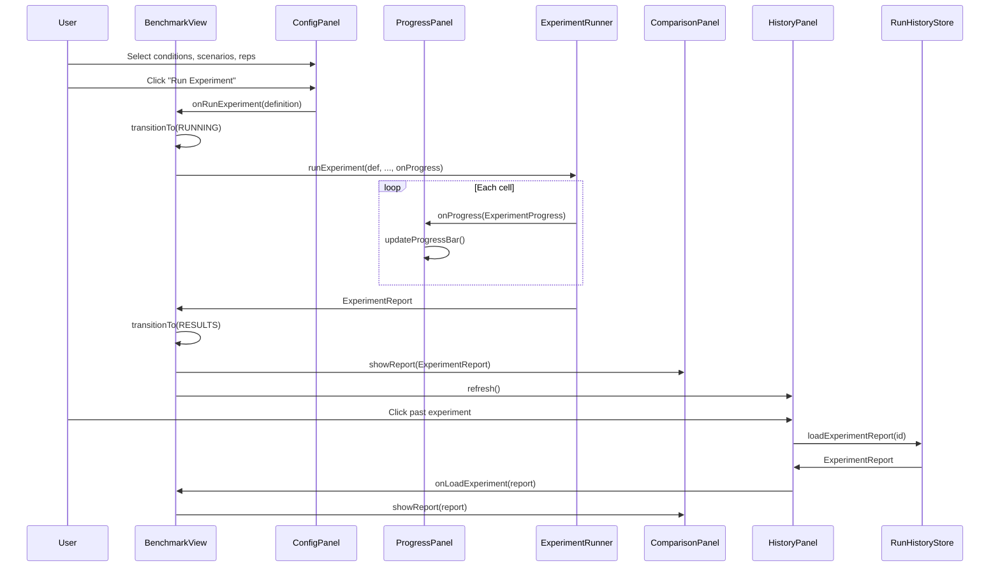

## Context

The experiment framework (F01) delivers `ExperimentRunner`, `ExperimentReport`, `AblationCondition`, `EffectSizeCalculator`, and related types in `sim.benchmark`. The current benchmarking surface is `BenchmarkPanel` — a tab within `SimulationView` scoped to single-scenario, single-condition runs. It renders metric cards, strategy bars, delta badges, and baseline comparison using the `ar-bench-*` CSS class family.

This design adds a dedicated `/benchmark` Vaadin route (`BenchmarkView`) that consumes the experiment framework's data model to provide experiment configuration, execution monitoring, cross-condition comparison, fact-level drill-down, and experiment history.

### Current State

- **SimulationView** (`@Route("")`): Header + controls → SplitLayout(55/45) → TabSheet with 5 tabs (Inspector, Timeline, Manipulation, Knowledge Browser, Benchmark). State machine via `SimControlState` enum drives panel visibility. Async updates via `ui.access()` with `CompletableFuture`.
- **BenchmarkPanel**: Embedded in SimulationView's TabSheet. Renders `BenchmarkReport` metric cards via `benchmarkMetricCard()`. Delta badges compare against baseline. Strategy bars with confidence bounds.
- **ChatView** (`@Route("chat")`): Independent route with 70/30 SplitLayout.
- **CSS**: Dark retro theme (`anchor-retro`). `ar-*` prefix convention. Health coloring via `[data-health]` data attributes. CSS Grid for metric cards (`ar-metrics-grid`).

### Key Data Available

- `ExperimentReport`: `cellReports` (Map<cellKey, BenchmarkReport>), `effectSizeMatrix` (Map<pairKey, Map<metric, EffectSizeEntry>>), `confidenceIntervals`, `strategyDeltas`, `conditions`, `scenarioIds`, `cancelled`.
- `BenchmarkReport`: `metricStatistics` (Map<metric, BenchmarkStatistics>), `strategyStatistics`, `runCount`, `runIds`.
- `BenchmarkStatistics`: `mean`, `stddev`, `median`, `p95`, `min`, `max`, `sampleCount`, `isHighVariance()`.
- `ScenarioLoader`: `listScenarios()`, `listByCategory(category)`, `load(id)`.
- `SimulationScenario`: `id`, `category`, `title`, `objective`, `testFocus`, `highlights`.

## Goals / Non-Goals

**Goals:**

1. Dedicated `/benchmark` route for configuring, running, and analyzing ablation experiments.
2. Reuse existing BenchmarkPanel patterns (metric cards, delta badges, strategy bars) — don't reinvent.
3. Cross-condition comparison: side-by-side cards, effect sizes, heatmap, per-strategy breakdown.
4. Fact-level drill-down: per-fact survival across conditions.
5. Experiment history: list, load, delete past experiments.
6. Consistent with existing `anchor-retro` theme and Vaadin patterns.

**Non-Goals:**

1. Modifying the existing BenchmarkPanel in SimulationView.
2. External charting libraries (Vaadin components + CSS only).
3. Data export (CSV, PDF) — candidate extension.
4. Custom condition authoring from the UI.
5. Cross-experiment comparison (comparing two different experiments side by side).
6. Turn-level progress within a run (UI updates at run/cell granularity).

## Decisions

### D1: BenchmarkView as Independent Route (not embedded in SimulationView)

**Decision**: Create `BenchmarkView` as a standalone `@Route("benchmark")` with its own layout, independent of SimulationView.

**Alternatives considered**:
- *Extend SimulationView with more tabs*: Would bloat the already-complex 5-tab layout. Experiment config/progress/comparison don't relate to turn-by-turn conversation.
- *Shared layout shell*: Vaadin `RouterLayout` wrapping both views. Adds complexity without clear benefit — the views share only navigation links, not content.

**Rationale**: SimulationView is a turn-level debugging tool. BenchmarkView is an experiment-level analysis tool. Different concerns, different state machines, different information density. Cross-view navigation via header links is sufficient coupling.

### D2: Panel Lifecycle State Machine

**Decision**: Use an enum-based state machine (mirroring SimulationView's `SimControlState`) to drive panel visibility in BenchmarkView.

```
BenchmarkViewState:
  CONFIG    → RUNNING   (user starts experiment)
  RUNNING   → RESULTS   (experiment completes or is cancelled)
  RUNNING   → CONFIG    (error recovery)
  RESULTS   → CONFIG    (user starts new experiment)
  RESULTS   → RESULTS   (user loads from history)
  CONFIG    → RESULTS   (user loads from history)
```

**State → Panel Mapping:**

| State | Visible Panels |
|-------|---------------|
| CONFIG | ExperimentConfigPanel, ExperimentHistoryPanel |
| RUNNING | ExperimentProgressPanel (config/history hidden) |
| RESULTS | ConditionComparisonPanel, FactDrillDownPanel, ExperimentHistoryPanel |

**Rationale**: Proven pattern in this codebase. `transitionTo(state)` controls all panel visibility from one method.

### D3: Layout Structure

**Decision**: Vertical stack layout (not SplitLayout).

```
┌────────────────────────────────────────────────────┐
│ Header: "Anchor Benchmarks" │ [Simulator] [Chat]   │
├────────────────────────────────────────────────────┤
│                                                    │
│  [CONFIG state]                                    │
│  ┌──────────────────────┐ ┌──────────────────────┐ │
│  │ Experiment Config    │ │ Experiment History   │ │
│  │ (conditions, scens,  │ │ (past experiments)   │ │
│  │  reps, run button)   │ │                      │ │
│  └──────────────────────┘ └──────────────────────┘ │
│                                                    │
│  [RUNNING state]                                   │
│  ┌─────────────────────────────────────────────┐   │
│  │ Progress: Cell 3/12, Run 2/5, ETA 4m       │   │
│  │ [██████████░░░░░░░░░░] 45%  [Cancel]       │   │
│  │ Completed: FULL:adv-contra → 82% survival   │   │
│  └─────────────────────────────────────────────┘   │
│                                                    │
│  [RESULTS state]                                   │
│  ┌─────────────────────────────────────────────┐   │
│  │ Comparison: metric cards per condition       │   │
│  │ [heatmap] [strategy table] [effect sizes]   │   │
│  │ ▸ Drill down: per-fact verdicts              │   │
│  └─────────────────────────────────────────────┘   │
│  ┌──────────────────────────────────────────────┐  │
│  │ Experiment History (also visible in RESULTS) │  │
│  └──────────────────────────────────────────────┘  │
│                                                    │
└────────────────────────────────────────────────────┘
```

**Alternatives considered**:
- *SplitLayout (config left / results right)*: Works for SimulationView's conversation+inspector split, but experiments don't have a persistent left panel.
- *TabSheet for config/results/history*: Hides related information. History should be visible alongside results for quick switching.

**Rationale**: Experiment workflow is sequential (configure → run → analyze). Vertical stack with state-driven visibility maps naturally to this flow. History panel visible in both CONFIG and RESULTS states for easy navigation.

### D4: Reuse BenchmarkPanel Rendering Patterns

**Decision**: Extract metric card rendering, delta badge rendering, and strategy bar rendering into static utility methods or a shared helper class. Both BenchmarkPanel and the new ConditionComparisonPanel use the same methods.

**Approach**: Create `BenchmarkRenderUtils` in `sim.views` with static methods:
- `metricCard(String label, BenchmarkStatistics stats, String health)` → `Div`
- `deltaBadge(double delta, boolean higherIsBetter)` → `Span`
- `strategyBar(String name, BenchmarkStatistics stats)` → `HorizontalLayout`
- `determineHealth(String metricName, BenchmarkStatistics stats)` → `String`

Refactor BenchmarkPanel to delegate to these utils. ConditionComparisonPanel uses the same utils plus new comparison-specific rendering.

**Rationale**: Avoids code duplication. Existing metric card styling (`ar-bench-metric-card`, `ar-metrics-grid`) is reused directly.

### D5: Condition Comparison Layout

**Decision**: Group metrics by condition, not by metric. Each condition gets a column of metric cards. Delta badges appear between adjacent condition columns.

```
┌──────────────────────────────────────────────────────────┐
│ Scenario: adversarial-contradictory                       │
├──────────────┬──────────────┬──────────────┬────────────┤
│ FULL_ANCHORS │ Δ            │ NO_ANCHORS   │ Δ          │
│ ┌──────────┐ │ +32.4%       │ ┌──────────┐ │            │
│ │survival  │ │ d=1.8 LARGE  │ │survival  │ │ ...        │
│ │82% ±4.2  │ │              │ │50% ±8.1  │ │            │
│ └──────────┘ │              │ └──────────┘ │            │
│ ┌──────────┐ │ -2.3         │ ┌──────────┐ │            │
│ │contradict│ │ d=0.9 LARGE  │ │contradict│ │ ...        │
│ │0.4 ±0.5  │ │              │ │2.7 ±1.2  │ │            │
│ └──────────┘ │              │ └──────────┘ │            │
└──────────────┴──────────────┴──────────────┴────────────┘
```

For >2 conditions: show the heatmap matrix (conditions × metrics) below the card comparison. Cards show the first two conditions (typically FULL_ANCHORS vs NO_ANCHORS as the primary comparison); heatmap shows all.

### D6: Heatmap via CSS Grid + Data Attributes

**Decision**: Implement the condition-metric heatmap as a CSS Grid of `Div` cells with `data-health` attributes, not a Vaadin Grid component.

**Rationale**: Vaadin Grid is designed for tabular data with scrolling and selection. The heatmap is a fixed-size matrix (4 conditions × 6 metrics = 24 cells) that benefits from direct CSS control over cell color, borders, and hover. CSS Grid with `ar-heatmap-cell[data-health]` follows the existing `[data-health]` pattern.

### D7: Fact Drill-Down via Vaadin Details Component

**Decision**: Use Vaadin `Details` component (expandable/collapsible) for each metric in the comparison view. Expanding reveals per-fact verdicts across conditions in a table.

**Data source**: Per-fact data requires iterating individual run `ScoringResult` data within each cell's `BenchmarkReport.runIds`. The `ScoringResult` contains per-fact verdicts (`factVerdicts: Map<String, EvalVerdict>`). Aggregate across runs to compute survival counts per fact per condition.

**Challenge**: `BenchmarkReport` stores aggregated statistics, not per-run details. Per-fact drill-down requires loading individual `SimulationRunRecord` via `RunHistoryStore.load(runId)` for each run in the cell. This is an O(n) load per cell expansion.

**Mitigation**: Lazy-load on expansion. Cache loaded per-fact data in the panel. Display a brief loading indicator.

### D8: Async Experiment Execution

**Decision**: Follow SimulationView's async pattern — `CompletableFuture.runAsync()` with `ui.access()` callbacks.

```java
CompletableFuture.runAsync(() ->
    experimentRunner.runExperiment(definition, injectionSupplier, tokenBudgetSupplier,
        progress -> ui.access(() -> progressPanel.updateProgress(progress)))
).thenAccept(report ->
    ui.access(() -> showResults(report))
).exceptionally(ex ->
    ui.access(() -> showError(ex))
);
```

**Rationale**: Proven pattern. Vaadin push is already configured in the application.

### D9: Navigation Links in Headers

**Decision**: Add navigation links as `RouterLink` components in the header area of each view.

- **SimulationView header**: Add `[Benchmark]` link
- **ChatView header**: Add `[Benchmark]` link
- **BenchmarkView header**: Add `[Simulator]` and `[Chat]` links

**Rationale**: Minimal footprint. `RouterLink` is Vaadin's idiomatic client-side navigation. No full-page reload.

## Data Flow





## New Types

| Type | Package | Purpose |
|------|---------|---------|
| `BenchmarkView` | `sim.views` | `@Route("benchmark")` root view with state machine |
| `BenchmarkViewState` | `sim.views` | Enum: CONFIG, RUNNING, RESULTS |
| `ExperimentConfigPanel` | `sim.views` | Condition checkboxes, scenario multi-select, reps slider |
| `ExperimentProgressPanel` | `sim.views` | Cell/run progress, ETA, cancel button, completed-cell log |
| `ConditionComparisonPanel` | `sim.views` | Side-by-side metric cards, deltas, heatmap, strategy table |
| `FactDrillDownPanel` | `sim.views` | Per-fact survival across conditions (lazy-loaded) |
| `ExperimentHistoryPanel` | `sim.views` | List/load/delete past experiments |
| `BenchmarkRenderUtils` | `sim.views` | Shared metric card, delta badge, strategy bar rendering |

## Risks / Trade-offs

| Risk | Impact | Mitigation |
|------|--------|------------|
| **Per-fact drill-down requires loading individual runs** | O(runs × cells) load on expansion. For 4 conditions × 5 reps = 20 run loads. | Lazy-load on expand. Cache in panel. Show loading indicator. |
| **ScoringResult per-fact data availability** | `BenchmarkReport` stores aggregated stats, not per-fact verdicts. Per-fact data lives in `SimulationRunRecord.turnSnapshots`. | Load runs via `RunHistoryStore.load(runId)`, iterate snapshots for verdict details. Accept that this is a heavier operation. |
| **Large heatmap with many conditions** | Currently 4 conditions × 6 metrics = 24 cells (manageable). Custom conditions would increase. | Not in scope (D5 handles 4 standard conditions). Flag if custom conditions are added later. |
| **Vaadin push contention** | SimulationView and BenchmarkView both use push. Running a sim and an experiment simultaneously could cause issues. | ExperimentRunner uses BenchmarkRunner which uses SimulationService — they share the same sequential execution constraint. Only one operation can run at a time. |
| **BenchmarkRenderUtils refactor** | Extracting shared methods from BenchmarkPanel changes existing code. | Extract as pure static methods. BenchmarkPanel delegates to utils. No behavioral change. |

## Open Questions

1. **Scenario category display**: ScenarioLoader provides `category` field but the existing YAML scenarios use varied category strings. Should the config panel group by category, or show a flat list with category tags?
2. **Experiment naming**: Should the user provide a name, or auto-generate one (e.g., "Experiment 2026-02-23 #1")?
3. **Per-fact data granularity**: The current `ScoringResult` stores `factVerdicts` as a map of fact text → verdict. Should the drill-down show per-run verdicts, or aggregate to "survived in X/N runs"?
