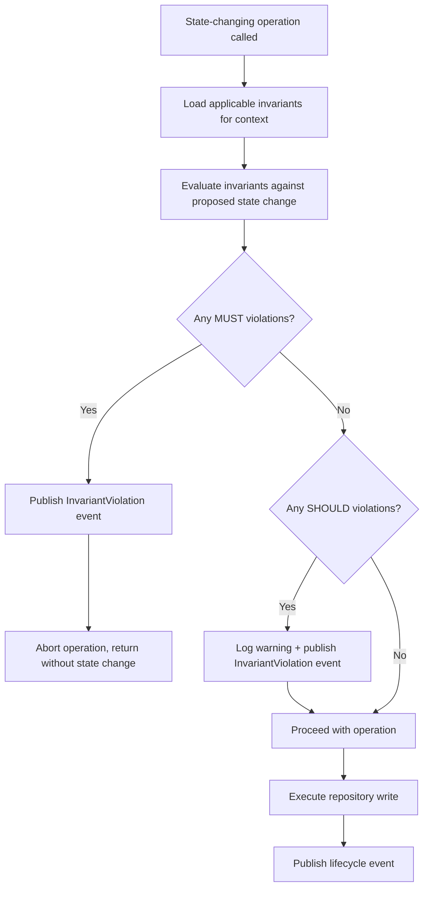
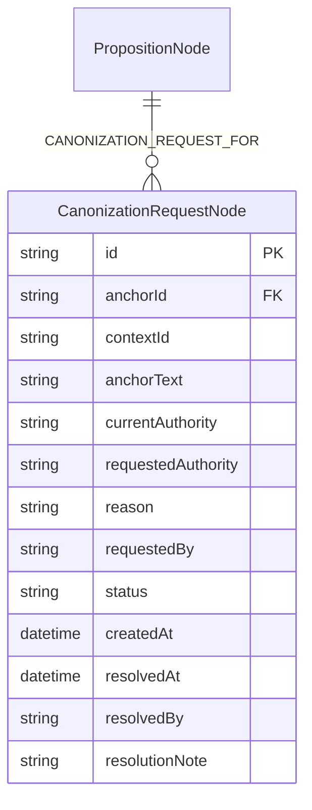
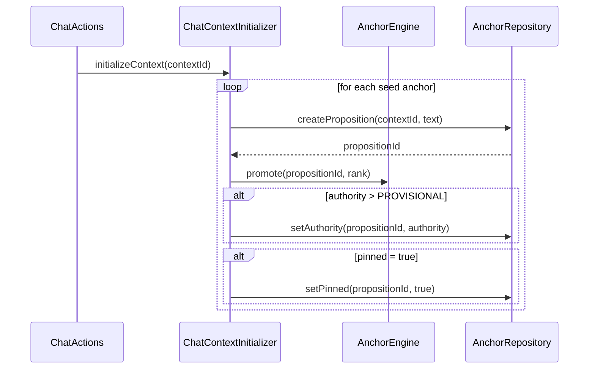

# Design: Operator Invariants API and Governance (F07)

**Change**: `operator-invariants-api-and-governance`
**Status**: Design
**Date**: 2026-02-22

Keywords follow [RFC 2119](https://www.ietf.org/rfc/rfc2119.txt).

---

## Context

The anchor engine enforces five technical invariants (A1–A5) via code-level guards in `AnchorEngine`:

- **A1**: Active anchor count never exceeds `budget` (default 20).
- **A2**: Rank is always clamped to [100, 900] via `Anchor.clampRank()`.
- **A3a–A3e**: CANON immunity, pin protection, bidirectional authority lifecycle, event publication.
- **A4**: Pinned anchors are immune to rank-based eviction and automatic demotion.
- **A5**: Trust score may be null for pre-trust anchors.

These invariants are hardcoded and apply uniformly. Operators have no mechanism to express *business-level* constraints — rules like "anchor X must remain CANON", "no anchor in context Y may be evicted", or "at least 3 RELIABLE anchors must exist in context Z". The governance gap manifests in three concrete areas:

1. **CompliancePolicy is compile-time and read-only** (`CompliancePolicy.java`). It maps `Authority` to `ComplianceStrength` but cannot be overridden per-anchor, per-context, or at runtime. Operators cannot say "this specific anchor is MUST-strength regardless of its authority level."

2. **CanonizationGate stores requests in-memory** (`CanonizationGate.java`, line 54: `ConcurrentHashMap<String, CanonizationRequest>`). Requests are lost on restart, and there is no audit trail for approved/rejected/stale transitions. The gate correctly enforces A3a/A3b but lacks persistence and governance traceability.

3. **Seed anchors are simulation-only**. Scenario YAML files define `seedAnchors` (e.g., `cursed-blade.yml`, lines 18–31), but the chat flow (`ChatActions`) has no equivalent seeding mechanism. Operators cannot establish ground-truth anchors for chat contexts without manual tool calls.

Adding an operator invariants framework provides the governance layer needed before benchmarking (F06) can measure policy compliance, and before upstream DICE integration (F08) can propose a governance contract.

### Affected classes

| Class | Package | Role |
|---|---|---|
| `AnchorEngine` | `anchor/` | Lifecycle facade — enforcement hooks go here |
| `CanonizationGate` | `anchor/` | HITL approval gate — gains Neo4j persistence |
| `CanonizationRequest` | `anchor/` | In-flight request record — gains persistence mapping |
| `AnchorLifecycleEvent` | `anchor/event/` | Sealed event hierarchy — gains `InvariantViolation` |
| `ContextInspectorPanel` | `sim/views/` | Inspector UI — gains "Invariants" tab |
| `DiceAnchorsProperties` | (root) | Config properties — gains invariant + chat seed sections |
| `AnchorRepository` | `persistence/` | Neo4j persistence — gains canonization request queries |
| `ScenarioLoader` | `sim/engine/` | YAML parsing — gains invariant definitions |

---

## Goals / Non-Goals

### Goals

1. Define a declarative invariant rule model that operators can express via YAML.
2. Enforce invariant rules on every state-changing operation in `AnchorEngine` — archive, eviction, demotion, authority change.
3. Distinguish MUST rules (block action) from SHOULD rules (warn and allow) per RFC 2119.
4. Publish `InvariantViolation` lifecycle events with rule ID, constraint, and blocked action.
5. Persist `CanonizationRequest` records to Neo4j with full audit trail.
6. Allow operators to seed CANON anchors in chat contexts via `application.yml`.
7. Display active invariants and violations in a new "Invariants" tab in `ContextInspectorPanel`.
8. Emit OTEL span attributes for invariant enforcement metrics.

### Non-Goals

1. Turing-complete rule engine or DSL — invariants are simple declarative constraints, not a scripting language.
2. Cross-context invariants — invariants are scoped to a single context ID or globally; no cross-context joins.
3. Runtime CRUD API for invariants — invariants are defined in YAML and loaded at startup or scenario load time. Runtime mutation is deferred to a future change.
4. Invariant-based auto-remediation — the system blocks or warns on violations but does not automatically fix state to satisfy invariants.
5. Migration tool for existing CanonizationGate in-memory state — the in-memory map is replaced; no migration of in-flight requests.
6. UI for creating/editing invariants — the inspector tab is read-only.

---

## Decisions

### D1: Invariant Rule Model

**Decision**: Represent invariants as a sealed interface `InvariantRule` with concrete record implementations for each constraint type. Each rule has a unique `id`, an RFC 2119 `strength` (MUST or SHOULD), an optional `contextId` scope (null = global), and type-specific constraint fields.

**Rationale**: Records are immutable, carry data, and match the project's data-over-strings convention. A sealed interface gives exhaustive `switch` coverage at enforcement sites. An enum-based approach was rejected because constraint types have heterogeneous fields (e.g., `AUTHORITY_FLOOR` needs an `Authority` value, `MIN_COUNT` needs an integer and optional authority filter).

**Rule types**:

| Rule type | Constraint | Example |
|---|---|---|
| `AuthorityFloor` | Named anchor's authority MUST/SHOULD not drop below a floor | "anchor X must remain CANON" |
| `EvictionImmunity` | Named anchor MUST/SHOULD not be evicted | "anchor Y cannot be budget-evicted" |
| `MinAuthorityCount` | Context must have at least N anchors at or above a given authority | "at least 3 RELIABLE anchors" |
| `ArchiveProhibition` | Named anchor MUST/SHOULD not be archived | "anchor Z must remain active" |

```java
package dev.dunnam.diceanchors.anchor;

/**
 * Operator-defined invariant constraining anchor state.
 * Evaluated on every lifecycle state change by {@link InvariantEvaluator}.
 *
 * <p>Invariants with {@link InvariantStrength#MUST} block the attempted action.
 * Invariants with {@link InvariantStrength#SHOULD} log a warning and allow the action.
 */
public sealed interface InvariantRule
        permits InvariantRule.AuthorityFloor,
                InvariantRule.EvictionImmunity,
                InvariantRule.MinAuthorityCount,
                InvariantRule.ArchiveProhibition {

    String id();
    InvariantStrength strength();
    /** Context scope. Null means global (applies to all contexts). */
    @Nullable String contextId();

    record AuthorityFloor(
            String id, InvariantStrength strength, @Nullable String contextId,
            String anchorTextPattern, Authority minimumAuthority
    ) implements InvariantRule {}

    record EvictionImmunity(
            String id, InvariantStrength strength, @Nullable String contextId,
            String anchorTextPattern
    ) implements InvariantRule {}

    record MinAuthorityCount(
            String id, InvariantStrength strength, @Nullable String contextId,
            Authority minimumAuthority, int minimumCount
    ) implements InvariantRule {}

    record ArchiveProhibition(
            String id, InvariantStrength strength, @Nullable String contextId,
            String anchorTextPattern
    ) implements InvariantRule {}
}
```

**`InvariantStrength` enum**:

```java
public enum InvariantStrength {
    /** Absolute requirement. Violation blocks the attempted action. */
    MUST,
    /** Strong recommendation. Violation logs a warning but allows the action. */
    SHOULD
}
```

**Anchor matching**: `anchorTextPattern` is matched via `String.contains()` (case-insensitive) against `Anchor.text()`. This avoids regex complexity while supporting substring matching. Exact-match semantics can be achieved by using the full anchor text as the pattern.

**Files created**: `InvariantRule.java`, `InvariantStrength.java`

---

### D2: Enforcement Hook Placement in AnchorEngine

**Decision**: Add invariant enforcement checks at four points in `AnchorEngine`, all executed *before* the state-changing operation is committed to the repository. A new `InvariantEvaluator` service is injected into `AnchorEngine` and called at each enforcement point. If any MUST-strength invariant is violated, the operation is aborted and an `InvariantViolation` event is published.

**Enforcement points**:

| Operation | Method | Invariants checked | Line reference |
|---|---|---|---|
| Archive | `archive(String, ArchiveReason, String)` | `ArchiveProhibition`, `MinAuthorityCount` | Before `repository.archiveAnchor()` (line 401) |
| Eviction | `promote(String, int, Authority)` | `EvictionImmunity`, `MinAuthorityCount` | Before `repository.evictLowestRanked()` (line 188) |
| Demotion | `demote(String, DemotionReason)` | `AuthorityFloor`, `MinAuthorityCount` | Before `repository.setAuthority()` (line 321) |
| Authority change | `reinforce(String)` | None (upward-only — invariants constrain downward transitions) | N/A |



**`InvariantEvaluator` service**:

```java
@Service
public class InvariantEvaluator {

    private final List<InvariantRule> rules;

    public InvariantEvaluator(InvariantRuleProvider ruleProvider) {
        this.rules = ruleProvider.loadRules();
    }

    /**
     * Evaluate invariants applicable to a proposed action.
     *
     * @param contextId   the context where the action is occurring
     * @param action      the proposed lifecycle action
     * @param anchors     current active anchors in the context
     * @param targetAnchor the anchor being acted upon (null for context-wide checks)
     * @return evaluation result with any violations
     */
    public InvariantEvaluation evaluate(
            String contextId, ProposedAction action,
            List<Anchor> anchors, @Nullable Anchor targetAnchor) {
        // filter rules by context scope, evaluate each, collect violations
    }
}
```

**`ProposedAction` enum**:

```java
public enum ProposedAction {
    ARCHIVE, EVICT, DEMOTE, AUTHORITY_CHANGE
}
```

**`InvariantEvaluation` result record**:

```java
public record InvariantEvaluation(
        List<InvariantViolation> violations,
        int checkedCount
) {
    public boolean hasBlockingViolation() {
        return violations.stream()
                .anyMatch(v -> v.strength() == InvariantStrength.MUST);
    }

    public boolean hasWarnings() {
        return violations.stream()
                .anyMatch(v -> v.strength() == InvariantStrength.SHOULD);
    }
}
```

**Files created**: `InvariantEvaluator.java`, `ProposedAction.java`, `InvariantEvaluation.java`
**Files changed**: `AnchorEngine.java` (constructor injection of `InvariantEvaluator`, four enforcement call sites)

---

### D3: MUST vs SHOULD Semantics

**Decision**: MUST-strength invariant violations block the attempted action. The operation method returns early (for void methods) or returns a sentinel value (for non-void methods). SHOULD-strength violations log a warning via SLF4J at WARN level, publish an `InvariantViolation` event, and allow the operation to proceed.

**Rationale**: This directly maps RFC 2119 keywords to system behavior. MUST = "non-compliance is a defect" = the system prevents the defect. SHOULD = "deviation requires documented justification" = the system documents the deviation via logs and events.

**Enforcement pattern in `AnchorEngine`**:

```java
public void archive(String anchorId, ArchiveReason reason, @Nullable String successorId) {
    var nodeOpt = repository.findPropositionNodeById(anchorId);
    if (nodeOpt.isEmpty()) {
        logger.warn("Cannot archive anchor {} because it was not found", anchorId);
        return;
    }
    var node = nodeOpt.get();
    var targetAnchor = toAnchor(node);
    var allAnchors = findByContext(node.getContextId());

    // Invariant enforcement — MUST before state change
    var eval = invariantEvaluator.evaluate(
            node.getContextId(), ProposedAction.ARCHIVE, allAnchors, targetAnchor);
    for (var violation : eval.violations()) {
        publish(AnchorLifecycleEvent.invariantViolation(this, node.getContextId(), violation));
    }
    if (eval.hasBlockingViolation()) {
        logger.warn("Archive of anchor {} blocked by MUST invariant(s): {}",
                anchorId, eval.violations().stream()
                        .filter(v -> v.strength() == InvariantStrength.MUST)
                        .map(InvariantViolation::ruleId)
                        .toList());
        return;
    }
    if (eval.hasWarnings()) {
        logger.warn("Archive of anchor {} proceeding despite SHOULD invariant warning(s)", anchorId);
    }

    // Original archive logic continues...
    repository.archiveAnchor(anchorId, successorId);
    publish(AnchorLifecycleEvent.archived(this, node.getContextId(), anchorId, reason));
}
```

**Eviction enforcement**: Budget eviction in `promote()` MUST skip anchors protected by `EvictionImmunity` invariants. The eviction query already skips pinned anchors; invariant-protected anchors are filtered from the eviction candidate list before calling `repository.evictLowestRanked()`. If eviction would violate a `MinAuthorityCount` invariant, the newly promoted anchor is the one removed instead (budget integrity preserved, but the promotion effectively fails).

**Files changed**: `AnchorEngine.java`

---

### D4: YAML Configuration Schema for Invariants

**Decision**: Invariants are defined in two places: `application.yml` (global defaults and chat context invariants) and scenario YAML files (simulation-specific invariants). Both use the same schema. The `InvariantRuleProvider` service loads from both sources, with scenario-level invariants overlaid on top of global ones.

**`application.yml` schema**:

```yaml
dice-anchors:
  invariants:
    rules:
      - id: chat-ground-truth-protection
        type: archive-prohibition
        strength: MUST
        anchor-text-pattern: "The party's quest is to retrieve the Moonstone"
      - id: min-reliable-anchors
        type: min-authority-count
        strength: SHOULD
        minimum-authority: RELIABLE
        minimum-count: 3
```

**Scenario YAML schema** (extends existing scenario structure):

```yaml
id: cursed-blade
adversarial: true
# ... existing fields ...

invariants:
  - id: king-dead-immutable
    type: authority-floor
    strength: MUST
    anchor-text-pattern: "King Aldric is dead"
    minimum-authority: CANON
  - id: no-eviction-sword
    type: eviction-immunity
    strength: MUST
    anchor-text-pattern: "Sword of Kael"
  - id: min-reliable-count
    type: min-authority-count
    strength: SHOULD
    minimum-authority: RELIABLE
    minimum-count: 2
```

**`DiceAnchorsProperties` extension**:

```java
public record DiceAnchorsProperties(
        // ... existing fields ...
        @NestedConfigurationProperty InvariantConfig invariants,
        @NestedConfigurationProperty ChatSeedConfig chatSeed
) {
    public record InvariantConfig(
            @DefaultValue("true") boolean enabled,
            List<InvariantRuleDefinition> rules
    ) {}

    public record InvariantRuleDefinition(
            String id,
            String type,
            @DefaultValue("MUST") String strength,
            String contextId,
            String anchorTextPattern,
            String minimumAuthority,
            Integer minimumCount
    ) {}
}
```

**Type mapping**: The `type` field maps to `InvariantRule` subtypes:
- `authority-floor` -> `InvariantRule.AuthorityFloor`
- `eviction-immunity` -> `InvariantRule.EvictionImmunity`
- `min-authority-count` -> `InvariantRule.MinAuthorityCount`
- `archive-prohibition` -> `InvariantRule.ArchiveProhibition`

**`InvariantRuleProvider` service**: Loads rules from `DiceAnchorsProperties.invariants()` at startup. Scenario-specific rules are registered via `InvariantRuleProvider.registerForContext(String contextId, List<InvariantRule> rules)` during scenario loading in `ScenarioLoader`.

**Files created**: `InvariantRuleProvider.java`, `InvariantRuleDefinition` (inner record in properties)
**Files changed**: `DiceAnchorsProperties.java`, `ScenarioLoader.java`, `application.yml`

---

### D5: InvariantViolation Event Design

**Decision**: Extend the `AnchorLifecycleEvent` sealed hierarchy with a new `InvariantViolation` subtype. This is appropriate because invariant violations are direct consequences of anchor lifecycle operations (archive, evict, demote) and consumers of the lifecycle event stream (e.g., simulation progress tracking, OTEL exporters) need to see them.

**Rationale**: Unlike `CompactionCompleted` (F05), which was deliberately kept outside the sealed hierarchy because compaction is a pipeline concern, invariant violations are intrinsically tied to anchor lifecycle. Every violation is triggered by a lifecycle operation on a specific anchor in a specific context.

**Event class**:

```java
/** Published when an operator invariant is violated during a lifecycle operation. */
public static final class InvariantViolation extends AnchorLifecycleEvent {
    private final String ruleId;
    private final InvariantStrength strength;
    private final ProposedAction blockedAction;
    private final String constraintDescription;
    private final @Nullable String anchorId;

    private InvariantViolation(Object source, String contextId,
                               String ruleId, InvariantStrength strength,
                               ProposedAction blockedAction,
                               String constraintDescription,
                               @Nullable String anchorId) {
        super(source, contextId);
        this.ruleId = ruleId;
        this.strength = strength;
        this.blockedAction = blockedAction;
        this.constraintDescription = constraintDescription;
        this.anchorId = anchorId;
    }

    public String getRuleId() { return ruleId; }
    public InvariantStrength getStrength() { return strength; }
    public ProposedAction getBlockedAction() { return blockedAction; }
    public String getConstraintDescription() { return constraintDescription; }
    public @Nullable String getAnchorId() { return anchorId; }
}
```

**Sealed `permits` clause update** (line 41 of `AnchorLifecycleEvent.java`):

```java
public abstract sealed class AnchorLifecycleEvent extends ApplicationEvent
        permits AnchorLifecycleEvent.Promoted,
                AnchorLifecycleEvent.Reinforced,
                AnchorLifecycleEvent.Archived,
                AnchorLifecycleEvent.Evicted,
                AnchorLifecycleEvent.ConflictDetected,
                AnchorLifecycleEvent.ConflictResolved,
                AnchorLifecycleEvent.AuthorityChanged,
                AnchorLifecycleEvent.TierChanged,
                AnchorLifecycleEvent.Superseded,
                AnchorLifecycleEvent.InvariantViolation {
```

**Static factory**:

```java
public static InvariantViolation invariantViolation(
        Object source, String contextId,
        String ruleId, InvariantStrength strength,
        ProposedAction blockedAction, String constraintDescription,
        @Nullable String anchorId) {
    return new InvariantViolation(source, contextId, ruleId, strength,
            blockedAction, constraintDescription, anchorId);
}
```

**Convenience overload** accepting an `InvariantViolation` data record from `InvariantEvaluation`:

```java
public static InvariantViolation invariantViolation(
        Object source, String contextId, InvariantViolationData violation) {
    return new InvariantViolation(source, contextId, violation.ruleId(),
            violation.strength(), violation.blockedAction(),
            violation.constraintDescription(), violation.anchorId());
}
```

**Files changed**: `AnchorLifecycleEvent.java`
**Files created**: `InvariantViolationData.java` (record for passing violation details between evaluator and event factory)

---

### D6: CanonizationGate Neo4j Persistence

**Decision**: Replace the in-memory `ConcurrentHashMap<String, CanonizationRequest>` in `CanonizationGate` (line 54) with Neo4j persistence via `AnchorRepository`. Canonization requests are stored as `CanonizationRequestNode` entities with a `CANONIZATION_REQUEST_FOR` relationship to the target `PropositionNode`. An audit trail is maintained by adding `resolvedAt`, `resolvedBy`, and `resolutionNote` fields to the persisted record.

**Rationale**: In-memory storage means all pending requests are lost on restart. For governance, canonization decisions need to be auditable — who requested, who approved/rejected, when, and why. Neo4j is the existing persistence layer, and the canonization request lifecycle is simple enough to model as a node.

**Node model**:



**Cypher queries** (added to `AnchorRepository`):

```cypher
// Create canonization request
CREATE (r:CanonizationRequest {
    id: $id, anchorId: $anchorId, contextId: $contextId,
    anchorText: $anchorText, currentAuthority: $currentAuthority,
    requestedAuthority: $requestedAuthority, reason: $reason,
    requestedBy: $requestedBy, status: 'PENDING',
    createdAt: datetime()
})
WITH r
MATCH (p:Proposition {id: $anchorId})
CREATE (r)-[:CANONIZATION_REQUEST_FOR]->(p)
RETURN {id: r.id} AS result

// Find pending requests by context
MATCH (r:CanonizationRequest {contextId: $contextId, status: 'PENDING'})
RETURN {id: r.id, anchorId: r.anchorId, contextId: r.contextId,
        anchorText: r.anchorText, currentAuthority: r.currentAuthority,
        requestedAuthority: r.requestedAuthority, reason: r.reason,
        requestedBy: r.requestedBy, status: r.status,
        createdAt: r.createdAt} AS result

// Approve/reject request (with audit fields)
MATCH (r:CanonizationRequest {id: $requestId})
SET r.status = $newStatus,
    r.resolvedAt = datetime(),
    r.resolvedBy = $resolvedBy,
    r.resolutionNote = $note
RETURN {id: r.id, status: r.status} AS result

// Find idempotent duplicate
MATCH (r:CanonizationRequest {anchorId: $anchorId, requestedAuthority: $requestedAuthority, status: 'PENDING'})
RETURN {id: r.id} AS result
```

**`CanonizationRequest` record extension**:

```java
public record CanonizationRequest(
        String id,
        String anchorId,
        String contextId,
        String anchorText,
        Authority currentAuthority,
        Authority requestedAuthority,
        String reason,
        String requestedBy,
        Instant createdAt,
        CanonizationStatus status,
        @Nullable Instant resolvedAt,
        @Nullable String resolvedBy,
        @Nullable String resolutionNote
) {}
```

**Migration**: The `ConcurrentHashMap` in `CanonizationGate` is removed. Existing in-memory state is not migrated. Any pending requests at upgrade time are lost — this is acceptable because:
- Simulation contexts (`sim-*`) auto-approve immediately, so no pending state accumulates.
- Chat-originated requests are rare in the current demo and losing them on upgrade is tolerable.

**Files changed**: `CanonizationGate.java`, `CanonizationRequest.java`, `AnchorRepository.java`

---

### D7: Chat Seed Anchors

**Decision**: Add a `chat-seed` configuration section to `DiceAnchorsProperties` that defines anchors to create when a new chat context is initialized. `ChatActions` (or a new `ChatContextInitializer` component) reads these definitions and calls `AnchorEngine.promote()` followed by `AnchorRepository.setAuthority()` for each seed anchor during context setup.

**Rationale**: Simulation scenarios have `seedAnchors` in YAML (e.g., `cursed-blade.yml`, lines 18–31). The chat flow has no equivalent. Operators need to establish ground-truth anchors in chat contexts (e.g., campaign facts, character identity constraints) without relying on manual tool calls.

**Configuration schema**:

```yaml
dice-anchors:
  chat-seed:
    enabled: true
    anchors:
      - text: "The party's quest is to retrieve the Moonstone from the Underdark"
        authority: CANON
        rank: 850
        pinned: true
      - text: "Kira Stormwind is a half-elf rogue"
        authority: RELIABLE
        rank: 700
```

**`DiceAnchorsProperties` extension**:

```java
public record ChatSeedConfig(
        @DefaultValue("false") boolean enabled,
        List<ChatSeedAnchor> anchors
) {}

public record ChatSeedAnchor(
        String text,
        @DefaultValue("RELIABLE") String authority,
        @DefaultValue("500") int rank,
        @DefaultValue("false") boolean pinned
) {}
```

**Initialization flow**:



The initializer MUST be idempotent: if anchors with matching text already exist in the context, they are skipped. This prevents duplicate seed anchors on reconnection or context reuse.

CANON seed anchors bypass the canonization gate (matching existing simulation seed behavior where CANON is assigned directly, not through the gate).

**Files created**: `ChatContextInitializer.java`, `ChatSeedConfig` + `ChatSeedAnchor` (inner records in `DiceAnchorsProperties`)
**Files changed**: `DiceAnchorsProperties.java`, `ChatActions.java` (call initializer on new context), `application.yml`

---

### D8: Invariant Inspector UI

**Decision**: Add an "Invariants" tab to `ContextInspectorPanel` alongside the existing Anchors, Verdicts, Prompt, and Compaction tabs. The tab displays active invariant rules for the current context, their status (satisfied/violated), and a history of violations from the current simulation run.

**Rationale**: The Context Inspector is the primary debugging interface for simulation runs. Operators need to see which invariants are active, whether they are being respected, and what actions were blocked or warned.

**Tab content**:

1. **Active Rules section**: Lists each `InvariantRule` applicable to the current context, showing rule ID, type, strength badge (MUST in red, SHOULD in amber), and constraint description.

2. **Violations section**: Lists `InvariantViolation` events from the current run, showing rule ID, blocked action, target anchor (if applicable), and timestamp. MUST violations are highlighted with error styling; SHOULD violations use warning styling.

3. **Summary badges**: The tab header shows a badge with the violation count, styled like the existing `verdictCountBadge` — red when MUST violations exist, amber for SHOULD-only, green when clean.

**Component structure**:

```java
// New fields in ContextInspectorPanel
private final VerticalLayout invariantsContent;
private final Span invariantCountBadge;
private final Tab invariantsTab;
```

The tab is added to the existing `Tabs` component (line 69 of `ContextInspectorPanel.java`):

```java
invariantsTab = new Tab("Invariants");
var tabs = new Tabs(anchorsTab, verdictsTab, promptTab, compactionTab, invariantsTab);
```

**Data flow**: `SimulationProgress` (the record that feeds `ContextInspectorPanel.onTurnCompleted()`) MUST carry the list of active invariant rules and any violations for the current turn. This requires extending `SimulationProgress` or `ContextTrace` with invariant data.

**Files changed**: `ContextInspectorPanel.java`, `SimulationProgress.java` or `ContextTrace.java`

---

### D9: OTEL Span Attributes

**Decision**: `AnchorEngine` MUST set OTEL span attributes after evaluating invariants at each enforcement point. Attributes are set on `Span.current()`, consistent with existing usage in `AnchorEngine.updateTierIfChanged()` (lines 715–718) and `AnchorEngine.supersede()` (lines 574–579).

**Attributes**:

| Attribute key | Type | Description |
|---|---|---|
| `invariant.checked_count` | long | Number of invariant rules evaluated |
| `invariant.violated_count` | long | Number of violations detected (MUST + SHOULD) |
| `invariant.blocked_action` | String | The `ProposedAction` that was blocked, or empty if no MUST violation |
| `invariant.must_violations` | long | Number of MUST-strength violations |
| `invariant.should_violations` | long | Number of SHOULD-strength violations |

**Implementation**:

```java
// After invariant evaluation, before proceeding or aborting
var span = Span.current();
span.setAttribute("invariant.checked_count", eval.checkedCount());
span.setAttribute("invariant.violated_count", eval.violations().size());
span.setAttribute("invariant.must_violations",
        eval.violations().stream()
                .filter(v -> v.strength() == InvariantStrength.MUST).count());
span.setAttribute("invariant.should_violations",
        eval.violations().stream()
                .filter(v -> v.strength() == InvariantStrength.SHOULD).count());
if (eval.hasBlockingViolation()) {
    span.setAttribute("invariant.blocked_action", action.name());
}
```

`Span.current()` returns a no-op span when no active trace exists, so this is safe without a null check.

**Files changed**: `AnchorEngine.java`

---

## Risks / Trade-offs

### R1: Performance overhead of invariant evaluation on every lifecycle operation

Every `archive()`, `demote()`, and `promote()` call now evaluates all applicable invariant rules, which includes loading active anchors for the context (for `MinAuthorityCount` rules). The `findByContext()` call reads from Neo4j on every invocation.

**Mitigation**: The invariant rule set is typically small (< 10 rules per context). The `findByContext()` call is already made in many lifecycle paths (e.g., `inject()` during promotion). If profiling reveals contention, a per-context anchor cache with turn-scoped invalidation can be added. The `invariants.enabled` config flag (default `true`) provides a kill switch.

### R2: Sealed interface extension requires recompilation of all switch expressions

Adding `InvariantViolation` to the `AnchorLifecycleEvent` sealed hierarchy means every `switch` expression over the hierarchy must add a case or default branch. If any consumer uses exhaustive `switch` without a `default`, it will fail to compile.

**Mitigation**: Audit all `switch` expressions over `AnchorLifecycleEvent` before implementing. The project convention is to use `default` branches for Kotlin enum compatibility (see Mistakes Log: "AnchorRepository switch expression needed default branch"), so this should already be in place. The compiler will catch any omissions.

### R3: CanonizationGate Neo4j migration loses in-flight requests

Replacing the in-memory `ConcurrentHashMap` with Neo4j means any pending requests at upgrade time are lost. There is no migration path.

**Mitigation**: Simulation contexts auto-approve immediately (line 239 of `CanonizationGate.java`), so pending requests only accumulate in non-simulation contexts. The chat flow rarely triggers canonization requests in the current demo. The lost-request window is limited to the upgrade instant. If this becomes a concern, a startup migration step can read the old map (if still in memory) and persist to Neo4j, but this is not worth the complexity for a demo app.

### R4: Anchor text pattern matching may produce false positives

`String.contains()` matching for `anchorTextPattern` is simple but may match unintended anchors. For example, a pattern of "sword" would match "The Sword of Kael burns wielders" and "Bring a sword to the negotiation."

**Mitigation**: Operators SHOULD use specific, unambiguous text patterns. The documentation for invariant rules MUST include examples showing good and bad patterns. A future enhancement could add regex support or exact-match mode, but substring matching is sufficient for the initial release.

### R5: Chat seed anchors bypass the canonization gate

CANON seed anchors are set directly via `repository.setAuthority()`, bypassing the `CanonizationGate` approval flow. This is intentional (matching simulation seed behavior) but could be surprising to operators who expect all CANON transitions to go through the gate.

**Mitigation**: Document this behavior explicitly in the `ChatSeedConfig` Javadoc. Seed anchors are operator-defined in configuration — the operator is the authority approving CANON status by defining it in YAML. The gate exists for runtime transitions, not configuration-time definitions.

### R6: Invariant inspector UI adds a fifth tab to an already dense panel

The `ContextInspectorPanel` already has four tabs (Anchors, Verdicts, Prompt, Compaction). Adding a fifth tab increases visual density. On narrow viewports, the tab bar may wrap or truncate.

**Mitigation**: The "Invariants" tab is only relevant when invariant rules are defined. It MAY be hidden when no invariants are active for the current context, reducing visual noise for the common case. The tab label is short (10 chars) and consistent with the existing naming pattern.
