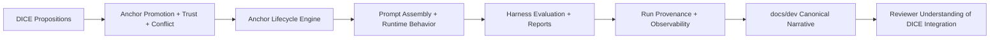
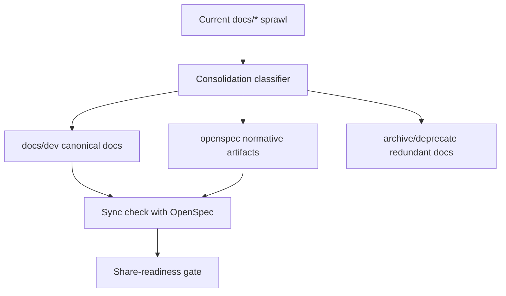

## Context

The Anchors core and adversarial harness are already functional, but reviewer experience is noisy because technical docs are fragmented and DICE integration intent is not explicit. The main audience for this share pass is engineers evaluating how Anchors fits into DICE-style proposition workflows.

Current implementation surfaces this design builds on:
- Anchor governance and promotion:
  - `src/main/java/dev/dunnam/diceanchors/anchor/AnchorEngine.java`
  - `src/main/java/dev/dunnam/diceanchors/anchor/LlmConflictDetector.java`
  - `src/main/java/dev/dunnam/diceanchors/anchor/TrustPipeline.java`
  - `src/main/java/dev/dunnam/diceanchors/extract/AnchorPromoter.java`
- Simulation/evaluation/reporting:
  - `src/main/java/dev/dunnam/diceanchors/sim/engine/SimulationTurnExecutor.java`
  - `src/main/java/dev/dunnam/diceanchors/sim/engine/ScoringService.java`
  - `src/main/java/dev/dunnam/diceanchors/sim/report/ResilienceReportBuilder.java`
  - `src/main/java/dev/dunnam/diceanchors/sim/report/MarkdownReportRenderer.java`
- Run history/provenance:
  - `src/main/java/dev/dunnam/diceanchors/sim/engine/SimulationRunRecord.java`
  - `src/main/java/dev/dunnam/diceanchors/sim/engine/SimulationRunStore.java`
  - `src/main/java/dev/dunnam/diceanchors/sim/engine/Neo4jRunHistoryStore.java`

## Goals / Non-Goals

**Goals:**
- Keep this repo easy to review as a demo by reducing documentation noise.
- Define a concise, canonical documentation structure (`docs/dev` + `openspec`) and enforce sync.
- Document DICE integration in enough depth for architecture/design review.
- Be explicit that Anchors is a trust/authority governance layer on top of DICE Agent Memory, not a replacement memory subsystem.
- Harden safety-critical implementation behavior relevant to reviewer trust (conflict/trust/lifecycle/reporting traceability).
- Ensure shared reports and docs do not overstate conclusions.

**Non-Goals:**
- Creating a formal program-management workflow for external reviewers.
- Expanding this change into a broad benchmark-policy redesign.
- Reworking DICE internals outside integration touchpoints used by this repo.

## Decisions

### D1: Use a pragmatic share-readiness gate, not a formal release process

The gate SHALL validate only what is necessary for demo sharing:
- required implementation safety checks,
- docs canonicalization/sync checks,
- core evidence/provenance checks for reported behavior.

It SHALL produce a clear pass/fail report with actionable remediation output.

**Alternative considered:** full formal review package workflow. Rejected as unnecessary process overhead for this demo phase.

### D2: Make DICE integration a first-class documentation artifact

A dedicated DICE integration doc set SHALL describe:
- concept mapping (DICE proposition lifecycle -> Anchors lifecycle),
- memory layering (DICE Agent Memory retrieval vs Anchors working-set injection),
- runtime boundaries (what remains in DICE vs what this repo adds),
- extension points for future incorporation into DICE,
- known integration gaps and risks.

**Alternative considered:** leave DICE context spread across existing docs. Rejected because reviewers cannot quickly assess fit.

### D2.1: Trust and authority overlays complement DICE memory confidence

Integration docs SHALL distinguish DICE proposition confidence/decay/revision behavior from Anchors trust and authority decisions.

Integration docs SHALL define how lower-trust knowledge can remain useful:
- retained with constrained authority and explicit provenance,
- excluded from authoritative conflict wins until corroborated or promoted.

**Alternative considered:** use a single combined confidence/trust score. Rejected because it hides provenance risk and weakens adversarial reasoning clarity.

### D3: Consolidate to two canonical technical documentation surfaces

Technical content SHALL live only in:
- `docs/dev/*` for developer-facing architecture/design/implementation material,
- `openspec/*` for normative requirements/design/tasks.

A one-time migration SHALL classify all existing `docs/*` files and consolidate overlapping content.

**Alternative considered:** incremental cleanup without canonical policy. Rejected due to recurring drift and duplication.

### D4: Keep only reviewer-relevant documentation content

Developer docs SHALL prioritize:
- architecture intent,
- implementation behavior and invariants,
- known issues/limitations,
- DICE integration specifics.

Non-essential or duplicative narratives SHALL be archived/deprecated to reduce cognitive load.

**Alternative considered:** preserve all historical docs in place. Rejected because it muddies Anchors review.

### D5: Harden reviewer-trust implementation paths

Share-critical behavior SHALL be improved in:
- conflict parse-failure handling,
- trust decision auditability,
- lifecycle hook determinism,
- report provenance and narrative caveat fidelity.

These changes ensure docs and observed runtime behavior stay aligned.

**Alternative considered:** docs-only cleanup without behavior hardening. Rejected because reviewers will evaluate implementation credibility, not docs alone.

## Risks / Trade-offs

- [Consolidation may remove context some contributors relied on] -> Mitigation: keep migration tracker and transitional pointer docs during cutoff period.
- [Docs-sync enforcement may initially fail often] -> Mitigation: provide clear sync metadata format and lightweight validation output.
- [Behavior hardening may surface previously hidden failures] -> Mitigation: expose degraded states explicitly in reports/observability and document them in known issues.
- [DICE integration docs may drift as implementation evolves] -> Mitigation: require OpenSpec path links and sync timestamps per doc.

## Migration Plan

1. Update OpenSpec scope to remove non-essential policy work and add DICE integration documentation scope.
2. Define canonical `docs/dev` index and migration tracker.
3. Consolidate existing `docs/*` into canonical docs, archive/deprecate redundant files.
4. Implement/adjust safety-critical behavior and provenance/reporting updates tied to this scope.
5. Run sync validation and produce a concise share-ready checklist for maintainers.

Rollback strategy:
- Keep migration tracker entries and transitional pointer docs so moved content can be recovered quickly.
- Keep new persistence/reporting fields backward-compatible on read.

## Open Questions

- Which DICE integration concerns need code examples vs conceptual docs for this audience?
- What is the minimum canonical doc set that preserves clarity without redundancy?
- How long should transitional pointer docs remain before deletion?
