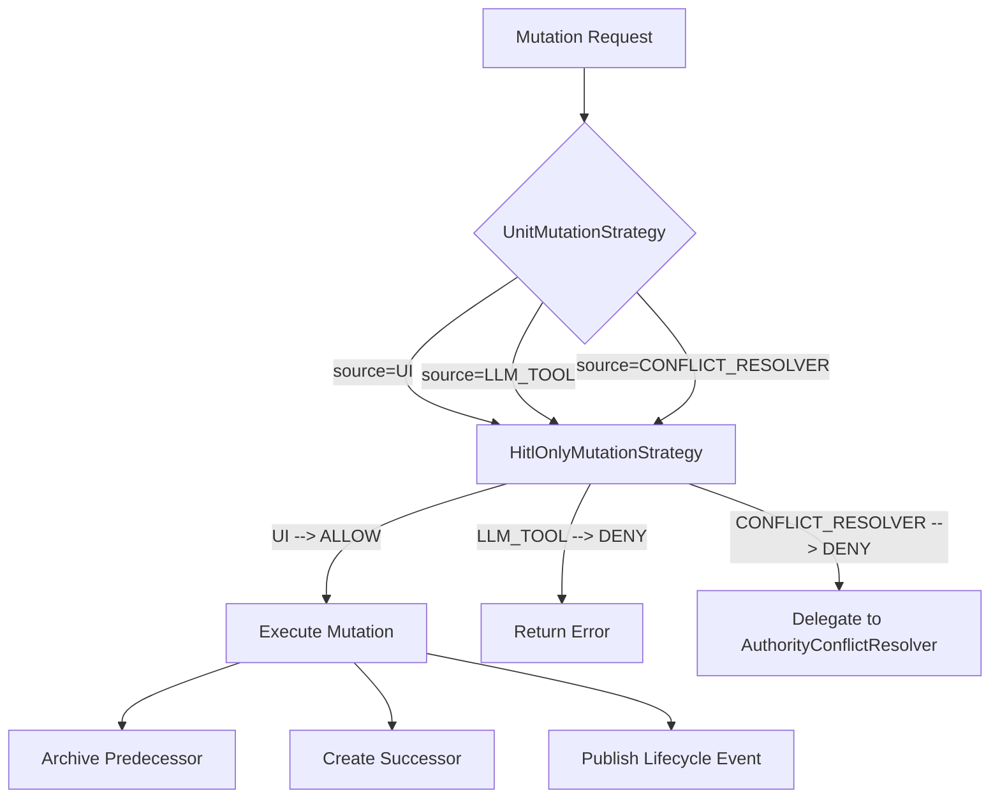

## Context

The `reviseFact` LLM tool (`ContextTools.reviseFact()`) allows adversarial user input to manipulate the LLM into defeating PROVISIONAL and UNRELIABLE context units with no human oversight. The tool has no rate limiting, no HITL gate, and no reinforcement-count check. An adversary can craft prompts that cause the LLM to call `reviseFact` and silently replace context units, defeating the trust model that context units are designed to protect.

The current `RevisionAwareConflictResolver` compounds this vulnerability: it auto-resolves REVISION-type conflicts by replacing PROVISIONAL context units unconditionally and UNRELIABLE context units above a confidence threshold, giving the adversary a second automated mutation path through conflict detection.

The existing `ChatView` already has an inline revision UI (text field + "Revise" button, lines 572-623) that performs revision directly through `ArcMemEngine.supersede()` without involving the LLM. This is the correct pattern: the human operator decides what to revise and when.

The `context units.jinja` prompt template currently injects `[revisable]` annotations on PROVISIONAL and UNRELIABLE context units and instructs the LLM to use `reviseFact`. These annotations and instructions MUST be removed when the LLM mutation path is closed.

## Goals / Non-Goals

**Goals:**
- Remove the LLM-accessible mutation path (`reviseFact` tool, template carveout, template variables)
- Introduce `UnitMutationStrategy` SPI for pluggable mutation gating
- Ship `HitlOnlyMutationStrategy` as the sole default implementation (ALLOW if source is UI, DENY otherwise)
- Gate the existing `ChatView` revision UI through the SPI
- Add revision UI to `UnitManipulationPanel` for HITL interventions during simulation pauses
- Neutralize `RevisionAwareConflictResolver` auto-resolution when HITL-only strategy is active

**Non-Goals:**
- Rate limiting on UI revisions (future work)
- Reinforcement-count checks before allowing revision (future work)
- Auto-approved mutation strategies (future work)
- Hybrid HITL+auto strategies (future work)
- Multi-user approval workflows (future work)

## Decisions

### D1: UnitMutationStrategy SPI

```java
public interface UnitMutationStrategy {

    MutationDecision evaluate(MutationRequest request);
}
```

Supporting records:

```java
public record MutationRequest(
        String unitId,
        String revisedText,
        MutationSource source,
        String requesterId
) {}

public enum MutationSource {
    UI, LLM_TOOL, CONFLICT_RESOLVER
}

public sealed interface MutationDecision {
    record Allow() implements MutationDecision {}
    record Deny(String reason) implements MutationDecision {}
    record PendingApproval(String requestId) implements MutationDecision {}
}
```

`UnitMutationStrategy` is unsealed to allow test doubles and future strategy implementations without modifying the interface. `HitlOnlyMutationStrategy` remains `final`. Security auditing of active strategies is enforced through Spring `@ConditionalOnProperty` wiring, not sealed permits.

`MutationDecision` is a sealed interface hierarchy rather than an enum because `Deny` carries a reason and `PendingApproval` carries a request ID. Pattern matching in callers:

```java
switch (decision) {
    case MutationDecision.Allow _ -> executeMutation(...);
    case MutationDecision.Deny deny -> showError(deny.reason());
    case MutationDecision.PendingApproval pending -> queueForApproval(pending.requestId());
}
```

`PendingApproval` is included in the decision type for forward compatibility but SHALL NOT be returned by `HitlOnlyMutationStrategy`. It exists so that future approval-workflow strategies can be added without changing the sealed hierarchy.

**Why unsealed**: The original design used `sealed` for audit control, but sealed interfaces with a single permitted class prevent test doubles on Java 25 (Mockito/ByteBuddy cannot mock sealed interfaces without agent pre-loading). The security gate is enforced through `@ConditionalOnProperty` bean wiring — only explicitly configured strategies are activated.

### D2: HitlOnlyMutationStrategy Implementation

```java
@Service
public final class HitlOnlyMutationStrategy implements UnitMutationStrategy {

    @Override
    public MutationDecision evaluate(MutationRequest request) {
        return switch (request.source()) {
            case UI -> new MutationDecision.Allow();
            case LLM_TOOL -> new MutationDecision.Deny("LLM-initiated mutation is disabled under HITL-only policy");
            case CONFLICT_RESOLVER -> new MutationDecision.Deny("Conflict-resolver mutation is disabled under HITL-only policy");
        };
    }
}
```

Registered as a Spring `@Service` bean. Activated when `context units.context unit.mutation.strategy=hitl-only` (default). The configuration property controls which `UnitMutationStrategy` bean is active via a `@ConditionalOnProperty` or a factory `@Bean`.

Configuration in `ArcMemProperties`:

```java
public record UnitConfig(
        // ... existing fields ...
        @DefaultValue("hitl-only") String mutationStrategy
) {}
```

**Why a separate strategy bean rather than a boolean flag**: A flag would need to be checked at every mutation site. The strategy centralizes the decision and makes it testable in isolation.

### D3: Remove reviseFact from LLM Tools

The following artifacts SHALL be removed or modified:

1. **`ContextTools.reviseFact()`** -- Delete the `@LlmTool` method entirely. The method body (create successor, promote, supersede) moves into a shared service method that both `ChatView` and `UnitManipulationPanel` call.

2. **`RevisionResult` record** -- Delete. No longer needed without the LLM tool.

3. **`context units.jinja` template** -- Remove:
   - The `` conditional block (lines 22-26) containing `reviseFact` tool instructions
   - All `[revisable]` annotations from context unit list items (lines 49, 57, 65)
   - The verification protocol exception for `reviseFact` (lines 85-87)
   - Template variables `revision_enabled` and `reliable_revisable` SHALL NOT be passed from callers

4. **Template variable callers** -- `ChatActions`, `ChatView`, and any simulation code passing `revision_enabled`/`reliable_revisable` to template rendering MUST stop passing these variables.

**Why delete rather than gate**: A gated-but-present tool is a security liability. The LLM tool description remains in the tool schema even if the method throws. Deleting removes the attack surface entirely.

### D4: Gate Existing ChatView Revision Through SPI

`ChatView.reviseUnit()` MUST call `UnitMutationStrategy.evaluate()` before executing the mutation:

```java
private boolean reviseUnit(Context Unit context unit, String revisedText) {
    var request = new MutationRequest(context unit.id(), revisedText, MutationSource.UI, "chat-operator");
    var decision = mutationStrategy.evaluate(request);
    return switch (decision) {
        case MutationDecision.Allow _ -> executeRevision(context unit, revisedText);
        case MutationDecision.Deny deny -> {
            Notification.show(deny.reason(), 3000, Notification.Position.MIDDLE);
            yield false;
        }
        case MutationDecision.PendingApproval _ -> {
            Notification.show("Revision queued for approval", 3000, Notification.Position.MIDDLE);
            yield false;
        }
    };
}
```

The `UnitMutationStrategy` bean MUST be injected into `ChatView` via constructor injection. Under `HitlOnlyMutationStrategy`, UI-sourced requests always receive `Allow`, so this gate is transparent for the current implementation but provides the extension point for future strategies.

### D5: RevisionAwareConflictResolver Behavior Under HITL-Only

When `HitlOnlyMutationStrategy` is active:

- `RevisionAwareConflictResolver` MUST still classify `ConflictType` (`REVISION`, `CONTRADICTION`, `WORLD_PROGRESSION`) and set OpenTelemetry span attributes. This classification is valuable for observability and drift analysis.
- `RevisionAwareConflictResolver` MUST NOT auto-resolve REVISION-type conflicts. Instead, REVISION conflicts SHALL delegate to `AuthorityConflictResolver` for resolution, which preserves the existing authority-based defense.
- Implementation: `RevisionAwareConflictResolver` checks the active `UnitMutationStrategy`. If the strategy denies `CONFLICT_RESOLVER` source, all REVISION conflicts delegate to the authority resolver. The classification-then-delegate pattern preserves telemetry while removing the auto-mutation path.

```java
private Resolution resolveRevision(ConflictDetector.Conflict conflict) {
    var probe = new MutationRequest(
            conflict.existing().id(), conflict.incomingText(),
            MutationSource.CONFLICT_RESOLVER, "conflict-resolver");
    if (mutationStrategy.evaluate(probe) instanceof MutationDecision.Deny) {
        return delegateWithDecision(conflict, "delegated", "mutation_strategy_denied");
    }
    // existing authority-gated revision logic
    ...
}
```

**Why not delete RevisionAwareConflictResolver entirely**: The conflict type classification emits `conflict.type`, `conflict.revision.eligible`, and `conflict.revision.reason` span attributes used by observability dashboards and benchmark reports. Deleting the resolver loses this telemetry. The cost of keeping it (one extra branch check) is negligible.

### D6: Sim Panel Revision UI

Add a revision text field and "Revise" button to each context unit edit card in `UnitManipulationPanel.buildUnitEditCard()`:

```java
var reviseField = new TextField("Revision");
reviseField.setWidthFull();
reviseField.setValue(node.getText());

var reviseButton = new Button("Revise");
reviseButton.addThemeVariants(ButtonVariant.LUMO_SMALL, ButtonVariant.LUMO_PRIMARY);
reviseButton.addClickListener(e -> {
    var text = reviseField.getValue();
    if (text == null || text.isBlank() || text.equals(node.getText())) return;
    var request = new MutationRequest(node.getId(), text, MutationSource.UI, "sim-operator");
    var decision = mutationStrategy.evaluate(request);
    if (decision instanceof MutationDecision.Allow) {
        executeRevision(node, text);
        recordIntervention(ActionType.REVISE, node.getId(), node.getText(), text);
        if (currentContextId != null) loadUnits(currentContextId);
    }
});
```

Changes to `UnitManipulationPanel`:

- Add `UnitMutationStrategy` as a constructor parameter (constructor injection)
- Add `REVISE` to the `ActionType` enum
- Add revision row to `buildUnitEditCard()` below the existing rank/pin/toggle controls
- Revision execution uses the same `ArcMemEngine.supersede()` pattern as `ChatView`

The revision is logged as an intervention event so it appears in the intervention log and can be correlated with simulation turn data.

### Mutation Request Flow



## Risks / Trade-offs

| Risk / Trade-off | Impact | Mitigation |
|---|---|---|
| Removing `reviseFact` breaks test scenarios that relied on LLM-initiated revision | Tests fail until expectations are updated | Audit all test classes referencing `reviseFact`, `RevisionResult`, or `revision_enabled`. Update or delete affected assertions. |
| HITL-only revision MAY feel sluggish in demo compared to LLM-initiated revision | Demo pacing relies on operator speed | UI revision is a single text edit + click. No LLM round-trip means revision is actually faster than the tool-based path. |
| SPI adds abstraction for a single implementation | Marginal complexity increase | Interface is 1 method, 3 supporting records. The abstraction pays for itself by preventing future refactoring when new strategies are added. |
| `ConflictType` classification still runs but REVISION conflicts no longer auto-resolve | Wasted LLM call for classification when conflict is REVISION | Observability value (span attributes, benchmark reports) outweighs the marginal cost. Classification is cheap relative to the conflict detection call that already ran. |
| `UnitMutationStrategy` is unsealed | Any class can implement the interface | Security gate is enforced through `@ConditionalOnProperty` bean wiring. `HitlOnlyMutationStrategy` is `final`. |

## Limitations (Demo Scope)

- No rate limiting on UI revisions. An operator with UI access can revise context units without throttling.
- No reinforcement-count check. Highly reinforced context units can be revised just as easily as fresh ones.
- `PendingApproval` decision type exists in the sealed hierarchy but is never returned. Approval workflows are out of scope.
- Single-operator model. No multi-user revision approval or audit trail beyond the intervention log.
