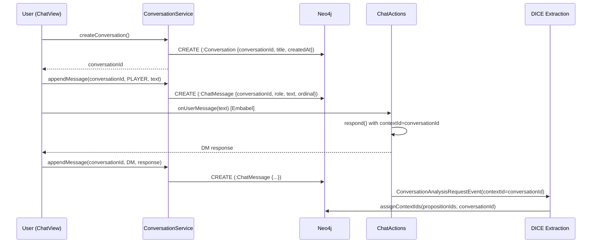

## Context

Chat conversations are ephemeral. The Embabel agent process holds the `Conversation` object in-memory (on the blackboard), and the `SessionData` record lives in the `VaadinSession`. Both are lost on browser refresh or server restart. Meanwhile, all propositions and anchors are persisted to Neo4j under a hardcoded `contextId = "chat"`, meaning every user shares the same anchor pool.

Key files today:
- `ChatView.java` — UI, manages `SessionData` in `VaadinSession`, renders messages
- `ChatActions.java` — Embabel `@EmbabelComponent`, hardcodes `DEFAULT_CONTEXT = "chat"`
- `ChatContextInitializer.java` — seeds anchors for a given `contextId`
- `AnchorRepository.java` — all queries filter by `contextId`
- `PropositionNode.java` — carries `contextId` as a plain Neo4j property

The established persistence pattern in this codebase (from `RunHistoryStore`, `ExperimentReport`) is JSON-in-Neo4j: a labeled node with queryable top-level properties.

## Goals / Non-Goals

**Goals:**
- Persist chat message transcripts to Neo4j so conversations survive restarts
- Make `conversationId` the shared correlation key for messages, propositions, and anchors
- UI flow for creating new conversations and resuming by ID
- Keep it simple — demo-quality, not production-grade

**Non-Goals:**
- Multi-user conversation sharing or access control
- Full-text search over conversations
- Conversation branching or forking
- Migration of existing `"chat"` contextId data
- Modifying the simulation flow (sims already use `sim-{uuid}` contextIds)

## Decisions

### D1: Neo4j for message storage (not Postgres)

Neo4j is already running and the entire persistence layer uses it. Adding Postgres would mean a second database, new Docker Compose service, Flyway migrations, and a second connection pool — all for a simple ordered list of messages. Neo4j handles this fine with a `ChatMessage` labeled node and `ordinal` property for ordering.

**Alternative considered:** Postgres with Spring Data JPA. Simpler querying for tabular message data, but the operational overhead isn't justified for a demo.

### D2: `conversationId` replaces `contextId` for chat (not coexists)

Today `contextId` is the scoping mechanism for all proposition/anchor queries. The `conversationId` will simply *be* the `contextId` — no alias, no indirection. `ChatActions.DEFAULT_CONTEXT` changes from `"chat"` to the dynamic `conversationId`.

This means:
- All existing `AnchorRepository` queries work unchanged (they filter by `contextId`)
- `ChatContextInitializer.initializeContext(contextId)` works unchanged
- Propositions extracted by DICE get `contextId = conversationId` via the existing `assignContextIds` path

**Alternative considered:** Maintaining a separate `conversationId` field alongside `contextId`. Rejected — adds complexity for zero benefit. `contextId` is already the logical scope boundary.

### D3: Message persistence at the ChatView/service level (not Embabel interceptor)

Messages are persisted by a new `ConversationService` called from `ChatView` — once when the user sends a message, once when the DM response arrives. This is simpler than hooking into Embabel's conversation lifecycle.

The Embabel `Conversation` object is still the in-memory authoritative source during an active session. Persistence is a side-effect for durability, not the primary data path.

### D4: Conversation resume creates a new Embabel session, pre-loaded with history

When resuming, we create a new `ChatSession` via `chatbot.createSession()` (we must — Embabel doesn't support session hydration). Then we replay the persisted messages into the `Conversation` object before the user sends new messages. This gives the LLM the full conversation context.

**Trade-off:** The Embabel agent process doesn't carry over any internal state (blackboard entries, etc.) from the original session. For a demo, this is acceptable — the LLM gets the transcript context, which is what matters.

### D5: ConversationNode + ChatMessage nodes in Neo4j

```
(:Conversation {conversationId, title, createdAt})
(:ChatMessage {conversationId, role, text, ordinal, createdAt})
```

No relationships between them — just shared `conversationId` property for filtering. This matches the flat-node pattern used by `SimulationRunRecord` and `ExperimentReport`. Relationships would add complexity without query benefit for this use case.

**Message count** is derived via `COUNT` query, not denormalized.

### D6: VaadinSession stores active conversationId for refresh survival

On conversation start or resume, the `conversationId` is stored as a `VaadinSession` attribute. On page refresh (`onAttach`), if a `conversationId` exists in the session, the conversation is automatically resumed from Neo4j. This gives refresh survival without cookies or URL params.

**Limitation:** Closing the browser tab loses the session. The user must paste the ID to resume. This is acceptable for a demo.

## Data Flow



## Risks / Trade-offs

- **[Risk] Embabel session state lost on resume** → Mitigation: Replay transcript into new session. LLM gets full context. Agent blackboard state (if any) is lost but doesn't affect demo UX.
- **[Risk] No conversation cleanup** → Old conversations accumulate in Neo4j. Acceptable for demo. Future: add TTL or manual delete.
- **[Risk] Concurrent writes to same conversation** → Not guarded. Single-user demo. Future: optimistic locking if needed.
- **[Trade-off] No full-text search** → Users must know their conversation ID. For a demo, this is fine.

## Shortcuts and Future Intent

- **No auth/multi-user**: Any user can resume any conversation by ID. Demo-only.
- **No conversation delete/archive**: Conversations are append-only. Add lifecycle later.
- **No title editing**: Title defaults to "Untitled". Could add auto-titling from first message later.
- **No conversation list in UI**: MVP has paste-to-resume only. A conversation browser/picker is a natural follow-up.
- **Anchor association is implicit**: Anchors get `contextId = conversationId` through the existing pipeline. No explicit `BELONGS_TO` relationship. Future: add relationship for "show me the conversation for this anchor" queries.
