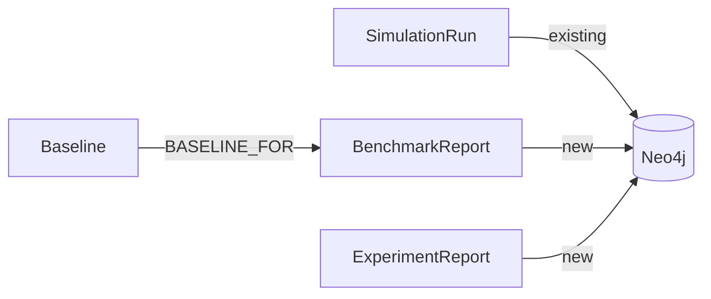

## Context

The `RunHistoryStore` interface already supports both in-memory and Neo4j backends. `Neo4jRunHistoryStore` persists `SimulationRunRecord` as JSON-in-Neo4j nodes, but benchmark reports, experiment reports, and baseline references remain in `ConcurrentHashMap` even when Neo4j mode is active. The in-memory default means all data is lost on restart.

The `BenchmarkRunner` uses `StructuredTaskScope` with virtual threads (parallelism default 4) and generates run IDs via 8-char UUID substrings. Report IDs use `bench-{uuid}` and `exp-{uuid}` prefixes, which are already collision-safe.

The current UI surfaces run history through `RunHistoryDialog` (modal) launched from `SimulationView` and `BenchmarkView`. `RunInspectorView` at `/run` handles detailed inspection and comparison.

## Goals / Non-Goals

**Goals:**
- Full Neo4j persistence for all report types (benchmark, experiment, baseline)
- Neo4j as default store — zero-config persistence out of the box
- Inline run history panel replacing the modal dialog approach
- Historical cross-session comparison via RunInspectorView

**Non-Goals:**
- Run data export (CSV, JSON) — future work
- Run tagging/labeling system — future work
- TTL/auto-expiration of old runs — future work
- Distributed/multi-instance locking — single-instance deployment only

## Decisions

### D1: JSON-in-Neo4j pattern for all report types

Extend the existing `SimulationRunRecord` serialization pattern to `BenchmarkReport` and `ExperimentReport`. Each report becomes a labeled node (`BenchmarkReport`, `ExperimentReport`) with queryable first-class properties plus a `payload` field containing the full JSON serialization.

**Why over separate properties:** The report records contain deeply nested structures (`Map<String, BenchmarkStatistics>`, `List<String> runIds`). Flattening these into Neo4j properties would be fragile and provide no query benefit. The JSON-in-node pattern is proven in the existing `SimulationRun` implementation.

**Baseline references:** Store as a `Baseline` node with `scenarioId` property and `BASELINE_FOR` relationship to the `BenchmarkReport` node. One `Baseline` per scenario (MERGE on scenarioId). This is queryable and cascades cleanly on report deletion.

### D2: Neo4j as default store

Change `SimulationConfiguration` to default to NEO4J (`matchIfMissing = false` on the NEO4J bean, `matchIfMissing = true` on... no — simpler: flip the default in `application.yml` from `MEMORY` to `NEO4J`). The memory store remains available for tests and lightweight usage via config override.

**Why:** The project already requires Neo4j to run. Making persistence the default eliminates a common "why are my runs gone?" confusion.

### D3: Inline history panel instead of modal dialog

Replace `RunHistoryDialog` (modal) with a collapsible panel in `SimulationView` sidebar. The panel shows a filtered, sortable grid of historical runs with scenario, date, resilience rate, and model ID. Clicking a run navigates to `RunInspectorView`. A "Compare" action selects two runs for side-by-side view.

**Why over keeping modal:** Modals interrupt workflow. An inline panel lets users browse history while configuring the next run.

### D4: Existing Cypher query patterns

Follow `Neo4jRunHistoryStore`'s existing patterns:
- `MERGE` for idempotent save (match on `reportId`)
- `MATCH ... RETURN` with `ORDER BY` for listing
- `DETACH DELETE` for removal with relationship cleanup
- `PersistenceManager` with `CypherStatement` for all queries

**Files affected:**
- `src/main/java/dev/dunnam/diceanchors/sim/engine/Neo4jRunHistoryStore.java` — add benchmark/experiment/baseline Cypher methods
- `src/main/java/dev/dunnam/diceanchors/sim/engine/SimulationConfiguration.java` — update default
- `src/main/resources/application.yml` — flip default to NEO4J
- `src/main/java/dev/dunnam/diceanchors/sim/views/SimulationView.java` — add history panel
- `src/main/java/dev/dunnam/diceanchors/sim/views/RunHistoryDialog.java` — refactor to panel component or deprecate

## Risks / Trade-offs

- **[Large JSON payloads in Neo4j]** → Benchmark reports with many runs can be large. Mitigation: payload is opaque to Neo4j queries; only first-class properties are indexed. Monitor node sizes in production.
- **[Default change breaks existing setups]** → Users with `MEMORY` in config won't be affected (explicit config wins). Users with no config get NEO4J now. Mitigation: Neo4j is already required; this is a safe default.
- **[Baseline cascade on delete]** → Deleting a benchmark report that is a baseline removes the baseline reference. Mitigation: spec requires this behavior explicitly; UI should warn before deletion.
