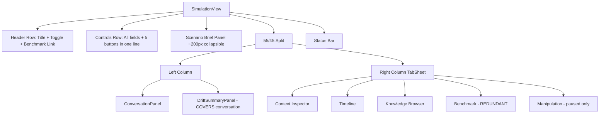
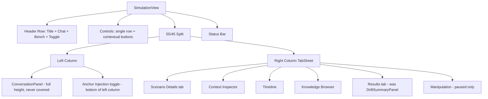

## Context

SimulationView is the primary UI of the dice-anchors application. On a 14" MacBook (1512x982), the current layout wastes vertical space on the Scenario Brief panel (~200px), crams all controls and buttons into one row, and causes the DriftSummaryPanel to push the conversation off-screen on completion. The right panel includes a Benchmark tab that duplicates the dedicated `/benchmark` route.

All UI is built with Vaadin 24.6.4 Java components — no HTML templates. CSS lives in `frontend/themes/anchor-retro/styles.css`.

### Current Layout

### Proposed Layout

## Goals / Non-Goals

**Goals:**
- Conversation panel always visible, never covered by results
- Controls fit comfortably on 14" screen
- Remove redundant Benchmark tab from SimulationView
- Scenario details accessible without consuming vertical space above the split
- Grouped scenario selection by category
- Contextual button visibility to reduce clutter

**Non-Goals:**
- Redesigning other routes (ChatView, BenchmarkView, RunInspectorView)
- Changing the anchor-retro theme aesthetics
- Modifying panel internals (ConversationPanel bubbles, ContextInspectorPanel sub-tabs, etc.)
- Responsive/mobile layout support
- Changing the 55/45 split ratio

## Decisions

### D1: DriftSummaryPanel becomes a right-panel tab

**Decision:** Move DriftSummaryPanel from left column (below conversation) to a "Results" tab in the right TabSheet. Auto-select this tab on simulation completion.

**Alternative considered:** Bottom drawer/overlay (like Chrome DevTools). Rejected because Vaadin has no built-in resizable drawer, and a partial overlay still covers the conversation.

**Alternative considered:** Auto-navigate to RunInspectorView on completion. Rejected because it loses the "see results in context" immediacy.

**Impact:** `SimulationView.java` — remove DriftSummaryPanel from left column, add as tab content. DriftSummaryPanel itself unchanged internally.

### D2: Scenario Brief becomes a right-panel tab

**Decision:** Move Scenario Brief content into a "Scenario Details" tab, selected by default before a run starts.

**Rationale:** The collapsible Details panel above the split consumes ~200px even when collapsed (the header is still visible). Moving it to a tab reclaims that space for the conversation.

**Impact:** `SimulationView.java` — remove the Details component, create a "Scenario Details" tab that renders the same content.

### D3: Contextual button visibility

**Decision:** Show/hide buttons based on `SimControlState` instead of disabling them.

| State | Buttons Shown |
|-------|--------------|
| IDLE | Run, History |
| RUNNING | Pause, Stop |
| PAUSED | Resume, Stop, History |
| COMPLETED | Run, History |

**Rationale:** Five buttons (3 disabled) waste horizontal space. Contextual visibility reduces the row to 2-3 buttons.

**Impact:** `SimulationView.java` — replace `setEnabled()` calls with `setVisible()` in state transition handler.

### D4: Single-row controls with separated injection toggle

**Decision:** All config inputs (Category Select, Scenario ComboBox, Token Budget, Max Turns) and action buttons on a single row. The Anchor Injection toggle is moved to the bottom of the left column beneath the conversation panel.

**Rationale:** Contextual button visibility (D3) reduced button count from 5 to 2-3, making a single row feasible. Moving the injection toggle to the left column reduces vertical dead space in the controls area and keeps it visually associated with the conversation output it affects.

### D5: Two-level category/scenario selection

**Decision:** Use a separate Category `Select<String>` (160px) and Scenario `ComboBox<SimulationScenario>` (240px). Selecting a category filters the scenario list to show only scenarios in that category. Categories are sorted alphabetically via TreeMap; scenarios are sorted by title within each category.

**Alternative considered:** Single ComboBox with grouped sections using a custom renderer for non-selectable category headers. Rejected because Vaadin ComboBox custom renderer complexity was unnecessary when two standard components achieve the same UX with simpler code.

### D6: Header navigation links

**Decision:** Add Chat and Benchmark RouterLinks to the header row, right-aligned alongside the theme toggle button.

**Current state:** Only a "Benchmark" link exists. No Chat link. Theme toggle is center-aligned.

**New state:** Title (left) | Chat + Benchmark + Theme Toggle (right).

### D7: Tab auto-selection

**Decision:** Programmatically select tabs based on simulation lifecycle events:

| Event | Tab Selected |
|-------|-------------|
| Page load / scenario change | Scenario Details |
| Run starts | Context Inspector |
| Simulation completes | Results |
| Pause with manipulation | Manipulation |

**Implementation:** `tabSheet.setSelectedIndex()` calls in the existing state-change handlers.

## Risks / Trade-offs

- **Right panel tab count (6 tabs):** With Scenario Details and Results added (Benchmark removed), the tab count goes from 5 to 6. Tab labels may truncate on narrow screens. → Mitigation: Keep tab labels short ("Details", "Inspector", "Timeline", "Browser", "Results", "Manipulation"). The Manipulation tab is only visible when paused, so effectively 5 tabs most of the time.

- **Two-component selection overhead:** Using two components (Category Select + Scenario ComboBox) instead of one adds a selection step. → Mitigation: The category filter reduces the scenario list to a manageable size, making the second selection faster. The overall UX is comparable to single-component approaches.

- **Tab auto-selection may override user intent:** If a user is examining the Timeline tab and the simulation completes, auto-selecting Results tab could be disruptive. → Mitigation: Only auto-select on state transitions, not on every turn update. Users can always click back to their preferred tab.
