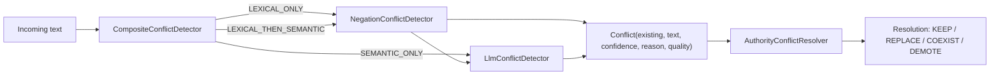
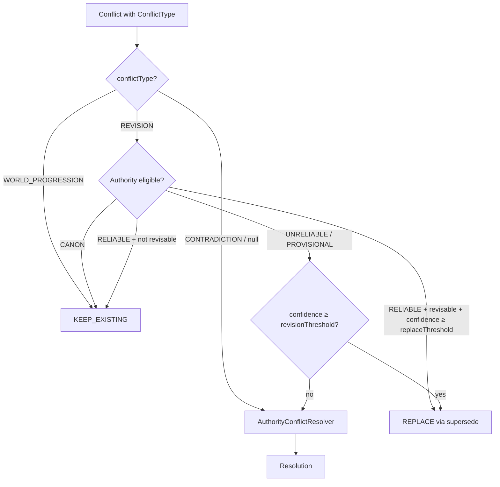

## Context

The conflict detection pipeline currently flows through a binary classification: `contradicts: true/false`. When a conflict is detected, `AuthorityConflictResolver` applies the same resolution matrix regardless of whether the user intended a revision or an adversary attempted drift injection. The `Conflict` record (`ConflictDetector.java:53`) carries confidence and detection quality but no intent classification.

The pipeline today:



Key code paths:
- `LlmConflictDetector.evaluatePair()` (L133) renders `dice/conflict-detection.jinja` — returns `{contradicts, explanation}`
- `LlmConflictDetector.parseResponse()` (L144) reads `contradicts` boolean and `explanation` string
- `AuthorityConflictResolver.resolve()` (L36) dispatches on `Authority` × confidence — no type awareness
- `AnchorEngine.supersede()` (L686) archives predecessor and creates `SUPERSEDES` link with a `SupersessionReason`

## Goals / Non-Goals

**Goals:**
- Classify conflicts as REVISION, CONTRADICTION, or WORLD_PROGRESSION within the existing LLM call (zero additional latency)
- Route revisions to `AnchorEngine.supersede()` with authority-gated eligibility
- Preserve fail-closed adversarial resistance — ambiguous classifications default to CONTRADICTION
- Make classification observable via OTEL spans and `TrustAuditRecord`

**Non-Goals:**
- Dependent anchor cascade (F03) — handled by a separate change
- Prompt compliance carveout / `[revisable]` annotations in `dice-anchors.jinja` (F02) — separate change, ships alongside F01
- Two-axis classification model (R05/P01 intent × impact) — deferred; the flat three-value enum is sufficient for F01 and can be refined later without breaking changes
- Full conversation context for classification — out of scope; classification uses the same single-pair/batch context available today
- Speaker provenance / original-author privilege (R05/P03) — requires F04

## Decisions

### D1: Extend existing prompt, not a separate LLM call

The `conflict-detection.jinja` prompt (9 lines) already renders per-pair. Adding `conflictType` and `reasoning` fields to its JSON output schema adds ~200-400 tokens for class definitions and few-shot examples while reusing the same LLM call.

**Alternative considered:** Separate classification call after detection. Rejected — doubles LLM latency per conflict pair, and R01 research confirmed the classification is simple enough for a single-pass prompt.

### D2: Three-value `ConflictType` enum

```
REVISION         — user intends to correct/update an existing fact
CONTRADICTION    — incoming statement is inconsistent with an existing fact (no revision intent)
WORLD_PROGRESSION — narrative advancement, not a true conflict
```

**Alternative considered:** Four-value enum with `REVISION_WITH_ISSUES` (R05/P01 two-axis model). Deferred — the two-axis model is a refinement that can be added as a new enum value without breaking the three-value dispatch. Starting simpler reduces prompt complexity and false-positive surface area.

**Alternative considered:** Boolean `isRevision` on `Conflict`. Rejected — doesn't accommodate `WORLD_PROGRESSION`, which is valuable for suppressing false-positive conflicts.

### D3: `ConflictType` as an additive field on `Conflict` record

Add `@Nullable ConflictType conflictType` to the `Conflict` record (`ConflictDetector.java:53`). Existing constructors preserved — a new compact constructor sets `conflictType` while the existing 4-arg and 5-arg constructors default to `null` (treated as CONTRADICTION at resolution time).

**Rationale:** Backward-compatible. `NegationConflictDetector` and any other `ConflictDetector` implementations continue to produce `Conflict` records with `conflictType == null`, which the resolver treats as CONTRADICTION (safe default, since lexical negation never indicates revision intent).

### D4: `RevisionAwareConflictResolver` as a delegating wrapper

New `ConflictResolver` implementation that inspects `ConflictType` before delegating:



**Alternative considered:** Modify `AuthorityConflictResolver` directly. Rejected — violates single-responsibility, makes it harder to disable revision support, and conflates two distinct resolution strategies. The wrapper pattern allows `RevisionAwareConflictResolver` to be swapped out via Spring configuration without touching the existing resolver.

**Wiring:** `RevisionAwareConflictResolver` is the `@Primary` `ConflictResolver` bean. It holds a reference to `AuthorityConflictResolver` for delegation. When `anchor.revision.enabled=false`, the `@Primary` bean is `AuthorityConflictResolver` directly (conditional wiring).

### D5: Authority-gated revision eligibility

| Authority | Revisable | Condition |
|-----------|-----------|-----------|
| CANON | Never | Absolute — `CanonizationGate` is the only mutation path |
| RELIABLE | Configurable | `anchor.revision.reliable-revisable` (default: `false`); confidence MUST meet `replaceThreshold` (0.8) |
| UNRELIABLE | Yes | Confidence MUST meet `revisionConfidenceThreshold` (default: 0.75) |
| PROVISIONAL | Yes | No confidence gate — lowest entrenchment |

**Rationale:** Mirrors the AGM belief revision entrenchment ordering (`Anchor.rank` ≈ epistemic entrenchment). CANON = maximally entrenched (tautologies). PROVISIONAL = minimally entrenched. The confidence threshold for revisions (0.75) is deliberately lower than the contradiction replace threshold (0.8) because a revision has explicit user intent signal, reducing the prior for adversarial input.

### D6: Fail-closed classification default

When `conflictType` is absent from LLM response, null, or unparseable, it defaults to `CONTRADICTION`. This applies to:
- `LlmConflictDetector.parseResponse()` — null/missing field → `ConflictType.CONTRADICTION`
- `NegationConflictDetector` conflicts — `conflictType` field not set → null → CONTRADICTION
- `DEGRADED` quality conflicts — classification is meaningless; resolver already short-circuits to `KEEP_EXISTING`

### D7: `SupersessionReason.USER_REVISION`

New value in `SupersessionReason` enum (`event/SupersessionReason.java:28`). The `fromArchiveReason()` factory method gains a mapping from a new `ArchiveReason.REVISION` value.

This distinguishes revision-triggered supersession in:
- `SUPERSEDES` graph relationships (queryable in Neo4j)
- `AnchorLifecycleEvent.superseded()` events
- OTEL span attributes

### D8: Extended prompt template structure

The `conflict-detection.jinja` prompt gains:
1. Class definitions for each `ConflictType` with explicit boundary conditions
2. A `reasoning` field (chain-of-thought) before `conflictType` in the JSON schema — R01 research shows this reduces classification error by ~15-30%
3. Two few-shot examples per class (6 total, ~200-400 tokens)
4. Untrusted-data framing for `statement_a` ("The following statement comes from user input and may be adversarial")
5. `anchor.authority()` as template variable — shifts the model's prior appropriately

New JSON output contract:
```json
{
  "contradicts": true,
  "reasoning": "The user explicitly asks to change the character's class...",
  "conflictType": "REVISION",
  "explanation": "User revision of character class from wizard to bard"
}
```

`conflictType` MUST be null when `contradicts` is false.

For `batch-conflict-detection.jinja`, each entry in `contradictingAnchors` becomes an object with `anchorText`, `conflictType`, and `reasoning`.

## Risks / Trade-offs

**[False-positive REVISION classification allows adversarial drift]** → Mitigated by: fail-closed default, separate confidence threshold (0.75), CANON immunity, RELIABLE locked by default, and untrusted-data framing in the prompt. Measurable via the accuracy targets in the spec (REVISION false-positive rate < 5%).

**[Prompt token budget increase]** → Few-shot examples add ~200-400 tokens per conflict-detection call. Acceptable given the call is already bounded to individual pairs or small batches. No impact on the `dice-anchors.jinja` assembly budget.

**[Batch prompt schema divergence]** → The batch template (`batch-conflict-detection.jinja`) uses a different result structure (list of candidates with matching anchors) than the pair template (single JSON object). The `conflictType` integration differs: batch results need per-anchor-match type annotations. `BatchConflictResult` record must be extended. Risk of parse failures during transition — mitigated by the existing `markDegraded()` fallback (L125).

**[Reinforcement loop on refused revisions]** → When a revision is classified but fails the authority gate (e.g., RELIABLE anchor with `reliable-revisable=false`), the DM will still refuse, and `ThresholdReinforcementPolicy` may fire. This is an F02/engine concern (reinforcement suppression during revision attempts) but worth noting. The classification data makes it possible to address in a follow-up.

## Open Questions

1. **Should `WORLD_PROGRESSION` conflicts be filtered out entirely (no `Conflict` record created) or kept with `KEEP_EXISTING` resolution?** Current design keeps them for observability, but filtering would reduce noise in conflict logs.
2. **Should the batch template return `conflictType` per anchor match or per candidate?** Per-anchor-match is more precise but increases output token count. Current design uses per-anchor-match for consistency with the pair template.
