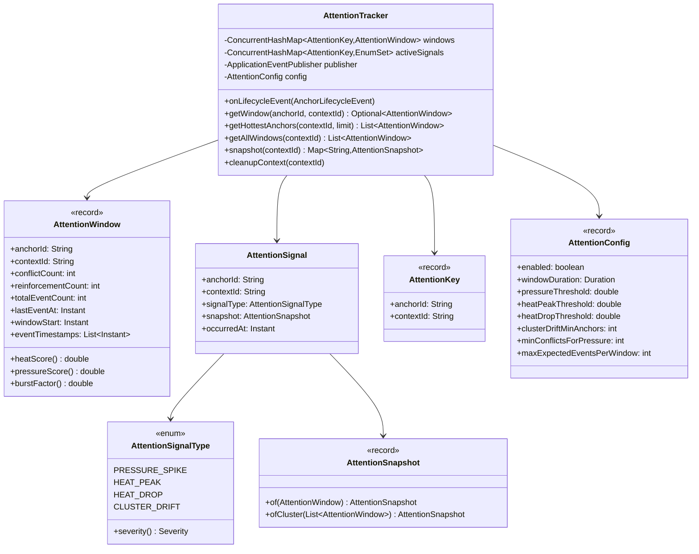

## Context

The anchor subsystem publishes 10 lifecycle event types via Spring's `ApplicationEventPublisher`, but nothing aggregates them over time. The `AnchorLifecycleListener` logs individual events — no temporal memory, no pattern detection. This change adds an in-memory sliding-window tracker that observes these events and produces higher-level attention signals.

## Goals / Non-Goals

**Goals:**
- Event-driven sliding-window aggregation of anchor lifecycle events
- Per-anchor, per-context attention metrics (heat, pressure, burst)
- Threshold-based signal publishing for downstream consumers
- Query API for on-demand attention state inspection
- Zero-overhead disable path

**Non-Goals:**
- Implementing downstream consumers (adversarial hardening, spotlight tracking, etc.) — separate changes
- Persisting attention state to Neo4j
- Modifying any existing anchor behavior (rank, authority, eviction)
- UI components for attention visualization

## Decisions

### D1: Separate package `anchor/attention/` within the anchor module

Place all attention-tracking code in `dev.dunnam.diceanchors.anchor.attention`. This is an anchor-level concern (observing anchor lifecycle events), not a simulation or assembly concern. The package depends on `anchor/event/` types but nothing in `anchor/` depends on `attention/`.

**Alternative**: Put in `assembly/` since it could inform context assembly. Rejected — the tracker is a generic event observer, not assembly-specific. Assembly consumers would import from `attention/`, not the other way around.

### D2: `AttentionSignal` as separate `ApplicationEvent`, not in sealed hierarchy

`AttentionSignal` extends `ApplicationEvent` directly, NOT `AnchorLifecycleEvent`. The sealed hierarchy represents state mutations to anchors. Attention signals are derived observations — they don't change anchor state. Mixing them into the sealed hierarchy would create a circular dependency (lifecycle events → tracker → attention signals → lifecycle hierarchy).

**Alternative**: Make `AttentionSignal` a POJO and have the tracker call consumers directly. Rejected — Spring events provide loose coupling, letting consumers register without the tracker knowing about them.

### D3: `ConcurrentHashMap<AttentionKey, AttentionWindow>` for thread-safe state

The tracker uses `ConcurrentHashMap` keyed by `AttentionKey(anchorId, contextId)` record. `AttentionWindow` is an immutable record — updates replace the entry via `compute()`. This avoids synchronization beyond what `ConcurrentHashMap` provides.

**Alternative**: Synchronized `HashMap`. Rejected — `ConcurrentHashMap.compute()` gives per-key atomicity without global locks, which matters when multiple event listeners fire concurrently.

### D4: Hysteresis via `EnumSet` tracking per key

Each `AttentionKey` has an associated `EnumSet<AttentionSignalType>` tracking which signals are currently "active" (threshold crossed but not yet reset). A signal is published only on the rising edge (not active → threshold crossed). It resets when the metric drops below threshold.

Stored as `ConcurrentHashMap<AttentionKey, EnumSet<AttentionSignalType>>` alongside the window map.

### D5: Configuration via nested record in `DiceAnchorsProperties`

Add `AttentionConfig` as a `@NestedConfigurationProperty` record within `DiceAnchorsProperties`, following the existing pattern for `AnchorConfig`, `MemoryConfig`, etc. Properties bind under `dice-anchors.attention.*`.

**Alternative**: Separate top-level `@ConfigurationProperties` class. Rejected — all dice-anchors config is centralized in `DiceAnchorsProperties`.

### D6: Event-to-anchor mapping via pattern matching

The tracker extracts anchor IDs from events using a switch expression with pattern matching on the sealed hierarchy. `ConflictDetected` maps to multiple anchor IDs; all others map to a single ID. `InvariantViolation` with null `anchorId` is skipped.

```java
private List<String> extractAnchorIds(AnchorLifecycleEvent event) {
    return switch (event) {
        case ConflictDetected e -> e.getConflictingAnchorIds();
        case Promoted e -> List.of(e.getAnchorId());
        case Reinforced e -> List.of(e.getAnchorId());
        case Archived e -> List.of(e.getAnchorId());
        case Evicted e -> List.of(e.getAnchorId());
        case ConflictResolved e -> List.of(e.getExistingAnchorId());
        case AuthorityChanged e -> List.of(e.getAnchorId());
        case TierChanged e -> List.of(e.getAnchorId());
        case Superseded e -> List.of(e.getPredecessorId());
        case InvariantViolation e -> e.getAnchorId() != null ? List.of(e.getAnchorId()) : List.of();
    };
}
```

### D7: CLUSTER_DRIFT evaluation on every event, scoped to context

After processing each event, the tracker evaluates cluster drift for the event's context. It counts how many anchors in that context currently have a `HEAT_DROP` condition (previously hot, now below drop threshold). If the count meets `clusterDriftMinAnchors`, a `CLUSTER_DRIFT` signal is published.

This is efficient because each event only triggers a scan of windows in one context (not all contexts).

## Data Flow

```mermaid
flowchart TD
    ALE[AnchorLifecycleEvent subtypes] -->|@EventListener| AT[AttentionTracker]
    AT -->|update| WM[Window Map<br>ConcurrentHashMap&lt;AttentionKey, AttentionWindow&gt;]
    AT -->|check thresholds| HM[Hysteresis Map<br>ConcurrentHashMap&lt;AttentionKey, EnumSet&gt;]
    AT -->|publish| AS[AttentionSignal]
    AS -->|@EventListener| C1[Consumer: Adversarial Hardener]
    AS -->|@EventListener| C2[Consumer: Spotlight Tracker]
    AS -->|@EventListener| C3[Consumer: Observability]
    AT -->|query API| Q[getHottestAnchors / snapshot / getWindow]
    Q -->|read-only| WM
```

## Component Structure



## Risks / Trade-offs

- **Memory growth**: Each active anchor in each context gets a window with a list of timestamps. Mitigated by: (1) windows are pruned on every event, (2) Archived/Evicted anchors have windows removed, (3) `cleanupContext()` for bulk teardown. For a budget of 20 anchors, this is negligible.
- **Event storm during batch operations**: `AnchorEngine.promote()` can trigger Promoted + Evicted + TierChanged in quick succession. The tracker handles each independently — this is by design, as rapid events are exactly what heat/burst metrics should capture.
- **CLUSTER_DRIFT scan cost**: Scanning all windows in a context on every event is O(budget). With default budget of 20, this is trivial. Would need optimization if budget scaled to thousands.
