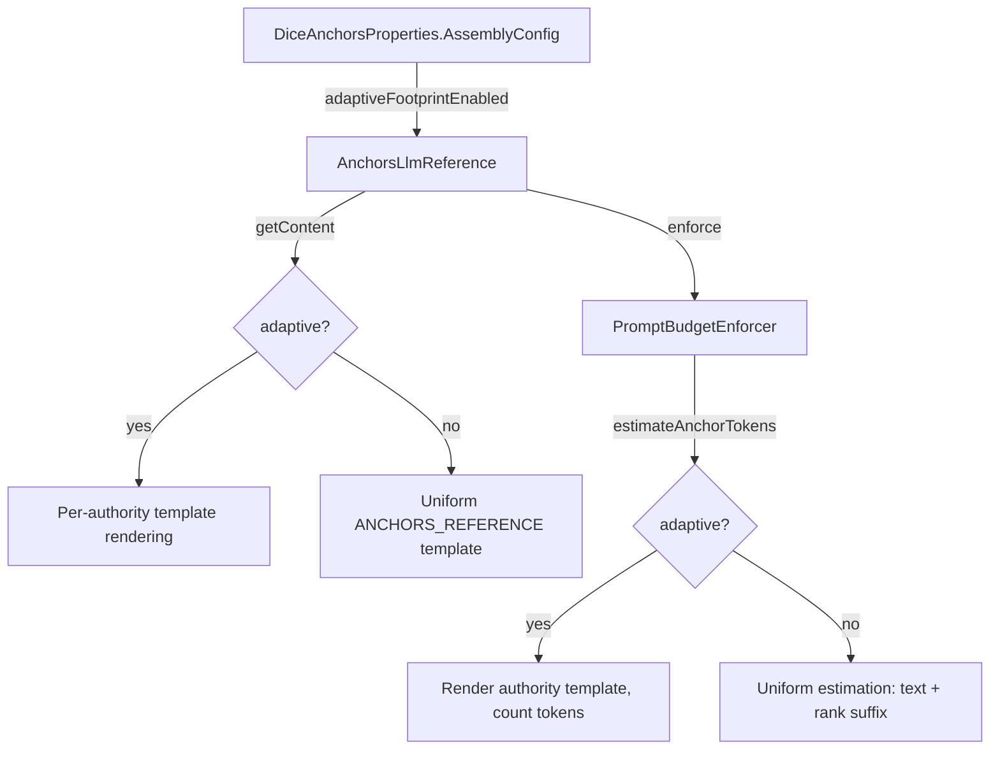

## Context

`AnchorsLlmReference.getContent()` currently renders all anchors through a single `ANCHORS_REFERENCE` Jinja2 template, grouping by authority tier and applying compliance strength labels. Each anchor is formatted identically regardless of authority: `{index}. {text} (rank: {rank})`. `PromptBudgetEnforcer.estimateTotal()` mirrors this with a uniform per-anchor cost: `counter.estimate(anchor.text()) + counter.estimate(" (rank: 999)")`.

The existing compliance tiering (`CompliancePolicy`) already groups anchors by authority and applies per-tier compliance language (MUST/SHOULD/MAY). This change extends that grouping to also vary the per-anchor template -- higher-authority anchors get less verbose rendering, freeing token budget for more anchors overall.

Key files:
- `AnchorsLlmReference` (`assembly/`) -- prompt context assembly
- `PromptBudgetEnforcer` (`assembly/`) -- token budget enforcement with per-anchor estimation
- `PromptPathConstants` (`prompt/`) -- template file path constants
- `PromptTemplates` (`prompt/`) -- Jinja2 template loading and rendering
- `DiceAnchorsProperties` (`root`) -- configuration records
- `anchors-reference.jinja` (`resources/prompts/`) -- current uniform template

## Goals / Non-Goals

**Goals:**
- Render per-anchor templates based on authority tier when adaptive footprint is enabled
- Produce token savings by using compact templates for high-authority anchors
- Update budget enforcement to estimate tokens using authority-appropriate template sizes
- Preserve exact current behavior when disabled (default)
- Keep the change contained to `assembly/` and `prompt/` packages

**Non-Goals:**
- Compliance fallback logic (reverting to full template if compliance degrades) -- skipped for demo
- Per-tier compliance tracking or monitoring
- Changes to retrieval modes (BULK/HYBRID/TOOL)
- Changes to CompliancePolicy or compliance strength mapping
- Dynamic per-anchor template selection based on conversation context
- UI controls for adaptive footprint (configuration-only for demo)

## Decisions

### 1. Four Template Files, One Per Authority Tier

Create four new Jinja2 template files in `src/main/resources/prompts/`:

| Authority | Template | Content | Approx. tokens saved vs. uniform |
|-----------|----------|---------|----------------------------------|
| PROVISIONAL | `anchor-tier-provisional.jinja` | `{index}. {text} (rank: {rank}) [unverified -- low confidence]` | 0% (baseline) |
| UNRELIABLE | `anchor-tier-unreliable.jinja` | `{index}. {text} (rank: {rank})` | ~15% |
| RELIABLE | `anchor-tier-reliable.jinja` | `{index}. {text}` | ~25% |
| CANON | `anchor-tier-canon.jinja` | `- {text}` | ~40% |

Each template renders a single anchor entry (one line). The containing tier header (e.g., `=== CANON FACTS ===`) remains in the main assembly logic, not in these per-anchor templates.

**Why**: External template files, not hardcoded strings. Consistent with the existing `PromptTemplates` pattern. Easy to adjust verbosity without code changes.

**Alternative considered**: A single template with `` conditionals. Rejected because it becomes hard to read and test with four tiers of conditional logic.

### 2. Template Selection in AnchorsLlmReference

When `adaptiveFootprintEnabled` is true, the `getContent()` method modifies the inner rendering loop. Instead of passing all anchors through the uniform template, each authority group renders its anchors using the tier-specific template:

```
for each authority tier (CANON -> RELIABLE -> UNRELIABLE -> PROVISIONAL):
  for each anchor in tier:
    rendered += PromptTemplates.render(templateForAuthority(authority), anchorVars)
```

The `templateForAuthority()` mapping uses a switch expression on `Authority`:

```java
private String templateForAuthority(Authority authority) {
    return switch (authority) {
        case CANON -> PromptPathConstants.ANCHOR_TEMPLATE_CANON;
        case RELIABLE -> PromptPathConstants.ANCHOR_TEMPLATE_RELIABLE;
        case UNRELIABLE -> PromptPathConstants.ANCHOR_TEMPLATE_UNRELIABLE;
        case PROVISIONAL -> PromptPathConstants.ANCHOR_TEMPLATE_PROVISIONAL;
    };
}
```

When `adaptiveFootprintEnabled` is false, the existing `PromptTemplates.render(ANCHORS_REFERENCE, ...)` path is used unchanged.

**Why**: Minimal change to existing code. The switch expression is exhaustive (compile-time safety if a new authority is added). The feature flag keeps the change opt-in.

**Alternative considered**: Passing `adaptiveFootprintEnabled` into the Jinja template and using conditionals there. Rejected because it moves Java logic into templates and makes testing harder.

### 3. PromptBudgetEnforcer Authority-Aware Estimation

`PromptBudgetEnforcer.estimateTotal()` currently uses a uniform per-anchor cost. When adaptive footprint is enabled, it needs to estimate per-anchor cost using the authority-specific template.

The approach: add an `adaptiveFootprintEnabled` boolean parameter to `enforce()`, or provide an estimation strategy. For simplicity in a demo repo, pass the flag and compute per-anchor cost accordingly:

```java
private int estimateAnchorTokens(TokenCounter counter, Anchor anchor, boolean adaptive) {
    if (!adaptive) {
        return counter.estimate(anchor.text()) + counter.estimate(" (rank: 999)");
    }
    var template = templateForAuthority(anchor.authority());
    var rendered = PromptTemplates.render(template, anchorVars(anchor));
    return counter.estimate(rendered);
}
```

**Why**: Renders the actual template to get an accurate estimate. The render cost is negligible (string concatenation, cached template). Avoids maintaining separate estimation heuristics that could drift from actual template content.

**Alternative considered**: Pre-computed overhead constants per tier. Rejected because constants would need manual updates whenever templates change.

### 4. Configuration via AssemblyConfig

Extend the existing `AssemblyConfig` record:

```java
public record AssemblyConfig(
    @Min(0) @DefaultValue("0") int promptTokenBudget,
    @DefaultValue("false") boolean adaptiveFootprintEnabled
) {}
```

Property path: `dice-anchors.assembly.adaptive-footprint-enabled`

**Why**: Reuses the existing `AssemblyConfig` record. Boolean toggle is the simplest opt-in mechanism. Default `false` ensures zero behavioral change for existing deployments.

### 5. Passing Adaptive Flag Through the Assembly Chain

`AnchorsLlmReference` already receives config at construction time. The `adaptiveFootprintEnabled` flag is passed to the constructor and stored as a field. `PromptBudgetEnforcer.enforce()` receives it as a parameter (or the enforcer is constructed with it).

For demo simplicity, `PromptBudgetEnforcer` will accept an `adaptiveFootprintEnabled` parameter on `enforce()` since it is currently instantiated inline in `AnchorsLlmReference` (not a Spring bean).



## Risks / Trade-offs

| Risk | Mitigation |
|------|-----------|
| CANON anchors with minimal templates may be ignored by the LLM (no rank/metadata to signal importance) | The tier header (`=== CANON FACTS (MUST be preserved) ===`) still carries compliance strength. CANON compliance is enforced by the header, not per-anchor metadata. |
| Template rendering per-anchor in estimation adds cost | Negligible: templates are cached, rendering is string interpolation. Budget enforcement runs once per turn. |
| Adaptive and uniform paths could diverge over time | Feature flag forces a clean branch. Both paths are tested. |
| Token savings may be marginal for small anchor sets | This is an optimization for budget-constrained scenarios with 15+ anchors. For small sets, the feature is harmless (slightly less verbose output). |

## Open Questions

None -- scoping decisions from the proposal (skip compliance fallback, skip per-tier tracking) eliminate open design questions for the demo scope.
