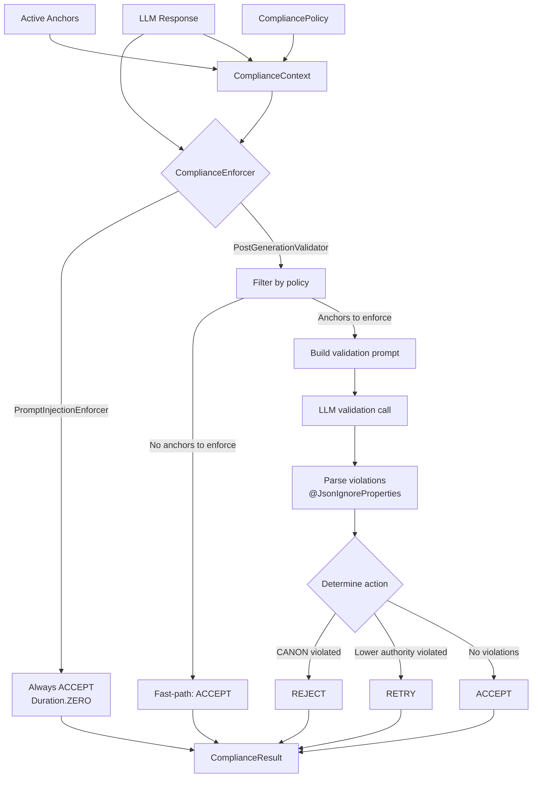
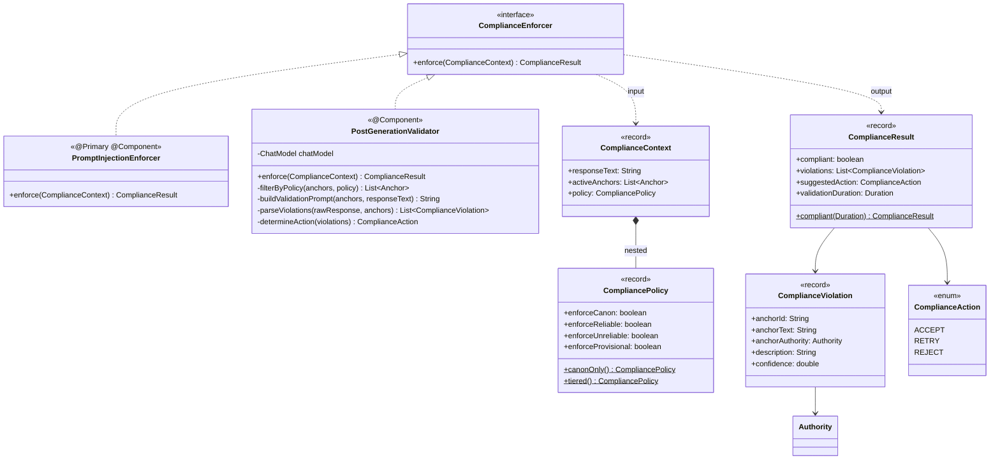

## Context

Anchor compliance is currently implicit: `AnchorsLlmReference` injects anchors into the system prompt with authority-tiered compliance directives (via `anchor/CompliancePolicy`), and the LLM is trusted to comply. There is no post-generation verification. This change adds a `ComplianceEnforcer` interface and two implementations to the `assembly/` package, establishing a three-tier enforcement spectrum that can grow to include constrained decoding (F12) without API changes.

## Goals / Non-Goals

**Goals:**
- Strategy-abstracted compliance enforcement via a single `@FunctionalInterface`
- Zero-cost default (`PromptInjectionEnforcer`) preserving existing behavior
- LLM-based post-generation validation (`PostGenerationValidator`) for CANON/RELIABLE anchors
- Authority-aware enforcement strictness via nested `CompliancePolicy` record
- Extensibility for future strategies (Prolog, logit bias, constrained decoding)

**Non-Goals:**
- Automatic retry on violation (callers decide retry policy)
- Modifications to `AnchorsLlmReference` prompt assembly logic
- Integration into `ChatActions` or `SimulationTurnExecutor` pipelines (separate changes)
- UI for compliance configuration
- Constrained decoding implementation (F12)
- Prolog invariant enforcement implementation (Wave 2-3)

## Decisions

### D1: assembly/ package placement, distinct from anchor/CompliancePolicy

All compliance enforcement types live in `dev.dunnam.diceanchors.assembly`. This is the response validation layer — it operates on assembled responses, not on prompt rendering.

The existing `anchor/CompliancePolicy` interface (maps authority to `ComplianceStrength` for prompt rendering) is a separate concept. The new `assembly/ComplianceContext.CompliancePolicy` record (controls which authority tiers are validated) is complementary, not competing:

| Concept | Package | Purpose | Used by |
|---------|---------|---------|---------|
| `CompliancePolicy` (interface) | `anchor/` | Authority -> strength for prompt rendering | `AnchorsLlmReference` |
| `ComplianceContext.CompliancePolicy` (record) | `assembly/` | Authority -> enforce/skip for response validation | `PostGenerationValidator` |

**Alternative**: Merge into a single type. Rejected — prompt rendering and response validation are different concerns with different consumers. Merging would couple `AnchorsLlmReference` to the enforcement layer.

### D2: Non-sealed @FunctionalInterface for open extensibility

`ComplianceEnforcer` is a `@FunctionalInterface` and is intentionally non-sealed. Future enforcement strategies include:

- **Prolog invariant inference** (Wave 2-3): DICE's tuProlog (2p-kt) projection can express structural invariants as Prolog rules. Deterministic enforcement at near-zero cost for rule-expressible constraints.
- **Logit bias adjustment**: API-level token probability manipulation. Requires provider support.
- **Constrained decoding** (F12): Generation-integrated enforcement inspired by the Google AI STATIC paper (2024). Requires local model infrastructure.

A sealed interface would require modifying permits clauses for each new strategy. Non-sealed allows unbounded extension.

**Alternative**: Sealed with explicit permits. Rejected — the enforcement spectrum is intentionally open-ended. The STATIC paper demonstrates that new enforcement strategies emerge from research; the interface MUST NOT require modification to accommodate them.

### D3: @Primary on PromptInjectionEnforcer for backward compatibility

`PromptInjectionEnforcer` is `@Primary` so Spring auto-wires it as the default `ComplianceEnforcer`. This means:

- Existing code that doesn't request enforcement gets zero-cost pass-through
- Callers opting into stricter enforcement use `@Qualifier("postGenerationValidator")` or direct injection
- No configuration change required to maintain current behavior

**Alternative**: Configuration-driven bean selection. Rejected for this change — adds complexity without clear benefit when only two implementations exist. Can be added when strategy selection per-simulation (A/B testing) is implemented.

### D4: Nested CompliancePolicy record in ComplianceContext

`CompliancePolicy` is nested inside `ComplianceContext` rather than being a top-level type. Reasons:

- Scopes the name to its usage context (enforcement policy, not prompt compliance policy)
- Avoids naming collision with `anchor/CompliancePolicy`
- Groups the policy with the context it configures
- Factory methods (`canonOnly()`, `tiered()`) provide convenient presets

### D5: @JsonIgnoreProperties on all LLM response models

All JSON models used to parse LLM validation responses use `@JsonIgnoreProperties(ignoreUnknown = true)`. This is a hard-learned lesson from the `BatchConflictResult` parse failure (2026-02-27) where LLMs returned extra `"reasoning"` fields that caused deserialization failures.

Additionally, if JSON parsing fails entirely, the validator fails open (treats as compliant) and logs a warning. False negatives are preferable to false positives that block valid responses.

### D6: REJECT for CANON, RETRY for lower authority

The action escalation model:

- **CANON violation -> REJECT**: CANON anchors are world-defining (invariant A3b). A response contradicting a CANON anchor is a fundamental failure. Retrying is unlikely to help without prompt changes — REJECT signals the caller to take corrective action.
- **RELIABLE/UNRELIABLE/PROVISIONAL violation -> RETRY**: Lower-authority violations may be correctable by regeneration. The LLM may produce a compliant response on a second attempt.
- **No violations -> ACCEPT**: Happy path.

**Alternative**: All violations → RETRY with increasing backoff. Rejected — CANON violations require different handling than RELIABLE violations. The authority hierarchy exists precisely to differentiate response.

### D7: Research attribution — STATIC paper and enforcement spectrum

The three-tier enforcement spectrum (prompt injection -> post-generation validation -> constrained decoding) is informed by the Google AI STATIC paper (2024), which demonstrated that sparse matrix constrained decoding can make structured output generation deterministic. The progression from probabilistic compliance (prompt injection) through post-hoc verification (this change) to generation-time enforcement (F12) provides a principled architecture for incrementally tightening compliance guarantees as infrastructure capabilities grow.

## Data Flow

## Component Structure

## File Inventory

| File | Type | Description |
|------|------|-------------|
| `assembly/ComplianceAction.java` | Enum | ACCEPT, RETRY, REJECT action values |
| `assembly/ComplianceViolation.java` | Record | Single violation: anchor reference + description + confidence |
| `assembly/ComplianceContext.java` | Record | Enforcement inputs: response, anchors, policy. Contains nested `CompliancePolicy` record |
| `assembly/ComplianceResult.java` | Record | Enforcement output: compliant flag, violations, action, duration |
| `assembly/ComplianceEnforcer.java` | Interface | `@FunctionalInterface`, single method, non-sealed |
| `assembly/PromptInjectionEnforcer.java` | Component | `@Primary` default, always compliant, zero cost |
| `assembly/PostGenerationValidator.java` | Component | LLM-based validation, authority-filtered, REJECT/RETRY escalation |

## Risks / Trade-offs

- **Naming collision with anchor/CompliancePolicy**: Two types named `CompliancePolicy` in different packages. Mitigated by nesting the assembly variant inside `ComplianceContext` — callers always reference it as `ComplianceContext.CompliancePolicy`, making the scope clear.
- **Validation prompt quality**: `PostGenerationValidator` effectiveness depends on the validation prompt. The current implementation uses a straightforward "check for contradictions" prompt. Prompt engineering iteration MAY be needed for edge cases (subtle paraphrasing, partial contradictions).
- **LLM call cost**: Every enforced response adds one LLM call. For simulation runs with 20 turns, this is 20 additional calls. Mitigated by: (1) `PromptInjectionEnforcer` as default (zero cost), (2) policy filtering to limit enforced anchors, (3) fast-path when no anchors match policy.
- **False positives from validation LLM**: The validator may flag valid responses that touch anchor-adjacent topics without contradicting them. Mitigated by confidence scores and authority-based action escalation (REJECT only for CANON).
