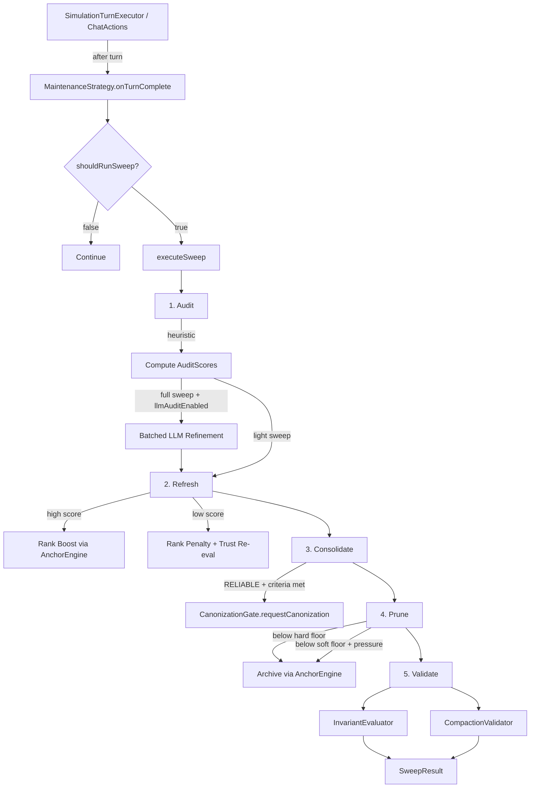

## Context

The `ProactiveMaintenanceStrategy` stub already exists as a `non-sealed class` implementing the `MaintenanceStrategy` sealed interface. It has three no-op methods: `onTurnComplete()`, `shouldRunSweep()`, and `executeSweep()`. The `AnchorConfiguration` bean factory creates it when maintenance mode is `PROACTIVE` or `HYBRID`. The `HybridMaintenanceStrategy` delegates sweep calls to it.

The `MemoryPressureGauge` (F04) already computes `PressureScore` with a `total` field and publishes threshold breach events. The `PressureConfig` already defines `lightSweepThreshold` (0.4) and `fullSweepThreshold` (0.8).

The codebase already has:
- `AnchorEngine` with `archiveAnchor()`, `updateRank()`, and access to the repository
- `CanonizationGate` with `requestCanonization(anchorId, contextId, text, authority, reason, requestedBy)`
- `CompactionValidator.validate(summary, protectedAnchors, minMatchRatio)` (static utility)
- `InvariantEvaluator.evaluate(contextId, action, anchors, targetAnchor)` returning `InvariantEvaluation`
- `TrustPipeline` for trust re-evaluation
- `LlmCallService` for batched LLM calls with timeout enforcement
- `Anchor` record with `rank()`, `authority()`, `pinned()`, `reinforcementCount()`, `text()`, `memoryTier()`

## Goals / Non-Goals

**Goals:**
- Replace the `ProactiveMaintenanceStrategy` stub with a working 5-step sweep
- Wire pressure-triggered activation via `MemoryPressureGauge`
- Heuristic audit scoring with optional LLM refinement for full sweeps
- Two-tier pruning (hard floor + pressure-gated soft floor)
- CANON candidacy routing through `CanonizationGate`
- Post-sweep validation via `CompactionValidator` + `InvariantEvaluator`
- Configurable sweep parameters via `DiceAnchorsProperties`

**Non-Goals:**
- Prolog pre-filter integration (demo repo scope reduction)
- Transaction/rollback framework (F01 deferred)
- Persisted audit scores (transient only)
- UI changes (existing panels display `SweepResult` data)
- Auto-tuning cycle frequency based on convergence metrics

## Decisions

### 1. ProactiveMaintenanceStrategy Dependencies

```java
public non-sealed class ProactiveMaintenanceStrategy implements MaintenanceStrategy {
    // Injected via constructor
    private final MemoryPressureGauge pressureGauge;
    private final AnchorEngine anchorEngine;
    private final AnchorRepository repository;
    private final CanonizationGate canonizationGate;
    private final InvariantEvaluator invariantEvaluator;
    private final LlmCallService llmCallService;
    private final DiceAnchorsProperties.ProactiveConfig config;
    // Per-context sweep state
    private final Map<String, SweepState> contextSweepState;
}
```

**Why**: All dependencies already exist as Spring beans. `SweepState` tracks `lastSweepTurn` per context for minimum turn interval enforcement. `ConcurrentHashMap` for thread safety per `MaintenanceStrategy` contract.

### 2. Sweep Type Determination

```java
enum SweepType { LIGHT, FULL, NONE }
```

Determined by pressure score:
- `total >= fullSweepThreshold` (0.8) -> `FULL` (heuristic + LLM audit)
- `total >= lightSweepThreshold` (0.4) -> `LIGHT` (heuristic-only audit)
- `total < lightSweepThreshold` -> `NONE`

**Why**: Matches the existing `PressureConfig` thresholds. Light sweeps avoid expensive LLM calls for moderate pressure.

### 3. Audit Score Record

```java
record AuditScore(
    String anchorId,
    double heuristicScore,
    double finalScore,
    boolean llmRefined
) {}
```

**Why**: Separates heuristic from LLM-refined scores for observability. `finalScore` is what downstream steps use.

### 4. Heuristic Relevance Scoring

Three signals combined with equal weight (0.33 each):

| Signal | Calculation | Range |
|--------|-------------|-------|
| **Recency** | `1.0 - min(turnsSinceReinforcement / maxTurns, 1.0)` | [0.0, 1.0] |
| **Rank position** | `(rank - MIN_RANK) / (MAX_RANK - MIN_RANK)` | [0.0, 1.0] |
| **Memory tier** | HOT=1.0, WARM=0.5, COLD=0.2 | {0.2, 0.5, 1.0} |

Combined: `(recency * 0.33) + (rankPosition * 0.33) + (tierScore * 0.34)`

**Why**: Entity overlap with recent conversation is desirable but requires access to conversation history, which `MaintenanceContext` doesn't carry. Using rank position and memory tier as proxies -- high-rank HOT anchors are more likely to be recently relevant. The `maxTurns` denominator is `minTurnsBetweenSweeps` so recency is calibrated to sweep frequency.

**Alternative considered**: Entity overlap scoring requires conversation turn text in `MaintenanceContext.metadata()`. This is feasible as a future enhancement -- pass recent turns via metadata map. For now, the three-signal heuristic is sufficient.

### 5. LLM Audit Prompt Design (Full Sweep Only)

For full sweeps, anchors with heuristic scores in the borderline range (between `softPruneThreshold` and 0.7) get refined via a single batched LLM call.

Prompt template:
```
System: You are evaluating anchor relevance for a knowledge management system.
Rate each anchor's relevance on a scale of 0.0 to 1.0.

User: Rate the relevance of each anchor. Return a JSON array of objects with
"anchorId" and "score" fields.

Anchors:
{{#each anchors}}
- ID: {{id}}, Text: "{{text}}", Authority: {{authority}}, Rank: {{rank}}
{{/each}}
```

**Why**: Simple structured output. `@JsonIgnoreProperties(ignoreUnknown = true)` on the response record per the BatchConflictResult lesson (Mistakes Log). Single batched call per `MaintenanceStrategy` error contract.

### 6. Refresh Step Mechanics

```
if (auditScore >= 0.7):
    newRank = clampRank(currentRank + rankBoostAmount)
else if (auditScore <= 0.3):
    newRank = clampRank(currentRank - rankPenaltyAmount)
else:
    // no change

if (auditScore between 0.2 and 0.4):
    trigger trust re-evaluation via AnchorEngine
```

**Why**: Simple linear adjustment. `clampRank()` guarantees invariant A2. The trust re-evaluation zone overlaps with the rank penalty zone intentionally -- degraded anchors get both a rank hit and a trust review.

### 7. Consolidation Candidacy

Candidates must meet ALL criteria:
1. `authority == RELIABLE`
2. `reinforcementCount >= candidacyMinReinforcements` (default 10)
3. `auditScore >= candidacyMinAuditScore` (default 0.8)
4. Turns since current authority >= `candidacyMinAge` (default 5) -- approximated via `reinforcementCount / 2` since we don't track promotion timestamps

**Why**: Combined criteria prevent premature consolidation from any single signal, per prep doc Q2 recommendation. The age approximation is imprecise but avoids adding a new field to `Anchor`. An exact age would require tracking the turn when RELIABLE was assigned.

### 8. Two-Tier Pruning

```
if (anchor.authority == CANON || anchor.pinned):
    skip  // Invariants A3b, A3d
else if (auditScore < hardPruneThreshold):
    archive  // Always prune
else if (auditScore < softPruneThreshold && pressure >= softPrunePressureThreshold):
    archive  // Pressure-gated prune
```

**Why**: Matches prep doc Q3 recommendation (d). Hard floor at 0.1 is very low -- only genuinely irrelevant anchors. Soft floor at 0.3 responds to budget pressure without being too aggressive. Death spiral prevention: the hard floor being low means only truly bad anchors are force-pruned.

### 9. Validation Step

Post-sweep checks:
1. For each pruned anchor: `InvariantEvaluator.evaluate(contextId, ARCHIVE, remainingAnchors, prunedAnchor)`
2. For remaining anchors: `CompactionValidator.validate(anchorTextsJoined, protectedAnchors, 0.5)` where protected = CANON + pinned anchors
3. Violations logged at WARN level, counts included in `SweepResult`

**Why**: No rollback (F01 deferred). Validation is observational -- it detects problems for the operator to investigate. The `CompactionValidator` reuse is slightly creative (comparing anchor texts against each other rather than a compaction summary) but validates that protected content isn't lost.

### 10. Configuration Structure

```java
// In DiceAnchorsProperties
public record ProactiveConfig(
    @Min(1) @DefaultValue("10") int minTurnsBetweenSweeps,
    @DecimalMin("0.0") @DecimalMax("1.0") @DefaultValue("0.1") double hardPruneThreshold,
    @DecimalMin("0.0") @DecimalMax("1.0") @DefaultValue("0.3") double softPruneThreshold,
    @DecimalMin("0.0") @DecimalMax("1.0") @DefaultValue("0.6") double softPrunePressureThreshold,
    @Min(1) @DefaultValue("10") int candidacyMinReinforcements,
    @DecimalMin("0.0") @DecimalMax("1.0") @DefaultValue("0.8") double candidacyMinAuditScore,
    @Min(1) @DefaultValue("5") int candidacyMinAge,
    @Min(1) @Max(200) @DefaultValue("50") int rankBoostAmount,
    @Min(1) @Max(200) @DefaultValue("50") int rankPenaltyAmount,
    @DefaultValue("false") boolean llmAuditEnabled
) {}
```

Nested under `MaintenanceConfig`:
```java
public record MaintenanceConfig(
    @DefaultValue("REACTIVE") MaintenanceMode mode,
    @Valid @NestedConfigurationProperty ProactiveConfig proactive
) {}
```

**Why**: Groups all proactive config under `dice-anchors.maintenance.proactive.*`. Jakarta validation annotations per coding style. `llmAuditEnabled` defaults to `false` so the feature works without LLM overhead initially.

## Data Flow



## Risks / Trade-offs

| Risk | Mitigation |
|------|-----------|
| **Heuristic audit scores inaccurate** | Three-signal heuristic is a proxy; optional LLM refinement available for full sweeps. Conservative prune thresholds prevent over-pruning. |
| **Sweep adds latency between turns** | Conservative default: 10 turn minimum between sweeps. Heuristic-only light sweeps are fast (no LLM calls). |
| **No rollback on validation failure** | F01 deferred. Violations logged for operator visibility. Prune thresholds are conservative. |
| **Consolidation age approximation** | Using `reinforcementCount / 2` as age proxy. Inaccurate but avoids Anchor record changes. Future: add `promotedToReliableAt` field. |
| **CANON anchors accumulate without pruning** | By design (invariant A3b). Budget enforcement still applies to non-CANON anchors. |

## Migration Plan

1. Add `ProactiveConfig` record to `DiceAnchorsProperties.MaintenanceConfig`
2. Add `AuditScore`, `SweepType`, `CycleMetrics` records to `anchor/` package
3. Implement `ProactiveMaintenanceStrategy` 5-step logic
4. Add audit prompt template to `src/main/resources/prompts/`
5. Update `AnchorConfiguration` bean factory to wire new dependencies
6. Add unit tests for each step and the trigger logic
7. Add default config values to `application.yml`
8. Verify all existing tests pass with `./mvnw test`

## Open Questions

- Should conversation turn text be passed via `MaintenanceContext.metadata()` for entity-overlap scoring? (Deferred -- current heuristic uses rank+tier+recency as proxies)
- Should `SweepResult` track `anchorsConsolidated` as a separate counter? (Currently not in the record -- would require modifying the sealed record)
