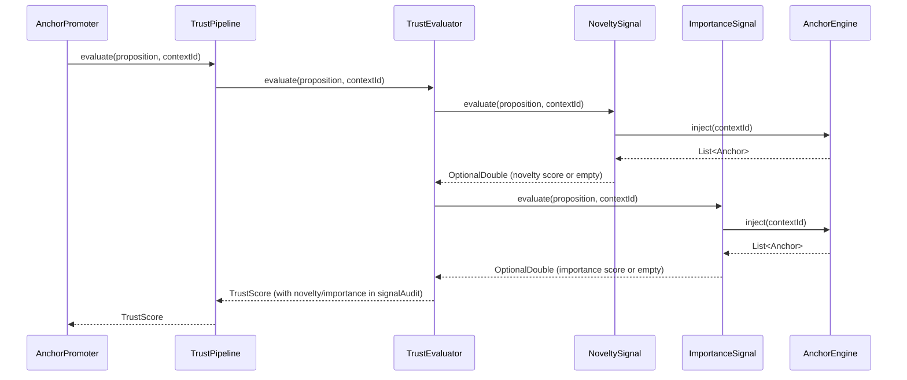

## Context

The anchor promotion pipeline (`AnchorPromoter`) evaluates incoming DICE propositions through a multi-gate pipeline: confidence -> conflict pre-check -> dedup -> conflict -> trust -> promote. The trust gate uses `TrustPipeline` which composes multiple `TrustSignal` implementations weighted by `DomainProfile`. Currently four signals exist: `sourceAuthority`, `extractionConfidence`, `graphConsistency`, and `corroboration`.

None of these signals measure proposition *value* -- whether the information is new (novelty) or relevant to the current conversation (importance). Sleeping-llm's curator (Amygdala) demonstrated that scoring facts by novelty and importance before injection into working memory improves memory utilization. Our adaptation uses heuristic text similarity rather than sleeping-llm's surface markers (message length, question marks).

Existing infrastructure:
- `TrustSignal` interface with `name()` and `evaluate(PropositionNode, String contextId)` returning `OptionalDouble`
- `TrustEvaluator` with absent-signal weight redistribution (returns empty -> weight goes to present signals)
- `DomainProfile` with per-signal weight maps validated to sum to 1.0
- `TrustConfiguration` declaring signal beans and `TrustPipeline`
- `AnchorEngine.getActiveAnchors(contextId)` / `inject(contextId)` for fetching existing anchors

## Goals / Non-Goals

**Goals:**
- Add novelty and importance as `TrustSignal` implementations composing with existing signals
- Use heuristic scoring only -- zero LLM cost, deterministic, fast
- Opt-in activation with no impact on existing behavior when disabled
- Observable scores in trust audit records for debugging and tuning
- Low default weights (~5% each) so quality signals are tie-breakers

**Non-Goals:**
- Embedding-based semantic similarity (future work, adds infrastructure)
- Prolog relationship inference (prep doc Task 5 -- skipped for demo scope)
- Per-proposition LLM calls for scoring
- Replacing or modifying `DuplicateDetector` (complementary, not overlapping)
- New pipeline stages in `AnchorPromoter` (quality signals run inside existing trust gate)

## Decisions

### 1. TrustSignal Integration (Option A from prep)

Implement `NoveltySignal` and `ImportanceSignal` as `TrustSignal` implementations. Register in `TrustConfiguration`. Add weights in `DomainProfile`.

**Why**: Leverages existing infrastructure entirely. No new pipeline stages, no new interfaces, no new evaluation paths. `TrustEvaluator` already handles absent signals (empty -> redistribute weight), so disabling quality scoring is zero-cost. Scores automatically appear in `TrustAuditRecord.signalAudit` via existing audit trail.

**Alternative considered**: Pre-trust filter (Option B from prep). Rejected because it adds a new pipeline stage, requires explicit audit injection, and doesn't compose with domain profile weights. Early exit benefit is negligible since heuristic scoring is sub-millisecond.

### 2. Novelty: Jaccard Similarity

Compute novelty as `1.0 - maxJaccardSimilarity` where Jaccard similarity is computed between the proposition's token set and each active anchor's token set.

```
tokenize(text) -> lowercase, split on whitespace/punctuation, remove stop words
jaccard(A, B) = |A ∩ B| / |A ∪ B|
maxSim = max over all anchors of jaccard(proposition_tokens, anchor_tokens)
novelty = 1.0 - maxSim
```

**Why**: Jaccard is simple, deterministic, and captures lexical overlap. A proposition that restates an existing anchor scores ~0.0 novelty. A completely new topic scores ~1.0. Stop-word removal improves signal quality by focusing on content words.

**Alternative considered**: TF-IDF cosine similarity (more accurate for long texts but heavier to compute and maintain term frequencies). Levenshtein distance (character-level, poor for semantic units). Embedding cosine distance (best accuracy but requires embedding model calls -- future work).

### 3. Importance: Keyword Overlap Ratio

Compute importance as the fraction of proposition content words that appear in the combined active anchor token set (representing accumulated conversation context).

```
propTokens = tokenize(proposition)
contextTokens = union of tokenize(anchor.text) for all active anchors
importance = |propTokens ∩ contextTokens| / |propTokens|
```

**Why**: Active anchors represent the conversation's accumulated knowledge. Propositions whose keywords overlap with this accumulated context are topically relevant. Simple ratio computation, no external dependencies.

**Alternative considered**: Entity-based overlap (would require NER -- too heavyweight for demo). Conversation turn windowing (would need access to raw conversation history, not available via `TrustSignal` interface). Topic modeling (overkill for demo scope).

### 4. Anchor Access via AnchorEngine

Both signals need the list of active anchors. `NoveltySignal` and `ImportanceSignal` SHALL receive `AnchorEngine` via constructor injection and call `inject(contextId)` to fetch active anchors for the context being evaluated.

**Why**: `AnchorEngine.inject(contextId)` is the existing API for retrieving active anchors. It returns `List<Anchor>` which provides the text needed for tokenization. `TrustSignal` receives `contextId` in the `evaluate()` call, so the signal can fetch anchors for the right context.

**Trade-off**: `inject()` may be called multiple times per evaluation batch (once per signal per proposition). This is acceptable because: (a) `inject()` reads from the in-memory anchor store, not Neo4j directly in hot paths; (b) the method is fast (sub-millisecond); (c) caching within a single evaluation pass would add complexity without measurable benefit.

### 5. Always-Registered Beans with Runtime Toggle

Register `NoveltySignal` and `ImportanceSignal` beans unconditionally in `TrustConfiguration`. Each signal checks `DiceAnchorsProperties.anchor().qualityScoring().enabled()` at evaluation time and returns `OptionalDouble.empty()` when disabled.

**Why**: Avoids `@ConditionalOnProperty` complexity and the need for separate profile configurations. `TrustEvaluator` already handles absent signals transparently via weight redistribution. The signals are cheap to instantiate (no resources held). Runtime toggle allows enabling/disabling without restart in test scenarios.

**Alternative considered**: `@ConditionalOnProperty` bean registration. Rejected because it requires application restart to toggle and complicates testing.

### 6. Data Flow



### 7. DomainProfile Weight Strategy

Reduce existing signal weights by ~10% total to allocate 5% each for novelty and importance. This ensures:
- Quality signals are tie-breakers, not dominators
- Existing promotion behavior is minimally affected
- When disabled, weight redistribution restores original proportions

**Weight redistribution example (NARRATIVE, quality disabled)**:
- Original effective: sourceAuthority=0.40, extractionConfidence=0.30, graphConsistency=0.15, corroboration=0.15
- New configured: sourceAuthority=0.35, extractionConfidence=0.25, graphConsistency=0.15, corroboration=0.15, novelty=0.05, importance=0.05
- After redistribution (novelty+importance absent): sourceAuthority=0.389, extractionConfidence=0.278, graphConsistency=0.167, corroboration=0.167
- Difference from original: < 1.2% per signal -- negligible impact

## Risks / Trade-offs

| Risk | Mitigation |
|------|-----------|
| **Jaccard misses semantic novelty** (paraphrased duplicates score high novelty) | Acceptable for demo. `DuplicateDetector` handles semantic dedup separately. Jaccard catches obvious restates. |
| **Keyword overlap is a coarse importance measure** (fails for implicit relevance) | Low weight (5%) limits impact. False negatives pass through -- the signal is a refinement, not a gate. |
| **DomainProfile weight change shifts existing scores slightly** | When disabled, redistribution yields < 1.2% deviation from original weights. Simulation validation will confirm. |
| **inject() called per signal per proposition in batch** | Sub-millisecond call to in-memory store. Profile if batch sizes exceed 50 propositions. |
| **Stop-word list is English-only** | Acceptable for demo. Parameterize in future if multilingual support needed. |

## Migration Plan

1. Add `QualityScoringConfig` record to `DiceAnchorsProperties` (default: disabled)
2. Implement `NoveltySignal` and `ImportanceSignal` with tests
3. Update `DomainProfile` built-in profiles with new weights
4. Register beans in `TrustConfiguration`
5. Run existing test suite to verify no regressions
6. Update `application.yml` with documented configuration

Rollback: Set `dice-anchors.anchor.quality-scoring.enabled=false` (or remove the property). When disabled, signals return empty and weight redistribution preserves prior behavior. No data migration needed.

## Open Questions

- Should stop words be loaded from a resource file rather than a static constant? (Low priority for demo -- hardcode is fine.)
- Should importance scoring consider conversation recency (more recent anchors weighted higher)? (Deferred -- adds complexity without clear benefit for demo.)
