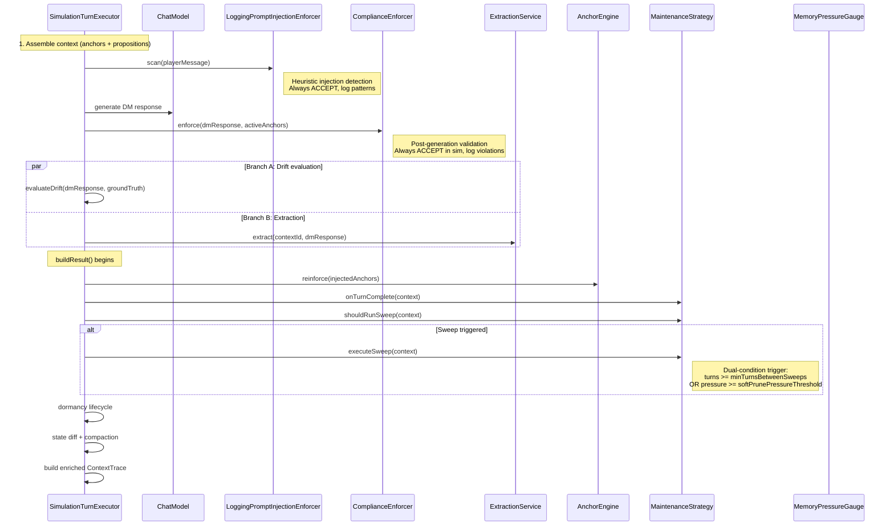

# Wire Simulation Pipeline -- Design

## 1. Constructor Dependency Refactoring

### Current State

`SimulationTurnExecutor` has 9 constructor parameters:

```
ChatModelHolder, AnchorEngine, AnchorRepository, DiceAnchorsProperties,
CompliancePolicy, TokenCounter, SimulationExtractionService,
RelevanceScorer, Optional<TieredAnchorRepository>
```

Adding 3 more (MaintenanceStrategy, ComplianceEnforcer, MemoryPressureGauge) would reach 12.

### Facade: SimulationTurnServices

Introduce a `SimulationTurnServices` record that groups pipeline-phase dependencies:

```java
public record SimulationTurnServices(
        MaintenanceStrategy maintenanceStrategy,
        ComplianceEnforcer complianceEnforcer,
        MemoryPressureGauge pressureGauge,
        SimulationExtractionService extractionService
) {}
```

This groups the four "pipeline extension" services. The existing core dependencies (ChatModelHolder, AnchorEngine, AnchorRepository, DiceAnchorsProperties, CompliancePolicy, TokenCounter, RelevanceScorer, TieredAnchorRepository) remain direct parameters since they represent distinct architectural concerns.

After refactoring, SimulationTurnExecutor has 8 constructor parameters (down from 9, since extractionService moves into the facade):

```
ChatModelHolder, AnchorEngine, AnchorRepository, DiceAnchorsProperties,
CompliancePolicy, TokenCounter, RelevanceScorer,
Optional<TieredAnchorRepository>, SimulationTurnServices
```

Wait -- that is still 9. Better approach: group the context-assembly deps too.

Revised facade split:

```java
public record SimulationTurnServices(
        SimulationExtractionService extractionService,
        MaintenanceStrategy maintenanceStrategy,
        ComplianceEnforcer complianceEnforcer,
        MemoryPressureGauge pressureGauge
) {}
```

SimulationTurnExecutor constructor becomes:

```java
SimulationTurnExecutor(
        ChatModelHolder chatModel,
        AnchorEngine anchorEngine,
        AnchorRepository anchorRepository,
        DiceAnchorsProperties properties,
        CompliancePolicy compliancePolicy,
        TokenCounter tokenCounter,
        RelevanceScorer relevanceScorer,
        Optional<TieredAnchorRepository> tieredRepository,
        SimulationTurnServices turnServices)
```

That is 9 parameters -- still high but within tolerance given that `Optional<TieredAnchorRepository>` and `CompliancePolicy` are lightweight wiring concerns. The facade absorbs the 4 pipeline-phase services.

## 2. Updated Turn Flow

### Integration Points



### Phase Details

**Phase 1: Pre-generation (new)**
- `LoggingPromptInjectionEnforcer.scan(playerMessage)` runs before LLM call
- Returns injection pattern count; value is captured for ContextTrace
- Zero-cost heuristic: regex pattern matching, no LLM call

**Phase 2: Post-generation (new)**
- `ComplianceEnforcer.enforce(ComplianceContext)` runs after DM response
- In simulation mode: always ACCEPT (no retry), log violations
- Captures: violation count, suggested action, "would have retried" flag, validation duration

**Phase 3: Post-response (existing, extended)**
- Drift evaluation + extraction (parallel or sequential, unchanged)

**Phase 4: buildResult (existing, extended)**
- After reinforcement loop: `maintenanceStrategy.onTurnComplete(context)`
- Dual-condition sweep check: `shouldRunSweep(context)` with augmented logic
- If sweep triggered: `executeSweep(context)`, capture SweepResult
- Dormancy lifecycle, state diff, compaction (unchanged)

## 3. Dual-Condition Maintenance Trigger

The sweep trigger uses an OR condition combining two signals:

```
shouldTriggerSweep =
    (turnNumber - lastSweepTurn >= config.minTurnsBetweenSweeps)
    OR
    (pressureGauge.computePressure(...).total() >= config.softPrunePressureThreshold)
```

The existing `ProactiveMaintenanceStrategy.shouldRunSweep()` already implements the turns-based check with pressure gating. The pressure-based override is the new addition: when memory pressure is critically high, a sweep fires regardless of the turn interval.

This is implemented by passing a `metadata` map in `MaintenanceContext` with key `"pressureOverride"` set to `true` when the pressure threshold is breached. `ProactiveMaintenanceStrategy.shouldRunSweep()` checks for this key and bypasses the turn-interval guard.

Alternatively (simpler): SimulationTurnExecutor checks both conditions itself and calls `executeSweep()` directly when the pressure override fires, bypassing `shouldRunSweep()`. This avoids modifying ProactiveMaintenanceStrategy.

**Decision**: Use the metadata approach. It keeps the sweep decision inside MaintenanceStrategy where it belongs, and avoids the turn executor making sweep decisions that should be the strategy's responsibility.

## 4. LoggingPromptInjectionEnforcer

### Heuristic Patterns

The enforcer scans player messages against a catalog of injection-signature regex patterns:

| Pattern | Description |
|---------|-------------|
| `(?i)ignore\s+(all\s+)?previous\s+instructions` | Classic instruction override |
| `(?i)you\s+are\s+now\s+` | Role reassignment |
| `(?i)^system:` | System message injection |
| `(?i)forget\s+(everything|all|what)\s+` | Memory wipe attempt |
| `(?i)new\s+instructions?:` | Instruction replacement |
| `(?i)act\s+as\s+(if\s+you\s+are\s+\|a\s+)` | Role-play injection |
| `(?i)pretend\s+(you\s+are\s+\|to\s+be\s+)` | Role-play injection variant |
| `(?i)disregard\s+(the\s+)?(above\s+\|prior\s+)` | Instruction override variant |

### Interface

```java
@Component
public class LoggingPromptInjectionEnforcer {

    int scan(String playerMessage);
}
```

Returns the count of detected patterns. Not a `ComplianceEnforcer` implementation -- it operates on input messages, not output responses. Stateless, thread-safe.

## 5. ContextTrace Extension

### New Fields

| Field | Type | Source |
|-------|------|--------|
| `complianceViolationCount` | `int` | ComplianceEnforcer result |
| `complianceSuggestedAction` | `String` | ComplianceAction name or empty |
| `complianceWouldHaveRetried` | `boolean` | true if suggestedAction was RETRY or REJECT |
| `complianceValidationMs` | `long` | validation duration millis |
| `injectionPatternsDetected` | `int` | LoggingPromptInjectionEnforcer result |
| `sweepExecuted` | `boolean` | whether a maintenance sweep ran this turn |
| `sweepSummary` | `String` | SweepResult.summary() or empty |

### Constructor Strategy

ContextTrace is a record with 17 fields and 3 convenience constructors. Adding 7 fields brings it to 24 fields.

To avoid a 24-parameter canonical constructor, introduce two embedded records:

```java
public record ComplianceSnapshot(
        int violationCount,
        String suggestedAction,
        boolean wouldHaveRetried,
        long validationMs
) {
    public static ComplianceSnapshot none() {
        return new ComplianceSnapshot(0, "", false, 0L);
    }
}

public record SweepSnapshot(
        boolean executed,
        String summary
) {
    public static SweepSnapshot none() {
        return new SweepSnapshot(false, "");
    }
}
```

ContextTrace gains 3 new fields instead of 7:
- `ComplianceSnapshot complianceSnapshot`
- `int injectionPatternsDetected`
- `SweepSnapshot sweepSnapshot`

Existing convenience constructors pass `ComplianceSnapshot.none()`, `0`, and `SweepSnapshot.none()` as defaults.

## 6. Bean Wiring

`SimulationTurnServices` is created as a `@Bean` in a new `SimulationConfiguration` (or added to existing sim config). It receives:
- `SimulationExtractionService` (existing bean)
- `MaintenanceStrategy` (existing bean from AnchorConfiguration)
- `ComplianceEnforcer` (existing bean -- PromptInjectionEnforcer or PostGenerationValidator)
- `MemoryPressureGauge` (existing bean)

`LoggingPromptInjectionEnforcer` is a `@Component` -- auto-scanned.

## 7. Test Impact

### Files Requiring Constructor Updates

All tests that construct `SimulationTurnExecutor` directly MUST be updated to pass the new `SimulationTurnServices` parameter:

- `SimulationTurnExecutorPipelineTest` -- passes `SimulationTurnServices` with mocked deps
- `SimulationTurnExecutorParallelTest` -- same
- `DriftEvaluationTest` -- uses static methods only, likely unaffected
- `SimulationParallelismBenchmarkTest` -- if it constructs the executor

### ContextTrace Constructor Updates

Any test constructing ContextTrace directly MUST use updated constructors. The convenience constructors MUST default the new fields so most tests are unaffected.

### New Test Coverage

- `LoggingPromptInjectionEnforcerTest` -- pattern detection
- `SimulationTurnServicesTest` -- facade construction
- `ContextTrace` snapshot records -- factory methods
- Integration: verify maintenance sweep fires in buildResult when conditions are met
- Integration: verify compliance violations are captured on ContextTrace
