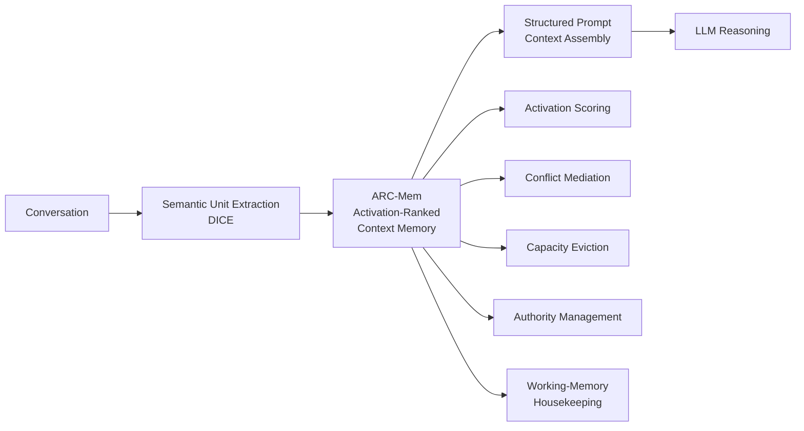
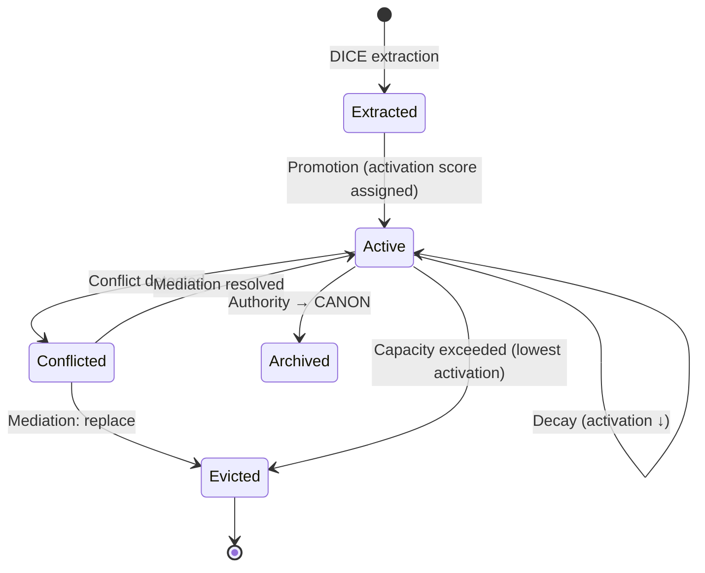

## Context

The dice-anchors project implements a working-memory layer for long-horizon LLM conversations using "anchors" — enriched DICE propositions with rank, authority, and budget management. The terminology "anchor" implies static pinning, but the mechanism is dynamic: units compete for working-set slots based on activation signals. This change rebrands to **ARC-Mem (Activation-Ranked Context Memory)** across documentation, UI, prompt templates, and public Java API surfaces.

**Current state**: 99 classes in the `anchor/` package, 12+ OpenSpec specs referencing anchor terminology, prompt templates, Vaadin UI views, blog/whitepaper drafts, CLAUDE.md, and application config all use "anchor" vocabulary.

**Constraints**:
- Neo4j node labels and property names SHOULD remain unchanged to avoid data migration
- DICE dependency is upstream and unchanged — ARC-Mem consumes DICE output
- Internal field names (`rank`, `authority`) MAY remain for backward compat
- The `anchor/` Java package name becomes `arcmem/` (or `arc/`)

## Goals / Non-Goals

**Goals:**
- Consistent ARC-Mem terminology across all user-facing surfaces (docs, UI, prompts, public API)
- Rename key public-facing Java classes per the terminology mapping
- Update architecture descriptions and diagrams to the 4-stage pipeline
- Broaden documentation language from "propositions" to "semantic units"
- Update config property namespace from `dice-anchors.*` to `arc-mem.*`

**Non-Goals:**
- Changing any behavioral semantics (rank ranges, authority levels, budget enforcement logic)
- Renaming Neo4j node labels or relationship types (avoid migration complexity)
- Renaming every private variable or local reference (internal code clarity, not user-facing)
- Changing the DICE extraction interface or DICE dependency
- Renaming the GitHub repository (deferred — trivial to do later)
- Renaming the Maven artifact ID or group ID (deferred — no downstream consumers)

## Decisions

### D1: Java package rename strategy

**Decision**: Rename `dev.dunnam.diceanchors.anchor` → `dev.dunnam.diceanchors.arcmem`

**Rationale**: The `anchor/` package is the primary domain package. Renaming it to `arcmem/` aligns with the brand. The parent package `diceanchors` stays — it's the project name and changing it cascades to every import in every file.

**Alternatives considered**:
- `arc/` — too short, ambiguous
- `contextmemory/` — too long, doesn't match the brand acronym
- Keep `anchor/` — defeats the purpose of the rebrand

### D2: Class rename scope

**Decision**: Rename only classes that contain "Anchor" in their name AND are referenced across package boundaries (public API surface). Internal-only classes MAY defer renaming.

**Key renames**:

| Old | New | Justification |
|-----|-----|---------------|
| `Anchor` | `ContextUnit` | Core domain record — most visible |
| `AnchorEngine` | `ArcMemEngine` | Central orchestration entry point |
| `AnchorRepository` | `ContextUnitRepository` | Persistence interface |
| `AnchorConfiguration` | `ArcMemConfiguration` | Spring config class |
| `AnchorPromoter` | `UnitPromoter` | Extraction pipeline public API |
| `AnchorTools` | `ContextTools` | Chat tools exposed to LLM |
| `AnchorsLlmReference` | `ArcMemLlmReference` | Prompt assembly reference |
| `AnchorContextLock` | `ArcMemContextLock` | Assembly lock |
| `AnchorPrologProjector` | `ContextUnitPrologProjector` | Prolog integration |
| `AnchorCluster` | `UnitCluster` | Clustering analysis |
| `AnchorMutationStrategy` | `UnitMutationStrategy` | Mutation SPI |
| `AnchorCacheInvalidator` | `ContextUnitCacheInvalidator` | Cache invalidation |

Classes like `AuthorityConflictResolver`, `DecayPolicy`, `ReinforcementPolicy`, `MaintenanceStrategy`, `TrustPipeline`, `BudgetStrategy`, `CanonizationGate` are terminology-neutral and stay unchanged.

**Alternatives considered**:
- Rename everything containing "Anchor" — excessive churn for private internals
- Rename nothing in Java, only docs — half-measure that creates inconsistency

### D3: Neo4j schema backward compatibility

**Decision**: Keep existing Neo4j node labels (`Proposition`), relationship types (`CONFLICTS_WITH`, `SUPPORTS`), and property names (`rank`, `authority`, `pinned`) unchanged. The Drivine mapping layer translates between domain model names and persistence names.

**Rationale**: Data migration scripts add risk and complexity for zero behavioral benefit. The persistence layer already abstracts this — `PropositionNode` and `PropositionView` handle the mapping. These persistence classes get a comment explaining the legacy naming.

### D4: Config namespace migration

**Decision**: Rename `dice-anchors.*` → `arc-mem.*` in `application.yml` and `DiceAnchorsProperties` → `ArcMemProperties`.

Add `@DeprecatedConfigurationProperty` annotations for the old namespace to ease migration for anyone who has customized configs.

### D5: Prompt template updates

**Decision**: Update all LLM-facing text in `src/main/resources/prompts/` to use ARC-Mem terminology. System prompts that explain the working-memory system to the LLM MUST use "semantic units", "activation scores", and "working-memory capacity".

Internal prompt variable names (template placeholders like `{anchorContext}`) MAY remain if renaming them cascades through too many call sites — add a comment mapping old name to new concept.

### D6: Documentation-first, code-second execution order

**Decision**: Execute the rebrand in two waves:
1. **Wave 1 — Documentation & prompts**: CLAUDE.md, blog, whitepaper, OpenSpec specs, prompt templates, UI labels, scenario YAML descriptions
2. **Wave 2 — Code**: Java class renames, package rename, config namespace, test updates

**Rationale**: Documentation changes are zero-risk (no compilation/test failures). Getting terminology right in docs first creates a reference for the code rename wave.

## Data Flow (Updated Pipeline)

## ARC-Mem Lifecycle

## Risks / Trade-offs

- **[Risk] IDE refactoring cascades** → Mitigate with IntelliJ "Rename" refactor (updates all references). Run full test suite after each class rename batch.
- **[Risk] Prompt regression** → Mitigate by running simulation scenarios before and after prompt template changes. Diff LLM outputs for semantic equivalence.
- **[Risk] Missed references** → Mitigate with project-wide grep for `/[Aa]nchor/` after all renames. Any remaining references are either intentional (Neo4j compat) or need updating.
- **[Risk] Config breakage for existing deployments** → Mitigate with `@DeprecatedConfigurationProperty` on old names. Spring Boot logs warnings for deprecated properties.
- **[Trade-off] Neo4j schema divergence** → Acceptable: persistence layer abstracts naming. Document the mapping in `AnchorRepository` Javadoc (renamed to `ContextUnitRepository`).

## Open Questions

- **Q1**: Should the `event/` subpackage classes (e.g., `AnchorLifecycleEvent`, `AnchorCreatedEvent`) be renamed to `ContextUnitLifecycleEvent`, `ContextUnitCreatedEvent`? Leaning yes — they're part of the public event API.
- **Q2**: Should the Maven module name change from `dice-anchors` to `arc-mem`? Leaning defer — no downstream consumers, low value right now.
- **Q3**: Should `PropositionNode`/`PropositionView` in the persistence layer be renamed? Leaning no — "Proposition" is DICE terminology (upstream), not anchor terminology.
