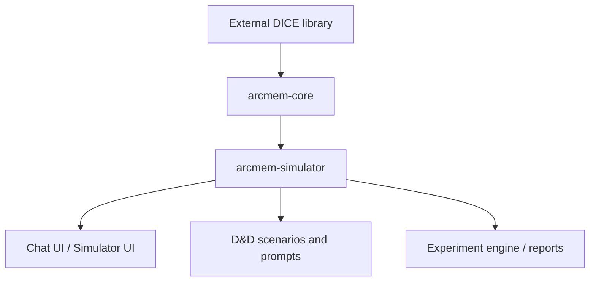

## Context

The current repository is a single-module Maven build that combines ARC-Mem implementation code, DICE integration, simulator runtime, D&D scenario assets, chat UI, benchmark UI, and experiment reporting under one source tree. The current package layout already reflects two different concerns:

- reusable ARC-Mem behavior in packages such as `src/main/java/dev/dunnam/arcmem/arcmem`, `src/main/java/dev/dunnam/arcmem/assembly`, `src/main/java/dev/dunnam/arcmem/extract`, and parts of `src/main/java/dev/dunnam/arcmem/persistence`
- simulator harness behavior in packages such as `src/main/java/dev/dunnam/arcmem/sim`, `src/main/java/dev/dunnam/arcmem/chat`, and `src/main/java/dev/dunnam/arcmem/domain`

The target architecture is a two-module split:

- `arcmem-core`: ARC-Mem implementation layer on top of DICE
- `arcmem-simulator`: D&D-driven harness that stress-tests ARC-Mem for drift via chat, scenarios, adversaries, and experiment flows

Constraints:

- DICE remains an external dependency rather than a local module.
- The first implementation pass must prioritize preserving current runtime behavior.
- The simulator continues to own the D&D schema, scenario prompts, and experiment surfaces.
- Existing Spring wiring and resource lookup must continue to work during the migration.

## Goals / Non-Goals

**Goals:**

- Establish a stable module boundary between ARC-Mem implementation and the simulator harness.
- Move D&D-specific schema and simulator-only code out of the ARC-Mem implementation module.
- Preserve current simulator behavior while performing the split.
- Reduce package ambiguity so future refactors can happen within modules rather than across unrelated concerns.
- Make the dependency direction explicit: simulator depends on core, core does not depend on simulator.

**Non-Goals:**

- Rewriting ARC-Mem algorithms, trust logic, or simulator behavior during the split.
- Introducing a local `dice` module or forking the DICE library.
- Completing the full internal package cleanup in the same change as the initial module extraction.
- Redesigning the simulator UI or changing D&D scenario semantics.

## Decisions

### Decision: Use two Maven modules, not three

The repo SHALL be split into `arcmem-core` and `arcmem-simulator`.

Rationale:

- ARC-Mem and the simulator are the two real ownership boundaries in this repo.
- A separate app module would duplicate simulator ownership because the simulator already owns the chat UI and experiment engine.
- Keeping the split to two modules lowers migration complexity and keeps the harness deployable as a single Spring Boot application.

Alternatives considered:

- Three modules (`arcmem-core`, `arcmem-app`, `arcmem-simulator`): rejected because chat UI and experiment surfaces are simulator concerns in this repo, not separate product surfaces.
- Stay single-module with package cleanup only: rejected because the ownership problem would remain implicit and easy to regress.

### Decision: Keep DICE external

`arcmem-core` SHALL depend on the published DICE library rather than introducing a local `dice` module.

Rationale:

- This repository integrates DICE; it does not own DICE.
- A local `dice` module would create an artificial boundary and increase maintenance burden.
- The important architectural seam is ARC-Mem core vs simulator harness, not local vs external DICE code.

Alternatives considered:

- Create a local `dice` module wrapper: rejected because it obscures real ownership and does not reduce current coupling.

### Decision: First split by module, then clean up package names

The implementation SHALL prioritize module extraction before deep internal package renaming.

Rationale:

- Combining module extraction with package redesign would increase the blast radius and make regressions harder to isolate.
- A behavior-preserving first pass creates a stable checkpoint before internal cleanup.

Alternatives considered:

- Rename packages during the initial split: rejected as too much change in one migration step.

### Decision: Simulator owns D&D assets and chat surfaces

All D&D schema types, D&D prompts, scenario YAMLs, chat UI, benchmark UI, and experiment/reporting flows SHALL live in `arcmem-simulator`.

Rationale:

- These assets exist to drive the harness and evaluate drift under D&D-flavored scenarios.
- They are not reusable ARC-Mem implementation concerns.

Alternatives considered:

- Keep D&D schema in core because extraction touches core-adjacent code: rejected because the schema is scenario-domain data, not ARC-Mem domain logic.

### Decision: Core keeps persistence code that implements ARC-Mem storage semantics

Persistence code SHALL remain in `arcmem-core` if it implements storage or projection semantics required by ARC-Mem. Simulator-owned run-history concerns SHALL move to `arcmem-simulator`.

Rationale:

- ARC-Mem needs concrete repository behavior for context units and related storage semantics.
- Simulator run history is harness-specific and does not belong in the reusable core.

Alternatives considered:

- Move all persistence to simulator: rejected because it would make `arcmem-core` incomplete and non-functional as a reusable implementation layer.

## Risks / Trade-offs

- [Module boundary leaks] → Mitigation: define an explicit ownership matrix and move simulator-only packages first.
- [Spring component scanning breaks after moves] → Mitigation: migrate bootstrap and configuration classes early and verify package scan roots after each move.
- [Resource resolution regressions for prompts and scenarios] → Mitigation: move simulator resources together with simulator wiring and keep path compatibility until tests are updated.
- [Persistence ownership ambiguity] → Mitigation: split run-history classes from core repository classes before broader persistence cleanup.
- [Over-scoping the first pass] → Mitigation: defer deep package cleanup until after the repository builds as two modules.

## Migration Plan

1. Convert the root `pom.xml` into an aggregator parent and create `arcmem-core/pom.xml` and `arcmem-simulator/pom.xml`.
2. Move Spring Boot bootstrap, simulator resources, `sim.*`, `chat.*`, and D&D schema types into `arcmem-simulator`.
3. Move ARC-Mem implementation packages into `arcmem-core` with minimal package renaming.
4. Split mixed ownership areas such as `persistence` and root configuration classes.
5. Update tests to run in their owning modules and restore a green build.
6. Perform second-pass package cleanup after the module split is stable.

Rollback strategy:

- The split can be rolled back by reverting module `pom.xml` changes and restoring source trees before the package-cleanup pass starts.
- No data migration is required because this is a source and build topology change.

## Open Questions

- Should `ArcMemProperties` remain a shared configuration type in core, or split into core and simulator property classes during migration?
- Which prompt templates are truly generic ARC-Mem assets versus simulator-owned D&D assets?
- Does `arcmem-core` need to keep all current Neo4j/Drivine implementations, or should some infrastructure move behind narrower interfaces in a later pass?
