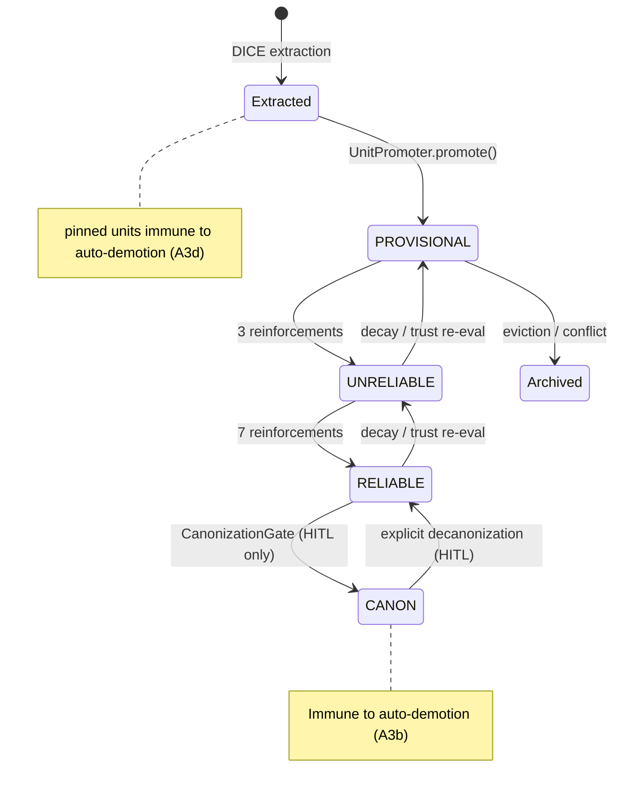

## Context

ARC-Mem's `docs/architecture.md` provides a solid high-level overview but lacks visual data-flow diagrams and end-to-end execution traces. Developers cannot currently trace a user message through extraction, promotion, conflict detection, maintenance, assembly, and compliance from documentation alone. The codebase has 96 specs and 15+ canonical packages — visual maps are essential for onboarding and auditing.

Existing docs cover:
- `architecture.md` — module structure, config defaults, package map (no Mermaid diagrams)
- `promotion-revision-supersession.md` — promotion gates, conflict outcomes (text-only flowcharts)
- `implementation-notes.md` — technical caveats (no visual aids)
- `attention-tracker-architecture.md` — event flow diagrams (already has some Mermaid)

## Goals / Non-Goals

**Goals:**
- Add Mermaid diagrams that trace data through every major subsystem
- Create `docs/data-flows.md` with concrete end-to-end scenarios (promotion, demotion, conflict, supersession)
- Update existing docs with visual state machines where text descriptions exist
- Enable a developer to trace any execution path from docs without reading source

**Non-Goals:**
- Rewriting existing prose that is already accurate
- API reference documentation (covered by Javadoc and specs)
- Operational runbooks or deployment guides
- Configuration tuning guides
- Adding diagrams to spec files (specs remain normative text)

## Decisions

### D1: Mermaid over alternatives (PlantUML, draw.io)

**Decision**: Use Mermaid for all diagrams.

**Rationale**: Mermaid renders natively in GitHub/GitLab markdown, requires no external tooling, lives alongside prose in `.md` files, and diffs cleanly in version control. PlantUML requires a server; draw.io produces opaque binary files.

**Trade-off**: Mermaid's layout engine has limited control over complex diagrams. Acceptable for documentation purposes.

### D2: New `data-flows.md` rather than inlining everything in `architecture.md`

**Decision**: Create `docs/data-flows.md` for end-to-end scenario traces. Keep `architecture.md` for structural diagrams (module map, component relationships).

**Rationale**: `architecture.md` is already 340 lines. Adding 7+ detailed flow traces would make it unwieldy. Separation keeps architecture as a reference map and data-flows as a narrative walkthrough.

### D3: Diagram taxonomy

Seven diagram categories, each targeting a specific subsystem:

| # | Diagram | Type | Target File |
|---|---------|------|-------------|
| 1 | Memory unit lifecycle state machine | stateDiagram-v2 | `architecture.md` |
| 2 | Conflict detection pipeline | flowchart | `architecture.md` |
| 3 | Trust pipeline scoring flow | flowchart | `architecture.md` |
| 4 | Maintenance strategy state machines | stateDiagram-v2 | `architecture.md` |
| 5 | Context assembly pipeline | sequenceDiagram | `architecture.md` |
| 6 | End-to-end: conversation → context → prompt | sequenceDiagram | `data-flows.md` |
| 7 | Promotion/demotion example flows | sequenceDiagram | `data-flows.md` |

### D4: Diagram content specification

**1. Memory Unit Lifecycle State Machine**

**2. Conflict Detection Pipeline**
- Show `CompositeConflictDetector` dispatching to `LlmConflictDetector`, `NegationConflictDetector`, `PrologConflictDetector`
- Show `ConflictDetectionStrategy` enum selecting which detectors fire
- Show `ConflictIndex` (precomputed O(1) lookup) with fallback to live detection
- Show `AuthorityConflictResolver` mapping conflicts to resolutions (KEEP_EXISTING / REPLACE / COEXIST / DEMOTE_EXISTING)

**3. Trust Pipeline Scoring Flow**
- Show `TrustPipeline` → `TrustEvaluator` → individual signals (`ImportanceSignal`, `NoveltySignal`, `GraphConsistencySignal`)
- Show signal scores → weighted aggregation → `TrustScore` (score, promotionZone, authorityCeiling)
- Show promotion zones: IMMEDIATE / CONDITIONAL / HOLD / REJECT
- Show `DomainProfile` modifiers applied per domain

**4. Maintenance Strategy State Machines**
- REACTIVE: `onTurnComplete()` → DecayPolicy + ReinforcementPolicy (inline, no sweep)
- PROACTIVE: `MemoryPressureGauge.computePressure()` → threshold check → 5-step sweep (audit → refresh → consolidate → prune → validate)
- HYBRID: reactive per-turn + proactive sweep when pressure ≥ threshold
- Show pressure dimensions: budget, conflict rate, decay rate, compaction rate
- Show thresholds: light-sweep 0.4, full-sweep 0.8

**5. Context Assembly Pipeline**
- `ArcMemLlmReference.getContent()` → load units → group by authority → apply adaptive footprint → token budgeting → format
- Show three retrieval modes: BULK (all active), HYBRID (relevance-scored top-k + CANON), TOOL (empty, on-demand)
- Show `PromptBudgetEnforcer` → `BudgetStrategy` (count-based or interference-density) → eviction
- Show `ComplianceEnforcer` chain: PromptInjection → PostGeneration → PrologInvariant

**6. End-to-End: Conversation → Context → Prompt** (sequence diagram)
- User message → ChatActions → DICE extraction → propositions
- Propositions → DuplicateDetector → ConflictDetector → UnitPromoter → ArcMemEngine.promote()
- ArcMemEngine → TrustPipeline → authority ceiling → Neo4j persist
- Next turn: ArcMemLlmReference → load active units → budget enforcement → format → system prompt injection
- LLM response → ComplianceEnforcer → validate → return to user

**7. Promotion/Demotion Example Flows**
- Scenario A: New fact promoted PROVISIONAL → reinforced 3x → UNRELIABLE → reinforced 4x more → RELIABLE
- Scenario B: Conflicting fact detected → AuthorityConflictResolver → REPLACE → predecessor archived with successorId
- Scenario C: Decay over 5 turns → rank drops below threshold → auto-demotion RELIABLE → UNRELIABLE
- Scenario D: Operator canonizes via CanonizationGate → RELIABLE → CANON (HITL approval)
- Scenario E: Supersession → predecessor archived → successor linked → lineage chain queryable

### D5: Supersession documentation approach

**Decision**: Document supersession within `data-flows.md` as a specific scenario rather than a separate page.

**Rationale**: Supersession is a compound operation (archive + link) on `ArcMemEngine`. It doesn't warrant its own doc — it's best explained as a concrete example flow showing `supersede(predecessorId, successorId, reason)` → `Archived` event with `successorId` → lineage chain via `findSupersessionChain()`.

## Risks / Trade-offs

- **[Diagram drift]** → Diagrams can become stale as code evolves. Mitigation: diagrams reference class names and method signatures that will cause obvious staleness when renamed.
- **[Mermaid rendering limits]** → Complex sequence diagrams may render poorly in narrow viewports. Mitigation: keep individual diagrams focused on one subsystem; split if needed.
- **[Accuracy]** → Diagrams derived from code reading may miss runtime behavior. Mitigation: cross-reference with test assertions and scenario YAML to verify flows.
